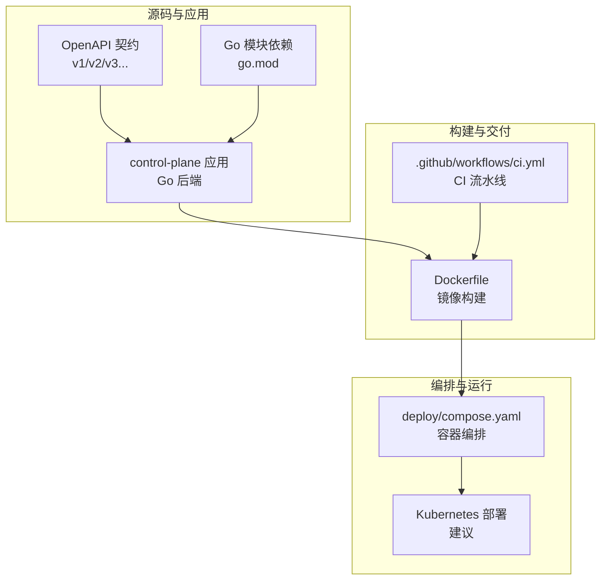
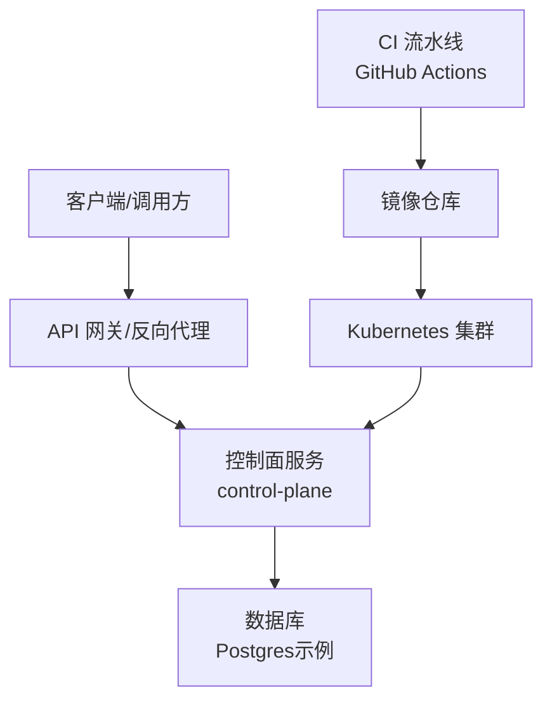
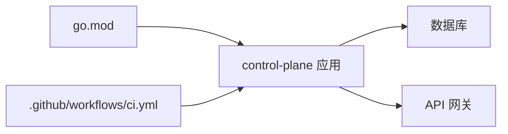

# 部署架构

<cite>
**本文引用的文件**   
- [README.md](file://README.md)
- [apps/control-plane/Dockerfile](file://apps/control-plane/Dockerfile)
- [deploy/compose.yaml](file://deploy/compose.yaml)
- [.github/workflows/ci.yml](file://.github/workflows/ci.yml)
- [go.mod](file://go.mod)
- [apps/control-plane/cmd/control-plane/main.go](file://apps/control-plane/cmd/control-plane/main.go)
- [apps/control-plane/internal/config/config.go](file://apps/control-plane/internal/config/config.go)
- [contracts/openapi/control-plane.v1.yaml](file://contracts/openapi/control-plane.v1.yaml)
- [contracts/openapi/router-agent.v1.yaml](file://contracts/openapi/router-agent.v1.yaml)
- [contracts/openapi/router-internal.v1.yaml](file://contracts/openapi/router-internal.v1.yaml)
</cite>

## 目录
1. [简介](#简介)
2. [项目结构](#项目结构)
3. [核心组件](#核心组件)
4. [架构总览](#架构总览)
5. [详细组件分析](#详细组件分析)
6. [依赖分析](#依赖分析)
7. [性能考虑](#性能考虑)
8. [故障排查指南](#故障排查指南)
9. [结论](#结论)
10. [附录](#附录)

## 简介
本文件为 NeKiro 平台的部署架构文档，聚焦容器化与编排、CI/CD 流水线、环境配置管理、服务发现、监控告警与日志收集等主题。内容基于仓库中现有的 Dockerfile、Compose 编排、GitHub Actions CI 以及 OpenAPI 契约进行梳理，并给出可扩展的 Kubernetes 部署建议与拓扑图。

## 项目结构
NeKiro 采用多应用与合约分离的组织方式：
- 控制面应用位于 apps/control-plane，包含 Go 后端入口、内部模块与数据库迁移脚本，并提供 Dockerfile 用于镜像构建。
- 合约定义集中在 contracts 目录，包括 OpenAPI 规范与测试用例，便于生成客户端与服务端契约校验。
- 部署相关资源位于 deploy/compose.yaml，提供本地或轻量环境的 Compose 编排。
- CI/CD 流水线位于 .github/workflows/ci.yml，负责代码检查、测试与镜像构建。
- go.mod 声明了 Go 模块依赖，作为构建与运行时的基础。

图表来源
- [apps/control-plane/Dockerfile](file://apps/control-plane/Dockerfile)
- [deploy/compose.yaml](file://deploy/compose.yaml)
- [.github/workflows/ci.yml](file://.github/workflows/ci.yml)
- [contracts/openapi/control-plane.v1.yaml](file://contracts/openapi/control-plane.v1.yaml)
- [go.mod](file://go.mod)

章节来源
- [README.md](file://README.md)
- [apps/control-plane/Dockerfile](file://apps/control-plane/Dockerfile)
- [deploy/compose.yaml](file://deploy/compose.yaml)
- [.github/workflows/ci.yml](file://.github/workflows/ci.yml)
- [go.mod](file://go.mod)

## 核心组件
- 控制面服务（Control Plane）
  - 提供平台核心能力，如目录注册、工作区管理、调用路由等。
  - 通过 OpenAPI 暴露对外接口，供网关或外部系统访问。
  - 使用 Go 语言实现，具备可容器化特性。
- 合约与契约
  - OpenAPI 文件定义了控制面与路由器相关的 API 版本与语义，确保跨组件一致性。
- 构建与镜像
  - Dockerfile 描述镜像构建步骤，产出可运行的控制面镜像。
- 编排与运行
  - Compose 编排将控制面与其依赖（如数据库）组合在一起，便于本地与演示环境运行。
- CI/CD
  - GitHub Actions 流水线执行静态检查、单元测试与集成测试，并在通过后构建镜像。

章节来源
- [apps/control-plane/cmd/control-plane/main.go](file://apps/control-plane/cmd/control-plane/main.go)
- [contracts/openapi/control-plane.v1.yaml](file://contracts/openapi/control-plane.v1.yaml)
- [contracts/openapi/router-agent.v1.yaml](file://contracts/openapi/router-agent.v1.yaml)
- [contracts/openapi/router-internal.v1.yaml](file://contracts/openapi/router-internal.v1.yaml)
- [apps/control-plane/Dockerfile](file://apps/control-plane/Dockerfile)
- [deploy/compose.yaml](file://deploy/compose.yaml)
- [.github/workflows/ci.yml](file://.github/workflows/ci.yml)

## 架构总览
下图展示了 NeKiro 在容器化与编排层面的总体架构，包括控制面服务、外部网关、数据库与 CI/CD 流水线的交互关系。

图表来源
- [contracts/openapi/control-plane.v1.yaml](file://contracts/openapi/control-plane.v1.yaml)
- [apps/control-plane/Dockerfile](file://apps/control-plane/Dockerfile)
- [deploy/compose.yaml](file://deploy/compose.yaml)
- [.github/workflows/ci.yml](file://.github/workflows/ci.yml)

## 详细组件分析

### 容器镜像构建（Dockerfile）
- 职责
  - 基于官方 Go 运行时构建控制面二进制。
  - 生成最小化运行镜像，仅包含必要的运行时依赖。
- 关键流程
  - 设置构建阶段，编译 Go 应用。
  - 复制产物到最终镜像，暴露必要端口。
  - 指定启动命令与参数。
- 注意事项
  - 建议使用多阶段构建以减小镜像体积。
  - 避免在镜像中引入敏感信息，统一通过环境变量注入。

章节来源
- [apps/control-plane/Dockerfile](file://apps/control-plane/Dockerfile)

### 容器编排（Compose）
- 职责
  - 将控制面服务与数据库等依赖组合，提供一键启动能力。
  - 定义网络、卷挂载、环境变量与重启策略。
- 关键要素
  - 服务定义：控制面服务、数据库服务。
  - 网络：默认桥接网络，服务间通过服务名解析。
  - 存储：数据库持久化卷。
  - 环境变量：数据库连接串、日志级别等。
- 扩展建议
  - 增加健康检查与依赖顺序，提升启动稳定性。
  - 为不同环境准备 compose.override.yaml 覆盖配置。

章节来源
- [deploy/compose.yaml](file://deploy/compose.yaml)

### CI/CD 流水线（GitHub Actions）
- 职责
  - 触发条件：推送与拉取请求。
  - 任务：安装依赖、静态检查、单元测试、集成测试、构建镜像。
- 关键流程
  - 设置 Go 环境与缓存。
  - 运行测试套件。
  - 构建并推送镜像至镜像仓库。
- 安全与合规
  - 使用受保护的分支与签名镜像。
  - 对敏感变量使用 Secrets 管理。

章节来源
- [.github/workflows/ci.yml](file://.github/workflows/ci.yml)

### 服务发现与通信
- 容器内服务发现
  - Compose 环境下，服务通过服务名进行 DNS 解析。
- Kubernetes 服务发现（建议）
  - 使用 Service 对象暴露控制面端口，Pod 间通过 ClusterIP 访问。
  - 对外暴露可通过 Ingress 或 LoadBalancer。
- 协议与契约
  - 控制面对外接口遵循 OpenAPI 规范，便于网关与客户端生成代码。

章节来源
- [contracts/openapi/control-plane.v1.yaml](file://contracts/openapi/control-plane.v1.yaml)
- [contracts/openapi/router-agent.v1.yaml](file://contracts/openapi/router-agent.v1.yaml)
- [contracts/openapi/router-internal.v1.yaml](file://contracts/openapi/router-internal.v1.yaml)

### 环境配置管理与环境变量策略
- 配置来源优先级（建议）
  - 默认值（代码或配置文件） < 环境变量 < 配置中心/密钥管理。
- 关键变量类别
  - 数据库连接：主机、端口、用户名、密码、库名。
  - 日志与追踪：级别、输出格式、采样率。
  - 安全与认证：JWT 密钥、OAuth 客户端凭据。
- 注入方式
  - Compose：env_file 或 inline 环境变量。
  - Kubernetes：ConfigMap 与 Secret，通过 Volume 或环境变量注入。
- 最佳实践
  - 禁止在镜像中硬编码敏感信息。
  - 使用命名空间与环境前缀区分不同环境。

章节来源
- [apps/control-plane/internal/config/config.go](file://apps/control-plane/internal/config/config.go)
- [deploy/compose.yaml](file://deploy/compose.yaml)

### 部署拓扑与基础设施需求
- 组件
  - 控制面服务：无状态，水平扩展。
  - 数据库：有状态，需持久化与备份。
  - 网关/反向代理：统一入口，负载均衡与健康检查。
  - 镜像仓库：存放构建产物。
- 资源建议
  - CPU/内存：根据 QPS 与并发量评估，预留扩容余量。
  - 存储：数据库磁盘容量与 IOPS 规划。
  - 网络：内网带宽与延迟要求。
- 高可用
  - 多副本部署与自动扩缩容。
  - 数据库主从或托管服务。

[本节为概念性说明，不直接分析具体文件]

### 监控告警与日志收集方案
- 指标采集
  - 应用指标：HTTP 请求数、错误率、延迟分位、Goroutine 数量。
  - 系统指标：CPU、内存、磁盘、网络。
- 日志收集
  - 结构化 JSON 日志，统一时间戳与上下文 ID。
  - 集中式日志平台（如 ELK/Loki），按服务与实例聚合。
- 告警规则
  - 错误率阈值、慢查询、资源水位线。
  - 通知渠道：邮件、IM、电话。
- 链路追踪
  - 基于 TraceID 贯穿请求链路，定位瓶颈与异常。

[本节为概念性说明，不直接分析具体文件]

## 依赖分析
- 模块依赖
  - Go 模块依赖由 go.mod 管理，影响构建与运行时的包版本。
- 组件耦合
  - 控制面与数据库强耦合（数据持久化）。
  - 控制面与网关弱耦合（通过 HTTP/OpenAPI）。
- 外部依赖
  - 镜像仓库、CI 平台、数据库服务。

图表来源
- [go.mod](file://go.mod)
- [.github/workflows/ci.yml](file://.github/workflows/ci.yml)
- [contracts/openapi/control-plane.v1.yaml](file://contracts/openapi/control-plane.v1.yaml)

章节来源
- [go.mod](file://go.mod)
- [.github/workflows/ci.yml](file://.github/workflows/ci.yml)
- [contracts/openapi/control-plane.v1.yaml](file://contracts/openapi/control-plane.v1.yaml)

## 性能考虑
- 镜像优化
  - 多阶段构建、精简基础镜像、启用构建缓存。
- 服务伸缩
  - 基于 CPU/内存或自定义指标自动扩缩容。
- 数据库优化
  - 连接池大小、索引与慢查询治理。
- 网络与网关
  - 合理超时与重试策略，限流与熔断。

[本节为通用指导，不直接分析具体文件]

## 故障排查指南
- 常见问题
  - 启动失败：检查环境变量与数据库连通性。
  - 健康检查失败：确认端口与路径正确。
  - 日志缺失：检查日志输出格式与收集器配置。
- 诊断步骤
  - 查看 Pod/容器日志与事件。
  - 抓取堆栈与指标快照。
  - 复现问题并缩小范围。
- 回滚策略
  - 保留上一稳定版本镜像，快速回滚。

章节来源
- [apps/control-plane/cmd/control-plane/main.go](file://apps/control-plane/cmd/control-plane/main.go)
- [deploy/compose.yaml](file://deploy/compose.yaml)

## 结论
NeKiro 的控制面服务具备良好的容器化与编排基础，结合 OpenAPI 契约与 CI/CD 流水线可实现自动化构建与发布。建议在 Kubernetes 环境中完善服务发现、配置管理、监控告警与日志收集，以提升可观测性与运维效率。

## 附录
- 术语
  - 控制面：平台的核心管理服务。
  - 网关：统一入口，负责鉴权、限流与路由。
  - 编排：容器生命周期与资源调度管理。
- 参考
  - OpenAPI 契约文件用于生成客户端与服务端代码。
  - Compose 与 Kubernetes 分别适用于本地与生产环境。

[本节为补充说明，不直接分析具体文件]