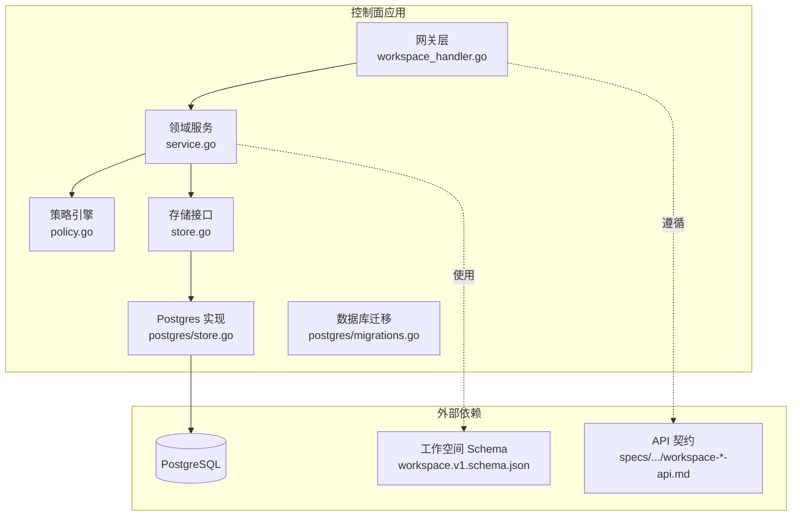
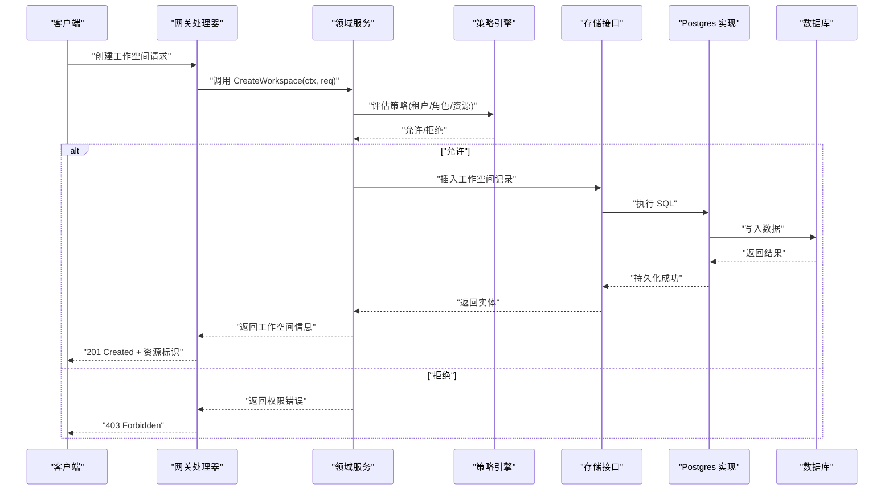
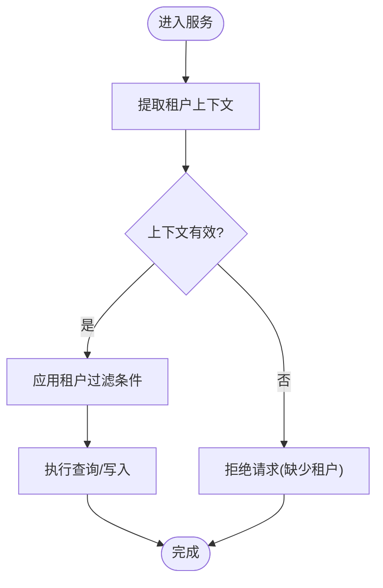
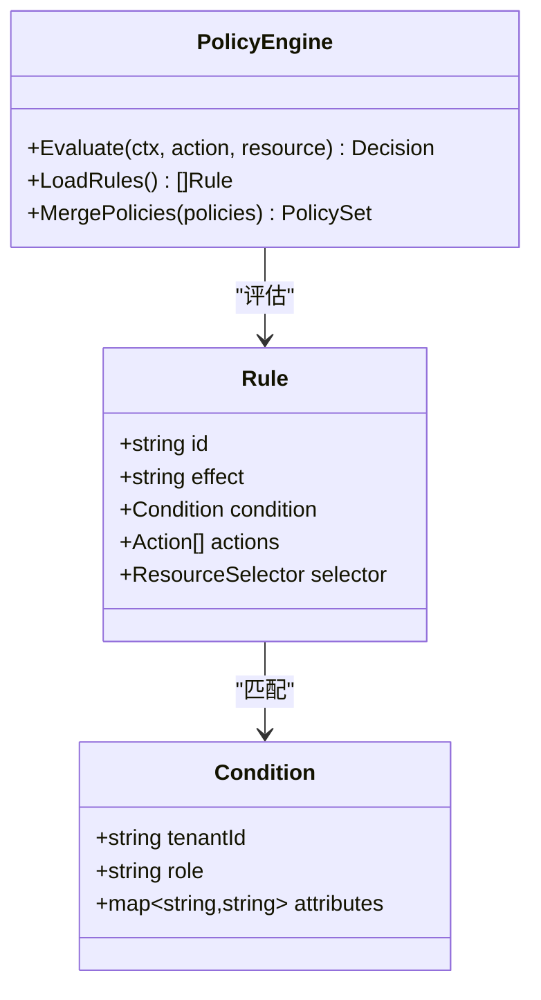
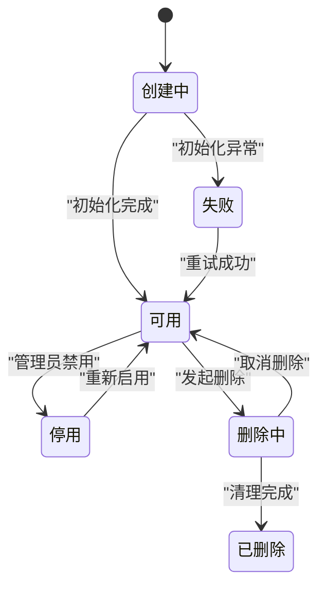
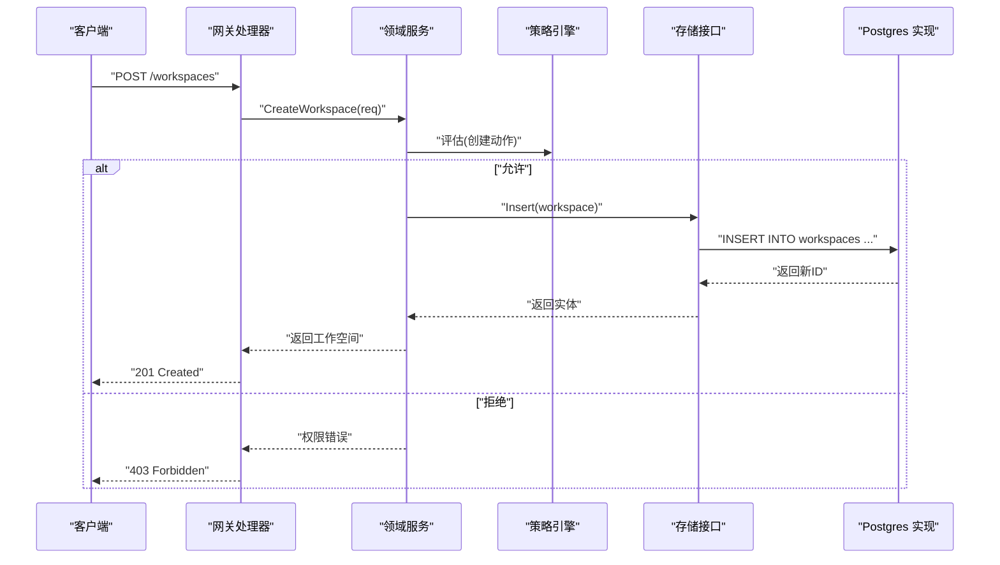
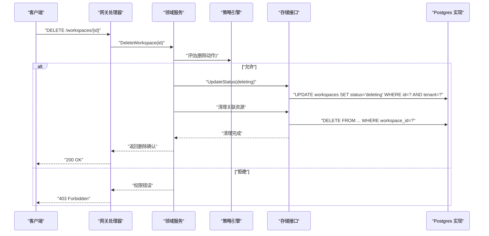
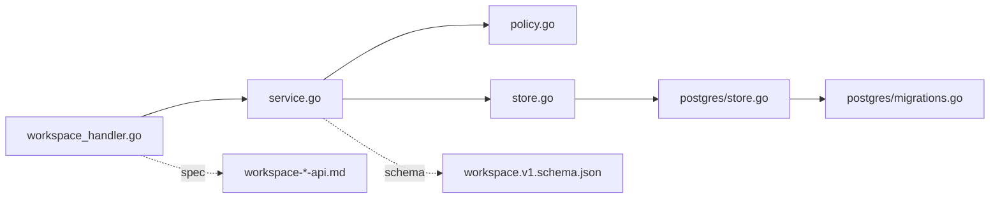

# 工作空间服务

<cite>
**本文引用的文件**   
- [apps/control-plane/cmd/control-plane/main.go](file://apps/control-plane/cmd/control-plane/main.go)
- [apps/control-plane/internal/gateway/workspace_handler.go](file://apps/control-plane/internal/gateway/workspace_handler.go)
- [apps/control-plane/internal/workspace/service.go](file://apps/control-plane/internal/workspace/service.go)
- [apps/control-plane/internal/workspace/store.go](file://apps/control-plane/internal/workspace/store.go)
- [apps/control-plane/internal/workspace/model.go](file://apps/control-plane/internal/workspace/model.go)
- [apps/control-plane/internal/workspace/policy.go](file://apps/control-plane/internal/workspace/policy.go)
- [apps/control-plane/internal/workspace/postgres/store.go](file://apps/control-plane/internal/workspace/postgres/store.go)
- [apps/control-plane/internal/workspace/postgres/migrations.go](file://apps/control-plane/internal/workspace/postgres/migrations.go)
- [contracts/schemas/workspace.v1.schema.json](file://contracts/schemas/workspace.v1.schema.json)
- [specs/004-workspace-create-read/contracts/workspace-create-read-api.md](file://specs/004-workspace-create-read/contracts/workspace-create-read-api.md)
- [specs/003-workspace-installation-contracts/contracts/workspace-installation-api.md](file://specs/003-workspace-installation-contracts/contracts/workspace-installation-api.md)
- [deploy/compose.yaml](file://deploy/compose.yaml)
</cite>

## 目录
1. [简介](#简介)
2. [项目结构](#项目结构)
3. [核心组件](#核心组件)
4. [架构总览](#架构总览)
5. [详细组件分析](#详细组件分析)
6. [依赖关系分析](#依赖关系分析)
7. [性能考虑](#性能考虑)
8. [故障排查指南](#故障排查指南)
9. [结论](#结论)
10. [附录](#附录)

## 简介
本技术文档聚焦 NeKiro 平台控制面中的“工作空间服务”，围绕多租户隔离、权限策略引擎与资源生命周期管理进行深入解析。文档覆盖工作空间的创建、读取、删除与配置管理等核心能力，结合仓库中实际代码路径说明实现要点，并提供策略扩展方法、常见问题排障与安全最佳实践建议。

## 项目结构
工作空间服务位于 control-plane 应用内部，采用分层组织：网关层暴露 HTTP API，领域服务封装业务逻辑，存储层对接数据库（PostgreSQL），并通过迁移脚本维护数据模型。相关契约与规范定义在 contracts 与 specs 目录下。

图表来源
- [apps/control-plane/internal/gateway/workspace_handler.go](file://apps/control-plane/internal/gateway/workspace_handler.go)
- [apps/control-plane/internal/workspace/service.go](file://apps/control-plane/internal/workspace/service.go)
- [apps/control-plane/internal/workspace/policy.go](file://apps/control-plane/internal/workspace/policy.go)
- [apps/control-plane/internal/workspace/store.go](file://apps/control-plane/internal/workspace/store.go)
- [apps/control-plane/internal/workspace/postgres/store.go](file://apps/control-plane/internal/workspace/postgres/store.go)
- [apps/control-plane/internal/workspace/postgres/migrations.go](file://apps/control-plane/internal/workspace/postgres/migrations.go)
- [contracts/schemas/workspace.v1.schema.json](file://contracts/schemas/workspace.v1.schema.json)
- [specs/004-workspace-create-read/contracts/workspace-create-read-api.md](file://specs/004-workspace-create-read/contracts/workspace-create-read-api.md)

章节来源
- [apps/control-plane/cmd/control-plane/main.go](file://apps/control-plane/cmd/control-plane/main.go)
- [apps/control-plane/internal/gateway/workspace_handler.go](file://apps/control-plane/internal/gateway/workspace_handler.go)
- [apps/control-plane/internal/workspace/service.go](file://apps/control-plane/internal/workspace/service.go)
- [apps/control-plane/internal/workspace/store.go](file://apps/control-plane/internal/workspace/store.go)
- [apps/control-plane/internal/workspace/postgres/store.go](file://apps/control-plane/internal/workspace/postgres/store.go)
- [apps/control-plane/internal/workspace/postgres/migrations.go](file://apps/control-plane/internal/workspace/postgres/migrations.go)
- [contracts/schemas/workspace.v1.schema.json](file://contracts/schemas/workspace.v1.schema.json)
- [specs/004-workspace-create-read/contracts/workspace-create-read-api.md](file://specs/004-workspace-create-read/contracts/workspace-create-read-api.md)
- [specs/003-workspace-installation-contracts/contracts/workspace-installation-api.md](file://specs/003-workspace-installation-contracts/contracts/workspace-installation-api.md)

## 核心组件
- 网关处理器：负责路由请求、鉴权上下文提取、参数校验与响应编排。
- 领域服务：实现工作空间的业务流程，包括创建、查询、更新、删除及策略评估。
- 策略引擎：基于策略规则对访问进行授权决策，支持按租户、角色或自定义条件判定。
- 存储接口与实现：抽象持久化操作，提供 Postgres 具体实现与迁移脚本。
- 数据模型与约束：通过领域模型与 JSON Schema 共同约束数据结构与合法性。

章节来源
- [apps/control-plane/internal/gateway/workspace_handler.go](file://apps/control-plane/internal/gateway/workspace_handler.go)
- [apps/control-plane/internal/workspace/service.go](file://apps/control-plane/internal/workspace/service.go)
- [apps/control-plane/internal/workspace/policy.go](file://apps/control-plane/internal/workspace/policy.go)
- [apps/control-plane/internal/workspace/store.go](file://apps/control-plane/internal/workspace/store.go)
- [apps/control-plane/internal/workspace/postgres/store.go](file://apps/control-plane/internal/workspace/postgres/store.go)
- [contracts/schemas/workspace.v1.schema.json](file://contracts/schemas/workspace.v1.schema.json)

## 架构总览
工作空间服务采用“网关-服务-存储”三层架构，策略引擎作为横切关注点嵌入服务层，确保所有关键操作均经过授权检查。数据模型由迁移脚本驱动演进，API 契约由 specs 与 schemas 共同约束。

图表来源
- [apps/control-plane/internal/gateway/workspace_handler.go](file://apps/control-plane/internal/gateway/workspace_handler.go)
- [apps/control-plane/internal/workspace/service.go](file://apps/control-plane/internal/workspace/service.go)
- [apps/control-plane/internal/workspace/policy.go](file://apps/control-plane/internal/workspace/policy.go)
- [apps/control-plane/internal/workspace/store.go](file://apps/control-plane/internal/workspace/store.go)
- [apps/control-plane/internal/workspace/postgres/store.go](file://apps/control-plane/internal/workspace/postgres/store.go)

## 详细组件分析

### 多租户隔离机制
- 租户边界：每个工作空间属于单一租户，所有读写操作需携带租户上下文，并在策略评估阶段强制校验。
- 数据隔离：存储层以租户 ID 为过滤键，确保跨租户数据不可见；查询与更新均附加租户条件。
- 上下文传递：网关从请求头或令牌中提取租户信息并注入到后续处理链。

图表来源
- [apps/control-plane/internal/workspace/service.go](file://apps/control-plane/internal/workspace/service.go)
- [apps/control-plane/internal/workspace/store.go](file://apps/control-plane/internal/workspace/store.go)
- [apps/control-plane/internal/workspace/postgres/store.go](file://apps/control-plane/internal/workspace/postgres/store.go)

章节来源
- [apps/control-plane/internal/workspace/service.go](file://apps/control-plane/internal/workspace/service.go)
- [apps/control-plane/internal/workspace/store.go](file://apps/control-plane/internal/workspace/store.go)
- [apps/control-plane/internal/workspace/postgres/store.go](file://apps/control-plane/internal/workspace/postgres/store.go)

### 权限策略引擎
- 策略类型：支持基于角色、资源标签、操作类型与条件的组合判断。
- 评估流程：在服务入口统一调用策略引擎，根据当前用户身份与工作空间属性做出授权决策。
- 可扩展性：策略规则可配置化，便于新增策略类型与动态加载。

图表来源
- [apps/control-plane/internal/workspace/policy.go](file://apps/control-plane/internal/workspace/policy.go)

章节来源
- [apps/control-plane/internal/workspace/policy.go](file://apps/control-plane/internal/workspace/policy.go)
- [apps/control-plane/internal/workspace/service.go](file://apps/control-plane/internal/workspace/service.go)

### 资源生命周期管理
- 状态机：工作空间包含创建中、可用、停用、删除中等状态，状态转换受策略与事务保护。
- 一致性：关键操作使用事务保证原子性，失败时回滚并返回明确错误码。
- 清理：删除流程触发级联清理（如关联配置、索引等），避免资源泄漏。

图表来源
- [apps/control-plane/internal/workspace/service.go](file://apps/control-plane/internal/workspace/service.go)
- [apps/control-plane/internal/workspace/store.go](file://apps/control-plane/internal/workspace/store.go)

章节来源
- [apps/control-plane/internal/workspace/service.go](file://apps/control-plane/internal/workspace/service.go)
- [apps/control-plane/internal/workspace/store.go](file://apps/control-plane/internal/workspace/store.go)

### 工作空间创建流程
- 输入校验：遵循 workspace.v1.schema.json 的字段约束与必填项。
- 策略前置：在持久化前进行策略评估，防止非法创建。
- 幂等性：支持幂等键或唯一约束，避免重复创建导致的数据不一致。

图表来源
- [apps/control-plane/internal/gateway/workspace_handler.go](file://apps/control-plane/internal/gateway/workspace_handler.go)
- [apps/control-plane/internal/workspace/service.go](file://apps/control-plane/internal/workspace/service.go)
- [apps/control-plane/internal/workspace/policy.go](file://apps/control-plane/internal/workspace/policy.go)
- [apps/control-plane/internal/workspace/store.go](file://apps/control-plane/internal/workspace/store.go)
- [apps/control-plane/internal/workspace/postgres/store.go](file://apps/control-plane/internal/workspace/postgres/store.go)
- [contracts/schemas/workspace.v1.schema.json](file://contracts/schemas/workspace.v1.schema.json)

章节来源
- [apps/control-plane/internal/gateway/workspace_handler.go](file://apps/control-plane/internal/gateway/workspace_handler.go)
- [apps/control-plane/internal/workspace/service.go](file://apps/control-plane/internal/workspace/service.go)
- [contracts/schemas/workspace.v1.schema.json](file://contracts/schemas/workspace.v1.schema.json)

### 工作空间删除流程
- 软删除优先：将状态置为删除中，随后异步或同步清理关联资源。
- 幂等删除：多次删除请求应返回一致结果，避免重复清理。
- 审计日志：记录删除主体、时间与原因，便于追踪。

图表来源
- [apps/control-plane/internal/gateway/workspace_handler.go](file://apps/control-plane/internal/gateway/workspace_handler.go)
- [apps/control-plane/internal/workspace/service.go](file://apps/control-plane/internal/workspace/service.go)
- [apps/control-plane/internal/workspace/policy.go](file://apps/control-plane/internal/workspace/policy.go)
- [apps/control-plane/internal/workspace/store.go](file://apps/control-plane/internal/workspace/store.go)
- [apps/control-plane/internal/workspace/postgres/store.go](file://apps/control-plane/internal/workspace/postgres/store.go)

章节来源
- [apps/control-plane/internal/gateway/workspace_handler.go](file://apps/control-plane/internal/gateway/workspace_handler.go)
- [apps/control-plane/internal/workspace/service.go](file://apps/control-plane/internal/workspace/service.go)

### 配置管理与变更
- 配置项：工作空间包含运行时配置、策略集与元数据，支持版本化与灰度发布。
- 变更流程：提交新配置后，策略引擎重新加载并生效；失败时回滚至上一版本。
- 校验：配置变更遵循 schema 与语义规则，避免不合法配置影响运行。

章节来源
- [apps/control-plane/internal/workspace/service.go](file://apps/control-plane/internal/workspace/service.go)
- [contracts/schemas/workspace.v1.schema.json](file://contracts/schemas/workspace.v1.schema.json)

### 策略开发与扩展指南
- 新增策略类型：在策略引擎中注册新的 Rule 类型，定义匹配条件与效果。
- 动态加载：支持从配置中心或文件系统加载策略集合，热更新无需重启。
- 测试用例：为策略编写单元测试与集成测试，覆盖边界条件与冲突场景。

章节来源
- [apps/control-plane/internal/workspace/policy.go](file://apps/control-plane/internal/workspace/policy.go)
- [apps/control-plane/internal/workspace/service.go](file://apps/control-plane/internal/workspace/service.go)

## 依赖关系分析
- 直接依赖：网关依赖服务，服务依赖策略与存储接口，存储接口依赖 Postgres 实现。
- 间接依赖：迁移脚本依赖数据库版本管理；API 契约依赖 specs 与 schemas。
- 潜在循环：服务不应反向依赖网关；策略引擎应保持无状态，避免与服务耦合过深。

图表来源
- [apps/control-plane/internal/gateway/workspace_handler.go](file://apps/control-plane/internal/gateway/workspace_handler.go)
- [apps/control-plane/internal/workspace/service.go](file://apps/control-plane/internal/workspace/service.go)
- [apps/control-plane/internal/workspace/policy.go](file://apps/control-plane/internal/workspace/policy.go)
- [apps/control-plane/internal/workspace/store.go](file://apps/control-plane/internal/workspace/store.go)
- [apps/control-plane/internal/workspace/postgres/store.go](file://apps/control-plane/internal/workspace/postgres/store.go)
- [apps/control-plane/internal/workspace/postgres/migrations.go](file://apps/control-plane/internal/workspace/postgres/migrations.go)
- [contracts/schemas/workspace.v1.schema.json](file://contracts/schemas/workspace.v1.schema.json)
- [specs/004-workspace-create-read/contracts/workspace-create-read-api.md](file://specs/004-workspace-create-read/contracts/workspace-create-read-api.md)

章节来源
- [apps/control-plane/internal/gateway/workspace_handler.go](file://apps/control-plane/internal/gateway/workspace_handler.go)
- [apps/control-plane/internal/workspace/service.go](file://apps/control-plane/internal/workspace/service.go)
- [apps/control-plane/internal/workspace/store.go](file://apps/control-plane/internal/workspace/store.go)
- [apps/control-plane/internal/workspace/postgres/store.go](file://apps/control-plane/internal/workspace/postgres/store.go)
- [apps/control-plane/internal/workspace/postgres/migrations.go](file://apps/control-plane/internal/workspace/postgres/migrations.go)
- [contracts/schemas/workspace.v1.schema.json](file://contracts/schemas/workspace.v1.schema.json)
- [specs/004-workspace-create-read/contracts/workspace-create-read-api.md](file://specs/004-workspace-create-read/contracts/workspace-create-read-api.md)

## 性能考虑
- 连接池：合理设置数据库连接池大小，避免在高并发下出现连接耗尽。
- 索引优化：为常用查询字段（租户 ID、工作空间 ID、状态）建立索引，提升检索性能。
- 缓存策略：对只读配置与策略集合引入缓存，降低频繁 I/O 开销。
- 批量操作：在清理与迁移过程中使用批量 SQL，减少往返次数。
- 超时与重试：为外部依赖设置合理的超时与退避重试，提高系统韧性。

[本节为通用指导，不涉及具体文件分析]

## 故障排查指南
- 权限冲突
  - 现象：同一用户对同一工作空间的不同操作被拒绝。
  - 排查：检查策略规则优先级与匹配顺序，确认角色与资源标签是否正确。
  - 参考路径：策略评估与服务入口调用位置。
- 资源泄漏
  - 现象：删除后仍有残留记录或索引。
  - 排查：确认删除流程是否完整执行级联清理，检查事务是否回滚。
  - 参考路径：删除序列与存储实现。
- 性能瓶颈
  - 现象：高并发下延迟升高或超时。
  - 排查：监控数据库慢查询与连接池使用率，检查索引命中情况。
  - 参考路径：Postgres 实现与迁移脚本。

章节来源
- [apps/control-plane/internal/workspace/policy.go](file://apps/control-plane/internal/workspace/policy.go)
- [apps/control-plane/internal/workspace/service.go](file://apps/control-plane/internal/workspace/service.go)
- [apps/control-plane/internal/workspace/postgres/store.go](file://apps/control-plane/internal/workspace/postgres/store.go)

## 结论
工作空间服务通过清晰的层次划分与策略引擎实现了强隔离与细粒度授权。结合迁移脚本与契约约束，系统在可维护性与安全性方面具备良好基础。建议在后续迭代中完善策略动态加载、审计日志与性能监控，进一步提升系统的可靠性与可观测性。

[本节为总结，不涉及具体文件分析]

## 附录
- 部署与环境
  - 使用 compose 编排控制面与数据库，便于本地开发与集成测试。
- API 契约
  - 工作空间创建与读取 API 契约定义于 specs 目录，确保前后端一致。
- 数据模型
  - 工作空间 JSON Schema 定义了字段约束与必填项，用于请求校验与文档生成。

章节来源
- [deploy/compose.yaml](file://deploy/compose.yaml)
- [specs/004-workspace-create-read/contracts/workspace-create-read-api.md](file://specs/004-workspace-create-read/contracts/workspace-create-read-api.md)
- [specs/003-workspace-installation-contracts/contracts/workspace-installation-api.md](file://specs/003-workspace-installation-contracts/contracts/workspace-installation-api.md)
- [contracts/schemas/workspace.v1.schema.json](file://contracts/schemas/workspace.v1.schema.json)