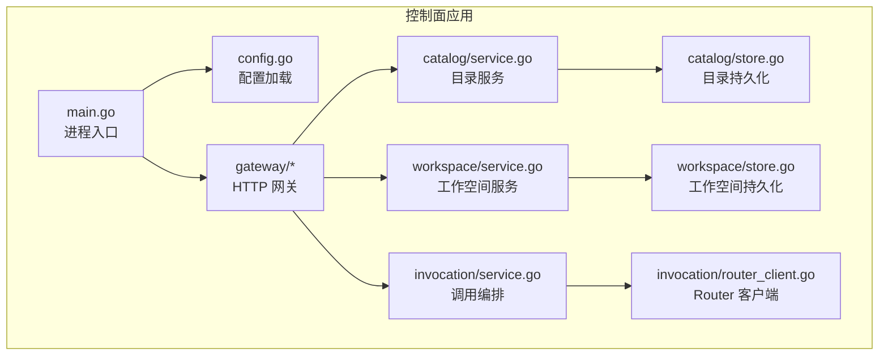
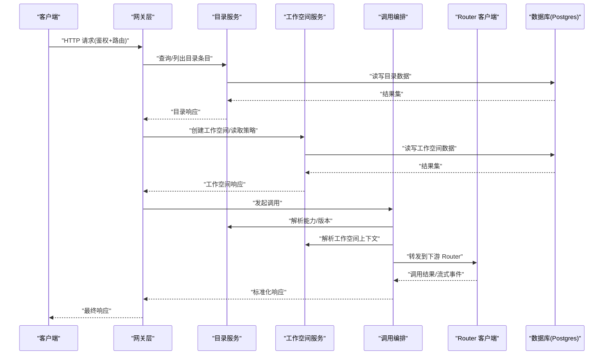
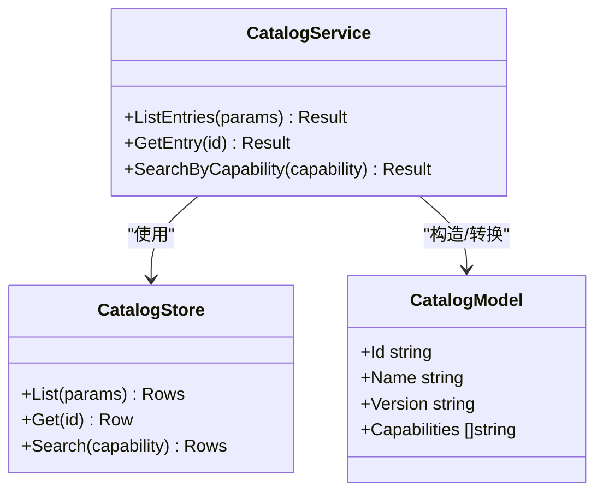
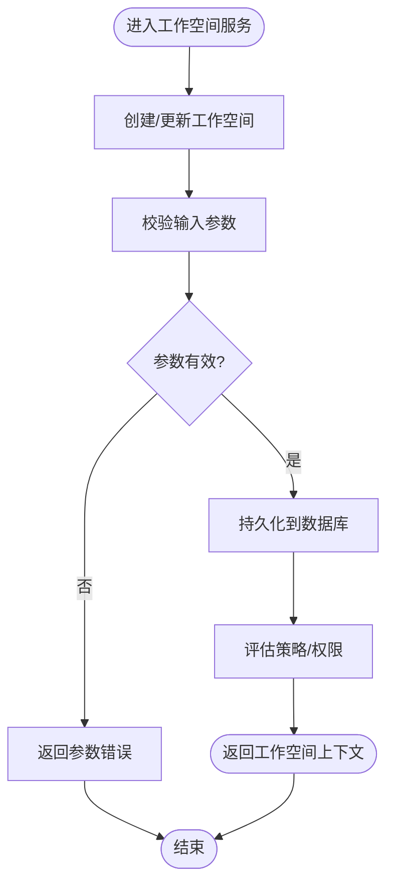
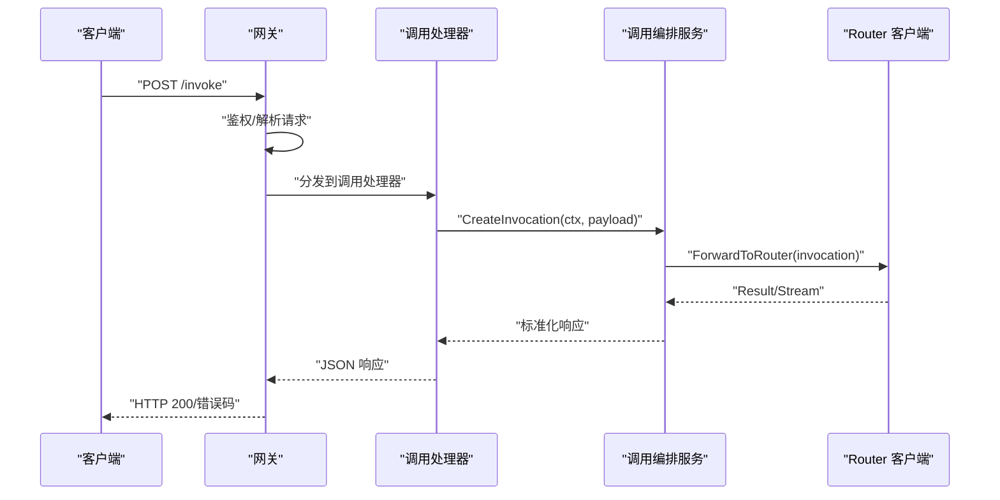
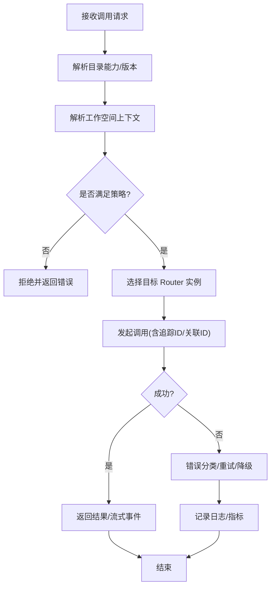
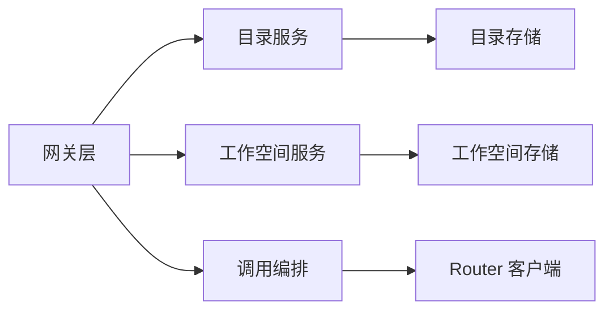

# 核心服务

<cite>
**本文引用的文件**   
- [apps/control-plane/cmd/control-plane/main.go](file://apps/control-plane/cmd/control-plane/main.go)
- [apps/control-plane/internal/config/config.go](file://apps/control-plane/internal/config/config.go)
- [apps/control-plane/internal/catalog/service.go](file://apps/control-plane/internal/catalog/service.go)
- [apps/control-plane/internal/catalog/store.go](file://apps/control-plane/internal/catalog/store.go)
- [apps/control-plane/internal/catalog/model.go](file://apps/control-plane/internal/catalog/model.go)
- [apps/control-plane/internal/workspace/service.go](file://apps/control-plane/internal/workspace/service.go)
- [apps/control-plane/internal/workspace/store.go](file://apps/control-plane/internal/workspace/store.go)
- [apps/control-plane/internal/workspace/model.go](file://apps/control-plane/internal/workspace/model.go)
- [apps/control-plane/internal/gateway/catalog_handler.go](file://apps/control-plane/internal/gateway/catalog_handler.go)
- [apps/control-plane/internal/gateway/workspace_handler.go](file://apps/control-plane/internal/gateway/workspace_handler.go)
- [apps/control-plane/internal/gateway/invocation_handler.go](file://apps/control-plane/internal/gateway/invocation_handler.go)
- [apps/control-plane/internal/gateway/auth.go](file://apps/control-plane/internal/gateway/auth.go)
- [apps/control-plane/internal/gateway/errors.go](file://apps/control-plane/internal/gateway/errors.go)
- [apps/control-plane/internal/invocation/service.go](file://apps/control-plane/internal/invocation/service.go)
- [apps/control-plane/internal/invocation/router_client.go](file://apps/control-plane/internal/invocation/router_client.go)
</cite>

## 目录
1. [简介](#简介)
2. [项目结构](#项目结构)
3. [核心组件](#核心组件)
4. [架构总览](#架构总览)
5. [详细组件分析](#详细组件分析)
6. [依赖关系分析](#依赖关系分析)
7. [性能考虑](#性能考虑)
8. [故障排查指南](#故障排查指南)
9. [结论](#结论)
10. [附录](#附录)

## 简介
本技术文档聚焦 NeKiro 控制面平台的核心服务，围绕目录服务、工作空间服务、网关层与调用路由服务等关键模块进行系统化说明。文档从系统架构、组件职责、数据流、接口契约、配置项、错误处理与性能特征等维度展开，并提供基于源码的可视化图示与排障建议，帮助初学者快速上手，同时为有经验的开发者提供深入的技术细节。

## 项目结构
控制面应用位于 apps/control-plane 下，采用分层组织：
- cmd/control-plane: 应用入口与进程启动
- internal/config: 配置加载与校验
- internal/catalog: 目录服务（Agent 注册、发现、版本管理）
- internal/workspace: 工作空间服务（安装、生命周期、策略）
- internal/gateway: HTTP 网关（鉴权、路由、错误映射）
- internal/invocation: 调用编排（路由到下游 Router）

图表来源
- [apps/control-plane/cmd/control-plane/main.go](file://apps/control-plane/cmd/control-plane/main.go)
- [apps/control-plane/internal/config/config.go](file://apps/control-plane/internal/config/config.go)
- [apps/control-plane/internal/gateway/catalog_handler.go](file://apps/control-plane/internal/gateway/catalog_handler.go)
- [apps/control-plane/internal/gateway/workspace_handler.go](file://apps/control-plane/internal/gateway/workspace_handler.go)
- [apps/control-plane/internal/gateway/invocation_handler.go](file://apps/control-plane/internal/gateway/invocation_handler.go)
- [apps/control-plane/internal/catalog/service.go](file://apps/control-plane/internal/catalog/service.go)
- [apps/control-plane/internal/catalog/store.go](file://apps/control-plane/internal/catalog/store.go)
- [apps/control-plane/internal/workspace/service.go](file://apps/control-plane/internal/workspace/service.go)
- [apps/control-plane/internal/workspace/store.go](file://apps/control-plane/internal/workspace/store.go)
- [apps/control-plane/internal/invocation/service.go](file://apps/control-plane/internal/invocation/service.go)
- [apps/control-plane/internal/invocation/router_client.go](file://apps/control-plane/internal/invocation/router_client.go)

章节来源
- [apps/control-plane/cmd/control-plane/main.go](file://apps/control-plane/cmd/control-plane/main.go)
- [apps/control-plane/internal/config/config.go](file://apps/control-plane/internal/config/config.go)

## 核心组件
- 目录服务（Catalog Service）
  - 职责：维护 Agent 卡片的注册、查询、分页与游标；支撑能力发现与版本选择。
  - 关键实现：service.go 暴露领域操作，store.go 对接持久化（Postgres），model.go 定义领域模型。
- 工作空间服务（Workspace Service）
  - 职责：管理工作空间的创建、读取、策略与安装上下文；提供安装边界与隔离语义。
  - 关键实现：service.go 暴露领域操作，store.go 对接持久化（Postgres），model.go 定义领域模型。
- 网关层（Gateway）
  - 职责：对外暴露 HTTP API，统一鉴权、错误映射、请求解析与响应序列化；将请求分发至各服务。
  - 关键实现：catalog_handler.go、workspace_handler.go、invocation_handler.go、auth.go、errors.go。
- 调用路由服务（Invocation + Router Client）
  - 职责：编排一次调用的生命周期，根据目录与工作空间信息选择目标实例，并通过 Router 客户端转发。
  - 关键实现：service.go 编排逻辑，router_client.go 封装对下游 Router 的内部协议调用。

章节来源
- [apps/control-plane/internal/catalog/service.go](file://apps/control-plane/internal/catalog/service.go)
- [apps/control-plane/internal/catalog/store.go](file://apps/control-plane/internal/catalog/store.go)
- [apps/control-plane/internal/catalog/model.go](file://apps/control-plane/internal/catalog/model.go)
- [apps/control-plane/internal/workspace/service.go](file://apps/control-plane/internal/workspace/service.go)
- [apps/control-plane/internal/workspace/store.go](file://apps/control-plane/internal/workspace/store.go)
- [apps/control-plane/internal/workspace/model.go](file://apps/control-plane/internal/workspace/model.go)
- [apps/control-plane/internal/gateway/catalog_handler.go](file://apps/control-plane/internal/gateway/catalog_handler.go)
- [apps/control-plane/internal/gateway/workspace_handler.go](file://apps/control-plane/internal/gateway/workspace_handler.go)
- [apps/control-plane/internal/gateway/invocation_handler.go](file://apps/control-plane/internal/gateway/invocation_handler.go)
- [apps/control-plane/internal/gateway/auth.go](file://apps/control-plane/internal/gateway/auth.go)
- [apps/control-plane/internal/gateway/errors.go](file://apps/control-plane/internal/gateway/errors.go)
- [apps/control-plane/internal/invocation/service.go](file://apps/control-plane/internal/invocation/service.go)
- [apps/control-plane/internal/invocation/router_client.go](file://apps/control-plane/internal/invocation/router_client.go)

## 架构总览
控制面作为“控制平面”，通过网关暴露 RESTful API，内部以领域服务为核心，持久化由 Postgres 承担，调用链通过 Router 客户端转发到执行侧。

图表来源
- [apps/control-plane/internal/gateway/catalog_handler.go](file://apps/control-plane/internal/gateway/catalog_handler.go)
- [apps/control-plane/internal/gateway/workspace_handler.go](file://apps/control-plane/internal/gateway/workspace_handler.go)
- [apps/control-plane/internal/gateway/invocation_handler.go](file://apps/control-plane/internal/gateway/invocation_handler.go)
- [apps/control-plane/internal/catalog/service.go](file://apps/control-plane/internal/catalog/service.go)
- [apps/control-plane/internal/workspace/service.go](file://apps/control-plane/internal/workspace/service.go)
- [apps/control-plane/internal/invocation/service.go](file://apps/control-plane/internal/invocation/service.go)
- [apps/control-plane/internal/invocation/router_client.go](file://apps/control-plane/internal/invocation/router_client.go)

## 详细组件分析

### 目录服务（Catalog Service）
- 设计要点
  - 领域模型：在 model.go 中定义卡片、能力、版本等实体。
  - 服务层：service.go 提供列表、查找、游标分页等能力。
  - 存储层：store.go 对接 Postgres，负责 SQL 构建与事务边界。
- 典型流程
  - 列出目录条目：网关 -> 目录服务 -> 存储层 -> 数据库 -> 返回分页结果。
  - 按条件查询：支持按名称、版本、能力过滤。
- 复杂度与优化
  - 游标分页避免深度偏移带来的性能问题。
  - 索引建议：名称、版本、能力字段建立合适索引以提升查询效率。

图表来源
- [apps/control-plane/internal/catalog/service.go](file://apps/control-plane/internal/catalog/service.go)
- [apps/control-plane/internal/catalog/store.go](file://apps/control-plane/internal/catalog/store.go)
- [apps/control-plane/internal/catalog/model.go](file://apps/control-plane/internal/catalog/model.go)

章节来源
- [apps/control-plane/internal/catalog/service.go](file://apps/control-plane/internal/catalog/service.go)
- [apps/control-plane/internal/catalog/store.go](file://apps/control-plane/internal/catalog/store.go)
- [apps/control-plane/internal/catalog/model.go](file://apps/control-plane/internal/catalog/model.go)

### 工作空间服务（Workspace Service）
- 设计要点
  - 领域模型：在 model.go 中定义工作空间、策略、安装上下文等实体。
  - 服务层：service.go 提供创建、读取、策略评估与安装边界检查。
  - 存储层：store.go 对接 Postgres，保证工作空间数据的强一致。
- 典型流程
  - 创建工作空间：网关 -> 工作空间服务 -> 存储层 -> 数据库 -> 返回工作空间标识。
  - 策略评估：结合工作空间上下文与策略规则，决定访问权限。
- 复杂度与优化
  - 策略计算可缓存热点规则，减少重复计算。
  - 写入路径建议短事务，降低锁竞争。

图表来源
- [apps/control-plane/internal/workspace/service.go](file://apps/control-plane/internal/workspace/service.go)
- [apps/control-plane/internal/workspace/store.go](file://apps/control-plane/internal/workspace/store.go)
- [apps/control-plane/internal/workspace/model.go](file://apps/control-plane/internal/workspace/model.go)

章节来源
- [apps/control-plane/internal/workspace/service.go](file://apps/control-plane/internal/workspace/service.go)
- [apps/control-plane/internal/workspace/store.go](file://apps/control-plane/internal/workspace/store.go)
- [apps/control-plane/internal/workspace/model.go](file://apps/control-plane/internal/workspace/model.go)

### 网关层（Gateway）
- 设计要点
  - 鉴权中间件：auth.go 负责令牌校验、用户上下文注入。
  - 错误映射：errors.go 将领域错误转换为标准 HTTP 状态码与 JSON 错误体。
  - 处理器：catalog_handler.go、workspace_handler.go、invocation_handler.go 分别对应目录、工作空间与调用路由。
- 请求处理序列（以调用为例）
  - 客户端 -> 网关鉴权 -> 调用处理器 -> 调用编排服务 -> Router 客户端 -> 下游 Router -> 返回结果。

图表来源
- [apps/control-plane/internal/gateway/invocation_handler.go](file://apps/control-plane/internal/gateway/invocation_handler.go)
- [apps/control-plane/internal/invocation/service.go](file://apps/control-plane/internal/invocation/service.go)
- [apps/control-plane/internal/invocation/router_client.go](file://apps/control-plane/internal/invocation/router_client.go)
- [apps/control-plane/internal/gateway/auth.go](file://apps/control-plane/internal/gateway/auth.go)
- [apps/control-plane/internal/gateway/errors.go](file://apps/control-plane/internal/gateway/errors.go)

章节来源
- [apps/control-plane/internal/gateway/catalog_handler.go](file://apps/control-plane/internal/gateway/catalog_handler.go)
- [apps/control-plane/internal/gateway/workspace_handler.go](file://apps/control-plane/internal/gateway/workspace_handler.go)
- [apps/control-plane/internal/gateway/invocation_handler.go](file://apps/control-plane/internal/gateway/invocation_handler.go)
- [apps/control-plane/internal/gateway/auth.go](file://apps/control-plane/internal/gateway/auth.go)
- [apps/control-plane/internal/gateway/errors.go](file://apps/control-plane/internal/gateway/errors.go)

### 调用路由服务（Invocation + Router Client）
- 设计要点
  - 编排服务：service.go 负责解析目录与工作空间上下文，选择目标实例并发起调用。
  - Router 客户端：router_client.go 封装内部协议调用，处理重试、超时与错误分类。
- 关键流程
  - 解析能力与版本 -> 选择工作空间 -> 调用 Router -> 聚合结果或流式事件 -> 返回给网关。

图表来源
- [apps/control-plane/internal/invocation/service.go](file://apps/control-plane/internal/invocation/service.go)
- [apps/control-plane/internal/invocation/router_client.go](file://apps/control-plane/internal/invocation/router_client.go)

章节来源
- [apps/control-plane/internal/invocation/service.go](file://apps/control-plane/internal/invocation/service.go)
- [apps/control-plane/internal/invocation/router_client.go](file://apps/control-plane/internal/invocation/router_client.go)

## 依赖关系分析
- 组件耦合
  - 网关层对服务层存在直接依赖，但通过处理器解耦具体业务。
  - 服务层对存储层抽象清晰，便于替换持久化实现。
  - 调用编排对 Router 客户端依赖明确，利于单元测试与模拟。
- 外部依赖
  - 数据库：Postgres（迁移脚本位于 migrations 目录）。
  - 协议：Router 内部协议由 router_client.go 封装。
- 潜在循环依赖
  - 当前分层清晰，未发现循环导入风险。

图表来源
- [apps/control-plane/internal/gateway/catalog_handler.go](file://apps/control-plane/internal/gateway/catalog_handler.go)
- [apps/control-plane/internal/gateway/workspace_handler.go](file://apps/control-plane/internal/gateway/workspace_handler.go)
- [apps/control-plane/internal/gateway/invocation_handler.go](file://apps/control-plane/internal/gateway/invocation_handler.go)
- [apps/control-plane/internal/catalog/service.go](file://apps/control-plane/internal/catalog/service.go)
- [apps/control-plane/internal/catalog/store.go](file://apps/control-plane/internal/catalog/store.go)
- [apps/control-plane/internal/workspace/service.go](file://apps/control-plane/internal/workspace/service.go)
- [apps/control-plane/internal/workspace/store.go](file://apps/control-plane/internal/workspace/store.go)
- [apps/control-plane/internal/invocation/service.go](file://apps/control-plane/internal/invocation/service.go)
- [apps/control-plane/internal/invocation/router_client.go](file://apps/control-plane/internal/invocation/router_client.go)

章节来源
- [apps/control-plane/internal/gateway/catalog_handler.go](file://apps/control-plane/internal/gateway/catalog_handler.go)
- [apps/control-plane/internal/gateway/workspace_handler.go](file://apps/control-plane/internal/gateway/workspace_handler.go)
- [apps/control-plane/internal/gateway/invocation_handler.go](file://apps/control-plane/internal/gateway/invocation_handler.go)
- [apps/control-plane/internal/catalog/service.go](file://apps/control-plane/internal/catalog/service.go)
- [apps/control-plane/internal/catalog/store.go](file://apps/control-plane/internal/catalog/store.go)
- [apps/control-plane/internal/workspace/service.go](file://apps/control-plane/internal/workspace/service.go)
- [apps/control-plane/internal/workspace/store.go](file://apps/control-plane/internal/workspace/store.go)
- [apps/control-plane/internal/invocation/service.go](file://apps/control-plane/internal/invocation/service.go)
- [apps/control-plane/internal/invocation/router_client.go](file://apps/control-plane/internal/invocation/router_client.go)

## 性能考虑
- 游标分页：目录服务使用游标分页，避免深度偏移导致的扫描放大。
- 索引策略：为高频查询字段（名称、版本、能力）建立索引，提升检索性能。
- 短事务：工作空间写入路径保持短事务，降低锁持有时间。
- 连接池：合理配置数据库连接池大小与超时，避免连接耗尽。
- 超时与重试：调用编排对 Router 客户端设置合理的超时与重试策略，增强鲁棒性。
- 缓存：对热点策略与目录元数据进行本地缓存，降低后端压力。

[本节为通用性能指导，不直接分析具体文件]

## 故障排查指南
- 鉴权失败
  - 现象：网关返回未授权或认证错误。
  - 排查：检查 auth.go 中的令牌校验逻辑与密钥配置。
- 参数校验错误
  - 现象：请求被拒绝，返回参数错误。
  - 排查：核对请求体结构与必填字段，参考错误映射 errors.go。
- 目录查询无结果
  - 现象：列出或搜索目录为空。
  - 排查：确认 store.go 的查询条件与数据库索引是否正确。
- 工作空间策略拒绝
  - 现象：调用被拒绝，提示权限不足。
  - 排查：检查工作空间策略与服务层评估逻辑。
- 调用路由失败
  - 现象：调用超时或下游不可用。
  - 排查：检查 router_client.go 的重试与错误分类，确认下游 Router 健康状态。

章节来源
- [apps/control-plane/internal/gateway/auth.go](file://apps/control-plane/internal/gateway/auth.go)
- [apps/control-plane/internal/gateway/errors.go](file://apps/control-plane/internal/gateway/errors.go)
- [apps/control-plane/internal/catalog/store.go](file://apps/control-plane/internal/catalog/store.go)
- [apps/control-plane/internal/workspace/service.go](file://apps/control-plane/internal/workspace/service.go)
- [apps/control-plane/internal/invocation/router_client.go](file://apps/control-plane/internal/invocation/router_client.go)

## 结论
NeKiro 控制面通过清晰的层次划分与明确的职责边界，实现了目录服务、工作空间服务、网关层与调用路由服务的协同工作。目录与工作空间服务提供稳定的领域能力，网关层统一鉴权与错误处理，调用编排负责跨组件协作与下游转发。配合合理的索引、连接池与重试策略，整体具备较好的可扩展性与稳定性。

[本节为总结性内容，不直接分析具体文件]

## 附录
- 配置选项
  - 数据库连接：DSN、最大连接数、空闲连接数、超时。
  - 网关监听：端口、TLS 证书、鉴权密钥。
  - 调用路由：下游 Router 地址、超时、重试次数。
- 接口契约
  - 目录 API：列出、查询、游标分页。
  - 工作空间 API：创建、读取、策略评估。
  - 调用 API：发起调用、获取结果/流式事件。
- 最佳实践
  - 使用游标分页替代偏移分页。
  - 为高频查询字段建立索引。
  - 设置合理的超时与重试策略。
  - 对敏感配置使用环境变量或密钥管理服务。

[本节为补充信息，不直接分析具体文件]