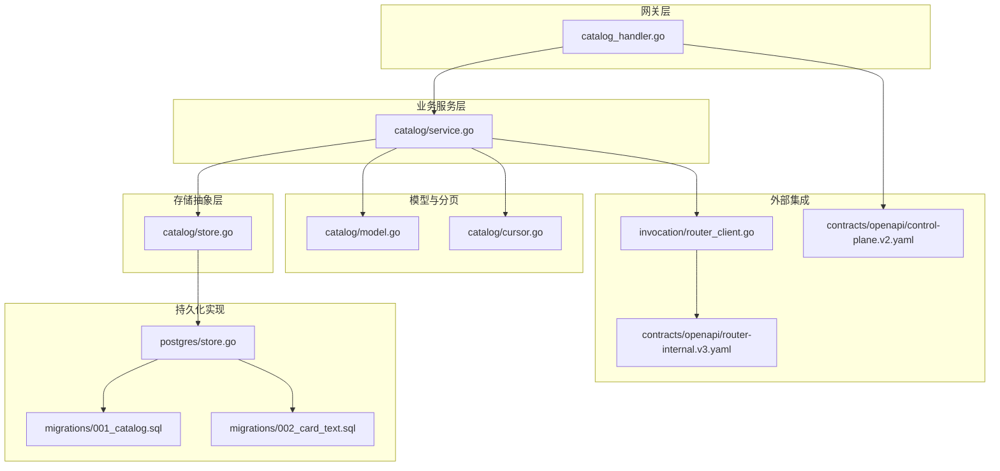
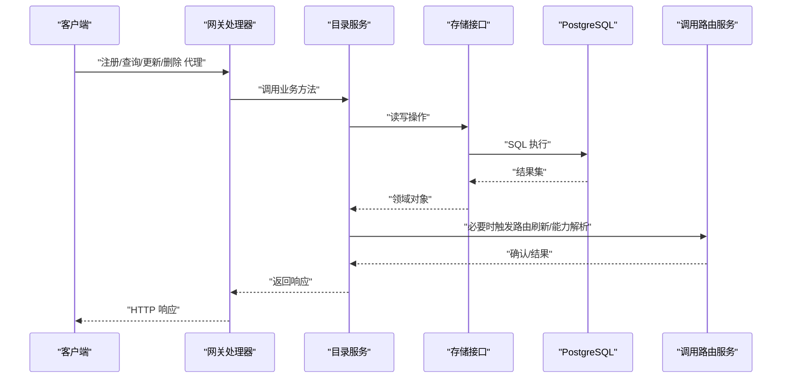
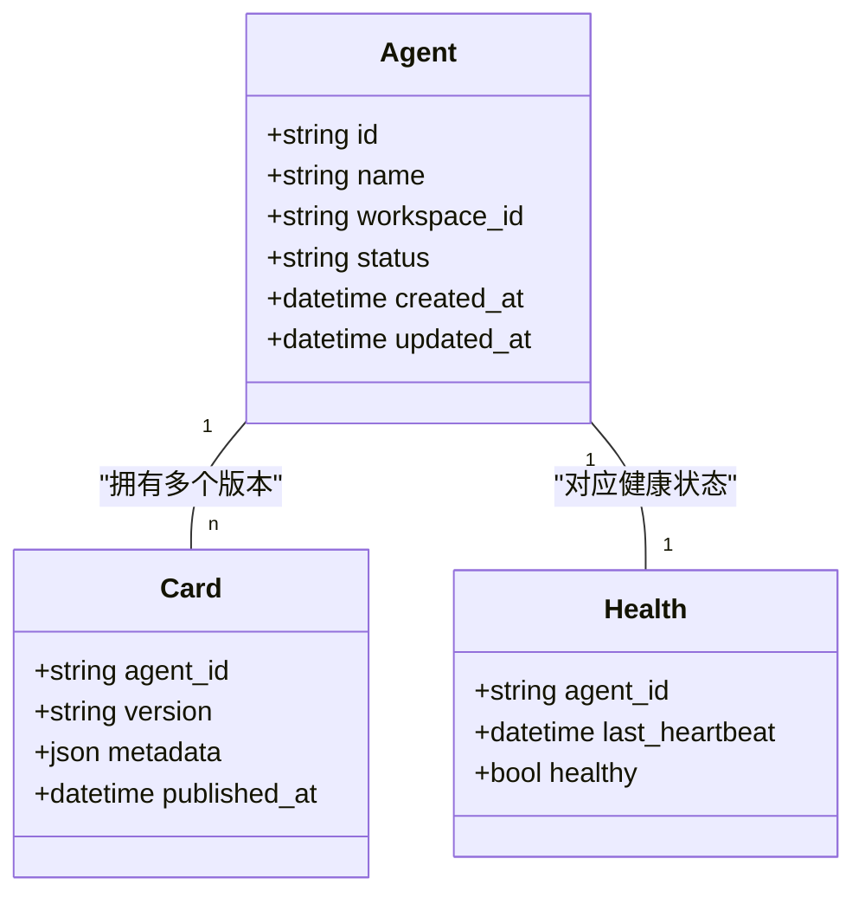
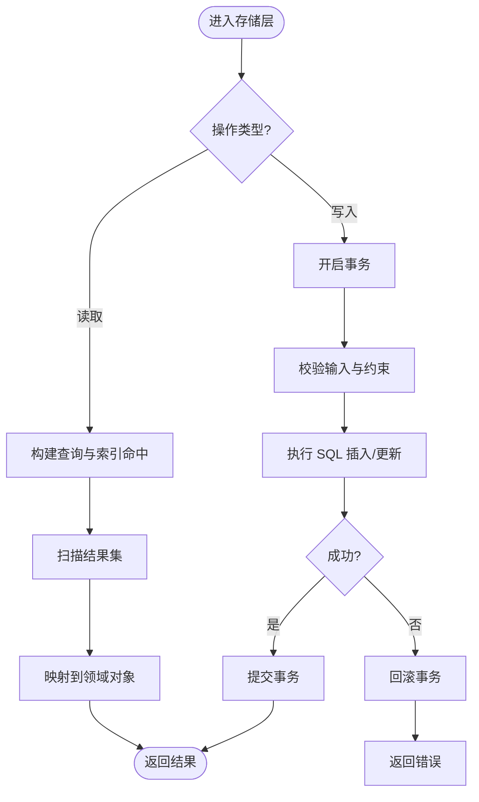
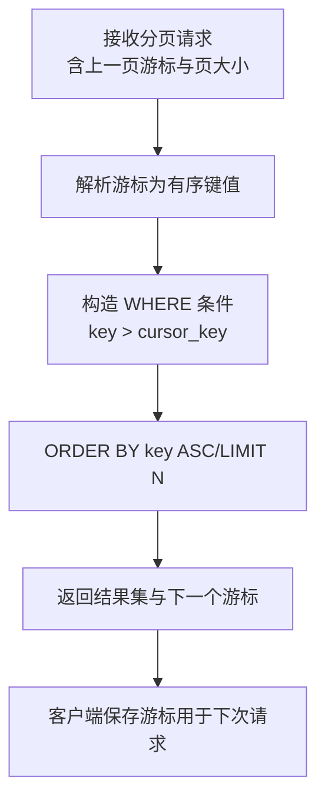
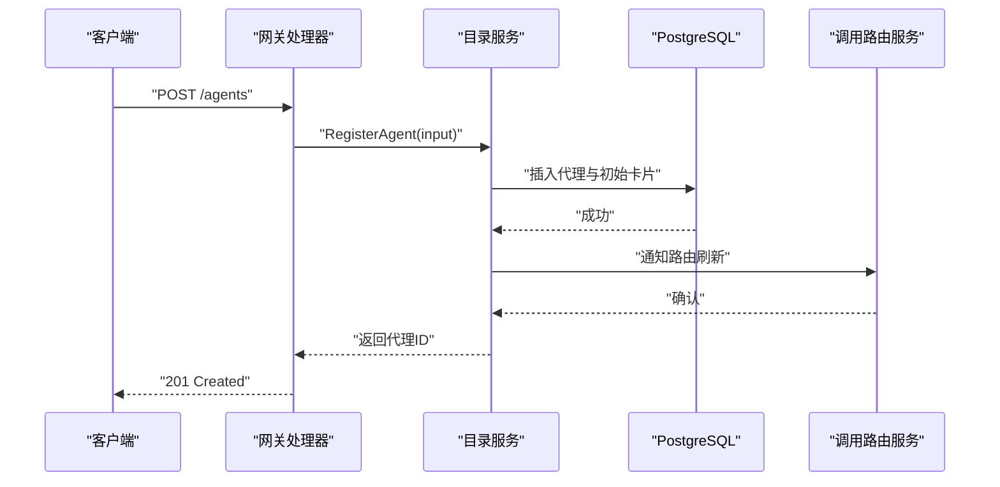
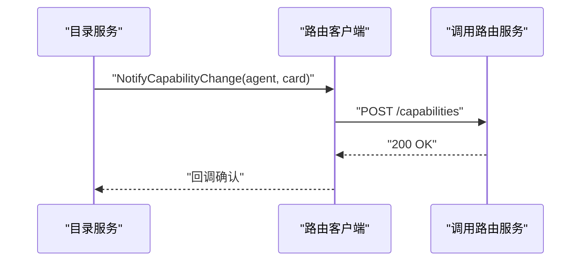
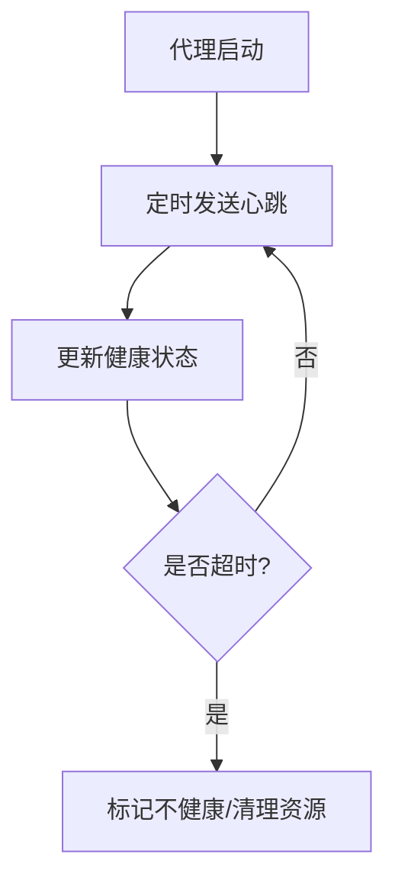
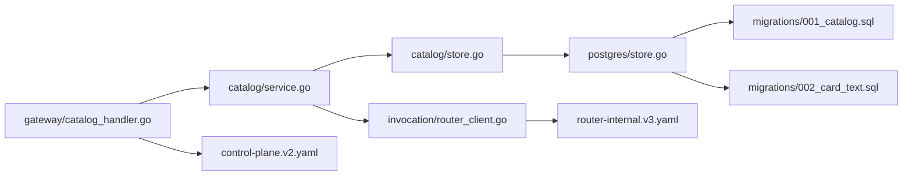

# 目录服务

<cite>
**本文引用的文件**   
- [apps/control-plane/internal/catalog/service.go](file://apps/control-plane/internal/catalog/service.go)
- [apps/control-plane/internal/catalog/store.go](file://apps/control-plane/internal/catalog/store.go)
- [apps/control-plane/internal/catalog/postgres/store.go](file://apps/control-plane/internal/catalog/postgres/store.go)
- [apps/control-plane/internal/catalog/model.go](file://apps/control-plane/internal/catalog/model.go)
- [apps/control-plane/internal/catalog/cursor.go](file://apps/control-plane/internal/catalog/cursor.go)
- [apps/control-plane/internal/gateway/catalog_handler.go](file://apps/control-plane/internal/gateway/catalog_handler.go)
- [apps/control-plane/internal/invocation/router_client.go](file://apps/control-plane/internal/invocation/router_client.go)
- [contracts/openapi/control-plane.v2.yaml](file://contracts/openapi/control-plane.v2.yaml)
- [contracts/openapi/router-internal.v3.yaml](file://contracts/openapi/router-internal.v3.yaml)
- [migrations/001_catalog.sql](file://migrations/001_catalog.sql)
- [migrations/002_card_text.sql](file://migrations/002_card_text.sql)
- [apps/control-plane/cmd/control-plane/main.go](file://apps/control-plane/cmd/control-plane/main.go)
</cite>

## 目录
1. [简介](#简介)
2. [项目结构](#项目结构)
3. [核心组件](#核心组件)
4. [架构总览](#架构总览)
5. [详细组件分析](#详细组件分析)
6. [依赖关系分析](#依赖关系分析)
7. [性能考虑](#性能考虑)
8. [故障排查指南](#故障排查指南)
9. [结论](#结论)
10. [附录](#附录)

## 简介
本文件为 NeKiro 平台“目录服务”的技术文档，聚焦代理注册、发现与管理能力。内容涵盖：
- 服务接口定义与数据模型
- 数据存储层设计与游标分页查询机制
- 代理卡片管理、版本控制与健康检查
- 与网关层和调用路由服务的交互关系
- 并发访问处理、常见问题与调优建议

## 项目结构
目录服务位于 control-plane 应用内，主要包含以下层次：
- 网关层（HTTP API）：对外暴露目录相关接口
- 业务服务层：编排注册、发现、管理等业务逻辑
- 存储抽象层：统一的数据访问接口
- 持久化实现：基于 PostgreSQL 的迁移与存储实现
- 数据模型与游标分页：领域模型与高效分页工具

图表来源
- [apps/control-plane/internal/gateway/catalog_handler.go](file://apps/control-plane/internal/gateway/catalog_handler.go)
- [apps/control-plane/internal/catalog/service.go](file://apps/control-plane/internal/catalog/service.go)
- [apps/control-plane/internal/catalog/store.go](file://apps/control-plane/internal/catalog/store.go)
- [apps/control-plane/internal/catalog/postgres/store.go](file://apps/control-plane/internal/catalog/postgres/store.go)
- [migrations/001_catalog.sql](file://migrations/001_catalog.sql)
- [migrations/002_card_text.sql](file://migrations/002/card_text.sql)
- [apps/control-plane/internal/catalog/model.go](file://apps/control-plane/internal/catalog/model.go)
- [apps/control-plane/internal/catalog/cursor.go](file://apps/control-plane/internal/catalog/cursor.go)
- [apps/control-plane/internal/invocation/router_client.go](file://apps/control-plane/internal/invocation/router_client.go)
- [contracts/openapi/control-plane.v2.yaml](file://contracts/openapi/control-plane.v2.yaml)
- [contracts/openapi/router-internal.v3.yaml](file://contracts/openapi/router-internal.v3.yaml)

章节来源
- [apps/control-plane/cmd/control-plane/main.go](file://apps/control-plane/cmd/control-plane/main.go)

## 核心组件
- 网关处理器：负责解析 HTTP 请求、参数校验、调用服务层并返回响应
- 目录服务：封装代理注册、更新、删除、查询、健康检查等核心流程
- 存储接口：定义统一的 CRUD 与分页查询方法
- PostgreSQL 存储实现：基于 SQL 迁移脚本进行表结构管理，提供高性能查询
- 数据模型：描述代理、卡片、版本、状态等实体
- 游标分页：基于有序键的高效翻页方案，避免深分页性能问题
- 路由客户端：与调用路由服务交互，完成能力解析与路由决策

章节来源
- [apps/control-plane/internal/gateway/catalog_handler.go](file://apps/control-plane/internal/gateway/catalog_handler.go)
- [apps/control-plane/internal/catalog/service.go](file://apps/control-plane/internal/catalog/service.go)
- [apps/control-plane/internal/catalog/store.go](file://apps/control-plane/internal/catalog/store.go)
- [apps/control-plane/internal/catalog/postgres/store.go](file://apps/control-plane/internal/catalog/postgres/store.go)
- [apps/control-plane/internal/catalog/model.go](file://apps/control-plane/internal/catalog/model.go)
- [apps/control-plane/internal/catalog/cursor.go](file://apps/control-plane/internal/catalog/cursor.go)
- [apps/control-plane/internal/invocation/router_client.go](file://apps/control-plane/internal/invocation/router_client.go)

## 架构总览
目录服务通过网关暴露 RESTful API，内部由服务层协调存储与路由客户端。数据持久化采用 PostgreSQL，使用迁移脚本维护 schema。

图表来源
- [apps/control-plane/internal/gateway/catalog_handler.go](file://apps/control-plane/internal/gateway/catalog_handler.go)
- [apps/control-plane/internal/catalog/service.go](file://apps/control-plane/internal/catalog/service.go)
- [apps/control-plane/internal/catalog/store.go](file://apps/control-plane/internal/catalog/store.go)
- [apps/control-plane/internal/catalog/postgres/store.go](file://apps/control-plane/internal/catalog/postgres/store.go)
- [apps/control-plane/internal/invocation/router_client.go](file://apps/control-plane/internal/invocation/router_client.go)

## 详细组件分析

### 数据模型与版本控制
- 代理实体：包含标识、名称、工作空间、状态、时间戳等字段
- 代理卡片：承载能力描述、端点信息、权限、版本等元数据
- 版本控制：支持多版本并存，按版本号或语义化选择策略进行解析
- 健康状态：记录最后心跳时间与可用性标记，供网关与路由层参考

图表来源
- [apps/control-plane/internal/catalog/model.go](file://apps/control-plane/internal/catalog/model.go)
- [migrations/001_catalog.sql](file://migrations/001_catalog.sql)
- [migrations/002_card_text.sql](file://migrations/002/card_text.sql)

章节来源
- [apps/control-plane/internal/catalog/model.go](file://apps/control-plane/internal/catalog/model.go)
- [migrations/001_catalog.sql](file://migrations/001_catalog.sql)
- [migrations/002_card_text.sql](file://migrations/002/card_text.sql)

### 存储抽象与 PostgreSQL 实现
- 存储接口：定义创建、读取、更新、删除、列表查询、按条件过滤等方法
- PostgreSQL 实现：
  - 使用迁移脚本初始化表结构与索引
  - 针对常用查询路径建立复合索引，优化排序与过滤
  - 事务边界清晰，保证写操作的原子性与一致性

图表来源
- [apps/control-plane/internal/catalog/store.go](file://apps/control-plane/internal/catalog/store.go)
- [apps/control-plane/internal/catalog/postgres/store.go](file://apps/control-plane/internal/catalog/postgres/store.go)
- [migrations/001_catalog.sql](file://migrations/001_catalog.sql)
- [migrations/002_card_text.sql](file://migrations/002/card_text.sql)

章节来源
- [apps/control-plane/internal/catalog/store.go](file://apps/control-plane/internal/catalog/store.go)
- [apps/control-plane/internal/catalog/postgres/store.go](file://apps/control-plane/internal/catalog/postgres/store.go)
- [migrations/001_catalog.sql](file://migrations/001_catalog.sql)
- [migrations/002/card_text.sql](file://migrations/002/card_text.sql)

### 游标分页查询机制
- 设计目标：避免 OFFSET 深分页导致的性能退化，提升大数据量下的稳定性
- 实现要点：
  - 基于有序键（如更新时间、主键）生成游标
  - 下一页查询以游标作为起始条件，结合 LIMIT 限制返回条数
  - 服务端对游标进行签名或校验，防止篡改
- 适用场景：代理列表、卡片历史、健康事件等高频分页接口

图表来源
- [apps/control-plane/internal/catalog/cursor.go](file://apps/control-plane/internal/catalog/cursor.go)
- [apps/control-plane/internal/catalog/store.go](file://apps/control-plane/internal/catalog/store.go)

章节来源
- [apps/control-plane/internal/catalog/cursor.go](file://apps/control-plane/internal/catalog/cursor.go)
- [apps/control-plane/internal/catalog/store.go](file://apps/control-plane/internal/catalog/store.go)

### 网关层与目录服务交互
- 网关处理器：
  - 解析路径与查询参数，校验必填字段
  - 调用目录服务方法进行业务处理
  - 将领域对象序列化为标准 JSON 响应
- 目录服务：
  - 编排存储读写与路由客户端调用
  - 处理并发冲突（如重复注册、版本覆盖）
  - 触发健康检查与路由刷新

图表来源
- [apps/control-plane/internal/gateway/catalog_handler.go](file://apps/control-plane/internal/gateway/catalog_handler.go)
- [apps/control-plane/internal/catalog/service.go](file://apps/control-plane/internal/catalog/service.go)
- [apps/control-plane/internal/invocation/router_client.go](file://apps/control-plane/internal/invocation/router_client.go)

章节来源
- [apps/control-plane/internal/gateway/catalog_handler.go](file://apps/control-plane/internal/gateway/catalog_handler.go)
- [apps/control-plane/internal/catalog/service.go](file://apps/control-plane/internal/catalog/service.go)
- [apps/control-plane/internal/invocation/router_client.go](file://apps/control-plane/internal/invocation/router_client.go)

### 与调用路由服务的交互
- 路由客户端负责：
  - 向路由服务上报代理能力变更
  - 获取路由决策所需的上下文信息
  - 处理超时与重试，确保最终一致性
- 目录服务在注册/更新后触发路由刷新，保证发现链路及时生效

图表来源
- [apps/control-plane/internal/invocation/router_client.go](file://apps/control-plane/internal/invocation/router_client.go)
- [contracts/openapi/router-internal.v3.yaml](file://contracts/openapi/router-internal.v3.yaml)

章节来源
- [apps/control-plane/internal/invocation/router_client.go](file://apps/control-plane/internal/invocation/router_client.go)
- [contracts/openapi/router-internal.v3.yaml](file://contracts/openapi/router-internal.v3.yaml)

### 健康检查与心跳
- 代理定期发送心跳，更新健康状态
- 网关与服务层可基于健康状态进行流量治理与降级
- 异常时自动清理过期心跳，避免僵尸节点影响发现

[此图为概念性流程图，无需图表来源]

## 依赖关系分析
- 网关层依赖目录服务接口
- 目录服务依赖存储抽象与路由客户端
- 存储抽象依赖 PostgreSQL 实现与迁移脚本
- 外部契约通过 OpenAPI 定义，确保跨服务一致性

图表来源
- [apps/control-plane/internal/gateway/catalog_handler.go](file://apps/control-plane/internal/gateway/catalog_handler.go)
- [apps/control-plane/internal/catalog/service.go](file://apps/control-plane/internal/catalog/service.go)
- [apps/control-plane/internal/catalog/store.go](file://apps/control-plane/internal/catalog/store.go)
- [apps/control-plane/internal/catalog/postgres/store.go](file://apps/control-plane/internal/catalog/postgres/store.go)
- [migrations/001_catalog.sql](file://migrations/001_catalog.sql)
- [migrations/002/card_text.sql](file://migrations/002/card_text.sql)
- [contracts/openapi/control-plane.v2.yaml](file://contracts/openapi/control-plane.v2.yaml)
- [contracts/openapi/router-internal.v3.yaml](file://contracts/openapi/router-internal.v3.yaml)

章节来源
- [apps/control-plane/internal/gateway/catalog_handler.go](file://apps/control-plane/internal/gateway/catalog_handler.go)
- [apps/control-plane/internal/catalog/service.go](file://apps/control-plane/internal/catalog/service.go)
- [apps/control-plane/internal/catalog/store.go](file://apps/control-plane/internal/catalog/store.go)
- [apps/control-plane/internal/catalog/postgres/store.go](file://apps/control-plane/internal/catalog/postgres/store.go)
- [migrations/001_catalog.sql](file://migrations/001_catalog.sql)
- [migrations/002/card_text.sql](file://migrations/002/card_text.sql)
- [contracts/openapi/control-plane.v2.yaml](file://contracts/openapi/control-plane.v2.yaml)
- [contracts/openapi/router-internal.v3.yaml](file://contracts/openapi/router-internal.v3.yaml)

## 性能考虑
- 连接池配置
  - 根据并发度与数据库容量合理设置最大连接数
  - 监控连接等待与空闲回收，避免连接泄漏
- 索引优化
  - 为常用过滤与排序字段建立复合索引
  - 避免过度索引导致写入放大
- 游标分页
  - 使用有序键与 LIMIT 替代 OFFSET，降低深分页成本
- 缓存与一致性
  - 对热点读路径引入本地缓存，注意失效策略
  - 写路径保持强一致，读路径允许短暂不一致
- 超时与重试
  - 对路由客户端调用设置合理超时与退避重试
  - 幂等设计避免重复刷新造成抖动

[本节为通用指导，无需章节来源]

## 故障排查指南
- 注册失败
  - 检查唯一约束冲突（如名称、工作空间组合）
  - 查看事务日志与回滚原因
- 查询缓慢
  - 验证索引命中情况，关注全表扫描
  - 调整游标分页参数，避免过大页大小
- 路由刷新延迟
  - 检查路由客户端超时与重试策略
  - 观察路由服务负载与队列积压
- 健康状态异常
  - 核对心跳间隔与阈值
  - 排查网络分区与代理进程崩溃

章节来源
- [apps/control-plane/internal/catalog/service.go](file://apps/control-plane/internal/catalog/service.go)
- [apps/control-plane/internal/catalog/postgres/store.go](file://apps/control-plane/internal/catalog/postgres/store.go)
- [apps/control-plane/internal/invocation/router_client.go](file://apps/control-plane/internal/invocation/router_client.go)

## 结论
目录服务通过清晰的层次划分与稳定的存储抽象，实现了代理注册、发现与管理的核心能力。游标分页与索引优化保障了高吞吐与低延迟；与路由服务的协作确保了发现链路的实时性。遵循本文的性能与排障建议，可在生产环境中获得稳定可靠的目录服务体验。

## 附录
- API 契约参考
  - 控制平面对外接口：[contracts/openapi/control-plane.v2.yaml](file://contracts/openapi/control-plane.v2.yaml)
  - 路由内部接口：[contracts/openapi/router-internal.v3.yaml](file://contracts/openapi/router-internal.v3.yaml)
- 数据库迁移
  - 目录基础表：[migrations/001_catalog.sql](file://migrations/001_catalog.sql)
  - 卡片文本扩展：[migrations/002_card_text.sql](file://migrations/002/card_text.sql)