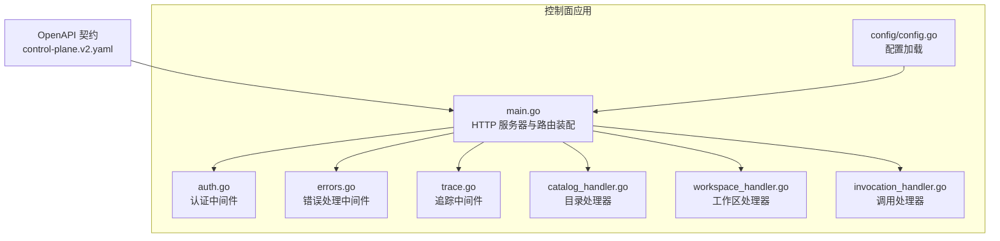
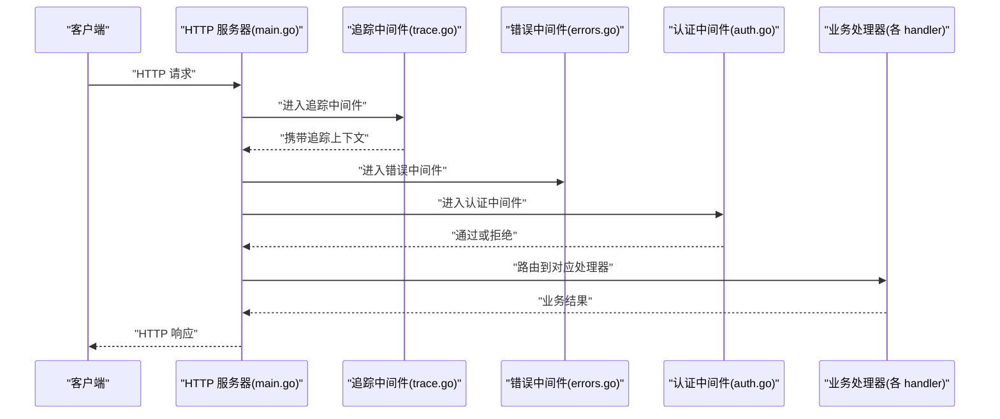
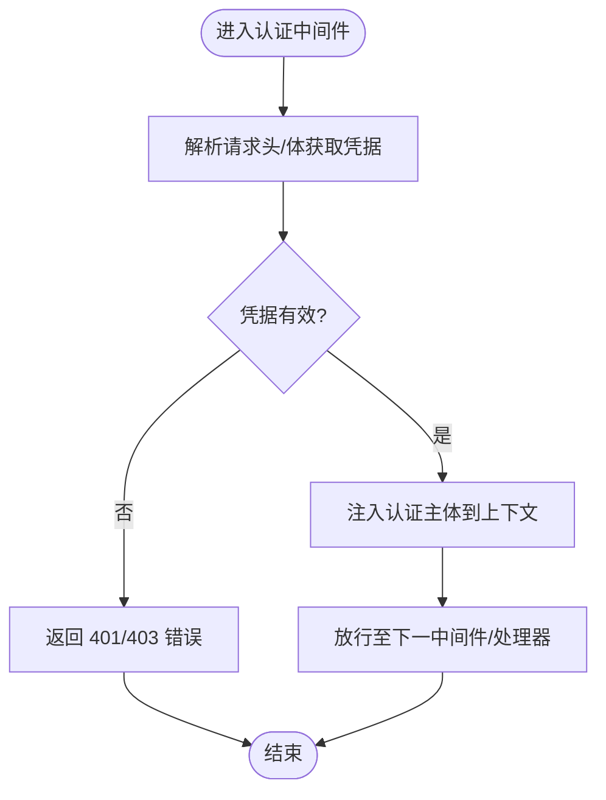
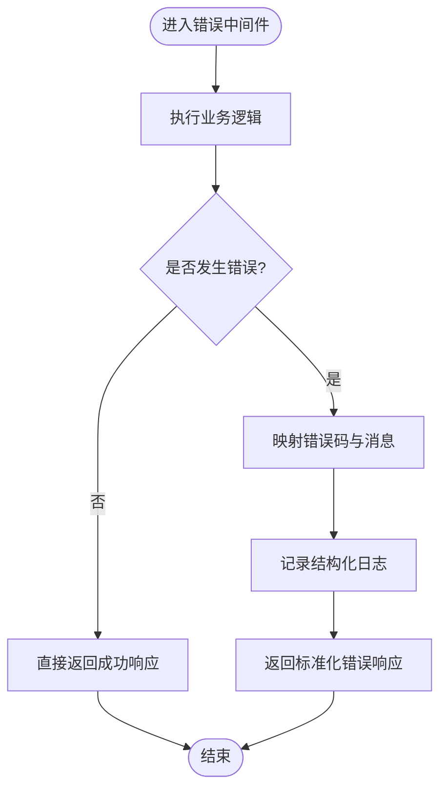
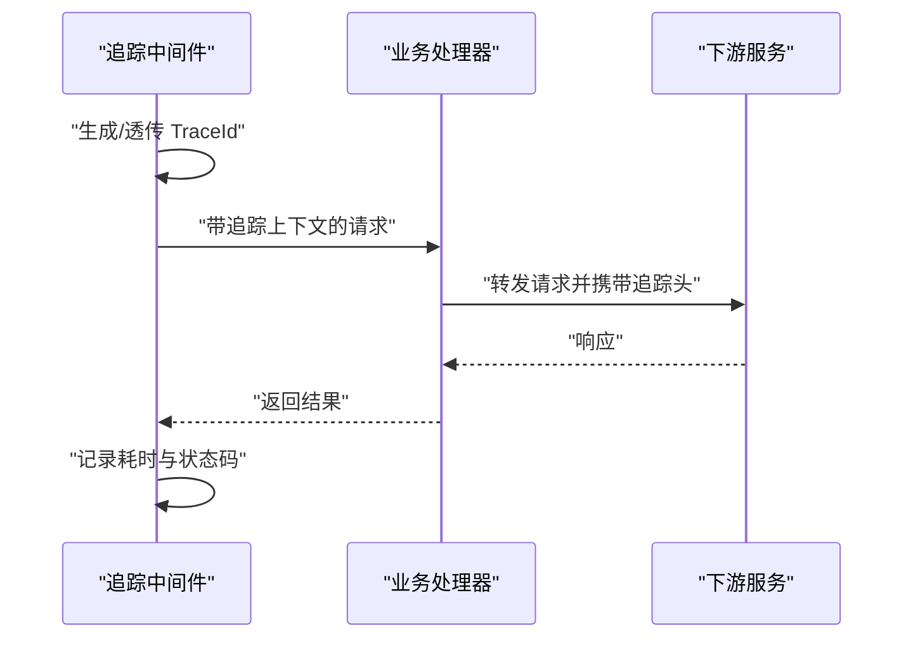
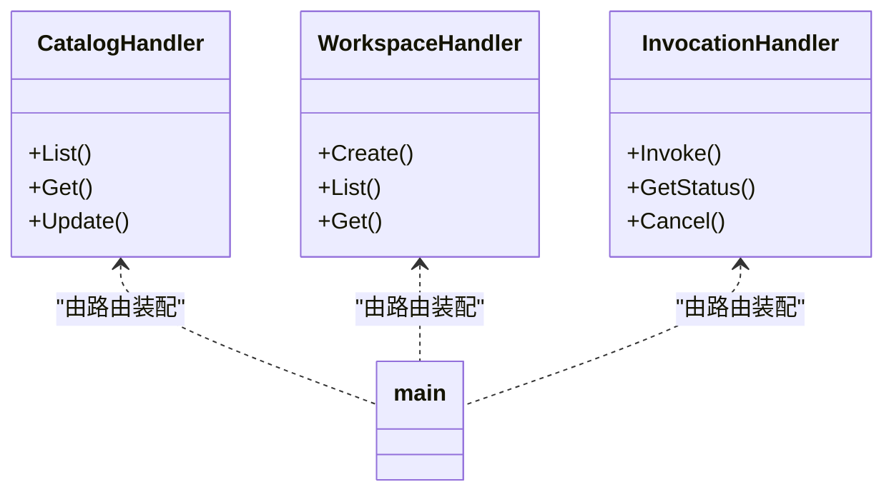
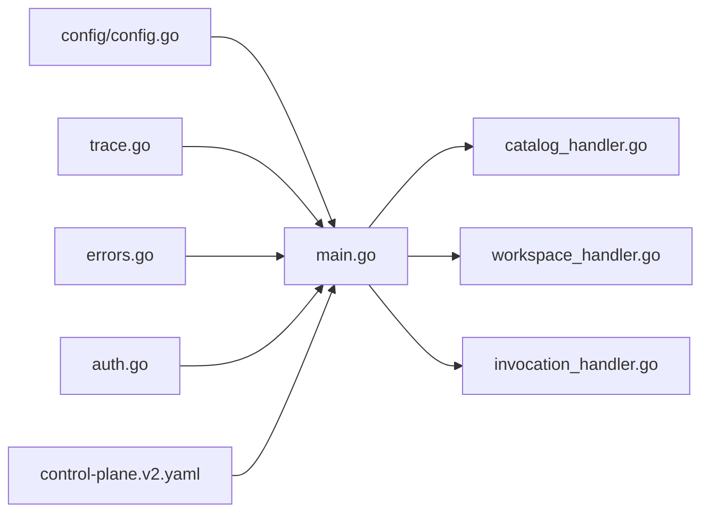

# 网关层

<cite>
**本文引用的文件**   
- [apps/control-plane/cmd/control-plane/main.go](file://apps/control-plane/cmd/control-plane/main.go)
- [apps/control-plane/internal/gateway/auth.go](file://apps/control-plane/internal/gateway/auth.go)
- [apps/control-plane/internal/gateway/errors.go](file://apps/control-plane/internal/gateway/errors.go)
- [apps/control-plane/internal/gateway/trace.go](file://apps/control-plane/internal/gateway/trace.go)
- [apps/control-plane/internal/gateway/catalog_handler.go](file://apps/control-plane/internal/gateway/catalog_handler.go)
- [apps/control-plane/internal/gateway/workspace_handler.go](file://apps/control-plane/internal/gateway/workspace_handler.go)
- [apps/control-plane/internal/gateway/invocation_handler.go](file://apps/control-plane/internal/gateway/invocation_handler.go)
- [apps/control-plane/internal/config/config.go](file://apps/control-plane/internal/config/config.go)
- [contracts/openapi/control-plane.v2.yaml](file://contracts/openapi/control-plane.v2.yaml)
</cite>

## 目录
1. [简介](#简介)
2. [项目结构](#项目结构)
3. [核心组件](#核心组件)
4. [架构总览](#架构总览)
5. [详细组件分析](#详细组件分析)
6. [依赖关系分析](#依赖关系分析)
7. [性能考虑](#性能考虑)
8. [故障排查指南](#故障排查指南)
9. [结论](#结论)
10. [附录](#附录)

## 简介
本文件面向 NeKiro 平台的网关层，聚焦控制面服务中的统一 API 入口、认证授权中间件、请求路由转发、HTTP 处理器设计、错误处理机制、追踪监控集成等关键能力。文档基于仓库中实际代码与 OpenAPI 契约进行说明，并提供扩展指南（新增端点、自定义认证、配置转发规则）、中间件链执行顺序与扩展方式、常见问题定位与安全加固建议。

## 项目结构
网关相关实现位于 control-plane 应用内部，主要包含：
- 启动与 HTTP 服务器装配：main.go
- 网关中间件：认证 auth.go、错误 errors.go、追踪 trace.go
- 业务处理器：目录 catalog_handler.go、工作区 workspace_handler.go、调用 invocation_handler.go
- 配置加载：config/config.go
- 外部契约：OpenAPI 定义 contracts/openapi/control-plane.v2.yaml

图示来源
- [apps/control-plane/cmd/control-plane/main.go](file://apps/control-plane/cmd/control-plane/main.go)
- [apps/control-plane/internal/gateway/auth.go](file://apps/control-plane/internal/gateway/auth.go)
- [apps/control-plane/internal/gateway/errors.go](file://apps/control-plane/internal/gateway/errors.go)
- [apps/control-plane/internal/gateway/trace.go](file://apps/control-plane/internal/gateway/trace.go)
- [apps/control-plane/internal/gateway/catalog_handler.go](file://apps/control-plane/internal/gateway/catalog_handler.go)
- [apps/control-plane/internal/gateway/workspace_handler.go](file://apps/control-plane/internal/gateway/workspace_handler.go)
- [apps/control-plane/internal/gateway/invocation_handler.go](file://apps/control-plane/internal/gateway/invocation_handler.go)
- [apps/control-plane/internal/config/config.go](file://apps/control-plane/internal/config/config.go)
- [contracts/openapi/control-plane.v2.yaml](file://contracts/openapi/control-plane.v2.yaml)

章节来源
- [apps/control-plane/cmd/control-plane/main.go](file://apps/control-plane/cmd/control-plane/main.go)
- [apps/control-plane/internal/config/config.go](file://apps/control-plane/internal/config/config.go)
- [contracts/openapi/control-plane.v2.yaml](file://contracts/openapi/control-plane.v2.yaml)

## 核心组件
- 统一入口与路由装配：负责创建 HTTP 服务器、挂载中间件链、注册各业务处理器路由。
- 认证授权中间件：校验请求身份与权限，失败时返回标准错误响应。
- 错误处理中间件：统一捕获异常、标准化错误码与消息、记录上下文信息。
- 追踪中间件：注入/透传追踪标识，记录请求耗时与关键事件。
- 业务处理器：按领域划分（目录、工作区、调用），实现具体 API 逻辑。
- 配置模块：提供运行时参数（如端口、超时、鉴权策略开关等）。

章节来源
- [apps/control-plane/cmd/control-plane/main.go](file://apps/control-plane/cmd/control-plane/main.go)
- [apps/control-plane/internal/gateway/auth.go](file://apps/control-plane/internal/gateway/auth.go)
- [apps/control-plane/internal/gateway/errors.go](file://apps/control-plane/internal/gateway/errors.go)
- [apps/control-plane/internal/gateway/trace.go](file://apps/control-plane/internal/gateway/trace.go)
- [apps/control-plane/internal/gateway/catalog_handler.go](file://apps/control-plane/internal/gateway/catalog_handler.go)
- [apps/control-plane/internal/gateway/workspace_handler.go](file://apps/control-plane/internal/gateway/workspace_handler.go)
- [apps/control-plane/internal/gateway/invocation_handler.go](file://apps/control-plane/internal/gateway/invocation_handler.go)
- [apps/control-plane/internal/config/config.go](file://apps/control-plane/internal/config/config.go)

## 架构总览
网关层采用“中间件 + 处理器”的清晰分层：所有入站请求先经过通用中间件链（追踪、错误、认证），再进入具体业务处理器；处理器完成业务逻辑后返回结构化响应。

图示来源
- [apps/control-plane/cmd/control-plane/main.go](file://apps/control-plane/cmd/control-plane/main.go)
- [apps/control-plane/internal/gateway/trace.go](file://apps/control-plane/internal/gateway/trace.go)
- [apps/control-plane/internal/gateway/errors.go](file://apps/control-plane/internal/gateway/errors.go)
- [apps/control-plane/internal/gateway/auth.go](file://apps/control-plane/internal/gateway/auth.go)
- [apps/control-plane/internal/gateway/catalog_handler.go](file://apps/control-plane/internal/gateway/catalog_handler.go)
- [apps/control-plane/internal/gateway/workspace_handler.go](file://apps/control-plane/internal/gateway/workspace_handler.go)
- [apps/control-plane/internal/gateway/invocation_handler.go](file://apps/control-plane/internal/gateway/invocation_handler.go)

## 详细组件分析

### 统一入口与路由装配（main.go）
- 职责
  - 加载配置并初始化 HTTP 服务器
  - 组装中间件链（追踪、错误、认证）
  - 注册各业务处理器路由
  - 暴露健康检查与调试接口（可选）
- 关键点
  - 中间件顺序决定执行流：通常先追踪，再错误，最后认证
  - 路由分组可按域划分（/catalog、/workspace、/invocation）
  - 可结合 OpenAPI 契约生成路由表或作为校验依据

章节来源
- [apps/control-plane/cmd/control-plane/main.go](file://apps/control-plane/cmd/control-plane/main.go)
- [contracts/openapi/control-plane.v2.yaml](file://contracts/openapi/control-plane.v2.yaml)

### 认证授权中间件（auth.go）
- 职责
  - 解析请求头中的凭据（如令牌、签名）
  - 校验用户身份与访问权限
  - 将已认证主体注入上下文供后续处理器使用
- 行为
  - 认证成功：继续链路
  - 认证失败：返回标准 401/403 错误
- 扩展点
  - 支持多认证源（JWT、OAuth、mTLS）
  - 支持基于路径/方法的细粒度授权策略

图示来源
- [apps/control-plane/internal/gateway/auth.go](file://apps/control-plane/internal/gateway/auth.go)

章节来源
- [apps/control-plane/internal/gateway/auth.go](file://apps/control-plane/internal/gateway/auth.go)

### 错误处理中间件（errors.go）
- 职责
  - 捕获未处理的 panic 与业务错误
  - 标准化错误响应格式（错误码、消息、关联 ID）
  - 输出结构化日志以便排障
- 行为
  - 对已知错误映射为合适的 HTTP 状态码
  - 对未知错误返回通用错误码，避免泄露内部细节

图示来源
- [apps/control-plane/internal/gateway/errors.go](file://apps/control-plane/internal/gateway/errors.go)

章节来源
- [apps/control-plane/internal/gateway/errors.go](file://apps/control-plane/internal/gateway/errors.go)

### 追踪中间件（trace.go）
- 职责
  - 生成/透传追踪 ID（如 X-Request-Id、Trace-Id）
  - 记录请求开始/结束时间、方法、路径、状态码、耗时
  - 将追踪上下文传递给下游服务（如调用转发）
- 行为
  - 若上游已携带追踪头则透传，否则生成新 ID
  - 在错误路径也记录必要上下文

图示来源
- [apps/control-plane/internal/gateway/trace.go](file://apps/control-plane/internal/gateway/trace.go)

章节来源
- [apps/control-plane/internal/gateway/trace.go](file://apps/control-plane/internal/gateway/trace.go)

### 业务处理器（catalog / workspace / invocation）
- 目录处理器（catalog_handler.go）
  - 负责代理服务的发现、注册、查询等能力
  - 典型操作：列出、获取、更新代理元数据
- 工作区处理器（workspace_handler.go）
  - 管理工作区生命周期与资源隔离
  - 典型操作：创建工作区、列举、读取配置
- 调用处理器（invocation_handler.go）
  - 负责任务调度的编排与转发
  - 典型操作：发起调用、查询调用状态、取消调用

图示来源
- [apps/control-plane/internal/gateway/catalog_handler.go](file://apps/control-plane/internal/gateway/catalog_handler.go)
- [apps/control-plane/internal/gateway/workspace_handler.go](file://apps/control-plane/internal/gateway/workspace_handler.go)
- [apps/control-plane/internal/gateway/invocation_handler.go](file://apps/control-plane/internal/gateway/invocation_handler.go)
- [apps/control-plane/cmd/control-plane/main.go](file://apps/control-plane/cmd/control-plane/main.go)

章节来源
- [apps/control-plane/internal/gateway/catalog_handler.go](file://apps/control-plane/internal/gateway/catalog_handler.go)
- [apps/control-plane/internal/gateway/workspace_handler.go](file://apps/control-plane/internal/gateway/workspace_handler.go)
- [apps/control-plane/internal/gateway/invocation_handler.go](file://apps/control-plane/internal/gateway/invocation_handler.go)

### 配置加载（config/config.go）
- 职责
  - 加载运行参数（监听端口、超时、鉴权开关、日志级别等）
  - 提供类型安全的配置对象供其他组件消费
- 关键点
  - 支持环境变量与配置文件双通道
  - 提供默认值与校验逻辑

章节来源
- [apps/control-plane/internal/config/config.go](file://apps/control-plane/internal/config/config.go)

## 依赖关系分析
- 组件耦合
  - main.go 依赖 config、gateway 中间件与各处理器
  - 中间件之间通过上下文传递共享状态（如认证主体、追踪上下文）
  - 处理器依赖业务服务与存储（不在本节展开）
- 外部契约
  - OpenAPI 契约定义了对外暴露的 API 边界，用于一致性测试与文档生成

图示来源
- [apps/control-plane/cmd/control-plane/main.go](file://apps/control-plane/cmd/control-plane/main.go)
- [apps/control-plane/internal/config/config.go](file://apps/control-plane/internal/config/config.go)
- [apps/control-plane/internal/gateway/trace.go](file://apps/control-plane/internal/gateway/trace.go)
- [apps/control-plane/internal/gateway/errors.go](file://apps/control-plane/internal/gateway/errors.go)
- [apps/control-plane/internal/gateway/auth.go](file://apps/control-plane/internal/gateway/auth.go)
- [apps/control-plane/internal/gateway/catalog_handler.go](file://apps/control-plane/internal/gateway/catalog_handler.go)
- [apps/control-plane/internal/gateway/workspace_handler.go](file://apps/control-plane/internal/gateway/workspace_handler.go)
- [apps/control-plane/internal/gateway/invocation_handler.go](file://apps/control-plane/internal/gateway/invocation_handler.go)
- [contracts/openapi/control-plane.v2.yaml](file://contracts/openapi/control-plane.v2.yaml)

章节来源
- [apps/control-plane/cmd/control-plane/main.go](file://apps/control-plane/cmd/control-plane/main.go)
- [contracts/openapi/control-plane.v2.yaml](file://contracts/openapi/control-plane.v2.yaml)

## 性能考虑
- 中间件开销
  - 追踪与错误中间件应尽量轻量，避免阻塞主流程
  - 大对象尽量通过引用传递，减少拷贝
- 并发与连接池
  - 合理设置 HTTP 服务器最大并发与连接复用
  - 下游调用使用连接池与超时控制
- 缓存与幂等
  - 对读多写少的目录/工作区查询增加缓存
  - 对调用类接口保证幂等键（如 Idempotency-Key）
- 限流与熔断
  - 在网关层引入速率限制与熔断器，保护后端服务
- 序列化优化
  - 选择高效的 JSON 编解码器，必要时启用零拷贝

[本节为通用指导，不直接分析具体文件]

## 故障排查指南
- 认证失败
  - 现象：返回 401/403
  - 排查：检查认证中间件的凭据解析逻辑、令牌有效期、签名算法
  - 参考：认证中间件实现
- 超时处理
  - 现象：请求长时间无响应
  - 排查：确认全局与下游调用超时配置、重试策略、队列积压
  - 参考：配置模块与处理器中的超时设置
- 日志记录
  - 现象：缺少关键上下文
  - 排查：确保追踪中间件正确注入 TraceId，错误中间件记录结构化日志
  - 参考：追踪与错误中间件
- 路由不命中
  - 现象：404
  - 排查：核对路由装配与 OpenAPI 契约的一致性
  - 参考：main.go 路由注册与契约文件

章节来源
- [apps/control-plane/internal/gateway/auth.go](file://apps/control-plane/internal/gateway/auth.go)
- [apps/control-plane/internal/gateway/errors.go](file://apps/control-plane/internal/gateway/errors.go)
- [apps/control-plane/internal/gateway/trace.go](file://apps/control-plane/internal/gateway/trace.go)
- [apps/control-plane/cmd/control-plane/main.go](file://apps/control-plane/cmd/control-plane/main.go)
- [apps/control-plane/internal/config/config.go](file://apps/control-plane/internal/config/config.go)
- [contracts/openapi/control-plane.v2.yaml](file://contracts/openapi/control-plane.v2.yaml)

## 结论
NeKiro 控制面网关层以清晰的中间件链与模块化处理器为核心，实现了统一的 API 入口、标准化的错误与追踪、可扩展的认证授权机制。通过遵循 OpenAPI 契约与合理的配置管理，可在保障安全与可观测性的同时，快速扩展新的 API 端点与服务转发规则。

[本节为总结性内容，不直接分析具体文件]

## 附录

### 如何添加新的 API 端点
- 步骤
  - 在对应处理器文件中新增方法（如 ListXxx、GetXxx）
  - 在 main.go 的路由装配处注册新路径与方法
  - 在 OpenAPI 契约中补充新端点定义，保持契约与实现一致
  - 编写单测与契约一致性测试
- 参考
  - 处理器示例：目录/工作区/调用处理器
  - 路由装配：main.go
  - 契约文件：control-plane.v2.yaml

章节来源
- [apps/control-plane/internal/gateway/catalog_handler.go](file://apps/control-plane/internal/gateway/catalog_handler.go)
- [apps/control-plane/internal/gateway/workspace_handler.go](file://apps/control-plane/internal/gateway/workspace_handler.go)
- [apps/control-plane/internal/gateway/invocation_handler.go](file://apps/control-plane/internal/gateway/invocation_handler.go)
- [apps/control-plane/cmd/control-plane/main.go](file://apps/control-plane/cmd/control-plane/main.go)
- [contracts/openapi/control-plane.v2.yaml](file://contracts/openapi/control-plane.v2.yaml)

### 如何实现自定义认证逻辑
- 思路
  - 在认证中间件中新增认证源分支（如 JWT、OAuth、mTLS）
  - 将认证主体注入上下文，供后续处理器使用
  - 对失败场景返回标准错误码
- 参考
  - 认证中间件实现

章节来源
- [apps/control-plane/internal/gateway/auth.go](file://apps/control-plane/internal/gateway/auth.go)

### 如何配置请求转发规则
- 要点
  - 在处理器中根据路由参数与查询条件选择目标服务地址
  - 透传必要的头部（如追踪头、租户标识）
  - 设置合理的超时与重试策略
- 参考
  - 调用处理器与配置模块

章节来源
- [apps/control-plane/internal/gateway/invocation_handler.go](file://apps/control-plane/internal/gateway/invocation_handler.go)
- [apps/control-plane/internal/config/config.go](file://apps/control-plane/internal/config/config.go)

### 中间件链执行顺序与扩展机制
- 顺序
  - 追踪 → 错误 → 认证 → 处理器
- 扩展
  - 新增中间件时插入到合适位置，确保上下文传递正确
  - 对敏感操作可增加审计中间件
- 参考
  - main.go 中间件装配顺序

章节来源
- [apps/control-plane/cmd/control-plane/main.go](file://apps/control-plane/cmd/control-plane/main.go)
- [apps/control-plane/internal/gateway/trace.go](file://apps/control-plane/internal/gateway/trace.go)
- [apps/control-plane/internal/gateway/errors.go](file://apps/control-plane/internal/gateway/errors.go)
- [apps/control-plane/internal/gateway/auth.go](file://apps/control-plane/internal/gateway/auth.go)

### 安全加固建议
- 强制 HTTPS 与最小权限原则
- 严格校验输入与输出，防止注入与越权
- 开启速率限制与 IP 白名单
- 定期轮换密钥与证书，启用强密码策略
- 对敏感字段脱敏与加密存储

[本节为通用安全建议，不直接分析具体文件]