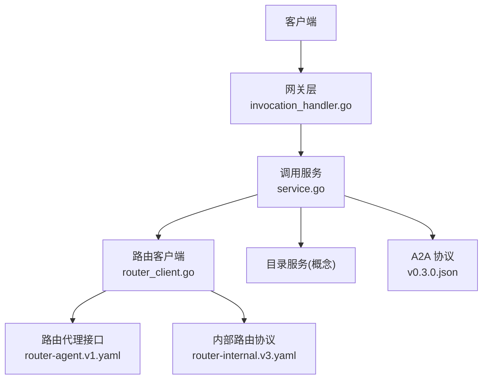
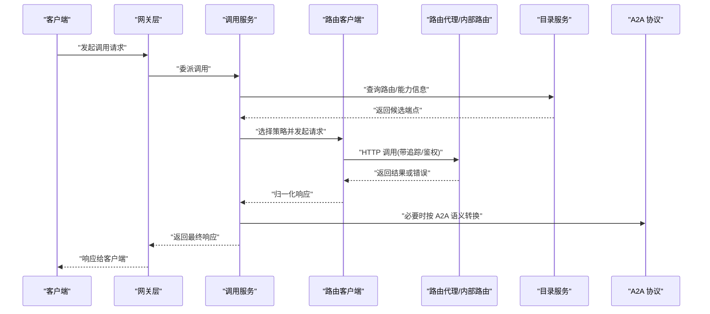
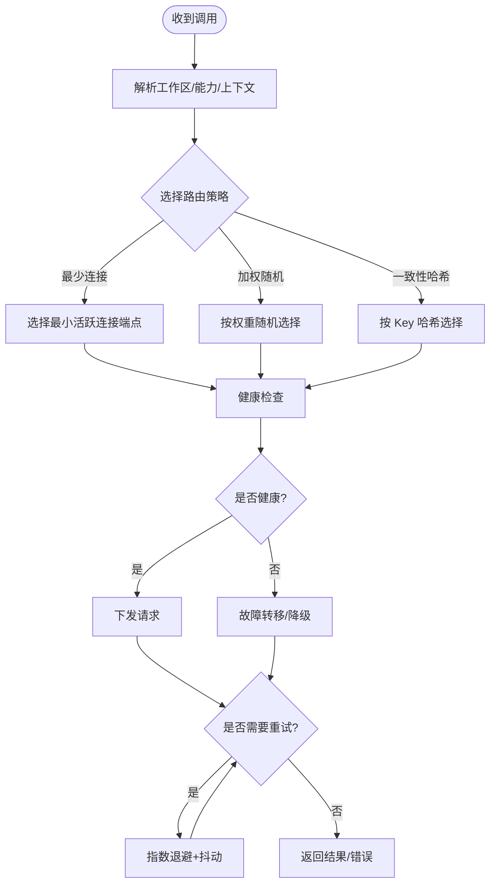
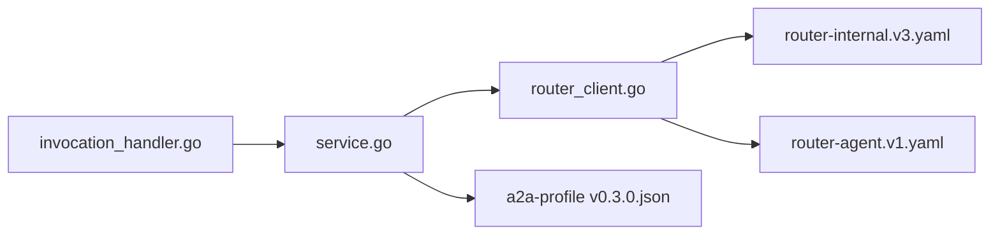

# 调用路由服务

<cite>
**本文引用的文件**   
- [apps/control-plane/cmd/control-plane/main.go](file://apps/control-plane/cmd/control-plane/main.go)
- [apps/control-plane/internal/gateway/invocation_handler.go](file://apps/control-plane/internal/gateway/invocation_handler.go)
- [apps/control-plane/internal/invocation/router_client.go](file://apps/control-plane/internal/invocation/router_client.go)
- [apps/control-plane/internal/invocation/service.go](file://apps/control-plane/internal/invocation/service.go)
- [contracts/openapi/router-agent.v1.yaml](file://contracts/openapi/router-agent.v1.yaml)
- [contracts/openapi/router-internal.v3.yaml](file://contracts/openapi/router-internal.v3.yaml)
- [contracts/a2a-profile/v0.3.0.json](file://contracts/a2a-profile/v0.3.0.json)
- [specs/012-control-plane-invocation-dispatch/spec.md](file://specs/012-control-plane-invocation-dispatch/spec.md)
</cite>

## 目录
1. [简介](#简介)
2. [项目结构](#项目结构)
3. [核心组件](#核心组件)
4. [架构总览](#架构总览)
5. [详细组件分析](#详细组件分析)
6. [依赖关系分析](#依赖关系分析)
7. [性能与可用性](#性能与可用性)
8. [故障排查指南](#故障排查指南)
9. [结论](#结论)
10. [附录](#附录)

## 简介
本技术文档聚焦 NeKiro 平台的“调用路由服务”，围绕智能请求分发、负载均衡、故障转移、重试机制、客户端连接管理、异步调用处理、监控状态以及与目录服务和 A2A 协议的集成进行系统化说明。文档同时提供高可用部署建议与故障恢复策略，并给出来自实际代码库的引用路径，便于读者快速定位实现细节。

## 项目结构
NeKiro 平台在控制面（control-plane）中实现了调用编排与路由能力，关键入口位于网关层与调用服务层：
- 网关层负责接收外部调用请求，解析上下文，选择目标路由，并委托调用服务完成具体转发。
- 调用服务封装了与下游路由服务的交互，包括连接管理、重试、超时与错误归一化。
- OpenAPI 契约定义了路由对外暴露的接口规范，以及内部路由通信协议。
- A2A Profile 描述了与 A2A 协议相关的消息结构与行为约束。

图示来源
- [apps/control-plane/internal/gateway/invocation_handler.go](file://apps/control-plane/internal/gateway/invocation_handler.go)
- [apps/control-plane/internal/invocation/service.go](file://apps/control-plane/internal/invocation/service.go)
- [apps/control-plane/internal/invocation/router_client.go](file://apps/control-plane/internal/invocation/router_client.go)
- [contracts/openapi/router-agent.v1.yaml](file://contracts/openapi/router-agent.v1.yaml)
- [contracts/openapi/router-internal.v3.yaml](file://contracts/openapi/router-internal.v3.yaml)
- [contracts/a2a-profile/v0.3.0.json](file://contracts/a2a-profile/v0.3.0.json)

章节来源
- [apps/control-plane/cmd/control-plane/main.go](file://apps/control-plane/cmd/control-plane/main.go)
- [apps/control-plane/internal/gateway/invocation_handler.go](file://apps/control-plane/internal/gateway/invocation_handler.go)
- [apps/control-plane/internal/invocation/service.go](file://apps/control-plane/internal/invocation/service.go)
- [apps/control-plane/internal/invocation/router_client.go](file://apps/control-plane/internal/invocation/router_client.go)
- [contracts/openapi/router-agent.v1.yaml](file://contracts/openapi/router-agent.v1.yaml)
- [contracts/openapi/router-internal.v3.yaml](file://contracts/openapi/router-internal.v3.yaml)
- [contracts/a2a-profile/v0.3.0.json](file://contracts/a2a-profile/v0.3.0.json)

## 核心组件
- 网关调用处理器：负责入站请求校验、上下文注入、路由决策触发与响应组装。
- 调用服务：封装路由策略、重试、超时、连接池管理与错误归一化；协调目录服务发现与 A2A 协议适配。
- 路由客户端：面向下游路由服务的 HTTP/JSON 客户端，维护连接复用、健康检查与熔断退避。
- 路由契约：定义路由代理与内部路由协议，确保跨版本兼容与可观测性。
- A2A 协议：描述任务生命周期、事件流与结果投递语义，供路由与运行时协同。

章节来源
- [apps/control-plane/internal/gateway/invocation_handler.go](file://apps/control-plane/internal/gateway/invocation_handler.go)
- [apps/control-plane/internal/invocation/service.go](file://apps/control-plane/internal/invocation/service.go)
- [apps/control-plane/internal/invocation/router_client.go](file://apps/control-plane/internal/invocation/router_client.go)
- [contracts/openapi/router-agent.v1.yaml](file://contracts/openapi/router-agent.v1.yaml)
- [contracts/openapi/router-internal.v3.yaml](file://contracts/openapi/router-internal.v3.yaml)
- [contracts/a2a-profile/v0.3.0.json](file://contracts/a2a-profile/v0.3.0.json)

## 架构总览
调用路由服务采用分层设计：网关层解耦外部协议与内部路由逻辑；调用服务作为策略中心，统一处理负载均衡、故障转移与重试；路由客户端抽象下游通信细节；OpenAPI 契约与 A2A Profile 保障跨系统互操作。

图示来源
- [apps/control-plane/internal/gateway/invocation_handler.go](file://apps/control-plane/internal/gateway/invocation_handler.go)
- [apps/control-plane/internal/invocation/service.go](file://apps/control-plane/internal/invocation/service.go)
- [apps/control-plane/internal/invocation/router_client.go](file://apps/control-plane/internal/invocation/router_client.go)
- [contracts/openapi/router-agent.v1.yaml](file://contracts/openapi/router-agent.v1.yaml)
- [contracts/openapi/router-internal.v3.yaml](file://contracts/openapi/router-internal.v3.yaml)
- [contracts/a2a-profile/v0.3.0.json](file://contracts/a2a-profile/v0.3.0.json)

## 详细组件分析

### 网关调用处理器
职责
- 解析入站请求参数与上下文（如工作区、租户、追踪 ID）。
- 校验权限与能力匹配，将调用委派给调用服务。
- 对异常进行统一包装，保证对外错误码一致。

关键点
- 支持异步模式：当请求标记为异步时，网关仅创建任务并返回任务标识，后续通过事件/轮询获取结果。
- 透传追踪与审计字段，便于全链路可观测。

章节来源
- [apps/control-plane/internal/gateway/invocation_handler.go](file://apps/control-plane/internal/gateway/invocation_handler.go)

### 调用服务（路由策略中心）
职责
- 根据能力、工作区与负载指标选择路由策略（如最少连接、加权随机、一致性哈希等）。
- 管理重试与退避策略，区分可重试错误与不可重试错误。
- 维护与目录服务的缓存与失效策略，降低发现延迟。
- 与 A2A 协议对接，将平台内调用映射为 A2A 任务/事件。

算法与配置要点
- 路由算法选择：可通过配置切换不同策略；默认策略需兼顾公平性与低延迟。
- 失败判定：基于状态码、超时、网络错误与业务错误分类。
- 重试边界：幂等性判断、最大重试次数、指数退避抖动。
- 连接池：最大并发、空闲回收、健康检查间隔。

章节来源
- [apps/control-plane/internal/invocation/service.go](file://apps/control-plane/internal/invocation/service.go)
- [specs/012-control-plane-invocation-dispatch/spec.md](file://specs/012-control-plane-invocation-dispatch/spec.md)

### 路由客户端（连接与重试）
职责
- 封装与下游路由代理的内部 API 调用，维护 HTTP 连接池。
- 实现健康检查、熔断与快速失败，避免雪崩。
- 注入追踪头、鉴权令牌与重试元数据。

连接管理
- 连接复用：长连接与 Keep-Alive 配置。
- 健康探测：定期探测端点存活，剔除不健康节点。
- 背压与限流：限制并发与队列长度，保护下游。

章节来源
- [apps/control-plane/internal/invocation/router_client.go](file://apps/control-plane/internal/invocation/router_client.go)
- [contracts/openapi/router-internal.v3.yaml](file://contracts/openapi/router-internal.v3.yaml)

### 路由契约与 A2A 协议集成
路由代理接口
- 定义路由发现、能力查询、任务提交与结果拉取等端点。
- 要求携带追踪 ID、工作区标识与幂等键。

内部路由协议
- 用于控制面与路由实例之间的细粒度通信，包含负载均衡权重、健康状态与拓扑变更通知。

A2A 协议
- 描述任务生命周期（创建、执行、取消）、事件流（增量输出）与结果投递。
- 路由服务需在必要时将平台内调用转换为 A2A 语义，确保端到端一致性。

章节来源
- [contracts/openapi/router-agent.v1.yaml](file://contracts/openapi/router-agent.v1.yaml)
- [contracts/openapi/router-internal.v3.yaml](file://contracts/openapi/router-internal.v3.yaml)
- [contracts/a2a-profile/v0.3.0.json](file://contracts/a2a-profile/v0.3.0.json)

### 智能请求分发与负载均衡
- 策略选择：支持最少连接、加权随机、一致性哈希等；可按工作区或能力维度隔离。
- 动态权重：结合目录服务与健康检查实时更新权重。
- 亲和性：对会话敏感型请求使用一致性哈希，提升命中率与缓存效果。

图示来源
- [apps/control-plane/internal/invocation/service.go](file://apps/control-plane/internal/invocation/service.go)
- [apps/control-plane/internal/invocation/router_client.go](file://apps/control-plane/internal/invocation/router_client.go)

### 异步调用与状态监控
- 异步模式：网关创建任务后返回任务 ID，调用服务记录状态机（创建、运行、完成、失败、取消）。
- 事件流：通过 A2A 事件推送增量结果，客户端可选择 SSE 或轮询。
- 监控指标：成功率、P95/P99 延迟、重试率、熔断触发次数、连接池利用率。

章节来源
- [apps/control-plane/internal/gateway/invocation_handler.go](file://apps/control-plane/internal/gateway/invocation_handler.go)
- [contracts/a2a-profile/v0.3.0.json](file://contracts/a2a-profile/v0.3.0.json)

## 依赖关系分析
- 网关层依赖调用服务，调用服务依赖路由客户端与目录服务。
- 路由客户端依赖内部路由协议与路由代理接口。
- 调用服务与 A2A 协议存在语义映射依赖。

图示来源
- [apps/control-plane/internal/gateway/invocation_handler.go](file://apps/control-plane/internal/gateway/invocation_handler.go)
- [apps/control-plane/internal/invocation/service.go](file://apps/control-plane/internal/invocation/service.go)
- [apps/control-plane/internal/invocation/router_client.go](file://apps/control-plane/internal/invocation/router_client.go)
- [contracts/openapi/router-internal.v3.yaml](file://contracts/openapi/router-internal.v3.yaml)
- [contracts/openapi/router-agent.v1.yaml](file://contracts/openapi/router-agent.v1.yaml)
- [contracts/a2a-profile/v0.3.0.json](file://contracts/a2a-profile/v0.3.0.json)

章节来源
- [apps/control-plane/internal/gateway/invocation_handler.go](file://apps/control-plane/internal/gateway/invocation_handler.go)
- [apps/control-plane/internal/invocation/service.go](file://apps/control-plane/internal/invocation/service.go)
- [apps/control-plane/internal/invocation/router_client.go](file://apps/control-plane/internal/invocation/router_client.go)
- [contracts/openapi/router-internal.v3.yaml](file://contracts/openapi/router-internal.v3.yaml)
- [contracts/openapi/router-agent.v1.yaml](file://contracts/openapi/router-agent.v1.yaml)
- [contracts/a2a-profile/v0.3.0.json](file://contracts/a2a-profile/v0.3.0.json)

## 性能与可用性
- 连接池调优：根据 QPS 与平均延迟设置最大并发与空闲回收时间，避免连接耗尽。
- 重试与退避：对幂等请求启用指数退避与抖动，限制最大重试次数，防止放大效应。
- 熔断与快速失败：对持续失败的端点快速熔断，缩短错误传播链。
- 多副本与区域亲和：结合目录服务与拓扑信息，优先选择就近副本，降低跨域延迟。
- 可观测性：全链路追踪、结构化日志与指标上报，支撑容量规划与问题定位。

[本节为通用指导，无需特定文件来源]

## 故障排查指南
常见问题与定位步骤
- 路由失败
  - 检查目录服务返回的候选端点是否健康。
  - 确认路由策略与权重配置是否正确。
  - 查看路由客户端的健康检查与熔断状态。
- 连接池耗尽
  - 观察连接池利用率与等待队列长度。
  - 调整最大并发与空闲回收策略。
  - 排查慢请求与未释放连接。
- 超时处理
  - 核对请求超时与读取超时配置。
  - 评估下游处理能力与重试放大风险。
  - 针对长耗时任务启用异步模式与事件流。

章节来源
- [apps/control-plane/internal/invocation/router_client.go](file://apps/control-plane/internal/invocation/router_client.go)
- [apps/control-plane/internal/invocation/service.go](file://apps/control-plane/internal/invocation/service.go)

## 结论
调用路由服务通过分层设计与契约驱动，实现了智能分发、负载均衡与故障转移，并结合 A2A 协议与目录服务达成高可用与可扩展的目标。建议在部署中重视连接池与重试策略的调优，完善可观测性与自动化故障恢复流程，以保障生产环境的稳定性与性能。

[本节为总结，无需特定文件来源]

## 附录
- 参考规范
  - 控制面调用派发规范：[specs/012-control-plane-invocation-dispatch/spec.md](file://specs/012-control-plane-invocation-dispatch/spec.md)
- 入口程序
  - 控制面主程序：[apps/control-plane/cmd/control-plane/main.go](file://apps/control-plane/cmd/control-plane/main.go)