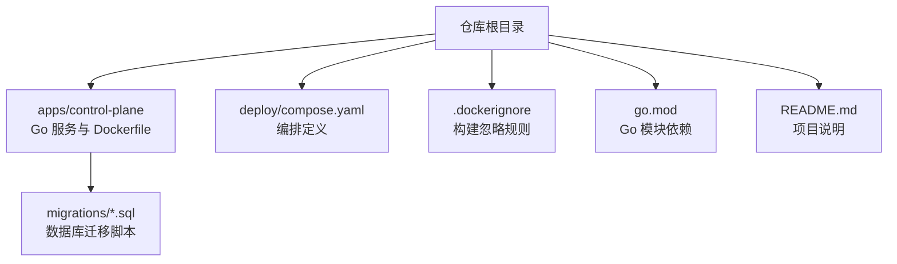
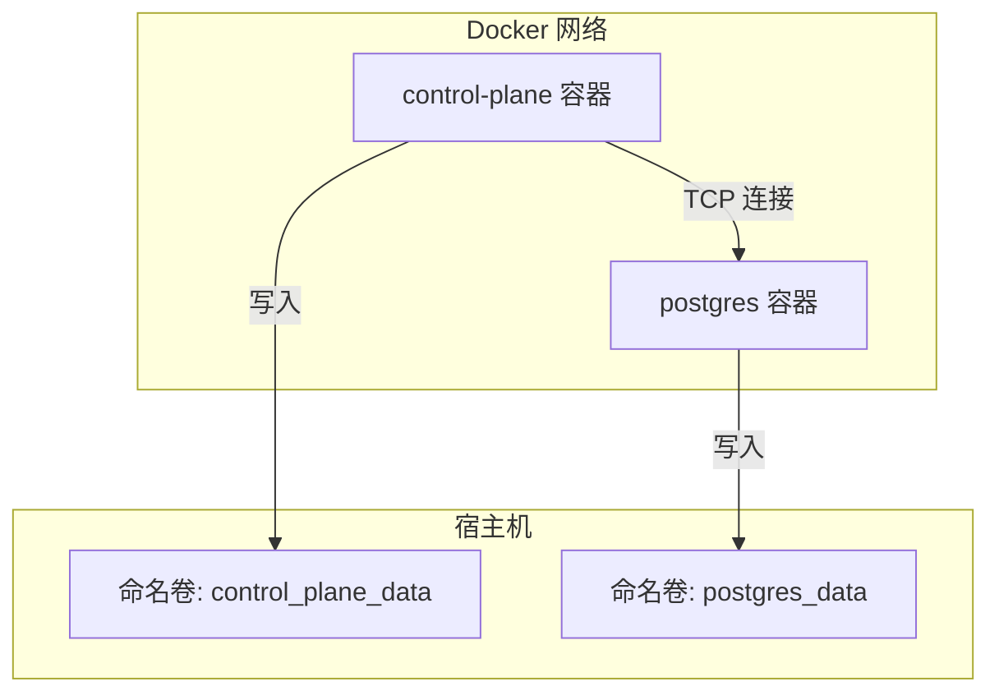
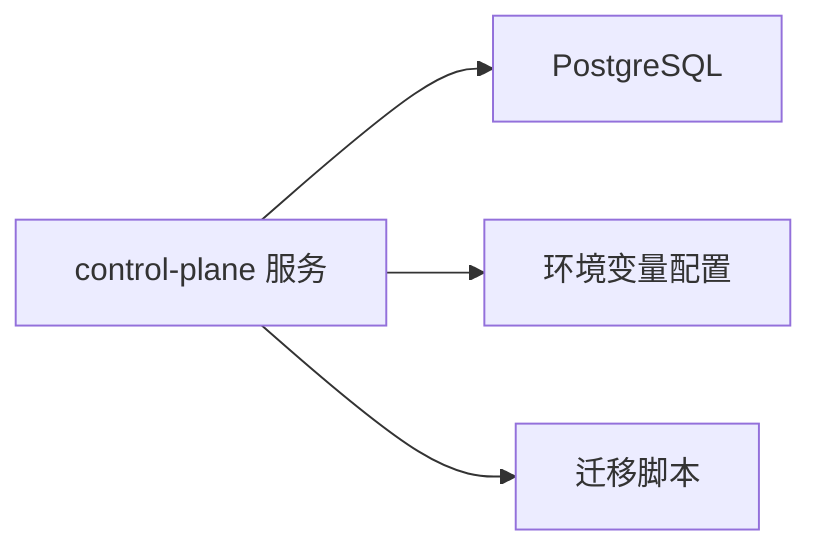

# Docker 部署

<cite>
**本文引用的文件**   
- [apps/control-plane/Dockerfile](file://apps/control-plane/Dockerfile)
- [deploy/compose.yaml](file://deploy/compose.yaml)
- [apps/control-plane/cmd/control-plane/main.go](file://apps/control-plane/cmd/control-plane/main.go)
- [apps/control-plane/internal/config/config.go](file://apps/control-plane/internal/config/config.go)
- [apps/control-plane/migrations/001_catalog.sql](file://apps/control-plane/migrations/001_catalog.sql)
- [apps/control-plane/migrations/002_card_text.sql](file://apps/control-plane/migrations/002_card_text.sql)
- [apps/control-plane/migrations/003_workspace.sql](file://apps/control-plane/migrations/003_workspace.sql)
- [.dockerignore](file://.dockerignore)
- [go.mod](file://go.mod)
- [README.md](file://README.md)
</cite>

## 目录
1. [简介](#简介)
2. [项目结构](#项目结构)
3. [核心组件](#核心组件)
4. [架构总览](#架构总览)
5. [详细组件分析](#详细组件分析)
6. [依赖分析](#依赖分析)
7. [性能考虑](#性能考虑)
8. [故障排查指南](#故障排查指南)
9. [结论](#结论)
10. [附录](#附录)

## 简介
本文件面向 NeKiro 平台的运维与开发者，提供基于 Docker 的完整部署文档。内容涵盖镜像构建、容器化配置、Docker Compose 编排、环境变量、数据卷挂载、网络设置、本地开发环境搭建、多环境差异化策略、健康检查、日志收集与监控建议，以及常见问题排查与最佳实践。

## 项目结构
NeKiro 控制面服务位于 apps/control-plane，包含 Go 源码、迁移脚本与 Dockerfile；编排文件位于 deploy/compose.yaml；仓库根目录包含 .dockerignore、go.mod 等通用工程文件。

图表来源
- [apps/control-plane/Dockerfile](file://apps/control-plane/Dockerfile)
- [deploy/compose.yaml](file://deploy/compose.yaml)
- [.dockerignore](file://.dockerignore)
- [go.mod](file://go.mod)
- [README.md](file://README.md)

章节来源
- [apps/control-plane/Dockerfile](file://apps/control-plane/Dockerfile)
- [deploy/compose.yaml](file://deploy/compose.yaml)
- [.dockerignore](file://.dockerignore)
- [go.mod](file://go.mod)
- [README.md](file://README.md)

## 核心组件
- 控制面服务（Control Plane）：Go 语言实现，负责目录、工作区、调用路由等核心能力。
- 数据库：PostgreSQL，用于持久化目录与工作区数据。
- 迁移脚本：SQL 文件，按序执行以初始化或升级数据库结构。
- 编排：Docker Compose 统一启动控制面与数据库，并管理网络与数据卷。

章节来源
- [apps/control-plane/cmd/control-plane/main.go](file://apps/control-plane/cmd/control-plane/main.go)
- [apps/control-plane/internal/config/config.go](file://apps/control-plane/internal/config/config.go)
- [apps/control-plane/migrations/001_catalog.sql](file://apps/control-plane/migrations/001_catalog.sql)
- [apps/control-plane/migrations/002_card_text.sql](file://apps/control-plane/migrations/002_card_text.sql)
- [apps/control-plane/migrations/003_workspace.sql](file://apps/control-plane/migrations/003_workspace.sql)
- [deploy/compose.yaml](file://deploy/compose.yaml)

## 架构总览
下图展示了本地与生产环境的典型部署形态：控制面服务通过内部网络访问 PostgreSQL，数据持久化到宿主机的命名卷。

图表来源
- [deploy/compose.yaml](file://deploy/compose.yaml)

## 详细组件分析

### 镜像构建与运行
- 构建入口：应用级 Dockerfile 定义了多阶段构建与运行时镜像。
- 忽略规则：.dockerignore 排除无关文件，减小镜像体积与构建时间。
- 运行参数：通过环境变量注入数据库连接、端口、日志级别等。

章节来源
- [apps/control-plane/Dockerfile](file://apps/control-plane/Dockerfile)
- [.dockerignore](file://.dockerignore)

### 容器编排（Docker Compose）
- 服务定义：compose.yaml 中声明 control-plane 与 postgres 两个服务。
- 网络：默认桥接网络，服务间通过服务名互通。
- 数据卷：为 control-plane 与 postgres 分别挂载命名卷，保障数据持久化。
- 依赖关系：控制面服务依赖数据库服务就绪。

章节来源
- [deploy/compose.yaml](file://deploy/compose.yaml)

### 环境变量与配置
- 配置加载：服务在启动时读取配置，通常包括数据库连接串、监听端口、日志级别等。
- 推荐变量（示例键名，具体以代码为准）：
  - DATABASE_URL：PostgreSQL 连接字符串
  - PORT：HTTP 监听端口
  - LOG_LEVEL：日志级别
  - MIGRATIONS_DIR：迁移脚本目录路径
- 配置优先级：环境变量 > 配置文件 > 默认值（以实际实现为准）。

章节来源
- [apps/control-plane/internal/config/config.go](file://apps/control-plane/internal/config/config.go)
- [apps/control-plane/cmd/control-plane/main.go](file://apps/control-plane/cmd/control-plane/main.go)

### 数据库迁移
- 迁移脚本：migrations 目录下包含 SQL 文件，按序号顺序执行。
- 执行时机：建议在控制面启动前或首次启动时自动执行。
- 回滚策略：建议引入版本管理与可逆迁移方案（如使用迁移工具）。

章节来源
- [apps/control-plane/migrations/001_catalog.sql](file://apps/control-plane/migrations/001_catalog.sql)
- [apps/control-plane/migrations/002_card_text.sql](file://apps/control-plane/migrations/002_card_text.sql)
- [apps/control-plane/migrations/003_workspace.sql](file://apps/control-plane/migrations/003_workspace.sql)

### 网络与安全
- 网络模型：Compose 默认创建单一网络，服务间通过服务名解析。
- 端口暴露：仅对外暴露必要端口（如 HTTP），数据库端口不暴露给宿主机。
- 安全建议：
  - 使用强密码与只读最小权限账号
  - 限制网络访问范围
  - 敏感信息通过密钥管理而非明文环境变量

章节来源
- [deploy/compose.yaml](file://deploy/compose.yaml)

### 健康检查与就绪探针
- 进程健康：可通过 HTTP 健康端点或 TCP 探测判断服务是否就绪。
- 数据库就绪：等待数据库接受连接后再启动控制面。
- 失败重试：对关键依赖进行指数退避重试。

章节来源
- [deploy/compose.yaml](file://deploy/compose.yaml)

### 日志与监控
- 日志输出：建议将日志输出至 stdout/stderr，由容器运行时或外部采集器收集。
- 日志轮转：在生产环境启用日志轮转策略。
- 指标暴露：如需监控，可在服务中暴露 Prometheus 指标端点。

章节来源
- [apps/control-plane/cmd/control-plane/main.go](file://apps/control-plane/cmd/control-plane/main.go)

## 依赖分析
- 直接依赖：
  - 数据库：PostgreSQL
  - 运行时：Go 编译产物
- 间接依赖：
  - 操作系统库（由基础镜像提供）
  - 网络栈（由 Docker 网络提供）

图表来源
- [deploy/compose.yaml](file://deploy/compose.yaml)
- [apps/control-plane/cmd/control-plane/main.go](file://apps/control-plane/cmd/control-plane/main.go)
- [apps/control-plane/internal/config/config.go](file://apps/control-plane/internal/config/config.go)
- [apps/control-plane/migrations/001_catalog.sql](file://apps/control-plane/migrations/001_catalog.sql)

章节来源
- [go.mod](file://go.mod)
- [deploy/compose.yaml](file://deploy/compose.yaml)

## 性能考虑
- 资源限制：为容器设置 CPU 与内存上限，避免争用。
- 连接池：合理配置数据库连接池大小与超时。
- 并发与限流：根据业务峰值调整并发度与请求限流。
- I/O 优化：使用 SSD 存储与合适的块大小，减少磁盘抖动。
- 缓存策略：对热点数据引入内存缓存层。

[本节为通用指导，无需特定文件引用]

## 故障排查指南
- 无法连接数据库
  - 检查 DATABASE_URL 是否正确
  - 确认数据库服务已启动且端口可达
  - 查看数据库日志与用户权限
- 迁移失败
  - 核对迁移脚本顺序与幂等性
  - 检查目标数据库版本兼容性
- 服务启动后无响应
  - 检查端口占用与防火墙规则
  - 查看健康端点与日志
- 日志缺失
  - 确认日志输出位置与采集器配置
  - 检查容器日志驱动与轮转策略

章节来源
- [apps/control-plane/cmd/control-plane/main.go](file://apps/control-plane/cmd/control-plane/main.go)
- [deploy/compose.yaml](file://deploy/compose.yaml)

## 结论
通过 Docker 与 Docker Compose，NeKiro 控制面可以快速在本地与生产环境一致地部署。结合环境变量、数据卷、网络与健康检查，可实现稳定可靠的交付。建议在生产环境引入密钥管理、集中日志与监控告警，以提升可观测性与安全性。

[本节为总结性内容，无需特定文件引用]

## 附录

### 本地开发环境搭建
- 前置条件
  - 安装 Docker 与 Docker Compose
  - 克隆仓库并进入项目根目录
- 启动依赖服务
  - 使用 compose 启动数据库与控制面
- 数据初始化
  - 首次启动时执行数据库迁移脚本
- 验证服务
  - 访问控制面健康端点或 API 文档
- 常用命令
  - 启动：compose up
  - 停止：compose down
  - 查看日志：compose logs -f
  - 重建镜像：compose build

章节来源
- [deploy/compose.yaml](file://deploy/compose.yaml)
- [apps/control-plane/migrations/001_catalog.sql](file://apps/control-plane/migrations/001_catalog.sql)
- [apps/control-plane/migrations/002_card_text.sql](file://apps/control-plane/migrations/002_card_text.sql)
- [apps/control-plane/migrations/003_workspace.sql](file://apps/control-plane/migrations/003_workspace.sql)

### 多环境差异化配置
- 环境划分
  - 开发：本地快速迭代，最小化资源
  - 测试：集成测试与端到端测试
  - 生产：高可用与严格的安全策略
- 差异点
  - 环境变量：数据库地址、端口、日志级别、功能开关
  - 资源配额：CPU/内存限制
  - 存储：SSD 与备份策略
  - 网络：隔离与访问控制
- 配置管理
  - 使用 .env 文件或密钥管理服务
  - 通过 compose profile 或不同 compose 文件区分环境

章节来源
- [deploy/compose.yaml](file://deploy/compose.yaml)
- [apps/control-plane/internal/config/config.go](file://apps/control-plane/internal/config/config.go)

### 最佳实践
- 镜像构建
  - 使用多阶段构建，精简运行时镜像
  - 固定基础镜像版本，确保可重现
- 安全
  - 非 root 用户运行容器
  - 最小权限原则与只读文件系统
- 可观测性
  - 结构化日志与指标暴露
  - 统一的日志采集与告警
- 可靠性
  - 健康检查与重启策略
  - 优雅停机与幂等迁移

章节来源
- [apps/control-plane/Dockerfile](file://apps/control-plane/Dockerfile)
- [deploy/compose.yaml](file://deploy/compose.yaml)