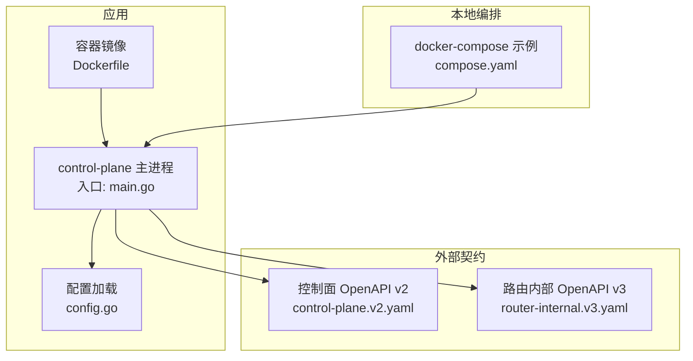
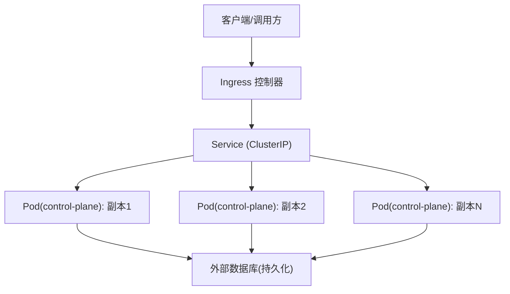
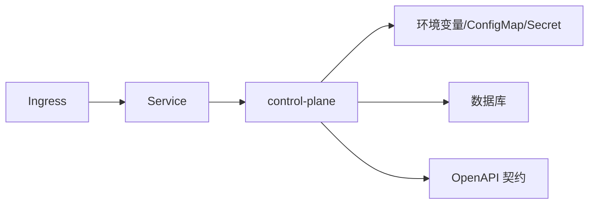

# Kubernetes 部署

<cite>
**本文引用的文件**   
- [README.md](file://README.md)
- [apps/control-plane/cmd/control-plane/main.go](file://apps/control-plane/cmd/control-plane/main.go)
- [apps/control-plane/internal/config/config.go](file://apps/control-plane/internal/config/config.go)
- [apps/control-plane/Dockerfile](file://apps/control-plane/Dockerfile)
- [deploy/compose.yaml](file://deploy/compose.yaml)
- [contracts/openapi/control-plane.v2.yaml](file://contracts/openapi/control-plane.v2.yaml)
- [contracts/openapi/router-internal.v3.yaml](file://contracts/openapi/router-internal.v3.yaml)
</cite>

## 目录
1. [简介](#简介)
2. [项目结构](#项目结构)
3. [核心组件](#核心组件)
4. [架构总览](#架构总览)
5. [详细组件分析](#详细组件分析)
6. [依赖分析](#依赖分析)
7. [性能与扩缩容](#性能与扩缩容)
8. [故障排查指南](#故障排查指南)
9. [结论](#结论)
10. [附录](#附录)

## 简介
本文件面向在 Kubernetes 上部署 NeKiro 平台的工程团队，提供基于 Helm Chart 或 Kustomize 的部署方案说明。内容覆盖 Deployment、Service、ConfigMap、Secret、Ingress、TLS、水平扩展与自动扩缩容、滚动更新与回滚策略、以及监控/日志/追踪集成建议。仓库当前未包含现成的 Helm Chart 或 Kustomize 清单，因此本文给出可直接落地的资源定义模板与参数化建议，并结合现有代码中的配置项与对外接口进行适配。

## 项目结构
NeKiro 后端服务位于 apps/control-plane，入口为 Go 程序，使用 Dockerfile 构建镜像；compose.yaml 用于本地开发编排；OpenAPI 契约定义了控制面与路由内部 API。

图表来源
- [apps/control-plane/cmd/control-plane/main.go:1-200](file://apps/control-plane/cmd/control-plane/main.go#L1-L200)
- [apps/control-plane/internal/config/config.go:1-200](file://apps/control-plane/internal/config/config.go#L1-L200)
- [apps/control-plane/Dockerfile:1-200](file://apps/control-plane/Dockerfile#L1-L200)
- [contracts/openapi/control-plane.v2.yaml:1-200](file://contracts/openapi/control-plane.v2.yaml#L1-L200)
- [contracts/openapi/router-internal.v3.yaml:1-200](file://contracts/openapi/router-internal.v3.yaml#L1-L200)
- [deploy/compose.yaml:1-200](file://deploy/compose.yaml#L1-L200)

章节来源
- [README.md:1-200](file://README.md#L1-L200)
- [apps/control-plane/cmd/control-plane/main.go:1-200](file://apps/control-plane/cmd/control-plane/main.go#L1-L200)
- [apps/control-plane/internal/config/config.go:1-200](file://apps/control-plane/internal/config/config.go#L1-L200)
- [apps/control-plane/Dockerfile:1-200](file://apps/control-plane/Dockerfile#L1-L200)
- [deploy/compose.yaml:1-200](file://deploy/compose.yaml#L1-L200)
- [contracts/openapi/control-plane.v2.yaml:1-200](file://contracts/openapi/control-plane.v2.yaml#L1-L200)
- [contracts/openapi/router-internal.v3.yaml:1-200](file://contracts/openapi/router-internal.v3.yaml#L1-L200)

## 核心组件
- control-plane 服务：Go 编写的控制平面，负责工作区、目录、调用路由等能力，通过 HTTP 暴露 API（参考 OpenAPI）。
- 配置系统：从环境变量与配置文件加载运行时参数（数据库连接、端口、TLS、日志级别等）。
- 容器镜像：由 Dockerfile 构建，作为 Kubernetes Pod 的运行单元。
- 契约与接口：OpenAPI 文档定义了对外与内部接口，便于生成客户端与服务端校验。

章节来源
- [apps/control-plane/cmd/control-plane/main.go:1-200](file://apps/control-plane/cmd/control-plane/main.go#L1-L200)
- [apps/control-plane/internal/config/config.go:1-200](file://apps/control-plane/internal/config/config.go#L1-L200)
- [apps/control-plane/Dockerfile:1-200](file://apps/control-plane/Dockerfile#L1-L200)
- [contracts/openapi/control-plane.v2.yaml:1-200](file://contracts/openapi/control-plane.v2.yaml#L1-L200)
- [contracts/openapi/router-internal.v3.yaml:1-200](file://contracts/openapi/router-internal.v3.yaml#L1-L200)

## 架构总览
下图展示在 Kubernetes 上的推荐部署拓扑：Ingress 暴露 HTTPS 入口，Service 将流量分发到多个 control-plane Pod，Pod 通过环境变量注入配置并访问外部数据库。

图表来源
- [contracts/openapi/control-plane.v2.yaml:1-200](file://contracts/openapi/control-plane.v2.yaml#L1-L200)
- [apps/control-plane/cmd/control-plane/main.go:1-200](file://apps/control-plane/cmd/control-plane/main.go#L1-L200)

## 详细组件分析

### 控制面服务与配置
- 服务入口与监听端口：由主程序初始化并读取配置决定监听地址与端口。
- 配置来源：支持环境变量与配置文件，常见键包括数据库连接串、HTTP 端口、日志级别、TLS 证书路径等。
- 健康检查：建议在 Deployment 中配置 liveness/readiness probe，结合 /healthz 或自定义探针端点。

章节来源
- [apps/control-plane/cmd/control-plane/main.go:1-200](file://apps/control-plane/cmd/control-plane/main.go#L1-L200)
- [apps/control-plane/internal/config/config.go:1-200](file://apps/control-plane/internal/config/config.go#L1-L200)

### 容器镜像与启动
- 镜像构建：Dockerfile 定义基础镜像、依赖安装、二进制拷贝与运行命令。
- 运行参数：通过环境变量注入敏感信息与运行时开关，避免硬编码。

章节来源
- [apps/control-plane/Dockerfile:1-200](file://apps/control-plane/Dockerfile#L1-L200)

### 本地编排与迁移提示
- compose.yaml 提供了本地开发时的多服务编排示例，可作为生产环境资源定义的参考。
- 若存在数据库迁移脚本，建议在 CI/CD 中以 Job 形式执行或在启动前以 InitContainer 完成。

章节来源
- [deploy/compose.yaml:1-200](file://deploy/compose.yaml#L1-L200)

## 依赖分析
- 外部依赖：数据库（PostgreSQL 或其他 RDBMS），可通过环境变量传入连接信息。
- 网络依赖：Ingress 控制器与 Service 发现，确保域名解析与 TLS 终止。
- 契约依赖：OpenAPI 定义驱动网关鉴权、限流与请求校验策略。

图表来源
- [apps/control-plane/internal/config/config.go:1-200](file://apps/control-plane/internal/config/config.go#L1-L200)
- [contracts/openapi/control-plane.v2.yaml:1-200](file://contracts/openapi/control-plane.v2.yaml#L1-L200)

章节来源
- [apps/control-plane/internal/config/config.go:1-200](file://apps/control-plane/internal/config/config.go#L1-L200)
- [contracts/openapi/control-plane.v2.yaml:1-200](file://contracts/openapi/control-plane.v2.yaml#L1-L200)

## 性能与扩缩容
- 副本数：根据 QPS 与延迟目标设置初始副本数，并通过 HPA 实现自动扩缩容。
- 资源限制：为 CPU/内存设置 requests/limits，避免节点过载与抖动。
- 滚动更新：使用 RollingUpdate 策略，配合 readiness/liveness 探针保障零停机发布。
- 水平扩展：HPA 基于 CPU/内存或自定义指标（如请求队列长度）触发扩容。
- 存储：数据库采用独立托管实例，避免与计算混部导致争用。

[本节为通用指导，不直接分析具体文件]

## 故障排查指南
- 启动失败：检查环境变量与 Secret 是否完整，确认数据库连通性与权限。
- 健康检查失败：验证探针端点返回码与超时时间，关注 Pod 事件与日志。
- 滚动更新卡住：检查新版本的 readiness 状态与旧版本 Pod 清理情况。
- 证书问题：确认 Ingress/TLS 证书有效且域名匹配，查看证书控制器日志。
- 性能瓶颈：观察 HPA 行为与资源利用率，调整 requests/limits 与副本上限。

[本节为通用指导，不直接分析具体文件]

## 结论
NeKiro 控制面服务具备清晰的配置模型与稳定的 HTTP 接口，适合在 Kubernetes 上以无状态方式横向扩展。通过合理的资源限制、滚动更新与 HPA 策略，可实现高可用与弹性伸缩。建议在生产环境中引入 Ingress+TLS、集中式日志与分布式追踪，以提升可观测性与排障效率。

[本节为总结性内容，不直接分析具体文件]

## 附录

### A. Helm/Kustomize 资源清单要点（模板指引）
以下为在 Kubernetes 上部署 control-plane 所需的核心资源及关键参数建议。请根据实际环境替换占位符。

- Namespace
  - 名称：nekro-platform
- ConfigMap
  - 用途：非敏感配置（如日志级别、默认超时等）
  - 挂载方式：Volume 或环境变量
- Secret
  - 用途：数据库连接串、JWT 密钥、TLS 私钥等
  - 挂载方式：环境变量或 Volume
- Deployment
  - 镜像：从私有镜像仓库拉取 control-plane 镜像
  - 副本数：初始值按容量规划设定
  - 资源：requests/limits 合理设置
  - 探针：liveness/readiness 端点
  - 卷：挂载 ConfigMap/Secret
  - 环境变量：注入运行时配置
- Service
  - 类型：ClusterIP
  - 端口：映射至控制面 HTTP 端口
- Ingress
  - 域名：绑定业务域名
  - TLS：启用证书管理（Cert-manager 或云厂商托管）
  - 注解：负载均衡、限流、WAF 等
- HPA
  - 指标：CPU/内存或自定义指标
  - 范围：min/max 副本数
- NetworkPolicy（可选）
  - 仅允许 Ingress 与数据库访问

[本节为模板指引，不直接分析具体文件]

### B. 环境变量与配置键参考
以下键名来源于配置模块与常见实践，请结合实际代码与部署需求调整。

- 数据库
  - DATABASE_URL：数据库连接字符串
  - DB_MIGRATE：是否执行迁移（true/false）
- 服务
  - SERVER_PORT：HTTP 监听端口
  - LOG_LEVEL：日志级别
  - TRACING_ENABLED：是否开启分布式追踪
- 安全
  - JWT_SECRET：签名密钥
  - TLS_CERT_PATH：证书路径（若由 Sidecar 注入则无需）
  - TLS_KEY_PATH：私钥路径
- 其他
  - WORKSPACE_ROOT：工作区根目录（如需要）
  - FEATURE_FLAGS：功能开关 JSON

章节来源
- [apps/control-plane/internal/config/config.go:1-200](file://apps/control-plane/internal/config/config.go#L1-L200)

### C. 对外接口与路由
- 控制面 API：参考 OpenAPI 文档，定义工作区、目录、调用管理等能力。
- 路由内部 API：供路由组件与控制面通信的内部接口。

章节来源
- [contracts/openapi/control-plane.v2.yaml:1-200](file://contracts/openapi/control-plane.v2.yaml#L1-L200)
- [contracts/openapi/router-internal.v3.yaml:1-200](file://contracts/openapi/router-internal.v3.yaml#L1-L200)

### D. 本地开发与快速验证
- 使用 docker-compose 快速拉起依赖服务与 control-plane，便于联调与演示。
- 修改 compose.yaml 中的环境变量与端口映射，模拟生产环境行为。

章节来源
- [deploy/compose.yaml:1-200](file://deploy/compose.yaml#L1-L200)