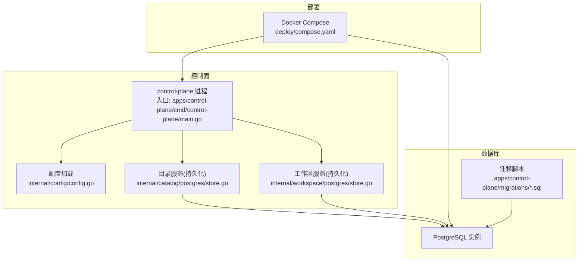
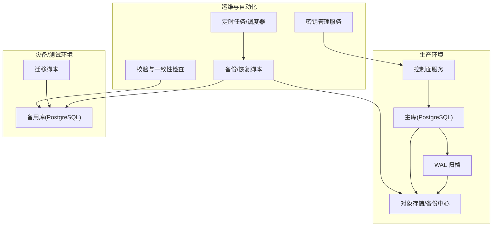
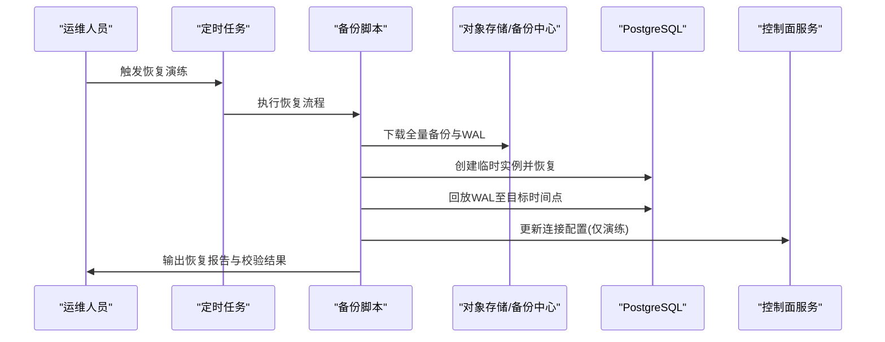
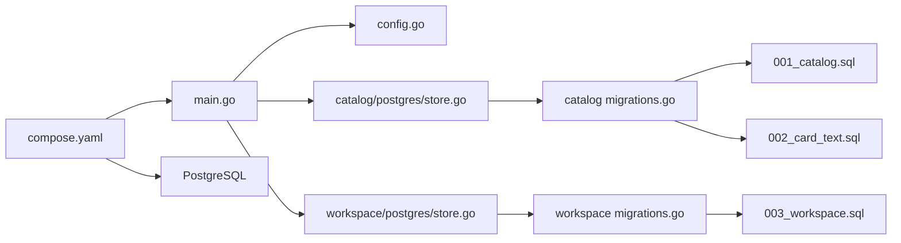

# 备份与恢复

<cite>
**本文引用的文件**   
- [README.md](file://README.md)
- [compose.yaml](file://deploy/compose.yaml)
- [main.go](file://apps/control-plane/cmd/control-plane/main.go)
- [config.go](file://apps/control-plane/internal/config/config.go)
- [store.go](file://apps/control-plane/internal/catalog/postgres/store.go)
- [migrations.go](file://apps/control-plane/internal/catalog/postgres/migrations.go)
- [store.go](file://apps/control-plane/internal/workspace/postgres/store.go)
- [migrations.go](file://apps/control-plane/internal/workspace/postgres/migrations.go)
- [001_catalog.sql](file://apps/control-plane/migrations/001_catalog.sql)
- [002_card_text.sql](file://apps/control-plane/migrations/002_card_text.sql)
- [003_workspace.sql](file://apps/control-plane/migrations/003_workspace.sql)
</cite>

## 目录
1. [简介](#简介)
2. [项目结构](#项目结构)
3. [核心组件](#核心组件)
4. [架构总览](#架构总览)
5. [详细组件分析](#详细组件分析)
6. [依赖分析](#依赖分析)
7. [性能考虑](#性能考虑)
8. [故障排查指南](#故障排查指南)
9. [结论](#结论)
10. [附录](#附录)

## 简介
本文件为 NeKiro 平台提供“备份与灾难恢复”的完整方案，覆盖数据库、文件存储、配置与密钥管理，包含全量/增量/实时同步策略、自动化脚本与定时任务、数据恢复流程（单表/全库/跨环境迁移）、灾难恢复预案（主从切换、异地容灾、故障转移）、RPO/RTO 目标设定与演练流程，以及备份验证与一致性检查方法。文档同时结合仓库中控制面应用、PostgreSQL 迁移与部署编排信息，给出可落地的工程化建议。

## 项目结构
NeKiro 的控制面服务使用 Go 实现，持久化层基于 PostgreSQL，并通过 SQL 迁移进行版本演进；部署采用 Docker Compose 编排。备份与恢复需围绕以下关键点展开：
- 控制面二进制与镜像：由 main.go 入口启动
- 配置加载：internal/config 负责读取运行时配置
- 数据持久化：catalog 与 workspace 模块通过 postgres store 访问数据库
- 数据库变更：migrations 目录下的 SQL 文件定义 schema 演进
- 部署编排：deploy/compose.yaml 描述容器与服务拓扑

图表来源
- [main.go](file://apps/control-plane/cmd/control-plane/main.go)
- [config.go](file://apps/control-plane/internal/config/config.go)
- [store.go](file://apps/control-plane/internal/catalog/postgres/store.go)
- [store.go](file://apps/control-plane/internal/workspace/postgres/store.go)
- [migrations.go](file://apps/control-plane/internal/catalog/postgres/migrations.go)
- [migrations.go](file://apps/control-plane/internal/workspace/postgres/migrations.go)
- [001_catalog.sql](file://apps/control-plane/migrations/001_catalog.sql)
- [002_card_text.sql](file://apps/control-plane/migrations/002_card_text.sql)
- [003_workspace.sql](file://apps/control-plane/migrations/003_workspace.sql)
- [compose.yaml](file://deploy/compose.yaml)

章节来源
- [README.md](file://README.md)
- [compose.yaml](file://deploy/compose.yaml)
- [main.go](file://apps/control-plane/cmd/control-plane/main.go)
- [config.go](file://apps/control-plane/internal/config/config.go)
- [store.go](file://apps/control-plane/internal/catalog/postgres/store.go)
- [migrations.go](file://apps/control-plane/internal/catalog/postgres/migrations.go)
- [store.go](file://apps/control-plane/internal/workspace/postgres/store.go)
- [migrations.go](file://apps/control-plane/internal/workspace/postgres/migrations.go)
- [001_catalog.sql](file://apps/control-plane/migrations/001_catalog.sql)
- [002_card_text.sql](file://apps/control-plane/migrations/002_card_text.sql)
- [003_workspace.sql](file://apps/control-plane/migrations/003_workspace.sql)

## 核心组件
- 控制面服务
  - 职责：对外暴露 API，协调目录与工作区能力，读写 PostgreSQL。
  - 关键路径：入口 main.go；配置 internal/config；持久化 catalog/workspace 的 postgres store。
- 数据库与迁移
  - 存储引擎：PostgreSQL。
  - 迁移脚本：migrations 目录下的 SQL 文件，按序执行以演进 schema。
- 部署编排
  - 使用 Docker Compose 编排控制面与数据库等组件。

章节来源
- [main.go](file://apps/control-plane/cmd/control-plane/main.go)
- [config.go](file://apps/control-plane/internal/config/config.go)
- [store.go](file://apps/control-plane/internal/catalog/postgres/store.go)
- [migrations.go](file://apps/control-plane/internal/catalog/postgres/migrations.go)
- [store.go](file://apps/control-plane/internal/workspace/postgres/store.go)
- [migrations.go](file://apps/control-plane/internal/workspace/postgres/migrations.go)
- [compose.yaml](file://deploy/compose.yaml)

## 架构总览
下图展示备份与恢复在系统中的位置与交互关系：备份侧通过数据库原生工具或云托管能力拉取快照与 WAL；恢复侧在目标环境重建数据库并回放迁移；配置与密钥通过外部安全设施管理；CI/CD 触发演练与验证。

图表来源
- [compose.yaml](file://deploy/compose.yaml)
- [migrations.go](file://apps/control-plane/internal/catalog/postgres/migrations.go)
- [migrations.go](file://apps/control-plane/internal/workspace/postgres/migrations.go)
- [001_catalog.sql](file://apps/control-plane/migrations/001_catalog.sql)
- [002_card_text.sql](file://apps/control-plane/migrations/002_card_text.sql)
- [003_workspace.sql](file://apps/control-plane/migrations/003_workspace.sql)

## 详细组件分析

### 数据库备份策略
- 全量备份
  - 推荐方式：使用 pg_basebackup 或云托管数据库的全量快照功能，确保一致性与可恢复性。
  - 频率：每日一次，保留策略按合规要求设置（如 7/14/30 天）。
  - 存储：加密后上传至对象存储或专用备份中心，开启服务端加密与访问审计。
- 增量备份
  - 推荐方式：启用 PostgreSQL WAL 归档，将 WAL 片段持续推送至对象存储。
  - 频率：连续归档，最小化 RPO。
  - 恢复：基于最近全量 + 回放 WAL 到指定时间点（PITR）。
- 实时同步
  - 推荐方式：逻辑复制（pg_logical）或流复制（物理复制），将变更实时复制到只读副本或异地集群。
  - 注意：复制延迟监控与告警；读写分离时避免对只读副本执行写操作。

章节来源
- [compose.yaml](file://deploy/compose.yaml)
- [001_catalog.sql](file://apps/control-plane/migrations/001_catalog.sql)
- [002_card_text.sql](file://apps/control-plane/migrations/002_card_text.sql)
- [003_workspace.sql](file://apps/control-plane/migrations/003_workspace.sql)

### 文件存储与配置备份
- 文件存储
  - 若存在本地磁盘挂载或临时目录，应纳入文件系统级备份（如 rsync/snapshot）。
  - 建议将非结构化数据统一上云对象存储，利用其内置冗余与版本控制。
- 配置备份
  - 将运行期配置（环境变量、配置文件）纳入版本控制与制品库，禁止硬编码敏感信息。
  - 使用配置中心或密钥管理服务（KMS/Vault）集中管理，仅保留引用与模板。
- 密钥管理
  - 数据库连接串、证书、API Key 等一律通过密钥管理服务注入。
  - 定期轮换密钥，记录审计日志，限制最小权限。

章节来源
- [config.go](file://apps/control-plane/internal/config/config.go)
- [compose.yaml](file://deploy/compose.yaml)

### 自动化备份脚本与定时任务
- 备份脚本
  - 全量：调用 pg_basebackup 或云厂商 SDK 生成快照，校验完整性并上传。
  - 增量：配置 WAL 归档与清理策略，确保归档链完整。
  - 元数据：导出 DDL 与迁移清单，便于快速重建。
- 定时任务
  - 使用系统 crontab 或容器编排的任务计划，按策略触发备份与清理。
  - 失败重试与告警：失败自动重试 N 次，通知运维通道。
- 生命周期管理
  - 保留策略：按日/周/月分层保留，过期自动删除。
  - 校验：每次备份完成后进行完整性校验与抽样恢复演练。

章节来源
- [compose.yaml](file://deploy/compose.yaml)

### 数据恢复流程
- 单表恢复
  - 步骤：定位最近可用备份 → 恢复到临时库 → 抽取目标表 → 导入生产库（事务内提交）。
  - 风险：外键约束与并发写入冲突，建议在低峰期执行并加锁。
- 全库恢复
  - 步骤：选择全量快照 → 恢复到新实例 → 回放 WAL 至目标时间点 → 验证数据一致性 → 切换流量。
  - 回滚：保留旧实例直至验证通过，支持快速回切。
- 跨环境迁移
  - 步骤：目标环境初始化数据库 → 执行迁移脚本 → 导入数据 → 更新配置与密钥 → 灰度验证。
  - 注意事项：迁移脚本幂等性、字段类型兼容、索引重建顺序。

图表来源
- [compose.yaml](file://deploy/compose.yaml)
- [migrations.go](file://apps/control-plane/internal/catalog/postgres/migrations.go)
- [migrations.go](file://apps/control-plane/internal/workspace/postgres/migrations.go)
- [001_catalog.sql](file://apps/control-plane/migrations/001_catalog.sql)
- [002_card_text.sql](file://apps/control-plane/migrations/002_card_text.sql)
- [003_workspace.sql](file://apps/control-plane/migrations/003_workspace.sql)

### 灾难恢复预案
- 主从切换
  - 条件：主库不可用或严重退化。
  - 步骤：提升只读副本为主库 → 更新 DNS/负载均衡 → 重启控制面指向新地址 → 观察指标与错误率。
- 异地容灾
  - 架构：同城双活或异地多活，结合逻辑复制与全局负载均衡。
  - 数据一致性：分区键设计与时钟同步，避免跨区写冲突。
- 故障转移
  - 自动检测：健康检查与熔断降级。
  - 手动干预：一键切换脚本与审批流程，记录审计。

章节来源
- [compose.yaml](file://deploy/compose.yaml)

### RPO/RTO 目标与演练流程
- 目标设定
  - RPO：根据业务容忍度确定（例如分钟级或小时级）。
  - RTO：根据恢复复杂度与资源准备时间评估（例如 30 分钟/2 小时）。
- 演练流程
  - 周期：季度演练，重大变更后专项演练。
  - 内容：全库恢复、单表恢复、跨环境迁移、主从切换。
  - 验收：数据一致性校验、端到端业务回归、性能基线对比。

章节来源
- [compose.yaml](file://deploy/compose.yaml)

### 备份验证与数据一致性检查
- 备份有效性
  - 完整性校验：校验和比对、解压/还原测试。
  - 可恢复性：在隔离环境执行恢复演练，验证应用连通性。
- 一致性检查
  - 统计校验：关键表行数、哈希指纹对比。
  - 业务校验：抽样查询与关键报表核对。
- 自动化
  - 将校验步骤集成到备份流水线，失败阻断发布与切换。

章节来源
- [compose.yaml](file://deploy/compose.yaml)

## 依赖分析
- 组件耦合
  - 控制面依赖配置加载与数据库连接；catalog/workspace 模块分别依赖各自的 postgres store。
  - 迁移脚本与数据库强相关，需在恢复与迁移流程中严格排序执行。
- 外部依赖
  - 部署编排依赖 Docker Compose；备份与恢复依赖数据库客户端工具或云厂商 SDK。
- 潜在风险
  - 循环依赖：当前未见代码级循环依赖迹象。
  - 外部变更：数据库版本升级、迁移脚本不兼容需提前评估。

图表来源
- [main.go](file://apps/control-plane/cmd/control-plane/main.go)
- [config.go](file://apps/control-plane/internal/config/config.go)
- [store.go](file://apps/control-plane/internal/catalog/postgres/store.go)
- [store.go](file://apps/control-plane/internal/workspace/postgres/store.go)
- [migrations.go](file://apps/control-plane/internal/catalog/postgres/migrations.go)
- [migrations.go](file://apps/control-plane/internal/workspace/postgres/migrations.go)
- [001_catalog.sql](file://apps/control-plane/migrations/001_catalog.sql)
- [002_card_text.sql](file://apps/control-plane/migrations/002_card_text.sql)
- [003_workspace.sql](file://apps/control-plane/migrations/003_workspace.sql)
- [compose.yaml](file://deploy/compose.yaml)

章节来源
- [main.go](file://apps/control-plane/cmd/control-plane/main.go)
- [config.go](file://apps/control-plane/internal/config/config.go)
- [store.go](file://apps/control-plane/internal/catalog/postgres/store.go)
- [store.go](file://apps/control-plane/internal/workspace/postgres/store.go)
- [migrations.go](file://apps/control-plane/internal/catalog/postgres/migrations.go)
- [migrations.go](file://apps/control-plane/internal/workspace/postgres/migrations.go)
- [001_catalog.sql](file://apps/control-plane/migrations/001_catalog.sql)
- [002_card_text.sql](file://apps/control-plane/migrations/002_card_text.sql)
- [003_workspace.sql](file://apps/control-plane/migrations/003_workspace.sql)
- [compose.yaml](file://deploy/compose.yaml)

## 性能考虑
- 备份窗口
  - 全量备份尽量安排在低峰期，避免影响在线事务。
  - 增量归档保持低延迟，减少网络拥塞。
- 恢复性能
  - 预分配磁盘与并行回放 WAL，缩短恢复时间。
  - 恢复后重建索引与统计信息，提升查询性能。
- 资源规划
  - 备份与恢复阶段预留足够 CPU/内存/IO 资源，避免与其他高负载任务争抢。

[本节为通用指导，无需特定文件来源]

## 故障排查指南
- 常见问题
  - 备份失败：检查网络连接、权限与存储空间；确认 WAL 归档路径与轮转策略。
  - 恢复失败：核对迁移脚本版本与目标库兼容性；检查外键约束与数据类型。
  - 主从不同步：查看复制延迟与错误日志，必要时重新初始化副本。
- 诊断手段
  - 日志采集：收集控制面与数据库日志，定位异常堆栈。
  - 指标观测：监控备份时长、成功率、恢复耗时与一致性校验结果。
  - 演练复盘：记录问题根因与改进措施，更新预案与脚本。

章节来源
- [compose.yaml](file://deploy/compose.yaml)

## 结论
通过全量+增量+WAL 归档的组合策略，配合自动化脚本与严格的恢复演练，NeKiro 可在满足 RPO/RTO 目标的前提下实现高可用的数据保护。建议将备份与恢复纳入 CI/CD 流水线，形成闭环的质量保障体系。

[本节为总结性内容，无需特定文件来源]

## 附录
- 术语
  - RPO：恢复点目标，表示可接受的最大数据丢失时间。
  - RTO：恢复时间目标，表示从故障发生到业务恢复的时间上限。
- 参考实践
  - 使用云托管数据库的快照与 PITR 能力简化运维。
  - 将配置与密钥纳入企业级 KMS，遵循最小权限原则。

[本节为补充说明，无需特定文件来源]