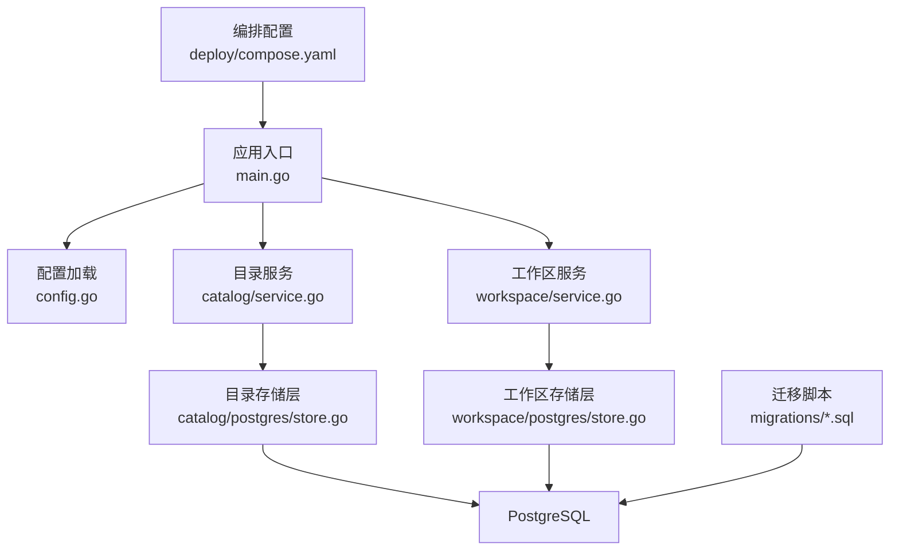
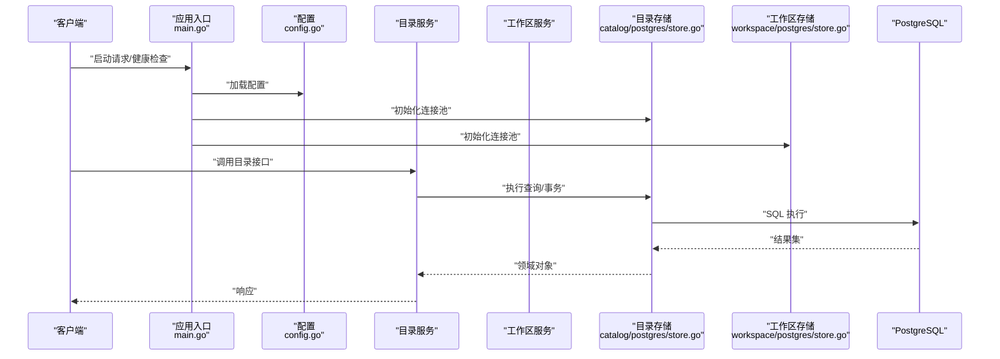
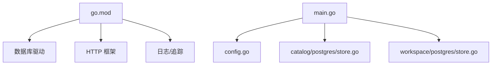

# 性能优化

<cite>
**本文引用的文件**   
- [apps/control-plane/cmd/control-plane/main.go](file://apps/control-plane/cmd/control-plane/main.go)
- [apps/control-plane/internal/config/config.go](file://apps/control-plane/internal/config/config.go)
- [apps/control-plane/internal/catalog/postgres/store.go](file://apps/control-plane/internal/catalog/postgres/store.go)
- [apps/control-plane/internal/workspace/postgres/store.go](file://apps/control-plane/internal/workspace/postgres/store.go)
- [apps/control-plane/migrations/001_catalog.sql](file://apps/control-plane/migrations/001_catalog.sql)
- [apps/control-plane/migrations/002_card_text.sql](file://apps/control-plane/migrations/002_card_text.sql)
- [apps/control-plane/migrations/003_workspace.sql](file://apps/control-plane/migrations/003_workspace.sql)
- [deploy/compose.yaml](file://deploy/compose.yaml)
- [go.mod](file://go.mod)
</cite>

## 目录
1. [简介](#简介)
2. [项目结构](#项目结构)
3. [核心组件](#核心组件)
4. [架构总览](#架构总览)
5. [详细组件分析](#详细组件分析)
6. [依赖分析](#依赖分析)
7. [性能考虑](#性能考虑)
8. [故障排查指南](#故障排查指南)
9. [结论](#结论)
10. [附录](#附录)

## 简介
本指南面向 NeKiro 平台，聚焦于数据库与应用层性能调优、系统资源监控、负载与基准测试方法、Go 运行时参数配置、慢查询分析与热点代码优化、容量规划与扩容策略，以及性能回归检测与持续性能监控。文档结合仓库中控制面（control-plane）的 Go 实现、PostgreSQL 迁移脚本与部署编排文件，给出可落地的优化建议与实践路径。

## 项目结构
NeKiro 的控制面服务以 Go 编写，使用 PostgreSQL 作为持久化存储，并通过迁移脚本管理数据模型变更。关键目录与职责：
- apps/control-plane/cmd/control-plane/main.go：应用入口与启动流程
- apps/control-plane/internal/config/config.go：配置加载与校验
- apps/control-plane/internal/catalog/postgres/store.go：目录（Catalog）数据访问层
- apps/control-plane/internal/workspace/postgres/store.go：工作区（Workspace）数据访问层
- apps/control-plane/migrations/*.sql：数据库迁移脚本
- deploy/compose.yaml：本地/集成环境编排与容器化配置
- go.mod：Go 模块与依赖声明

图表来源
- [apps/control-plane/cmd/control-plane/main.go](file://apps/control-plane/cmd/control-plane/main.go)
- [apps/control-plane/internal/config/config.go](file://apps/control-plane/internal/config/config.go)
- [apps/control-plane/internal/catalog/postgres/store.go](file://apps/control-plane/internal/catalog/postgres/store.go)
- [apps/control-plane/internal/workspace/postgres/store.go](file://apps/control-plane/internal/workspace/postgres/store.go)
- [apps/control-plane/migrations/001_catalog.sql](file://apps/control-plane/migrations/001_catalog.sql)
- [apps/control-plane/migrations/002_card_text.sql](file://apps/control-plane/migrations/002_card_text.sql)
- [apps/control-plane/migrations/003_workspace.sql](file://apps/control-plane/migrations/003_workspace.sql)
- [deploy/compose.yaml](file://deploy/compose.yaml)

章节来源
- [apps/control-plane/cmd/control-plane/main.go](file://apps/control-plane/cmd/control-plane/main.go)
- [apps/control-plane/internal/config/config.go](file://apps/control-plane/internal/config/config.go)
- [apps/control-plane/internal/catalog/postgres/store.go](file://apps/control-plane/internal/catalog/postgres/store.go)
- [apps/control-plane/internal/workspace/postgres/store.go](file://apps/control-plane/internal/workspace/postgres/store.go)
- [apps/control-plane/migrations/001_catalog.sql](file://apps/control-plane/migrations/001_catalog.sql)
- [apps/control-plane/migrations/002_card_text.sql](file://apps/control-plane/migrations/002_card_text.sql)
- [apps/control-plane/migrations/003_workspace.sql](file://apps/control-plane/migrations/003_workspace.sql)
- [deploy/compose.yaml](file://deploy/compose.yaml)

## 核心组件
- 应用入口与生命周期管理：负责初始化配置、日志、追踪、HTTP 网关、数据库连接与优雅关闭。
- 配置中心：集中读取环境变量或配置文件，提供类型安全的配置项，包括数据库连接池、超时、并发度等。
- 数据访问层（Catalog/Workspace）：封装 SQL 执行、事务、游标分页与批量操作，是性能优化的关键切入点。
- 迁移脚本：定义表结构与索引，直接影响查询性能与写入吞吐。

章节来源
- [apps/control-plane/cmd/control-plane/main.go](file://apps/control-plane/cmd/control-plane/main.go)
- [apps/control-plane/internal/config/config.go](file://apps/control-plane/internal/config/config.go)
- [apps/control-plane/internal/catalog/postgres/store.go](file://apps/control-plane/internal/catalog/postgres/store.go)
- [apps/control-plane/internal/workspace/postgres/store.go](file://apps/control-plane/internal/workspace/postgres/store.go)

## 架构总览
控制面采用分层架构：入口层 -> 业务服务层 -> 数据访问层 -> 数据库。迁移脚本在部署阶段执行，确保数据模型一致。

图表来源
- [apps/control-plane/cmd/control-plane/main.go](file://apps/control-plane/cmd/control-plane/main.go)
- [apps/control-plane/internal/config/config.go](file://apps/control-plane/internal/config/config.go)
- [apps/control-plane/internal/catalog/postgres/store.go](file://apps/control-plane/internal/catalog/postgres/store.go)
- [apps/control-plane/internal/workspace/postgres/store.go](file://apps/control-plane/internal/workspace/postgres/store.go)

## 详细组件分析

### 数据库性能调优
- 索引优化
  - 依据迁移脚本中的建表语句与常用过滤条件，为高频查询字段建立合适索引，避免过度索引导致写入放大。
  - 对联合查询与排序字段评估覆盖索引的收益，权衡空间与写放大。
  - 定期通过 EXPLAIN/EXPLAIN ANALYZE 验证执行计划是否命中预期索引。
- 查询优化
  - 减少 N+1 查询，合并多次小查询为批量或 JOIN。
  - 限制返回列与行数，使用分页与游标避免全表扫描与大结果集传输。
  - 避免在 WHERE 中对列进行函数计算，保持 SARGable 条件。
- 连接池配置
  - 根据 CPU 核数与数据库最大连接数设置最大空闲连接与最大活跃连接，避免连接耗尽与上下文切换开销。
  - 合理设置连接获取超时与空闲回收时间，防止长尾延迟。
  - 针对读写分离场景，区分只读连接池与读写连接池。

章节来源
- [apps/control-plane/migrations/001_catalog.sql](file://apps/control-plane/migrations/001_catalog.sql)
- [apps/control-plane/migrations/002_card_text.sql](file://apps/control-plane/migrations/002_card_text.sql)
- [apps/control-plane/migrations/003_workspace.sql](file://apps/control-plane/migrations/003_workspace.sql)
- [apps/control-plane/internal/catalog/postgres/store.go](file://apps/control-plane/internal/catalog/postgres/store.go)
- [apps/control-plane/internal/workspace/postgres/store.go](file://apps/control-plane/internal/workspace/postgres/store.go)

### 应用层性能优化
- 缓存策略
  - 对读多写少的目录与工作区元数据进行本地缓存或分布式缓存，设置合理的 TTL 与失效策略。
  - 使用一致性哈希或分片缓存降低热点键压力。
- 异步处理
  - 将耗时任务（如导出、统计、索引重建）放入消息队列或后台协程，缩短请求链路。
  - 使用背压与限流保护下游系统与数据库。
- 并发控制
  - 基于令牌桶或信号量限制并发度，避免雪崩。
  - 使用 goroutine 池与 worker 队列平衡吞吐与资源占用。

章节来源
- [apps/control-plane/internal/catalog/service.go](file://apps/control-plane/internal/catalog/service.go)
- [apps/control-plane/internal/workspace/service.go](file://apps/control-plane/internal/workspace/service.go)

### 系统资源监控
- CPU
  - 关注 Go 调度器指标（goroutine 数量、阻塞比例）、系统级 CPU 使用率与内核态占比。
- 内存
  - 监控堆大小、GC 暂停时间与分配速率，识别内存泄漏与频繁分配热点。
- 磁盘 I/O
  - 观察磁盘吞吐、IOPS 与等待时间，定位慢查询与大量随机写。
- 网络
  - 监控连接数、带宽利用率与重传率，识别网络瓶颈与拥塞。

章节来源
- [deploy/compose.yaml](file://deploy/compose.yaml)

### 负载测试与基准测试
- 负载测试方案
  - 使用工具模拟真实流量模式（混合读写、峰值突发），逐步提升 QPS 直至出现瓶颈。
  - 记录 P50/P95/P99 延迟、错误率与资源使用率，绘制 SLO 达成情况。
- 基准测试方法
  - 针对关键路径（如目录检索、工作区创建）编写微基准，对比优化前后差异。
  - 固定硬件与环境，隔离外部依赖影响，确保结果可复现。

章节来源
- [deploy/compose.yaml](file://deploy/compose.yaml)

### Go 运行时调优参数
- 关键参数
  - GOMAXPROCS：设置为 CPU 核数，充分利用并行能力。
  - GOGC：调整 GC 触发阈值，平衡延迟与吞吐。
  - GOMEMLIMIT：限制进程内存上限，防止 OOM。
  - GODEBUG：开启特定调试开关（如 gcshutdowndelay）。
- 配置方式
  - 通过环境变量注入或在启动命令中显式指定。
  - 结合 Prometheus 指标与 pprof 分析进行动态调优。

章节来源
- [go.mod](file://go.mod)
- [deploy/compose.yaml](file://deploy/compose.yaml)

### 慢查询分析与热点代码优化
- 慢查询分析
  - 启用 PostgreSQL 慢查询日志，收集执行时长超过阈值的 SQL。
  - 使用 EXPLAIN/EXPLAIN ANALYZE 分析执行计划，定位全表扫描、临时表与文件排序。
- 热点代码优化
  - 使用 pprof 生成 CPU/内存/阻塞/互斥锁快照，识别热点函数与锁竞争。
  - 减少不必要的对象分配与拷贝，复用缓冲区与连接。
  - 将热路径从同步改为异步或批处理，降低尾部延迟。

章节来源
- [apps/control-plane/internal/catalog/postgres/store.go](file://apps/control-plane/internal/catalog/postgres/store.go)
- [apps/control-plane/internal/workspace/postgres/store.go](file://apps/control-plane/internal/workspace/postgres/store.go)

### 容量规划与扩容策略
- 容量规划
  - 基于历史峰值与增长趋势估算 CPU、内存、磁盘与网络需求。
  - 预留安全边际（通常 20%-30%），应对突发流量与故障恢复。
- 扩容策略
  - 水平扩展：增加控制面实例，配合负载均衡与健康检查。
  - 垂直扩展：提升单机规格，注意单点风险与停机窗口。
  - 数据库侧：主从复制、只读副本与分库分表，按热点维度拆分。

章节来源
- [deploy/compose.yaml](file://deploy/compose.yaml)

### 性能回归检测与持续性能监控
- 回归检测
  - 在 CI/CD 流水线中集成基准测试与负载测试，设定阈值告警。
  - 对比基线版本，自动标记性能退化提交。
- 持续监控
  - 采集应用指标（QPS、延迟分布、错误率）与系统指标（CPU、内存、磁盘、网络）。
  - 建立仪表盘与告警规则，快速定位异常与回滚。

章节来源
- [deploy/compose.yaml](file://deploy/compose.yaml)

## 依赖分析
控制面依赖 Go 标准库与第三方包，数据库驱动与 ORM/查询构建器影响连接池与查询性能。

图表来源
- [go.mod](file://go.mod)
- [apps/control-plane/cmd/control-plane/main.go](file://apps/control-plane/cmd/control-plane/main.go)
- [apps/control-plane/internal/config/config.go](file://apps/control-plane/internal/config/config.go)
- [apps/control-plane/internal/catalog/postgres/store.go](file://apps/control-plane/internal/catalog/postgres/store.go)
- [apps/control-plane/internal/workspace/postgres/store.go](file://apps/control-plane/internal/workspace/postgres/store.go)

章节来源
- [go.mod](file://go.mod)
- [apps/control-plane/cmd/control-plane/main.go](file://apps/control-plane/cmd/control-plane/main.go)
- [apps/control-plane/internal/config/config.go](file://apps/control-plane/internal/config/config.go)
- [apps/control-plane/internal/catalog/postgres/store.go](file://apps/control-plane/internal/catalog/postgres/store.go)
- [apps/control-plane/internal/workspace/postgres/store.go](file://apps/control-plane/internal/workspace/postgres/store.go)

## 性能考虑
- 数据库层面优先：索引与查询优化收益显著，应作为首要优化方向。
- 应用层并发与缓存：在高并发场景下，合理并发与缓存可降低数据库压力。
- 资源监控先行：没有度量就没有优化，先建立完善的监控与告警体系。
- 渐进式优化：每次变更只做单一假设，量化收益并回滚预案。

## 故障排查指南
- 常见症状
  - 高延迟：检查慢查询、锁竞争与 GC 停顿。
  - 高错误率：关注连接池耗尽、超时与下游依赖失败。
  - 资源飙升：识别热点 goroutine、内存泄漏与磁盘 I/O 瓶颈。
- 排查步骤
  - 查看应用日志与追踪 ID，定位问题请求。
  - 抓取 pprof 快照，分析 CPU/内存/阻塞热点。
  - 使用 EXPLAIN/EXPLAIN ANALYZE 分析慢查询执行计划。
  - 核对连接池配置与数据库最大连接数，避免资源争用。

章节来源
- [apps/control-plane/internal/catalog/postgres/store.go](file://apps/control-plane/internal/catalog/postgres/store.go)
- [apps/control-plane/internal/workspace/postgres/store.go](file://apps/control-plane/internal/workspace/postgres/store.go)

## 结论
通过数据库索引与查询优化、应用层并发与缓存策略、系统资源监控与负载测试、Go 运行时调优、慢查询分析与热点代码优化、容量规划与持续性能监控，NeKiro 平台可在保证稳定性的前提下显著提升性能与可扩展性。建议以度量驱动的方式推进优化，形成闭环改进机制。

## 附录
- 术语
  - SLO：服务等级目标
  - QPS：每秒查询数
  - P95/P99：延迟百分位
- 参考实践
  - 使用 pg_stat_statements 统计慢查询
  - 使用 Prometheus + Grafana 搭建监控面板
  - 使用 k6/JMeter 进行负载测试