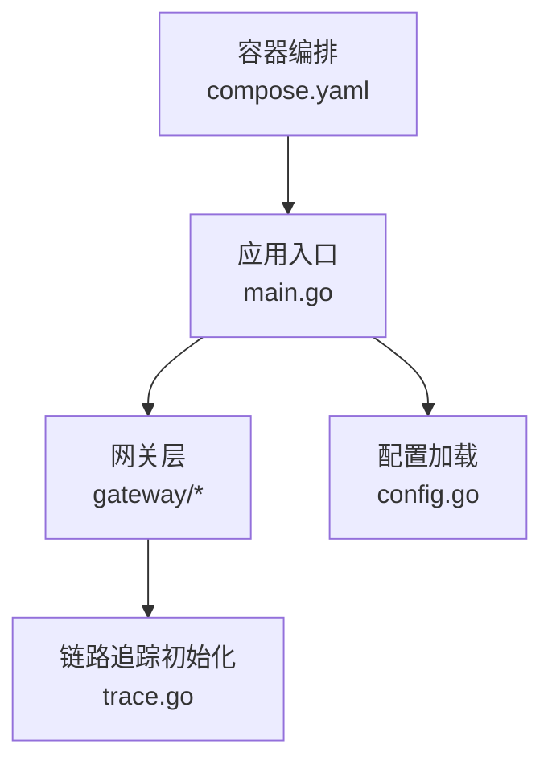
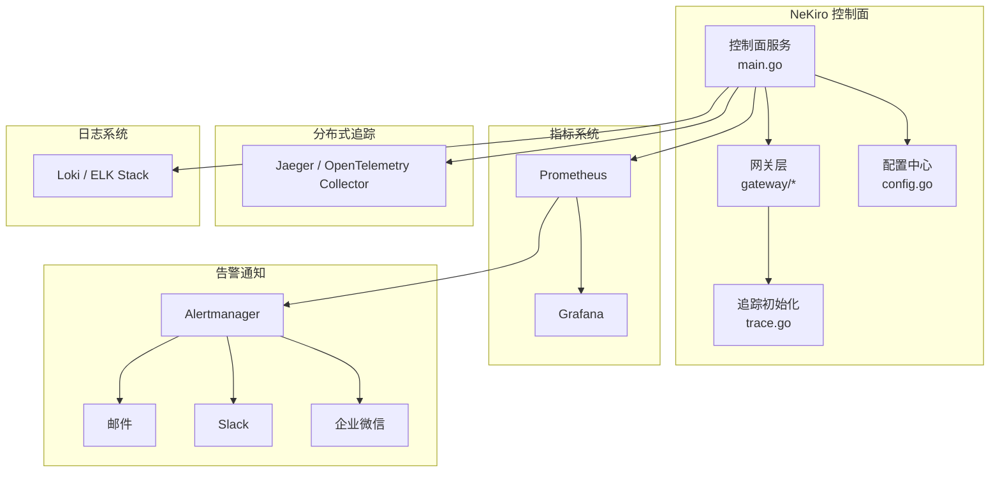
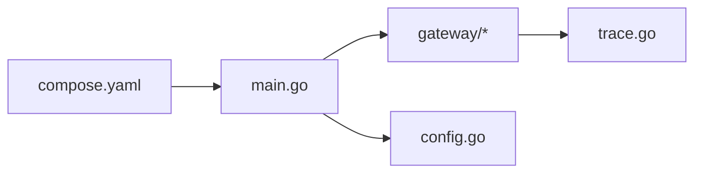

# 监控与日志

<cite>
**本文引用的文件**   
- [apps/control-plane/cmd/control-plane/main.go](file://apps/control-plane/cmd/control-plane/main.go)
- [apps/control-plane/internal/gateway/trace.go](file://apps/control-plane/internal/gateway/trace.go)
- [apps/control-plane/internal/config/config.go](file://apps/control-plane/internal/config/config.go)
- [deploy/compose.yaml](file://deploy/compose.yaml)
</cite>

## 目录
1. [简介](#简介)
2. [项目结构](#项目结构)
3. [核心组件](#核心组件)
4. [架构总览](#架构总览)
5. [详细组件分析](#详细组件分析)
6. [依赖关系分析](#依赖关系分析)
7. [性能考虑](#性能考虑)
8. [故障排查指南](#故障排查指南)
9. [结论](#结论)
10. [附录](#附录)

## 简介
本章节面向 NeKiro 平台的可观测性建设，聚焦于监控指标、分布式追踪、结构化日志与告警通知的落地方案。文档基于仓库中控制面服务的现有实现与部署配置，给出 Prometheus 集成、自定义指标定义、Jaeger/OpenTelemetry 集成、结构化日志规范、日志聚合（ELK/Loki）以及关键业务与健康检查指标的监控建议，并提供可视化面板与告警渠道集成的参考实践。

## 项目结构
NeKiro 的控制面服务位于 apps/control-plane 下，入口为 main.go；网关层包含链路追踪初始化逻辑 trace.go；配置集中在 internal/config；容器编排使用 deploy/compose.yaml。

图示来源
- [apps/control-plane/cmd/control-plane/main.go](file://apps/control-plane/cmd/control-plane/main.go)
- [apps/control-plane/internal/gateway/trace.go](file://apps/control-plane/internal/gateway/trace.go)
- [apps/control-plane/internal/config/config.go](file://apps/control-plane/internal/config/config.go)
- [deploy/compose.yaml](file://deploy/compose.yaml)

章节来源
- [apps/control-plane/cmd/control-plane/main.go](file://apps/control-plane/cmd/control-plane/main.go)
- [apps/control-plane/internal/gateway/trace.go](file://apps/control-plane/internal/gateway/trace.go)
- [apps/control-plane/internal/config/config.go](file://apps/control-plane/internal/config/config.go)
- [deploy/compose.yaml](file://deploy/compose.yaml)

## 核心组件
- 应用入口与生命周期：负责启动 HTTP 服务、加载配置、初始化中间件与路由、暴露健康检查端点等。
- 网关层与追踪：在请求进入时注入并传播追踪上下文，记录关键阶段信息，便于端到端排障。
- 配置管理：集中读取环境变量或配置文件，驱动运行时行为（如端口、日志级别、追踪导出器开关等）。
- 容器编排：通过 compose 拉起服务及可选的可观测性组件（Prometheus、Jaeger、Loki/ELK 等），提供本地与测试环境的一键运行能力。

章节来源
- [apps/control-plane/cmd/control-plane/main.go](file://apps/control-plane/cmd/control-plane/main.go)
- [apps/control-plane/internal/gateway/trace.go](file://apps/control-plane/internal/gateway/trace.go)
- [apps/control-plane/internal/config/config.go](file://apps/control-plane/internal/config/config.go)
- [deploy/compose.yaml](file://deploy/compose.yaml)

## 架构总览
下图展示了控制面服务与常见可观测性组件的交互关系，包括指标采集、分布式追踪、结构化日志与告警通知。

图示来源
- [apps/control-plane/cmd/control-plane/main.go](file://apps/control-plane/cmd/control-plane/main.go)
- [apps/control-plane/internal/gateway/trace.go](file://apps/control-plane/internal/gateway/trace.go)
- [apps/control-plane/internal/config/config.go](file://apps/control-plane/internal/config/config.go)
- [deploy/compose.yaml](file://deploy/compose.yaml)

## 详细组件分析

### 指标收集与 Prometheus 集成
- 指标暴露位置：建议在 HTTP 入口或网关中间件中统一暴露 /metrics 端点，由 Prometheus 定期抓取。
- 内置指标：优先复用语言/框架提供的运行时指标（进程、HTTP、数据库连接池等）。
- 自定义指标：围绕关键业务路径（如调用分发、工作空间操作、编目查询）定义计数器、直方图与时序指标，确保维度可控且具备高基数防护。
- 标签设计：遵循命名规范，避免过多高基数标签；对错误分类采用低基数字典化枚举。
- 抓取策略：在 compose 中声明 Prometheus 任务，设置合理的 scrape_interval 与超时，结合服务发现或静态 targets。
- 健康检查：暴露 /healthz 与 /readyz，配合 liveness/readiness 探针与外部告警联动。

章节来源
- [apps/control-plane/cmd/control-plane/main.go](file://apps/control-plane/cmd/control-plane/main.go)
- [deploy/compose.yaml](file://deploy/compose.yaml)

### 自定义指标定义与最佳实践
- 指标类型选择：
  - 计数器：累计事件数（如请求总量、失败次数、重试次数）。
  - 直方图/摘要：延迟分布（P50/P90/P99）、批处理耗时。
  - 时序：资源使用率（CPU、内存、GC）、队列长度、连接池占用。
- 维度与基数：
  - 保留必要维度（方法、状态码、路由、组件名），剔除用户敏感信息与高基数字段。
- 采样与降采样：
  - 对高频指标进行合理采样或在采集侧做预聚合，降低存储压力。
- 指标校验：
  - 在 CI 中加入指标白名单与命名规范检查，防止污染指标命名空间。

[本节为通用指导，不直接分析具体文件]

### 告警规则设置
- 基础可用性：服务不可用、健康检查失败、依赖（数据库、消息队列）异常。
- 性能退化：P99 延迟突增、错误率上升、资源饱和（CPU/内存/GC）。
- 业务异常：关键流程失败率、幂等冲突、重试风暴、下游超时。
- 告警分级：按影响范围与恢复难度划分 P0-P3，明确升级策略与值班响应时间。
- 抑制与去重：利用分组、静默与抑制规则减少告警风暴。

[本节为通用指导，不直接分析具体文件]

### 分布式追踪系统（Jaeger / OpenTelemetry）
- 上下文传播：在网关入口处创建根 Span，将 trace_id/span_id 注入到下游调用与日志上下文中。
- 采样策略：生产环境采用动态采样（按错误率、延迟阈值、业务重要性），开发调试可全量采样。
- 导出通道：通过 OTLP 或 Jaeger Agent 上报，支持批量发送与重试退避。
- 关联日志：在日志中输出 trace_id/span_id，便于从日志跳转到对应 Trace。
- 可视化：在 Jaeger UI 或 Grafana Tempo 中查看端到端链路，定位慢节点与错误分支。

章节来源
- [apps/control-plane/internal/gateway/trace.go](file://apps/control-plane/internal/gateway/trace.go)
- [apps/control-plane/cmd/control-plane/main.go](file://apps/control-plane/cmd/control-plane/main.go)

### 结构化日志格式、级别与轮转
- 结构化格式：JSON 为主，固定字段包含时间戳、级别、服务名、实例 ID、trace_id、span_id、模块、消息体、关键业务键。
- 日志级别：DEBUG/INFO/WARN/ERROR/FATAL，严格限制 DEBUG 在生产开启。
- 脱敏与安全：禁止输出密钥、令牌、个人身份信息；对敏感字段进行掩码或丢弃。
- 轮转策略：按大小与时间双轮转，保留周期与压缩策略需与日志聚合容量规划匹配。
- 性能优化：异步写入、批量落盘、限流与熔断，避免阻塞主流程。

[本节为通用指导，不直接分析具体文件]

### 日志聚合方案（ELK / Loki）
- ELK 栈：Filebeat/Fluent Bit 采集 -> Kafka（可选）-> Logstash/Vector -> Elasticsearch -> Kibana。
- Loki 方案：Promtail/Fluent Bit 采集 -> Loki -> Grafana 查询与可视化。
- 索引与标签：以低基数维度作为索引键（服务、环境、模块），提高查询效率。
- 保留与归档：冷热分层、对象存储归档，满足合规与成本要求。

[本节为通用指导，不直接分析具体文件]

### 关键业务指标、系统性能与健康检查
- 业务指标：
  - 调用成功率、失败原因分布、端到端延迟分位、并发度、排队长度。
  - 工作空间/编目相关 CRUD 吞吐与错误率。
- 系统性能：
  - CPU/内存/GC、文件描述符、网络 I/O、数据库连接池与慢查询。
- 健康检查：
  - /healthz：进程存活、依赖可达。
  - /readyz：依赖就绪、缓存预热完成。
  - /metrics：指标暴露。

章节来源
- [apps/control-plane/cmd/control-plane/main.go](file://apps/control-plane/cmd/control-plane/main.go)

### 告警通知渠道集成
- Alertmanager 路由：按团队/服务/严重等级分流至不同接收器。
- 渠道：
  - 邮件：SMTP 配置、模板与收件人组。
  - Slack：Webhook 或 Bot Token，频道与 @提及策略。
  - 企业微信：机器人 Webhook，消息卡片与@成员。
- 降噪：抑制规则、静默窗口、重复告警合并。

[本节为通用指导，不直接分析具体文件]

### 监控面板与可视化
- Grafana 面板：
  - 概览：SLO/SLI、错误预算、关键业务 KPI。
  - 性能：延迟分位、吞吐、资源使用。
  - 追踪：Top N 慢请求、错误热点。
- 看板组织：按服务域与环境分层，提供默认视图与高级筛选。
- 权限与共享：只读分享链接、RBAC 控制访问。

[本节为通用指导，不直接分析具体文件]

## 依赖关系分析
- 入口与中间件：入口负责组装中间件链，其中包含追踪、日志、指标等横切关注点。
- 配置驱动：运行时参数（端口、日志级别、追踪开关）由配置模块注入。
- 编排与外部依赖：compose 定义服务拓扑，协调控制面与可观测性组件的启动顺序与网络连通。

图示来源
- [apps/control-plane/cmd/control-plane/main.go](file://apps/control-plane/cmd/control-plane/main.go)
- [apps/control-plane/internal/gateway/trace.go](file://apps/control-plane/internal/gateway/trace.go)
- [apps/control-plane/internal/config/config.go](file://apps/control-plane/internal/config/config.go)
- [deploy/compose.yaml](file://deploy/compose.yaml)

章节来源
- [apps/control-plane/cmd/control-plane/main.go](file://apps/control-plane/cmd/control-plane/main.go)
- [apps/control-plane/internal/gateway/trace.go](file://apps/control-plane/internal/gateway/trace.go)
- [apps/control-plane/internal/config/config.go](file://apps/control-plane/internal/config/config.go)
- [deploy/compose.yaml](file://deploy/compose.yaml)

## 性能考虑
- 指标与日志开销：关闭不必要的 DEBUG 日志；指标维度控制；批量与异步写入。
- 追踪采样：生产环境按需采样，避免全量上报造成带宽与存储压力。
- 资源隔离：为可观测性组件分配独立资源配额，避免与业务争抢。
- 容量规划：根据 QPS、P99 延迟与保留周期估算存储与带宽需求。

[本节为通用指导，不直接分析具体文件]

## 故障排查指南
- 快速定位：
  - 通过 /healthz 与 /readyz 判断服务状态。
  - 使用 trace_id 在日志与追踪系统中串联问题链路。
- 常见问题：
  - 指标未上报：检查 /metrics 端点、Prometheus 抓取目标与网络策略。
  - 追踪丢失：确认网关处是否创建根 Span 并正确传播上下文。
  - 日志缺失：检查轮转策略、磁盘空间与采集器状态。
- 回滚与降级：
  - 临时关闭非关键指标与追踪采样，保障核心链路稳定。
  - 调整告警阈值与静默窗口，避免误报干扰。

章节来源
- [apps/control-plane/cmd/control-plane/main.go](file://apps/control-plane/cmd/control-plane/main.go)
- [apps/control-plane/internal/gateway/trace.go](file://apps/control-plane/internal/gateway/trace.go)

## 结论
通过在入口与网关层统一接入指标、追踪与日志，并结合 compose 编排与标准健康检查端点，NeKiro 控制面可实现端到端的可观测性与稳定的运维闭环。建议持续完善指标字典、告警规则与可视化看板，形成“可观测即代码”的工程化体系。

[本节为总结性内容，不直接分析具体文件]

## 附录
- 术语表：
  - SLO/SLI：服务等级目标/指标
  - OTLP：OpenTelemetry 协议
  - P99：第 99 百分位延迟
- 参考清单：
  - 指标命名规范与维度设计
  - 告警分级与响应流程
  - 日志脱敏与安全基线

[本节为补充说明，不直接分析具体文件]