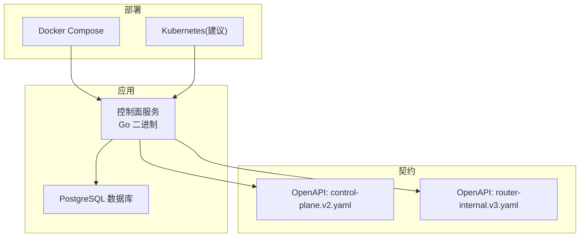
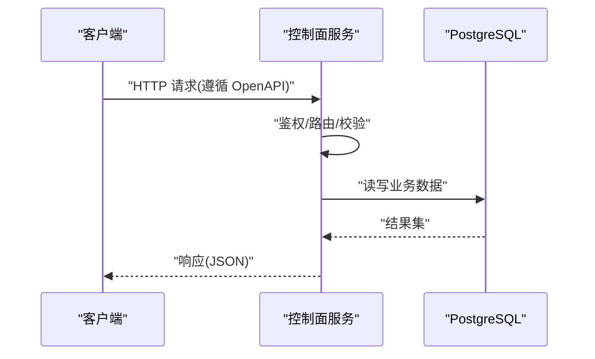
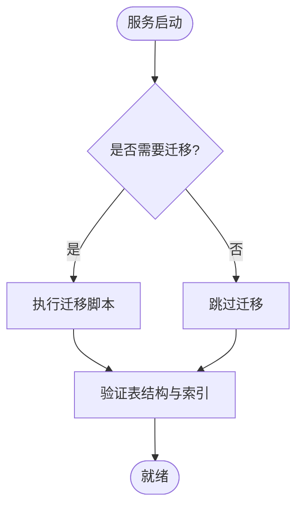
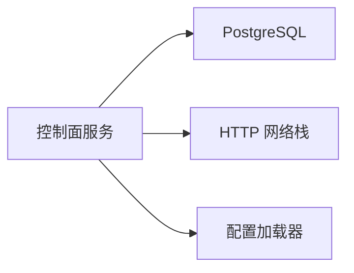

# 部署运维

<cite>
**本文引用的文件**   
- [README.md](file://README.md)
- [compose.yaml](file://deploy/compose.yaml)
- [Dockerfile](file://apps/control-plane/Dockerfile)
- [main.go](file://apps/control-plane/cmd/control-plane/main.go)
- [config.go](file://apps/control-plane/internal/config/config.go)
- [migrations.go](file://apps/control-plane/internal/catalog/postgres/migrations.go)
- [store.go](file://apps/control-plane/internal/catalog/postgres/store.go)
- [workspace_store.go](file://apps/control-plane/internal/workspace/postgres/store.go)
- [workspace_migrations.go](file://apps/control-plane/internal/workspace/postgres/migrations.go)
- [001_catalog.sql](file://apps/control-plane/migrations/001_catalog.sql)
- [002_card_text.sql](file://apps/control-plane/migrations/002_card_text.sql)
- [003_workspace.sql](file://apps/control-plane/migrations/003_workspace.sql)
- [control-plane.v2.yaml](file://contracts/openapi/control-plane.v2.yaml)
- [router-internal.v3.yaml](file://contracts/openapi/router-internal.v3.yaml)
</cite>

## 目录
1. [简介](#简介)
2. [项目结构](#项目结构)
3. [核心组件](#核心组件)
4. [架构总览](#架构总览)
5. [详细组件分析](#详细组件分析)
6. [依赖关系分析](#依赖关系分析)
7. [性能考虑](#性能考虑)
8. [故障排查指南](#故障排查指南)
9. [结论](#结论)
10. [附录](#附录)

## 简介
本文件面向 NeKiro 平台的运维与 SRE 团队，提供从本地到生产环境的完整部署与运维指南。内容覆盖 Docker 与 Kubernetes 部署、环境变量配置、指标收集、日志管理、告警策略、健康检查、容量规划、备份恢复、灾难恢复与安全加固，以及自动化脚本与最佳实践。文档以仓库现有实现为依据，确保可落地执行。

## 项目结构
NeKiro 控制面服务位于 apps/control-plane，包含 Go 主程序、内部模块（配置、网关、编目、工作区、调用路由）、PostgreSQL 迁移脚本与容器镜像构建定义；deploy/compose.yaml 提供本地一键编排；contracts/openapi 定义对外与内部接口契约。

图表来源
- [compose.yaml](file://deploy/compose.yaml)
- [Dockerfile](file://apps/control-plane/Dockerfile)
- [control-plane.v2.yaml](file://contracts/openapi/control-plane.v2.yaml)
- [router-internal.v3.yaml](file://contracts/openapi/router-internal.v3.yaml)

章节来源
- [README.md](file://README.md)
- [compose.yaml](file://deploy/compose.yaml)
- [Dockerfile](file://apps/control-plane/Dockerfile)

## 核心组件
- 控制面服务：提供编目与工作区等核心能力，持久化至 PostgreSQL。
- 配置加载：通过配置文件与环境变量注入运行时参数。
- 数据访问：基于 Postgres 的存储层与迁移机制。
- 外部契约：遵循 OpenAPI 定义的 REST/JSON 接口。

章节来源
- [main.go](file://apps/control-plane/cmd/control-plane/main.go)
- [config.go](file://apps/control-plane/internal/config/config.go)
- [store.go](file://apps/control-plane/internal/catalog/postgres/store.go)
- [workspace_store.go](file://apps/control-plane/internal/workspace/postgres/store.go)
- [control-plane.v2.yaml](file://contracts/openapi/control-plane.v2.yaml)

## 架构总览
控制面服务作为单进程应用运行，依赖外部 PostgreSQL 进行状态持久化。开发环境可通过 Docker Compose 拉起服务与数据库；生产环境建议使用 Kubernetes 进行编排与弹性伸缩。

图表来源
- [main.go](file://apps/control-plane/cmd/control-plane/main.go)
- [store.go](file://apps/control-plane/internal/catalog/postgres/store.go)
- [workspace_store.go](file://apps/control-plane/internal/workspace/postgres/store.go)
- [control-plane.v2.yaml](file://contracts/openapi/control-plane.v2.yaml)

## 详细组件分析

### 容器镜像与入口
- 镜像构建：使用 apps/control-plane/Dockerfile 定义多阶段构建与最小化运行时。
- 入口程序：cmd/control-plane/main.go 负责初始化配置、启动 HTTP 服务与生命周期钩子。

章节来源
- [Dockerfile](file://apps/control-plane/Dockerfile)
- [main.go](file://apps/control-plane/cmd/control-plane/main.go)

### 配置与环境变量
- 配置加载：internal/config/config.go 提供配置读取与默认值处理。
- 关键配置项（示例）：
  - 数据库连接：主机、端口、用户名、密码、库名、SSL 模式、连接池大小、超时等。
  - 服务监听：HTTP 端口、TLS 证书路径、最大并发等。
  - 日志级别：输出格式、采样率、结构化字段开关。
  - 迁移开关：是否自动执行迁移、回滚策略。
- 推荐实践：
  - 使用环境变量或密钥管理服务注入敏感信息。
  - 在 Compose/K8s ConfigMap/Secret 中集中管理非敏感配置。

章节来源
- [config.go](file://apps/control-plane/internal/config/config.go)

### 数据持久化与迁移
- 迁移脚本：
  - migrations/001_catalog.sql
  - migrations/002_card_text.sql
  - migrations/003_workspace.sql
- 迁移执行：
  - internal/catalog/postgres/migrations.go
  - internal/workspace/postgres/migrations.go
- 存储实现：
  - internal/catalog/postgres/store.go
  - internal/workspace/postgres/store.go

图表来源
- [migrations.go](file://apps/control-plane/internal/catalog/postgres/migrations.go)
- [workspace_migrations.go](file://apps/control-plane/internal/workspace/postgres/migrations.go)
- [001_catalog.sql](file://apps/control-plane/migrations/001_catalog.sql)
- [002_card_text.sql](file://apps/control-plane/migrations/002_card_text.sql)
- [003_workspace.sql](file://apps/control-plane/migrations/003_workspace.sql)

章节来源
- [migrations.go](file://apps/control-plane/internal/catalog/postgres/migrations.go)
- [workspace_migrations.go](file://apps/control-plane/internal/workspace/postgres/migrations.go)
- [store.go](file://apps/control-plane/internal/catalog/postgres/store.go)
- [workspace_store.go](file://apps/control-plane/internal/workspace/postgres/store.go)
- [001_catalog.sql](file://apps/control-plane/migrations/001_catalog.sql)
- [002_card_text.sql](file://apps/control-plane/migrations/002_card_text.sql)
- [003_workspace.sql](file://apps/control-plane/migrations/003_workspace.sql)

### 网络与接口契约
- 控制面对外接口：contracts/openapi/control-plane.v2.yaml
- 路由器内部接口：contracts/openapi/router-internal.v3.yaml
- 建议：
  - 在生产环境启用 TLS 终止于网关或 Ingress。
  - 对内部接口实施网络隔离与鉴权。

章节来源
- [control-plane.v2.yaml](file://contracts/openapi/control-plane.v2.yaml)
- [router-internal.v3.yaml](file://contracts/openapi/router-internal.v3.yaml)

## 依赖关系分析
- 直接依赖：
  - PostgreSQL：用于编目与工作区数据的持久化。
  - 标准库 HTTP 服务器：暴露 REST 接口。
- 间接依赖：
  - 容器运行时：Docker/Kubernetes。
  - 可选：监控与日志采集器（Prometheus、Loki、Jaeger 等）。

图表来源
- [main.go](file://apps/control-plane/cmd/control-plane/main.go)
- [config.go](file://apps/control-plane/internal/config/config.go)
- [store.go](file://apps/control-plane/internal/catalog/postgres/store.go)
- [workspace_store.go](file://apps/control-plane/internal/workspace/postgres/store.go)

章节来源
- [main.go](file://apps/control-plane/cmd/control-plane/main.go)
- [config.go](file://apps/control-plane/internal/config/config.go)

## 性能考虑
- 数据库连接池：根据 QPS 与延迟目标调整最大连接数与空闲连接数。
- 查询优化：为常用过滤字段建立索引，避免全表扫描。
- 缓存策略：热点读数据可引入内存缓存或外部缓存层。
- 水平扩展：无状态服务可多副本部署，结合负载均衡。
- 资源配额：合理设置 CPU/内存限制与请求/限制比。
- 批处理与分页：大列表与批量写入采用分页与分批提交。

[本节为通用指导，不直接分析具体文件]

## 故障排查指南
- 常见问题
  - 无法连接数据库：检查连接串、网络可达性、认证凭据与防火墙规则。
  - 迁移失败：核对迁移脚本幂等性与版本一致性，查看迁移日志。
  - 接口报错：对照 OpenAPI 契约校验请求体与状态码。
  - 高延迟：观察数据库慢查询、连接池耗尽、GC 停顿与 CPU 争用。
- 调试技巧
  - 开启更详细日志级别并采集结构化日志。
  - 使用健康检查端点确认服务就绪。
  - 抓取堆栈与 goroutine 快照定位阻塞。
- 快速自检清单
  - 端口监听与证书有效性
  - 数据库连通性与权限
  - 迁移状态与表结构
  - 外部依赖可用性

章节来源
- [config.go](file://apps/control-plane/internal/config/config.go)
- [migrations.go](file://apps/control-plane/internal/catalog/postgres/migrations.go)
- [workspace_migrations.go](file://apps/control-plane/internal/workspace/postgres/migrations.go)
- [control-plane.v2.yaml](file://contracts/openapi/control-plane.v2.yaml)

## 结论
NeKiro 控制面服务以轻量 Go 进程形态运行，依赖 PostgreSQL 完成状态持久化。通过 Docker Compose 可快速本地验证，生产环境建议采用 Kubernetes 进行编排与弹性伸缩。配合合理的配置、监控、日志与告警策略，可实现稳定可靠的平台运行。

[本节为总结性内容，不直接分析具体文件]

## 附录

### Docker 部署
- 构建镜像
  - 使用 apps/control-plane/Dockerfile 构建控制面镜像。
- 本地运行
  - 使用 deploy/compose.yaml 编排控制面与数据库。
- 环境变量
  - 参考配置模块说明，将数据库连接、服务端口、日志级别等通过环境变量注入。

章节来源
- [Dockerfile](file://apps/control-plane/Dockerfile)
- [compose.yaml](file://deploy/compose.yaml)
- [config.go](file://apps/control-plane/internal/config/config.go)

### Kubernetes 部署
- 建议资源对象
  - Deployment：控制面服务副本与资源限制。
  - Service：集群内暴露 HTTP 端口。
  - ConfigMap/Secret：非敏感配置与敏感凭据分离。
  - PersistentVolumeClaim：若需本地持久化（通常建议外部托管数据库）。
  - Ingress/Gateway：TLS 终止与域名绑定。
- 健康检查
  - Liveness/Readiness 探针指向健康检查端点。
- 滚动更新
  - 使用滚动更新策略，确保零停机发布。
- 扩缩容
  - 基于 CPU/内存或自定义指标 HPA 自动扩缩容。

[本节为通用指导，不直接分析具体文件]

### 环境变量配置清单（示例）
- 数据库
  - POSTGRES_HOST、POSTGRES_PORT、POSTGRES_USER、POSTGRES_PASSWORD、POSTGRES_DB、POSTGRES_SSL_MODE、POSTGRES_MAX_CONNECTIONS、POSTGRES_TIMEOUT
- 服务
  - SERVER_HTTP_PORT、SERVER_TLS_CERT_PATH、SERVER_TLS_KEY_PATH、SERVER_MAX_CONCURRENCY
- 日志
  - LOG_LEVEL、LOG_FORMAT、LOG_SAMPLE_RATE
- 迁移
  - MIGRATE_AUTO_RUN、MIGRATION_DIR

章节来源
- [config.go](file://apps/control-plane/internal/config/config.go)

### 指标收集与监控
- 建议采集
  - 系统指标：CPU、内存、磁盘、网络
  - 应用指标：QPS、错误率、P95/P99 延迟、连接池使用率、GC 统计
  - 业务指标：编目条目数、工作区数量、调用成功率
- 工具建议
  - Prometheus + Grafana 可视化
  - cAdvisor 采集容器指标
  - OpenTelemetry/Jaeger 链路追踪（可选）

[本节为通用指导，不直接分析具体文件]

### 日志管理与检索
- 输出格式：结构化 JSON，包含请求 ID、用户标识、耗时等上下文。
- 采集方案：Filebeat/Fluent Bit 推送至 Loki/Elasticsearch。
- 保留策略：按天轮转与冷热分层存储。

[本节为通用指导，不直接分析具体文件]

### 告警配置
- 建议阈值
  - 错误率 > 1% 持续 5 分钟
  - P99 延迟 > 500ms 持续 10 分钟
  - 数据库连接池使用率 > 80%
  - 迁移失败或卡住
- 通知渠道
  - 企业微信/钉钉/邮件/短信

[本节为通用指导，不直接分析具体文件]

### 健康检查与就绪探针
- 存活探针：返回 200 表示进程存活。
- 就绪探针：数据库连通、迁移完成、依赖可用后返回 200。
- 未就绪行为：停止流量转发，等待恢复。

[本节为通用指导，不直接分析具体文件]

### 容量规划
- 单机基准：评估典型负载下的 CPU/内存/IO 占用。
- 横向扩展：无状态服务按 QPS 线性扩容。
- 数据库容量：根据数据增长与查询复杂度规划实例规格与分库分表策略。

[本节为通用指导，不直接分析具体文件]

### 备份与恢复
- 数据库备份
  - 定期逻辑备份（pg_dump）与物理备份（WAL 归档）。
  - 异地多副本与加密存储。
- 恢复演练
  - 定期演练恢复流程，验证 RPO/RTO 目标。
- 迁移兼容
  - 升级前冻结变更窗口，灰度发布与回滚预案。

[本节为通用指导，不直接分析具体文件]

### 灾难恢复
- 多可用区部署：跨 AZ 部署 Pod 与数据库只读副本。
- 故障切换：DNS/Ingress 切换与数据库主备切换。
- 数据一致性：基于事务与幂等设计保障最终一致。

[本节为通用指导，不直接分析具体文件]

### 安全加固
- 传输安全：强制 HTTPS/TLS，禁用弱套件。
- 身份鉴权：统一网关鉴权与最小权限原则。
- 密钥管理：使用 Secret 管理敏感信息，禁止硬编码。
- 网络安全：仅开放必要端口，启用网络策略。
- 审计与合规：开启访问审计与操作留痕。

[本节为通用指导，不直接分析具体文件]

### 自动化脚本与最佳实践
- CI/CD
  - 代码检查、单元测试、集成测试、镜像构建与推送。
- 发布流程
  - 灰度发布、蓝绿/金丝雀、自动回滚。
- 基础设施即代码
  - Helm Chart/Kustomize 管理 K8s 资源。
- 日常巡检
  - 自动化巡检任务与报告生成。

[本节为通用指导，不直接分析具体文件]