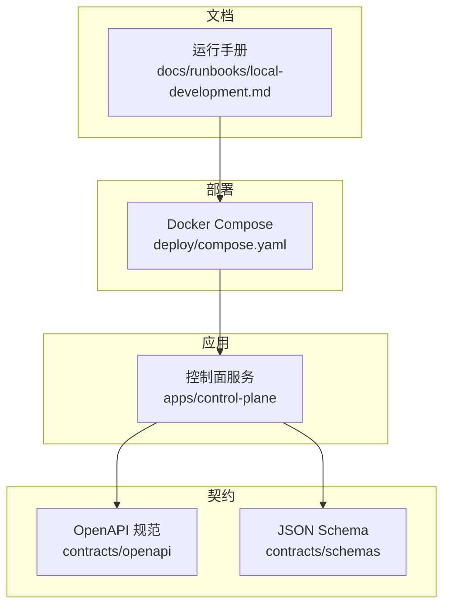
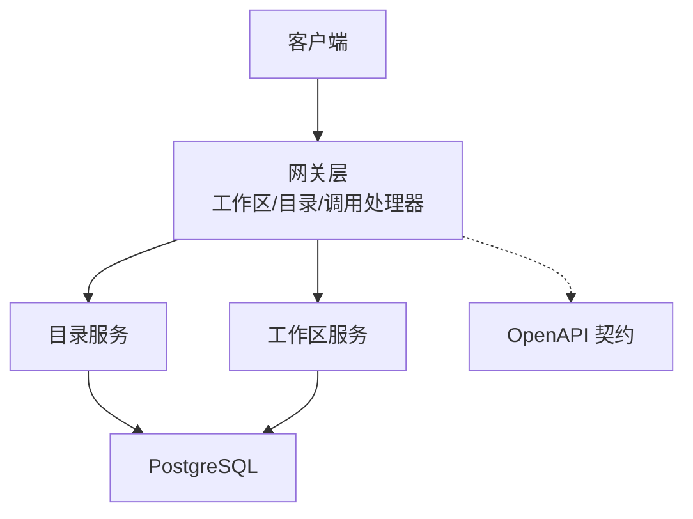
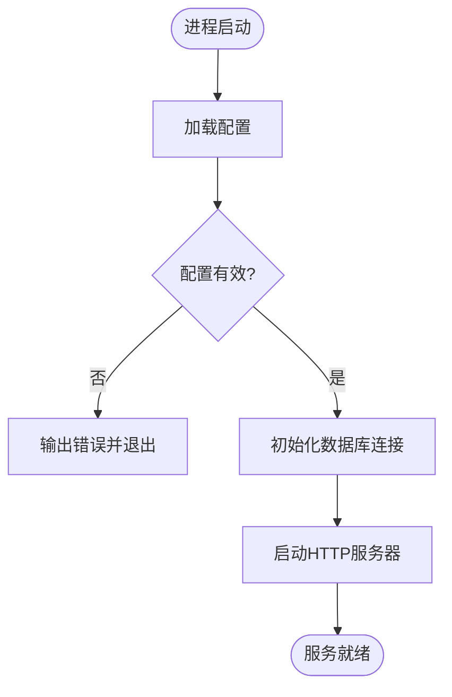
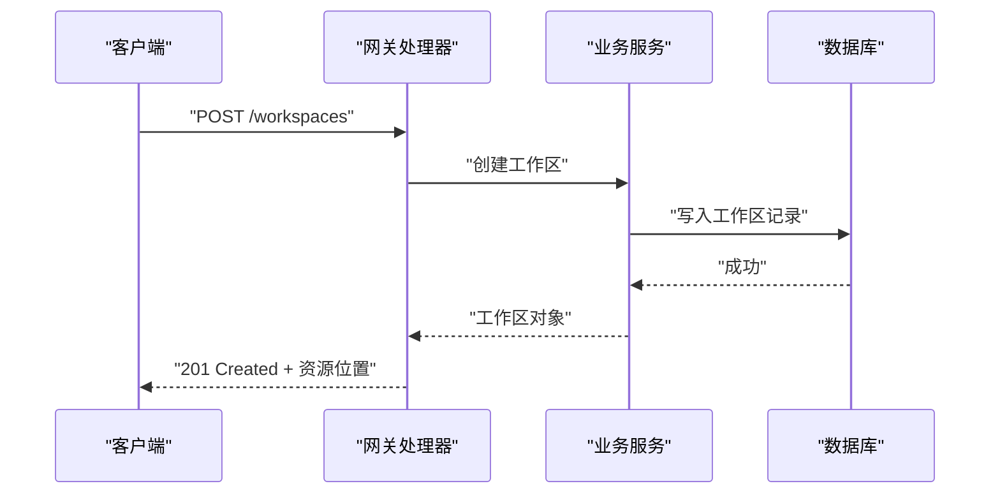
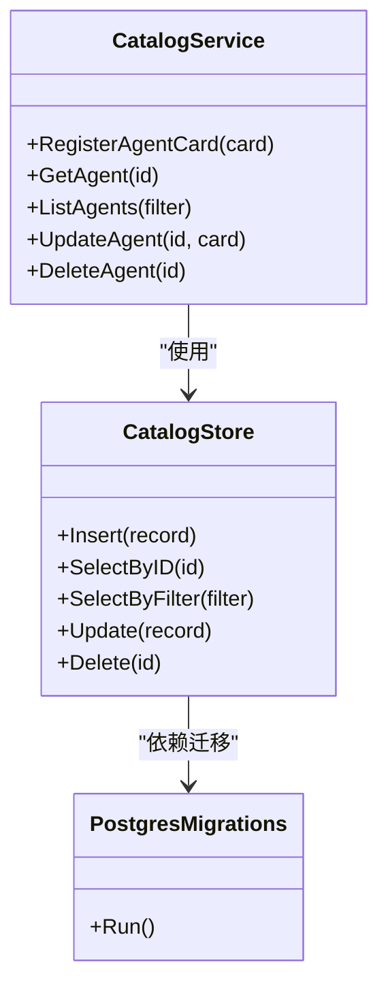
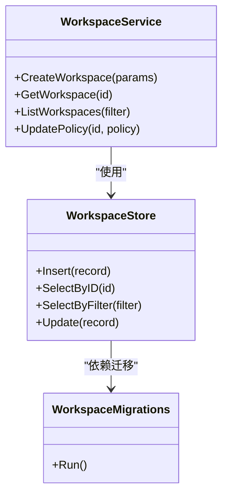
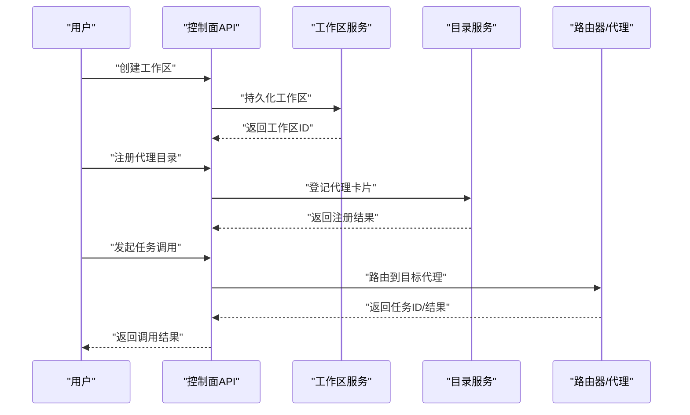
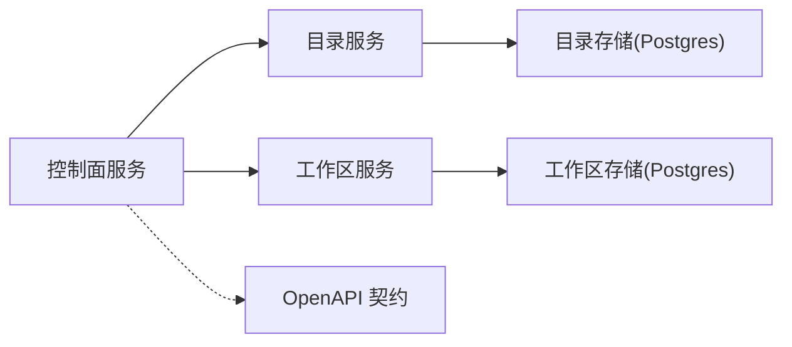

# 快速开始

<cite>
**本文引用的文件**   
- [README.md](file://README.md)
- [compose.yaml](file://deploy/compose.yaml)
- [main.go](file://apps/control-plane/cmd/control-plane/main.go)
- [config.go](file://apps/control-plane/internal/config/config.go)
- [control-plane.v1.yaml](file://contracts/openapi/control-plane.v1.yaml)
- [control-plane.v2.yaml](file://contracts/openapi/control-plane.v2.yaml)
- [control-plane.v3.yaml](file://contracts/openapi/control-plane.v3.yaml)
- [router-agent.v1.yaml](file://contracts/openapi/router-agent.v1.yaml)
- [workspace_handler.go](file://apps/control-plane/internal/gateway/workspace_handler.go)
- [catalog_handler.go](file://apps/control-plane/internal/gateway/catalog_handler.go)
- [invocation_handler.go](file://apps/control-plane/internal/gateway/invocation_handler.go)
- [service.go](file://apps/control-plane/internal/catalog/service.go)
- [store.go](file://apps/control-plane/internal/catalog/store.go)
- [migrations.go](file://apps/control-plane/internal/catalog/postgres/migrations.go)
- [workspace_service.go](file://apps/control-plane/internal/workspace/service.go)
- [workspace_store.go](file://apps/control-plane/internal/workspace/postgres/store.go)
- [workspace_migrations.go](file://apps/control-plane/internal/workspace/postgres/migrations.go)
- [local-development.md](file://docs/runbooks/local-development.md)
</cite>

## 目录
1. [简介](#简介)
2. [项目结构](#项目结构)
3. [核心组件](#核心组件)
4. [架构总览](#架构总览)
5. [详细组件分析](#详细组件分析)
6. [依赖分析](#依赖分析)
7. [性能考虑](#性能考虑)
8. [故障排查指南](#故障排查指南)
9. [结论](#结论)
10. [附录](#附录)

## 简介
本快速开始指南面向首次接触 NeKiro AI Agent 平台的新用户，目标是帮助你在最短时间内完成环境搭建、本地启动与第一个代理的注册和调用。你将通过 Docker Compose 一键拉起控制面服务与数据库，使用 OpenAPI 定义的 API 完成工作区创建、代理目录注册以及任务调用等基础流程。文档同时提供安装验证清单与常见问题排查建议，确保你能够顺利体验平台的核心能力。

## 项目结构
NeKiro 平台采用多模块组织方式：
- 应用层：控制面服务位于 apps/control-plane，包含网关路由、目录管理、工作区管理等内部包。
- 契约层：OpenAPI 规范与 JSON Schema 定义在 contracts 目录，用于描述对外与内部接口。
- 部署配置：Docker Compose 编排文件位于 deploy/compose.yaml，用于一键拉起服务与数据库。
- 运行手册：本地开发相关说明位于 docs/runbooks/local-development.md。

图表来源
- [compose.yaml](file://deploy/compose.yaml)
- [control-plane.v1.yaml](file://contracts/openapi/control-plane.v1.yaml)
- [control-plane.v2.yaml](file://contracts/openapi/control-plane.v2.yaml)
- [control-plane.v3.yaml](file://contracts/openapi/control-plane.v3.yaml)
- [router-agent.v1.yaml](file://contracts/openapi/router-agent.v1.yaml)
- [local-development.md](file://docs/runbooks/local-development.md)

章节来源
- [README.md](file://README.md)
- [compose.yaml](file://deploy/compose.yaml)
- [local-development.md](file://docs/runbooks/local-development.md)

## 核心组件
- 控制面服务（Control Plane）
  - 入口程序：负责初始化配置、启动 HTTP 网关与内部服务。
  - 网关层：暴露工作区、目录、调用等 REST API。
  - 业务层：目录服务与工作区服务分别封装领域逻辑。
  - 数据访问层：PostgreSQL 迁移与存储实现。
- 契约与规范
  - OpenAPI 定义了控制面与路由器之间的接口版本演进。
  - JSON Schema 定义了通用数据结构与错误模型。
- 部署与运行
  - Docker Compose 编排控制面与数据库，支持本地与 CI 环境的一键启动。

章节来源
- [main.go](file://apps/control-plane/cmd/control-plane/main.go)
- [config.go](file://apps/control-plane/internal/config/config.go)
- [workspace_handler.go](file://apps/control-plane/internal/gateway/workspace_handler.go)
- [catalog_handler.go](file://apps/control-plane/internal/gateway/catalog_handler.go)
- [invocation_handler.go](file://apps/control-plane/internal/gateway/invocation_handler.go)
- [service.go](file://apps/control-plane/internal/catalog/service.go)
- [store.go](file://apps/control-plane/internal/catalog/store.go)
- [migrations.go](file://apps/control-plane/internal/catalog/postgres/migrations.go)
- [workspace_service.go](file://apps/control-plane/internal/workspace/service.go)
- [workspace_store.go](file://apps/control-plane/internal/workspace/postgres/store.go)
- [workspace_migrations.go](file://apps/control-plane/internal/workspace/postgres/migrations.go)

## 架构总览
下图展示了控制面服务的整体架构与关键交互路径：外部客户端通过网关访问工作区、目录与调用接口；网关将请求分发到对应服务；服务通过存储层读写 PostgreSQL；OpenAPI 契约约束了对外接口行为。

图表来源
- [workspace_handler.go](file://apps/control-plane/internal/gateway/workspace_handler.go)
- [catalog_handler.go](file://apps/control-plane/internal/gateway/catalog_handler.go)
- [invocation_handler.go](file://apps/control-plane/internal/gateway/invocation_handler.go)
- [service.go](file://apps/control-plane/internal/catalog/service.go)
- [workspace_service.go](file://apps/control-plane/internal/workspace/service.go)
- [control-plane.v1.yaml](file://contracts/openapi/control-plane.v1.yaml)
- [control-plane.v2.yaml](file://contracts/openapi/control-plane.v2.yaml)
- [control-plane.v3.yaml](file://contracts/openapi/control-plane.v3.yaml)

## 详细组件分析

### 控制面服务入口与配置
- 入口职责
  - 加载配置并初始化运行时。
  - 启动 HTTP 服务器与中间件（如鉴权、追踪）。
  - 注册路由与处理器。
- 配置要点
  - 数据库连接参数、端口、日志级别等可通过环境变量或配置文件注入。
  - 配置校验失败时应尽早报错以便快速定位问题。

图表来源
- [main.go](file://apps/control-plane/cmd/control-plane/main.go)
- [config.go](file://apps/control-plane/internal/config/config.go)

章节来源
- [main.go](file://apps/control-plane/cmd/control-plane/main.go)
- [config.go](file://apps/control-plane/internal/config/config.go)

### 网关层与处理器
- 工作区处理器
  - 提供工作区的创建、查询等接口。
  - 典型流程：解析请求 -> 校验参数 -> 调用工作区服务 -> 返回响应。
- 目录处理器
  - 提供代理目录的注册、查询、更新等接口。
  - 典型流程：解析请求 -> 校验参数 -> 调用目录服务 -> 持久化 -> 返回响应。
- 调用处理器
  - 提供任务调度的入口，转发至路由客户端或服务进行执行。
  - 典型流程：解析请求 -> 鉴权与限流 -> 路由选择 -> 异步/同步执行 -> 结果回传。

图表来源
- [workspace_handler.go](file://apps/control-plane/internal/gateway/workspace_handler.go)
- [workspace_service.go](file://apps/control-plane/internal/workspace/service.go)
- [workspace_store.go](file://apps/control-plane/internal/workspace/postgres/store.go)
- [workspace_migrations.go](file://apps/control-plane/internal/workspace/postgres/migrations.go)

章节来源
- [workspace_handler.go](file://apps/control-plane/internal/gateway/workspace_handler.go)
- [catalog_handler.go](file://apps/control-plane/internal/gateway/catalog_handler.go)
- [invocation_handler.go](file://apps/control-plane/internal/gateway/invocation_handler.go)

### 目录服务与存储
- 目录服务
  - 封装代理目录的增删改查与一致性策略。
  - 处理并发写入冲突与幂等性。
- 存储实现
  - 基于 PostgreSQL 的表结构与迁移脚本。
  - 游标分页与索引优化以提升查询性能。

图表来源
- [service.go](file://apps/control-plane/internal/catalog/service.go)
- [store.go](file://apps/control-plane/internal/catalog/store.go)
- [migrations.go](file://apps/control-plane/internal/catalog/postgres/migrations.go)

章节来源
- [service.go](file://apps/control-plane/internal/catalog/service.go)
- [store.go](file://apps/control-plane/internal/catalog/store.go)
- [migrations.go](file://apps/control-plane/internal/catalog/postgres/migrations.go)

### 工作区服务与存储
- 工作区服务
  - 管理工作区生命周期与权限策略。
  - 提供与目录、调用相关的上下文绑定。
- 存储实现
  - 基于 PostgreSQL 的工作区表结构与迁移脚本。
  - 支持按租户隔离的数据访问。

图表来源
- [workspace_service.go](file://apps/control-plane/internal/workspace/service.go)
- [workspace_store.go](file://apps/control-plane/internal/workspace/postgres/store.go)
- [workspace_migrations.go](file://apps/control-plane/internal/workspace/postgres/migrations.go)

章节来源
- [workspace_service.go](file://apps/control-plane/internal/workspace/service.go)
- [workspace_store.go](file://apps/control-plane/internal/workspace/postgres/store.go)
- [workspace_migrations.go](file://apps/control-plane/internal/workspace/postgres/migrations.go)

### 第一个代理的注册与调用示例
以下示例以“工作区创建 -> 代理目录注册 -> 任务调用”为主线，展示基本 API 使用方法。请根据实际 OpenAPI 版本调整路径与字段。

- 步骤一：创建工作区
  - 方法：POST /workspaces
  - 目的：为后续代理与调用提供隔离上下文。
  - 参考契约：[control-plane.v1.yaml](file://contracts/openapi/control-plane.v1.yaml)、[control-plane.v2.yaml](file://contracts/openapi/control-plane.v2.yaml)、[control-plane.v3.yaml](file://contracts/openapi/control-plane.v3.yaml)
- 步骤二：注册代理目录
  - 方法：POST /catalog/agents
  - 目的：将代理卡片信息登记到目录，供路由发现。
  - 参考契约：[control-plane.v1.yaml](file://contracts/openapi/control-plane.v1.yaml)、[control-plane.v2.yaml](file://contracts/openapi/control-plane.v2.yaml)、[control-plane.v3.yaml](file://contracts/openapi/control-plane.v3.yaml)
- 步骤三：调用代理任务
  - 方法：POST /invocations
  - 目的：在工作区内发起一次代理任务调用。
  - 参考契约：[control-plane.v1.yaml](file://contracts/openapi/control-plane.v1.yaml)、[control-plane.v2.yaml](file://contracts/openapi/control-plane.v2.yaml)、[control-plane.v3.yaml](file://contracts/openapi/control-plane.v3.yaml)
- 步骤四：查看任务状态与结果
  - 方法：GET /invocations/{id}
  - 目的：轮询或拉取任务执行结果。
  - 参考契约：[control-plane.v1.yaml](file://contracts/openapi/control-plane.v1.yaml)、[control-plane.v2.yaml](file://contracts/openapi/control-plane.v2.yaml)、[control-plane.v3.yaml](file://contracts/openapi/control-plane.v3.yaml)

图表来源
- [workspace_handler.go](file://apps/control-plane/internal/gateway/workspace_handler.go)
- [catalog_handler.go](file://apps/control-plane/internal/gateway/catalog_handler.go)
- [invocation_handler.go](file://apps/control-plane/internal/gateway/invocation_handler.go)
- [control-plane.v1.yaml](file://contracts/openapi/control-plane.v1.yaml)
- [control-plane.v2.yaml](file://contracts/openapi/control-plane.v2.yaml)
- [control-plane.v3.yaml](file://contracts/openapi/control-plane.v3.yaml)

章节来源
- [workspace_handler.go](file://apps/control-plane/internal/gateway/workspace_handler.go)
- [catalog_handler.go](file://apps/control-plane/internal/gateway/catalog_handler.go)
- [invocation_handler.go](file://apps/control-plane/internal/gateway/invocation_handler.go)
- [control-plane.v1.yaml](file://contracts/openapi/control-plane.v1.yaml)
- [control-plane.v2.yaml](file://contracts/openapi/control-plane.v2.yaml)
- [control-plane.v3.yaml](file://contracts/openapi/control-plane.v3.yaml)

## 依赖分析
- 外部依赖
  - PostgreSQL：作为控制面的主要持久化存储。
  - Docker/Docker Compose：用于容器化部署与本地开发。
- 内部依赖
  - 网关层依赖目录与服务层。
  - 服务层依赖存储层与迁移脚本。
  - 契约层约束各组件间的数据格式与行为。

图表来源
- [service.go](file://apps/control-plane/internal/catalog/service.go)
- [workspace_service.go](file://apps/control-plane/internal/workspace/service.go)
- [control-plane.v1.yaml](file://contracts/openapi/control-plane.v1.yaml)

章节来源
- [compose.yaml](file://deploy/compose.yaml)
- [service.go](file://apps/control-plane/internal/catalog/service.go)
- [workspace_service.go](file://apps/control-plane/internal/workspace/service.go)
- [control-plane.v1.yaml](file://contracts/openapi/control-plane.v1.yaml)

## 性能考虑
- 数据库层面
  - 合理设计索引与分页游标，避免全表扫描。
  - 对高频查询字段建立覆盖索引。
- 服务层面
  - 启用连接池与超时控制，防止资源耗尽。
  - 对写操作进行幂等设计，减少重复提交影响。
- 网络层面
  - 使用压缩与缓存策略降低带宽占用。
  - 对长耗时任务采用异步处理与事件驱动模式。

## 故障排查指南
- 服务无法启动
  - 检查数据库连接参数是否正确，确认端口未被占用。
  - 查看服务日志中的配置校验与初始化错误。
- 数据库迁移失败
  - 确认迁移脚本顺序与兼容性。
  - 检查数据库权限与版本是否满足要求。
- API 返回错误
  - 对照 OpenAPI 契约核对请求体与路径参数。
  - 关注鉴权与权限策略是否生效。
- 调用无响应或超时
  - 检查路由客户端配置与下游代理可用性。
  - 观察调用链追踪信息定位瓶颈。

章节来源
- [main.go](file://apps/control-plane/cmd/control-plane/main.go)
- [config.go](file://apps/control-plane/internal/config/config.go)
- [migrations.go](file://apps/control-plane/internal/catalog/postgres/migrations.go)
- [workspace_migrations.go](file://apps/control-plane/internal/workspace/postgres/migrations.go)
- [invocation_handler.go](file://apps/control-plane/internal/gateway/invocation_handler.go)

## 结论
通过本快速开始指南，你已经完成了 NeKiro AI Agent 平台的本地环境搭建、服务启动与第一个代理的注册与调用。建议结合 OpenAPI 契约与运行手册进一步探索高级功能与最佳实践。若遇到问题，可参考故障排查指南逐步定位与解决。

## 附录

### 系统要求与环境准备
- 操作系统：Linux/macOS/Windows（推荐 Linux 或 macOS）
- 软件依赖：
  - Docker 与 Docker Compose
  - 可选：Go 工具链（仅本地源码编译调试）
- 磁盘与内存：
  - 至少 2GB 可用内存
  - 至少 10GB 可用磁盘空间

### 一键部署与本地启动
- 使用 Docker Compose 拉起平台
  - 进入部署目录并执行编排命令。
  - 等待服务健康检查通过后，即可访问控制面 API。
- 本地开发模式
  - 参考运行手册中的本地开发说明，按需调整配置与端口映射。

章节来源
- [compose.yaml](file://deploy/compose.yaml)
- [local-development.md](file://docs/runbooks/local-development.md)

### 配置文件设置
- 环境变量
  - 数据库连接字符串、端口、日志级别等。
- 配置文件
  - 如需集中管理配置，可在服务启动时指定配置文件路径。

章节来源
- [config.go](file://apps/control-plane/internal/config/config.go)

### 安装验证清单
- 服务健康检查
  - 访问健康端点或根路径，确认返回正常。
- 数据库连通性
  - 使用数据库客户端连接并执行简单查询。
- API 可用性
  - 调用工作区创建接口，确认返回 201 与资源位置。
- 代理注册
  - 调用目录注册接口，确认代理卡片入库。
- 任务调用
  - 发起一次任务调用，确认返回任务 ID 与结果。

### 测试用例建议
- 工作区 CRUD
  - 创建、读取、更新、删除工作区，验证幂等性与一致性。
- 目录管理
  - 注册、查询、更新、删除代理卡片，验证唯一性与冲突处理。
- 任务调用
  - 同步与异步调用，验证超时、重试与错误码。
- 兼容性与契约
  - 使用 OpenAPI 契约进行自动化回归测试。

章节来源
- [workspace_handler.go](file://apps/control-plane/internal/gateway/workspace_handler.go)
- [catalog_handler.go](file://apps/control-plane/internal/gateway/catalog_handler.go)
- [invocation_handler.go](file://apps/control-plane/internal/gateway/invocation_handler.go)
- [control-plane.v1.yaml](file://contracts/openapi/control-plane.v1.yaml)
- [control-plane.v2.yaml](file://contracts/openapi/control-plane.v2.yaml)
- [control-plane.v3.yaml](file://contracts/openapi/control-plane.v3.yaml)