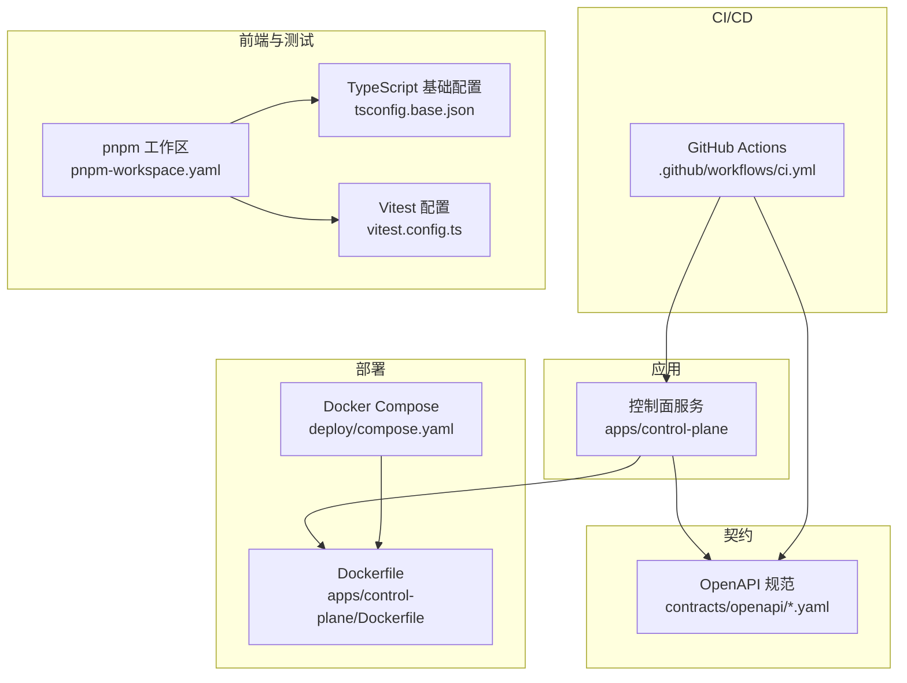
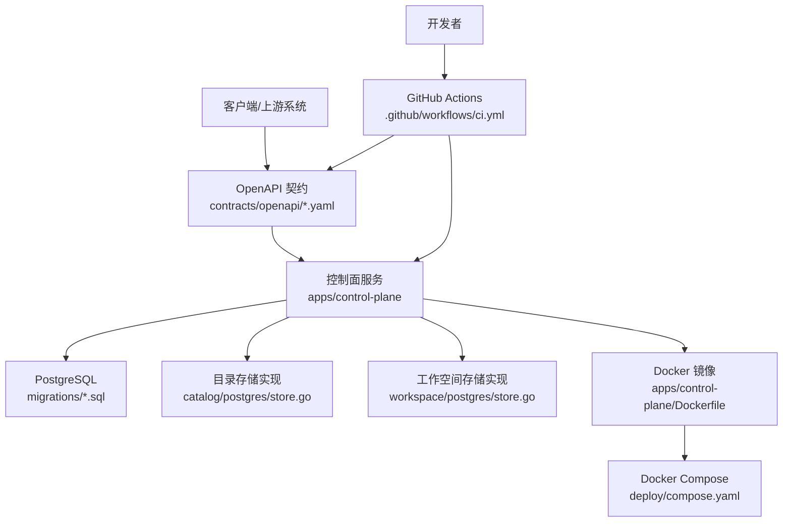
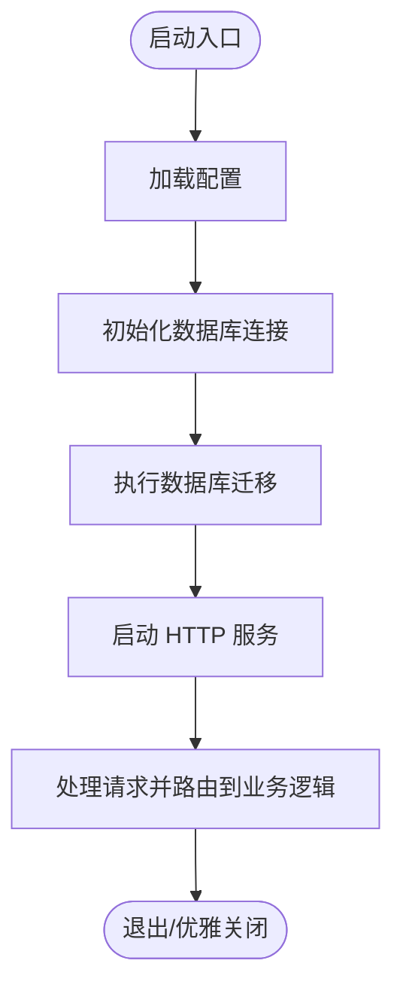
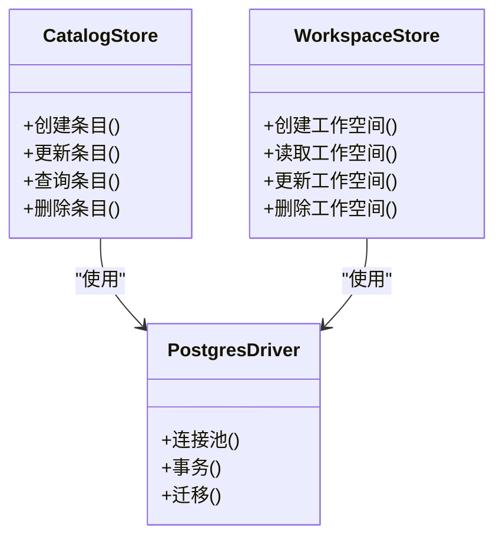
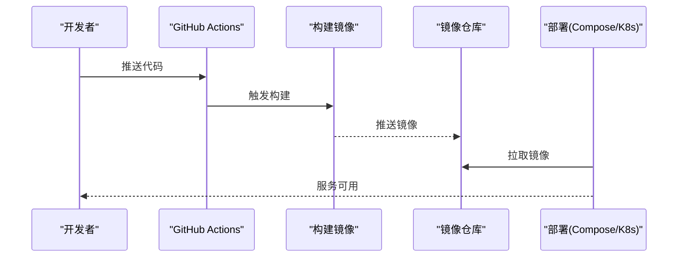
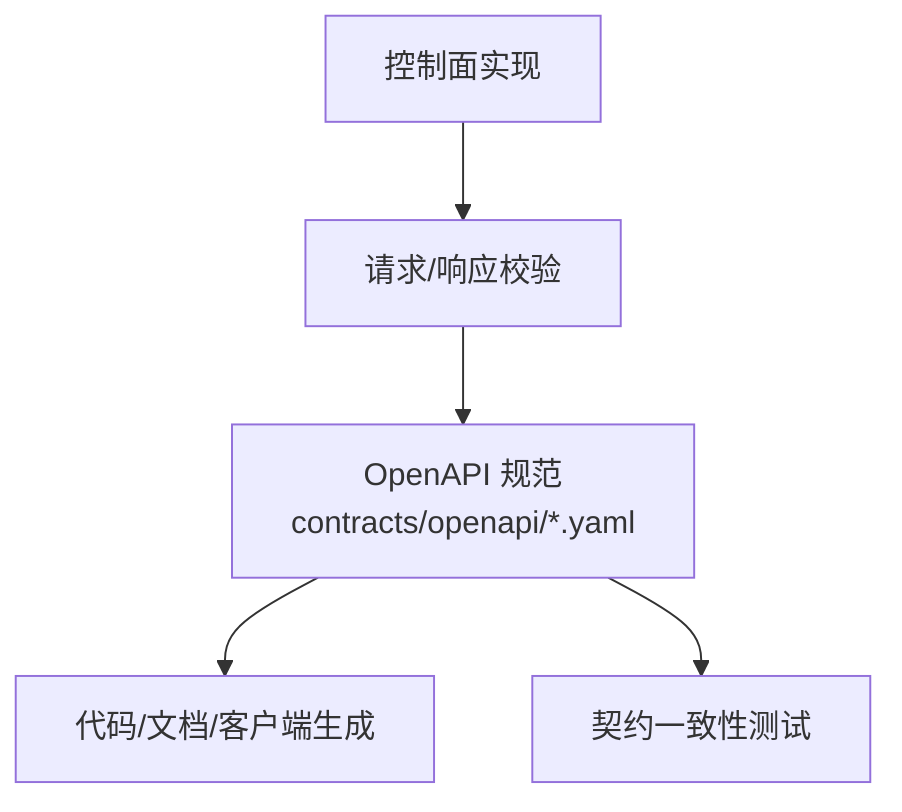
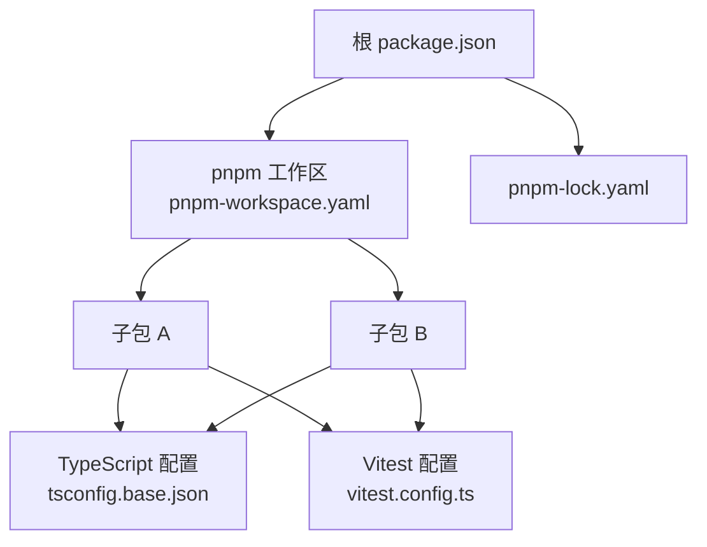
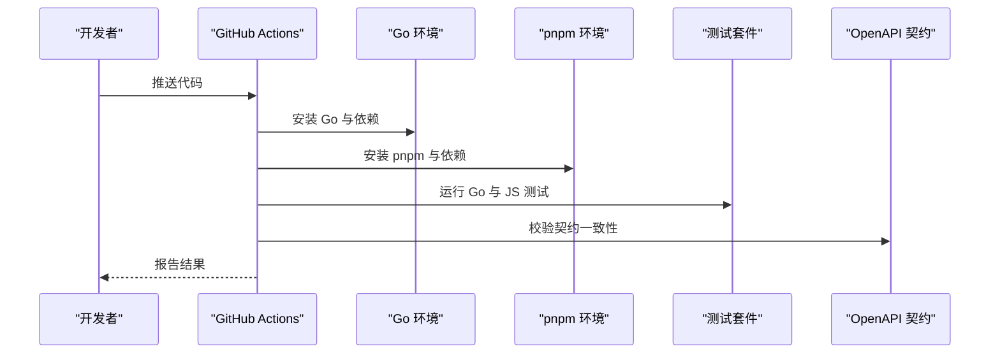
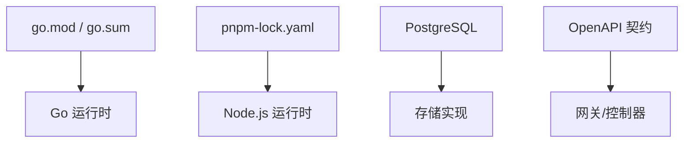

# 技术栈

<cite>
**本文引用的文件**   
- [README.md](file://README.md)
- [go.mod](file://go.mod)
- [package.json](file://package.json)
- [pnpm-workspace.yaml](file://pnpm-workspace.yaml)
- [pnpm-lock.yaml](file://pnpm-lock.yaml)
- [tsconfig.base.json](file://tsconfig.base.json)
- [vitest.config.ts](file://vitest.config.ts)
- [.github/workflows/ci.yml](file://.github/workflows/ci.yml)
- [deploy/compose.yaml](file://deploy/compose.yaml)
- [apps/control-plane/Dockerfile](file://apps/control-plane/Dockerfile)
- [apps/control-plane/cmd/control-plane/main.go](file://apps/control-plane/cmd/control-plane/main.go)
- [contracts/openapi/control-plane.v1.yaml](file://contracts/openapi/control-plane.v1.yaml)
- [contracts/openapi/control-plane.v2.yaml](file://contracts/openapi/control-plane.v2.yaml)
- [contracts/openapi/control-plane.v3.yaml](file://contracts/openapi/control-plane.v3.yaml)
- [contracts/openapi/control-plane-invocation.v4.yaml](file://contracts/openapi/control-plane-invocation.v4.yaml)
- [contracts/openapi/router-agent.v1.yaml](file://contracts/openapi/router-agent.v1.yaml)
- [contracts/openapi/router-internal.v1.yaml](file://contracts/openapi/router-internal.v1.yaml)
- [contracts/openapi/router-internal.v2.yaml](file://contracts/openapi/router-internal.v2.yaml)
- [contracts/openapi/router-internal.v3.yaml](file://contracts/openapi/router-internal.v3.yaml)
- [contracts/openapi/control-plane-internal.v1.yaml](file://contracts/openapi/control-plane-internal.v1.yaml)
- [contracts/openapi/control-plane-internal.v2.yaml](file://contracts/openapi/control-plane-internal.v2.yaml)
- [apps/control-plane/internal/config/config.go](file://apps/control-plane/internal/config/config.go)
- [apps/control-plane/internal/catalog/postgres/store.go](file://apps/control-plane/internal/catalog/postgres/store.go)
- [apps/control-plane/internal/workspace/postgres/store.go](file://apps/control-plane/internal/workspace/postgres/store.go)
- [apps/control-plane/migrations/001_catalog.sql](file://apps/control-plane/migrations/001_catalog.sql)
- [apps/control-plane/migrations/002_card_text.sql](file://apps/control-plane/migrations/002_card_text.sql)
- [apps/control-plane/migrations/003_workspace.sql](file://apps/control-plane/migrations/003_workspace.sql)
- [docs/decisions/0001-go-backend-stack.md](file://docs/decisions/0001-go-backend-stack.md)
- [docs/decisions/0004-catalog-persistence-and-consistency.md](file://docs/decisions/0004-catalog-persistence-and-consistency.md)
</cite>

## 目录
1. [简介](#简介)
2. [项目结构](#项目结构)
3. [核心组件](#核心组件)
4. [架构总览](#架构总览)
5. [详细组件分析](#详细组件分析)
6. [依赖分析](#依赖分析)
7. [性能考虑](#性能考虑)
8. [故障排查指南](#故障排查指南)
9. [结论](#结论)
10. [附录](#附录)

## 简介
本技术栈文档面向 NeKiro AI Agent 平台的开发者与运维人员，系统性梳理后端、数据库、容器化、API 规范、前端工具链、测试框架以及 CI/CD 流水线的选型与配置。重点解释 Go 语言作为后端主语言的原因与版本要求、PostgreSQL 的持久化选择、Docker 与 Compose 的部署方案、OpenAPI 驱动的 API 设计策略，以及 TypeScript + pnpm 的前端工程化与 Vitest 测试框架的使用。同时给出依赖版本管理方式、兼容性矩阵与演进规划，帮助团队在一致的技术基线上高效协作与迭代。

## 项目结构
仓库采用多应用与契约优先的组织方式：
- apps：包含控制面服务（control-plane）等可执行应用
- contracts：集中存放 OpenAPI 规范与协议一致性用例
- deploy：提供 Docker Compose 编排脚本
- .github/workflows：GitHub Actions CI 流水线
- 根级包管理：Go 模块、pnpm 工作区与 TypeScript 基础配置
- docs：决策记录与路线图

图表来源
- [apps/control-plane/Dockerfile](file://apps/control-plane/Dockerfile)
- [deploy/compose.yaml](file://deploy/compose.yaml)
- [.github/workflows/ci.yml](file://.github/workflows/ci.yml)
- [pnpm-workspace.yaml](file://pnpm-workspace.yaml)
- [tsconfig.base.json](file://tsconfig.base.json)
- [vitest.config.ts](file://vitest.config.ts)

章节来源
- [README.md](file://README.md)
- [go.mod](file://go.mod)
- [package.json](file://package.json)
- [pnpm-workspace.yaml](file://pnpm-workspace.yaml)

## 核心组件
- 后端主语言与运行时：Go 语言，通过 go.mod 进行模块与依赖管理；控制面入口位于应用命令目录。
- 数据库：PostgreSQL，使用迁移脚本与存储实现对接数据层。
- 容器化：Dockerfile 定义镜像构建，Compose 编排本地与服务环境。
- API 设计：以 OpenAPI YAML 为单一事实源，覆盖控制面与路由器相关接口。
- 前端工具链：TypeScript 与 pnpm 工作区，统一基础配置与测试框架 Vitest。
- CI/CD：GitHub Actions 驱动自动化构建、测试与校验。

章节来源
- [apps/control-plane/cmd/control-plane/main.go](file://apps/control-plane/cmd/control-plane/main.go)
- [go.mod](file://go.mod)
- [apps/control-plane/internal/catalog/postgres/store.go](file://apps/control-plane/internal/catalog/postgres/store.go)
- [apps/control-plane/internal/workspace/postgres/store.go](file://apps/control-plane/internal/workspace/postgres/store.go)
- [apps/control-plane/migrations/001_catalog.sql](file://apps/control-plane/migrations/001_catalog.sql)
- [apps/control-plane/migrations/002_card_text.sql](file://apps/control-plane/migrations/002_card_text.sql)
- [apps/control-plane/migrations/003_workspace.sql](file://apps/control-plane/migrations/003_workspace.sql)
- [contracts/openapi/control-plane.v1.yaml](file://contracts/openapi/control-plane.v1.yaml)
- [contracts/openapi/control-plane.v2.yaml](file://contracts/openapi/control-plane.v2.yaml)
- [contracts/openapi/control-plane.v3.yaml](file://contracts/openapi/control-plane.v3.yaml)
- [contracts/openapi/control-plane-invocation.v4.yaml](file://contracts/openapi/control-plane-invocation.v4.yaml)
- [contracts/openapi/router-agent.v1.yaml](file://contracts/openapi/router-agent.v1.yaml)
- [contracts/openapi/router-internal.v1.yaml](file://contracts/openapi/router-internal.v1.yaml)
- [contracts/openapi/router-internal.v2.yaml](file://contracts/openapi/router-internal.v2.yaml)
- [contracts/openapi/router-internal.v3.yaml](file://contracts/openapi/router-internal.v3.yaml)
- [contracts/openapi/control-plane-internal.v1.yaml](file://contracts/openapi/control-plane-internal.v1.yaml)
- [contracts/openapi/control-plane-internal.v2.yaml](file://contracts/openapi/control-plane-internal.v2.yaml)
- [pnpm-workspace.yaml](file://pnpm-workspace.yaml)
- [tsconfig.base.json](file://tsconfig.base.json)
- [vitest.config.ts](file://vitest.config.ts)
- [.github/workflows/ci.yml](file://.github/workflows/ci.yml)

## 架构总览
NeKiro 平台采用“契约优先”的 API 设计与分层架构：
- 控制面服务负责目录注册、工作空间生命周期、调用路由与编排
- 数据层基于 PostgreSQL，通过迁移与存储实现保证一致性与可演化性
- 外部与内部 API 均以 OpenAPI 描述，便于生成客户端、校验与文档
- 容器化与编排支持本地与生产环境的快速交付
- CI/CD 保障代码质量与契约一致性

图表来源
- [contracts/openapi/control-plane.v1.yaml](file://contracts/openapi/control-plane.v1.yaml)
- [contracts/openapi/control-plane.v2.yaml](file://contracts/openapi/control-plane.v2.yaml)
- [contracts/openapi/control-plane.v3.yaml](file://contracts/openapi/control-plane.v3.yaml)
- [contracts/openapi/control-plane-invocation.v4.yaml](file://contracts/openapi/control-plane-invocation.v4.yaml)
- [contracts/openapi/router-agent.v1.yaml](file://contracts/openapi/router-agent.v1.yaml)
- [contracts/openapi/router-internal.v1.yaml](file://contracts/openapi/router-internal.v1.yaml)
- [contracts/openapi/router-internal.v2.yaml](file://contracts/openapi/router-internal.v2.yaml)
- [contracts/openapi/router-internal.v3.yaml](file://contracts/openapi/router-internal.v3.yaml)
- [contracts/openapi/control-plane-internal.v1.yaml](file://contracts/openapi/control-plane-internal.v1.yaml)
- [contracts/openapi/control-plane-internal.v2.yaml](file://contracts/openapi/control-plane-internal.v2.yaml)
- [apps/control-plane/cmd/control-plane/main.go](file://apps/control-plane/cmd/control-plane/main.go)
- [apps/control-plane/internal/catalog/postgres/store.go](file://apps/control-plane/internal/catalog/postgres/store.go)
- [apps/control-plane/internal/workspace/postgres/store.go](file://apps/control-plane/internal/workspace/postgres/store.go)
- [apps/control-plane/migrations/001_catalog.sql](file://apps/control-plane/migrations/001_catalog.sql)
- [apps/control-plane/migrations/002_card_text.sql](file://apps/control-plane/migrations/002_card_text.sql)
- [apps/control-plane/migrations/003_workspace.sql](file://apps/control-plane/migrations/003_workspace.sql)
- [apps/control-plane/Dockerfile](file://apps/control-plane/Dockerfile)
- [deploy/compose.yaml](file://deploy/compose.yaml)
- [.github/workflows/ci.yml](file://.github/workflows/ci.yml)

## 详细组件分析

### 后端主语言：Go
- 选型理由与优势
  - 并发模型与高性能网络 I/O 适合高吞吐的网关与控制面场景
  - 静态类型与强编译期检查提升可靠性与可维护性
  - 生态完善（HTTP 框架、数据库驱动、序列化库等）
- 版本与模块管理
  - 通过 go.mod 声明模块路径与依赖版本，配合 go.sum 锁定二进制依赖
  - 建议固定 Go 版本并在 CI 中校验，避免运行环境差异
- 入口与组织
  - 控制面入口位于命令目录，遵循标准库与模块化组织
  - 配置加载与参数解析由配置模块统一管理

图表来源
- [apps/control-plane/cmd/control-plane/main.go](file://apps/control-plane/cmd/control-plane/main.go)
- [apps/control-plane/internal/config/config.go](file://apps/control-plane/internal/config/config.go)
- [apps/control-plane/migrations/001_catalog.sql](file://apps/control-plane/migrations/001_catalog.sql)
- [apps/control-plane/migrations/002_card_text.sql](file://apps/control-plane/migrations/002_card_text.sql)
- [apps/control-plane/migrations/003_workspace.sql](file://apps/control-plane/migrations/003_workspace.sql)

章节来源
- [go.mod](file://go.mod)
- [apps/control-plane/cmd/control-plane/main.go](file://apps/control-plane/cmd/control-plane/main.go)
- [apps/control-plane/internal/config/config.go](file://apps/control-plane/internal/config/config.go)
- [docs/decisions/0001-go-backend-stack.md](file://docs/decisions/0001-go-backend-stack.md)

### 数据库：PostgreSQL
- 选型理由
  - ACID 事务与强一致性满足目录与工作空间的可靠性需求
  - 成熟的迁移与索引优化能力，利于长期演进
- 迁移与存储
  - 使用 SQL 迁移脚本管理 schema 演进
  - 存储实现封装具体查询与事务边界，向上暴露领域接口
- 一致性策略
  - 结合决策文档明确目录持久化与一致性边界

图表来源
- [apps/control-plane/internal/catalog/postgres/store.go](file://apps/control-plane/internal/catalog/postgres/store.go)
- [apps/control-plane/internal/workspace/postgres/store.go](file://apps/control-plane/internal/workspace/postgres/store.go)
- [apps/control-plane/migrations/001_catalog.sql](file://apps/control-plane/migrations/001_catalog.sql)
- [apps/control-plane/migrations/002_card_text.sql](file://apps/control-plane/migrations/002_card_text.sql)
- [apps/control-plane/migrations/003_workspace.sql](file://apps/control-plane/migrations/003_workspace.sql)
- [docs/decisions/0004-catalog-persistence-and-consistency.md](file://docs/decisions/0004-catalog-persistence-and-consistency.md)

章节来源
- [apps/control-plane/internal/catalog/postgres/store.go](file://apps/control-plane/internal/catalog/postgres/store.go)
- [apps/control-plane/internal/workspace/postgres/store.go](file://apps/control-plane/internal/workspace/postgres/store.go)
- [apps/control-plane/migrations/001_catalog.sql](file://apps/control-plane/migrations/001_catalog.sql)
- [apps/control-plane/migrations/002_card_text.sql](file://apps/control-plane/migrations/002_card_text.sql)
- [apps/control-plane/migrations/003_workspace.sql](file://apps/control-plane/migrations/003_workspace.sql)
- [docs/decisions/0004-catalog-persistence-and-consistency.md](file://docs/decisions/0004-catalog-persistence-and-consistency.md)

### 容器化与部署：Docker + Compose
- Dockerfile 定义控制面镜像构建步骤，确保可重复构建与最小化镜像体积
- Compose 编排本地开发与服务依赖（如数据库），简化联调与演示
- 建议在生产环境引入镜像签名、安全扫描与滚动升级策略

图表来源
- [apps/control-plane/Dockerfile](file://apps/control-plane/Dockerfile)
- [deploy/compose.yaml](file://deploy/compose.yaml)
- [.github/workflows/ci.yml](file://.github/workflows/ci.yml)

章节来源
- [apps/control-plane/Dockerfile](file://apps/control-plane/Dockerfile)
- [deploy/compose.yaml](file://deploy/compose.yaml)

### API 设计：OpenAPI 规范驱动
- 契约优先：所有对外与对内接口均以 OpenAPI YAML 描述，作为唯一事实源
- 版本化：按语义化版本管理不同阶段的 API 契约，兼容旧版本的同时推进演进
- 一致性：通过契约测试与合规用例确保实现与规范一致
- 主要契约范围
  - 控制面公开 API（v1/v2/v3）
  - 控制面内部 API（v1/v2）
  - 调用相关 API（invocation v4）
  - 路由器相关 API（router-agent v1，router-internal v1/v2/v3）

图表来源
- [contracts/openapi/control-plane.v1.yaml](file://contracts/openapi/control-plane.v1.yaml)
- [contracts/openapi/control-plane.v2.yaml](file://contracts/openapi/control-plane.v2.yaml)
- [contracts/openapi/control-plane.v3.yaml](file://contracts/openapi/control-plane.v3.yaml)
- [contracts/openapi/control-plane-invocation.v4.yaml](file://contracts/openapi/control-plane-invocation.v4.yaml)
- [contracts/openapi/router-agent.v1.yaml](file://contracts/openapi/router-agent.v1.yaml)
- [contracts/openapi/router-internal.v1.yaml](file://contracts/openapi/router-internal.v1.yaml)
- [contracts/openapi/router-internal.v2.yaml](file://contracts/openapi/router-internal.v2.yaml)
- [contracts/openapi/router-internal.v3.yaml](file://contracts/openapi/router-internal.v3.yaml)
- [contracts/openapi/control-plane-internal.v1.yaml](file://contracts/openapi/control-plane-internal.v1.yaml)
- [contracts/openapi/control-plane-internal.v2.yaml](file://contracts/openapi/control-plane-internal.v2.yaml)

章节来源
- [contracts/openapi/control-plane.v1.yaml](file://contracts/openapi/control-plane.v1.yaml)
- [contracts/openapi/control-plane.v2.yaml](file://contracts/openapi/control-plane.v2.yaml)
- [contracts/openapi/control-plane.v3.yaml](file://contracts/openapi/control-plane.v3.yaml)
- [contracts/openapi/control-plane-invocation.v4.yaml](file://contracts/openapi/control-plane-invocation.v4.yaml)
- [contracts/openapi/router-agent.v1.yaml](file://contracts/openapi/router-agent.v1.yaml)
- [contracts/openapi/router-internal.v1.yaml](file://contracts/openapi/router-internal.v1.yaml)
- [contracts/openapi/router-internal.v2.yaml](file://contracts/openapi/router-internal.v2.yaml)
- [contracts/openapi/router-internal.v3.yaml](file://contracts/openapi/router-internal.v3.yaml)
- [contracts/openapi/control-plane-internal.v1.yaml](file://contracts/openapi/control-plane-internal.v1.yaml)
- [contracts/openapi/control-plane-internal.v2.yaml](file://contracts/openapi/control-plane-internal.v2.yaml)

### 前端工具链：TypeScript + pnpm
- pnpm 工作区：统一依赖安装与版本管理，提升多包协作效率
- TypeScript 基础配置：共享 tsconfig 保证跨包类型一致
- 测试框架：Vitest 提供快速单元测试与集成测试体验
- 锁文件：pnpm-lock.yaml 锁定依赖树，确保可重现构建

图表来源
- [package.json](file://package.json)
- [pnpm-workspace.yaml](file://pnpm-workspace.yaml)
- [tsconfig.base.json](file://tsconfig.base.json)
- [vitest.config.ts](file://vitest.config.ts)
- [pnpm-lock.yaml](file://pnpm-lock.yaml)

章节来源
- [package.json](file://package.json)
- [pnpm-workspace.yaml](file://pnpm-workspace.yaml)
- [tsconfig.base.json](file://tsconfig.base.json)
- [vitest.config.ts](file://vitest.config.ts)
- [pnpm-lock.yaml](file://pnpm-lock.yaml)

### 测试框架：Vitest
- 特点：与 TypeScript 原生友好、速度快、插件生态丰富
- 适用场景：单元测试、契约验证、端到端辅助测试
- 配置：通过 vitest.config.ts 统一测试行为与覆盖率收集

章节来源
- [vitest.config.ts](file://vitest.config.ts)

### CI/CD：GitHub Actions
- 作用：在每次提交或合并时自动执行构建、测试、契约校验与镜像构建
- 关键流程：
  - 设置 Go 与 Node/pnpm 环境
  - 安装依赖并运行测试
  - 校验 OpenAPI 契约与一致性用例
  - 构建并推送镜像（可选）
- 建议：缓存依赖、并行任务、失败告警与安全扫描

图表来源
- [.github/workflows/ci.yml](file://.github/workflows/ci.yml)
- [go.mod](file://go.mod)
- [pnpm-workspace.yaml](file://pnpm-workspace.yaml)
- [contracts/openapi/control-plane.v1.yaml](file://contracts/openapi/control-plane.v1.yaml)

章节来源
- [.github/workflows/ci.yml](file://.github/workflows/ci.yml)

## 依赖分析
- Go 依赖
  - 通过 go.mod 与 go.sum 管理模块与二进制依赖，建议在 CI 中校验 go.mod 未变更且 go.sum 一致
- JavaScript/TypeScript 依赖
  - 使用 pnpm 工作区与 pnpm-lock.yaml 锁定依赖树，确保可重现构建
- 兼容性矩阵（示例）
  - Go 版本：与 go.mod 中指定版本保持一致
  - Node.js 版本：与 pnpm 工作区要求的引擎版本保持一致
  - PostgreSQL 版本：与迁移脚本与驱动兼容性保持一致
- 外部依赖风险
  - 定期审计第三方依赖漏洞与许可证
  - 对关键依赖进行最小版本约束与升级回归测试

图表来源
- [go.mod](file://go.mod)
- [pnpm-lock.yaml](file://pnpm-lock.yaml)
- [apps/control-plane/internal/catalog/postgres/store.go](file://apps/control-plane/internal/catalog/postgres/store.go)
- [apps/control-plane/internal/workspace/postgres/store.go](file://apps/control-plane/internal/workspace/postgres/store.go)
- [contracts/openapi/control-plane.v1.yaml](file://contracts/openapi/control-plane.v1.yaml)

章节来源
- [go.mod](file://go.mod)
- [pnpm-lock.yaml](file://pnpm-lock.yaml)

## 性能考虑
- Go 运行时
  - 合理设置 GOMAXPROCS 与连接池大小，避免资源争用
  - 使用对象池与零拷贝减少 GC 压力
- 数据库
  - 针对高频查询建立合适索引，避免全表扫描
  - 使用事务边界与批量操作降低往返开销
- 网络与序列化
  - 启用 HTTP/2 与连接复用
  - 选择合适的序列化格式（JSON/Protobuf）并按需压缩
- 容器与编排
  - 限制 CPU/内存配额，避免抖动
  - 使用健康检查与就绪探针提升可用性

[本节为通用指导，不直接分析具体文件]

## 故障排查指南
- 启动失败
  - 检查环境变量与配置文件是否完整
  - 确认数据库连接与迁移状态
- 契约不一致
  - 对比 OpenAPI 规范与实际响应，定位字段缺失或类型不符
  - 运行契约一致性测试用例，复现问题
- 性能退化
  - 查看慢查询日志与索引命中情况
  - 监控 Go 运行时指标（GC、goroutine、阻塞）
- 容器问题
  - 检查镜像构建日志与端口映射
  - 使用 Compose 日志定位依赖服务异常

章节来源
- [apps/control-plane/internal/config/config.go](file://apps/control-plane/internal/config/config.go)
- [apps/control-plane/migrations/001_catalog.sql](file://apps/control-plane/migrations/001_catalog.sql)
- [apps/control-plane/migrations/002_card_text.sql](file://apps/control-plane/migrations/002_card_text.sql)
- [apps/control-plane/migrations/003_workspace.sql](file://apps/control-plane/migrations/003_workspace.sql)
- [contracts/openapi/control-plane.v1.yaml](file://contracts/openapi/control-plane.v1.yaml)

## 结论
NeKiro 平台以 Go 为核心后端语言，结合 PostgreSQL 的强一致性与成熟生态，构建了高可靠的控制面服务。通过 OpenAPI 契约优先的设计与 GitHub Actions 的自动化流水线，实现了从开发到部署的一致性与可追溯性。前端工具链采用 TypeScript 与 pnpm，配合 Vitest 测试框架，提升了整体工程效率。未来可在以下方向持续演进：
- 强化契约治理与自动化生成
- 引入更细粒度的可观测性与性能基准
- 扩展多环境编排与灰度发布策略
- 持续评估与升级依赖版本，保持安全与性能平衡

[本节为总结性内容，不直接分析具体文件]

## 附录
- 术语
  - 控制面：负责目录、工作空间与调用编排的核心服务
  - 契约：OpenAPI 规范与一致性用例
  - 迁移：数据库 schema 的版本化管理脚本
- 参考
  - 决策记录：后端栈与持久化一致性策略
  - 部署说明：本地开发与运行手册

章节来源
- [docs/decisions/0001-go-backend-stack.md](file://docs/decisions/0001-go-backend-stack.md)
- [docs/decisions/0004-catalog-persistence-and-consistency.md](file://docs/decisions/0004-catalog-persistence-and-consistency.md)