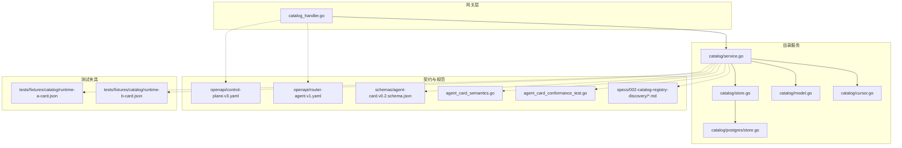
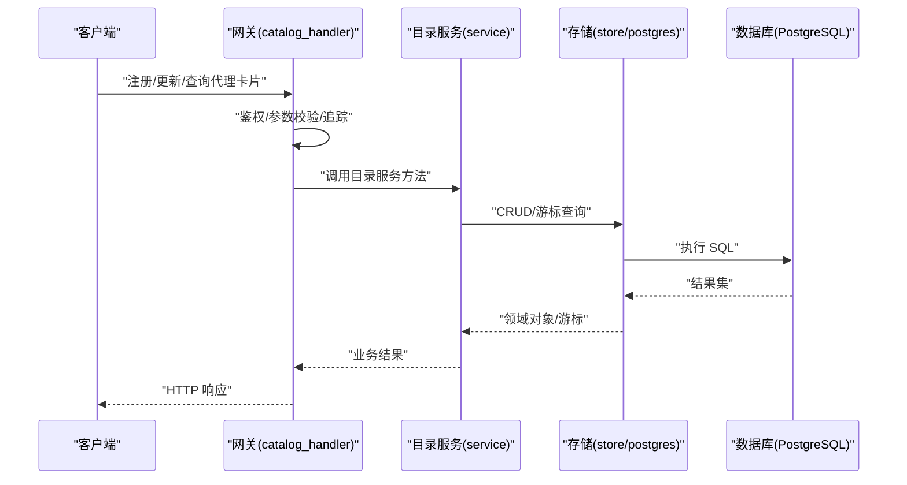
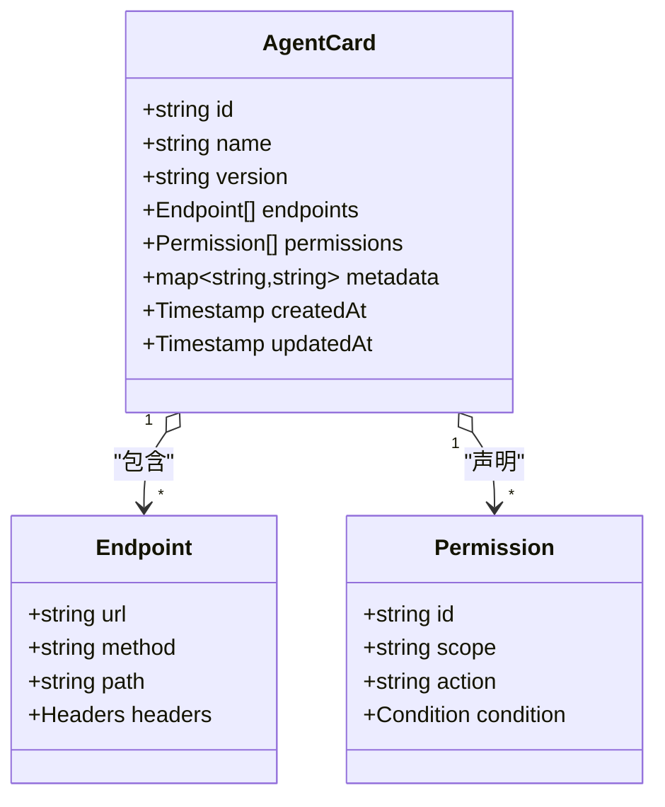
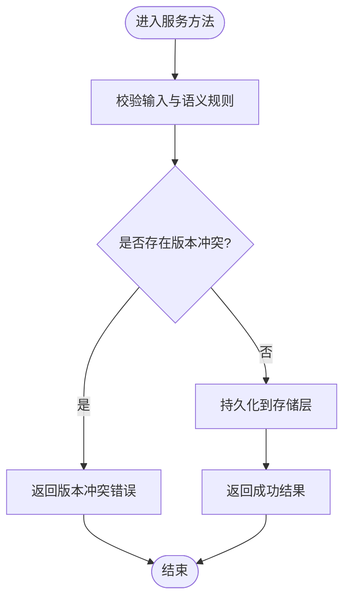
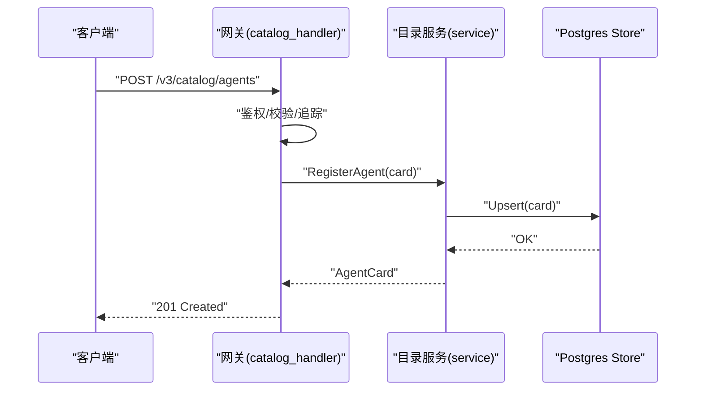
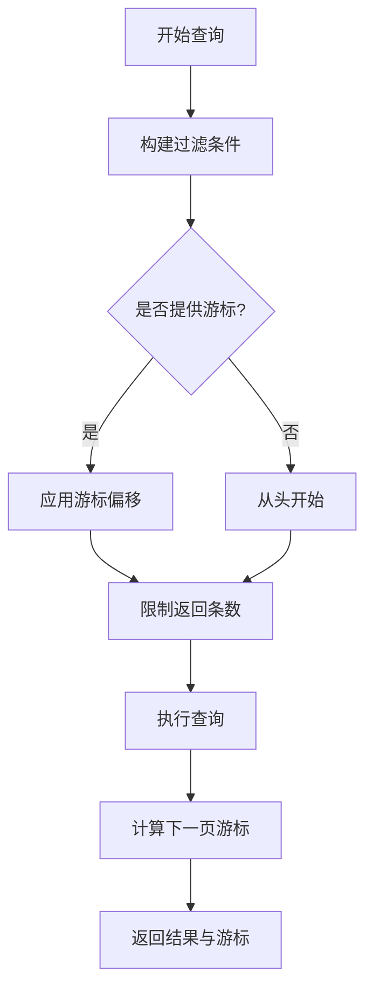
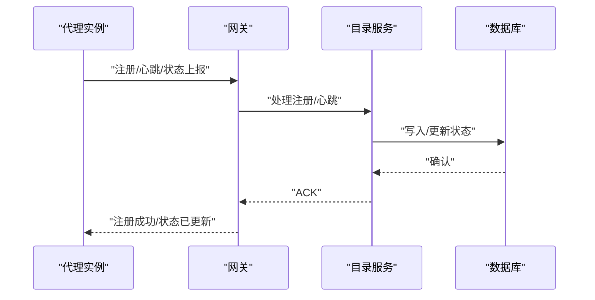
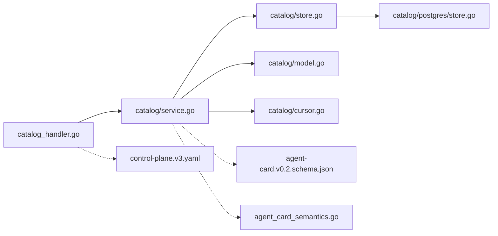

# 代理管理

<cite>
**本文引用的文件**   
- [apps/control-plane/internal/catalog/service.go](file://apps/control-plane/internal/catalog/service.go)
- [apps/control-plane/internal/catalog/store.go](file://apps/control-plane/internal/catalog/store.go)
- [apps/control-plane/internal/catalog/model.go](file://apps/control-plane/internal/catalog/model.go)
- [apps/control-plane/internal/catalog/cursor.go](file://apps/control-plane/internal/catalog/cursor.go)
- [apps/control-plane/internal/catalog/postgres/store.go](file://apps/control-plane/internal/catalog/postgres/store.go)
- [apps/control-plane/internal/gateway/catalog_handler.go](file://apps/control-plane/internal/gateway/catalog_handler.go)
- [contracts/agent_card_semantics.go](file://contracts/agent_card_semantics.go)
- [contracts/agent_card_conformance_test.go](file://contracts/agent_card_conformance_test.go)
- [contracts/schemas/agent-card.v0.2.schema.json](file://contracts/schemas/agent-card.v0.2.schema.json)
- [contracts/openapi/router-agent.v1.yaml](file://contracts/openapi/router-agent.v1.yaml)
- [contracts/openapi/control-plane.v3.yaml](file://contracts/openapi/control-plane.v3.yaml)
- [specs/002-catalog-registry-discovery/spec.md](file://specs/002-catalog-registry-discovery/spec.md)
- [specs/002-catalog-registry-discovery/data-model.md](file://specs/002-catalog-registry-discovery/data-model.md)
- [specs/002-catalog-registry-discovery/contracts/catalog-api.md](file://specs/002-catalog-registry-discovery/contracts/catalog-api.md)
- [tests/fixtures/catalog/runtime-a-card.json](file://tests/fixtures/catalog/runtime-a-card.json)
- [tests/fixtures/catalog/runtime-b-card.json](file://tests/fixtures/catalog/runtime-b-card.json)
</cite>

## 目录
1. [简介](#简介)
2. [项目结构](#项目结构)
3. [核心组件](#核心组件)
4. [架构总览](#架构总览)
5. [详细组件分析](#详细组件分析)
6. [依赖关系分析](#依赖关系分析)
7. [性能考虑](#性能考虑)
8. [故障排查指南](#故障排查指南)
9. [结论](#结论)
10. [附录](#附录)

## 简介
本文件面向 NeKiro 平台的“代理管理”能力，围绕代理注册、发现、版本管理与生命周期管理进行系统化说明。重点覆盖：
- 代理卡片（Agent Card）的结构定义、元数据存储与查询接口
- 代理注册流程、动态发现机制、健康检查策略与故障恢复
- 与目录服务（Catalog）的交互模式、缓存策略与一致性保证
- 权限控制、安全验证与审计日志记录
- 典型 API 调用示例（注册新代理、查询可用代理、处理状态变更）

## 项目结构
与代理管理相关的代码主要分布在以下模块：
- 网关层：HTTP 路由与请求处理（catalog_handler）
- 目录服务：业务逻辑与持久化（service、store、postgres store）
- 契约与规范：OpenAPI、JSON Schema、语义规则与测试用例
- 规格文档：目录注册与发现的总体设计、数据模型与 API 约定

图表来源
- [apps/control-plane/internal/gateway/catalog_handler.go](file://apps/control-plane/internal/gateway/catalog_handler.go)
- [apps/control-plane/internal/catalog/service.go](file://apps/control-plane/internal/catalog/service.go)
- [apps/control-plane/internal/catalog/store.go](file://apps/control-plane/internal/catalog/store.go)
- [apps/control-plane/internal/catalog/postgres/store.go](file://apps/control-plane/internal/catalog/postgres/store.go)
- [apps/control-plane/internal/catalog/model.go](file://apps/control-plane/internal/catalog/model.go)
- [apps/control-plane/internal/catalog/cursor.go](file://apps/control-plane/internal/catalog/cursor.go)
- [contracts/openapi/control-plane.v3.yaml](file://contracts/openapi/control-plane.v3.yaml)
- [contracts/openapi/router-agent.v1.yaml](file://contracts/openapi/router-agent.v1.yaml)
- [contracts/schemas/agent-card.v0.2.schema.json](file://contracts/schemas/agent-card.v0.2.schema.json)
- [contracts/agent_card_semantics.go](file://contracts/agent_card_semantics.go)
- [contracts/agent_card_conformance_test.go](file://contracts/agent_card_conformance_test.go)
- [specs/002-catalog-registry-discovery/spec.md](file://specs/002-catalog-registry-discovery/spec.md)
- [tests/fixtures/catalog/runtime-a-card.json](file://tests/fixtures/catalog/runtime-a-card.json)
- [tests/fixtures/catalog/runtime-b-card.json](file://tests/fixtures/catalog/runtime-b-card.json)

章节来源
- [apps/control-plane/internal/gateway/catalog_handler.go](file://apps/control-plane/internal/gateway/catalog_handler.go)
- [apps/control-plane/internal/catalog/service.go](file://apps/control-plane/internal/catalog/service.go)
- [apps/control-plane/internal/catalog/store.go](file://apps/control-plane/internal/catalog/store.go)
- [apps/control-plane/internal/catalog/postgres/store.go](file://apps/control-plane/internal/catalog/postgres/store.go)
- [apps/control-plane/internal/catalog/model.go](file://apps/control-plane/internal/catalog/model.go)
- [apps/control-plane/internal/catalog/cursor.go](file://apps/control-plane/internal/catalog/cursor.go)
- [contracts/openapi/control-plane.v3.yaml](file://contracts/openapi/control-plane.v3.yaml)
- [contracts/openapi/router-agent.v1.yaml](file://contracts/openapi/router-agent.v1.yaml)
- [contracts/schemas/agent-card.v0.2.schema.json](file://contracts/schemas/agent-card.v0.2.schema.json)
- [contracts/agent_card_semantics.go](file://contracts/agent_card_semantics.go)
- [contracts/agent_card_conformance_test.go](file://contracts/agent_card_conformance_test.go)
- [specs/002-catalog-registry-discovery/spec.md](file://specs/002-catalog-registry-discovery/spec.md)
- [tests/fixtures/catalog/runtime-a-card.json](file://tests/fixtures/catalog/runtime-a-card.json)
- [tests/fixtures/catalog/runtime-b-card.json](file://tests/fixtures/catalog/runtime-b-card.json)

## 核心组件
- 网关处理器（catalog_handler）
  - 职责：接收外部 HTTP 请求，校验参数与鉴权，转发至目录服务；返回统一响应格式。
  - 关键点：输入校验、错误映射、限流与追踪上下文透传。
- 目录服务（catalog service）
  - 职责：实现代理注册、更新、删除、查询、分页游标等核心业务；协调存储层与校验器。
  - 关键点：事务边界、幂等性、版本冲突处理、游标分页。
- 存储抽象与实现（store / postgres store）
  - 职责：提供统一的 CRUD 与游标查询接口；PostgreSQL 具体实现负责迁移与索引优化。
  - 关键点：并发写保护、唯一约束、软删除或硬删除策略、游标编码解码。
- 数据模型与游标（model / cursor）
  - 职责：定义代理卡片的领域模型、字段含义与约束；游标用于高效分页。
  - 关键点：时间戳排序、复合键、游标安全性。
- 契约与规范（OpenAPI、Schema、语义规则）
  - 职责：定义对外 API、代理卡片结构与语义规则；提供一致性测试夹具。
  - 关键点：向后兼容、版本演进、合规性断言。

章节来源
- [apps/control-plane/internal/gateway/catalog_handler.go](file://apps/control-plane/internal/gateway/catalog_handler.go)
- [apps/control-plane/internal/catalog/service.go](file://apps/control-plane/internal/catalog/service.go)
- [apps/control-plane/internal/catalog/store.go](file://apps/control-plane/internal/catalog/store.go)
- [apps/control-plane/internal/catalog/postgres/store.go](file://apps/control-plane/internal/catalog/postgres/store.go)
- [apps/control-plane/internal/catalog/model.go](file://apps/control-plane/internal/catalog/model.go)
- [apps/control-plane/internal/catalog/cursor.go](file://apps/control-plane/internal/catalog/cursor.go)
- [contracts/openapi/control-plane.v3.yaml](file://contracts/openapi/control-plane.v3.yaml)
- [contracts/openapi/router-agent.v1.yaml](file://contracts/openapi/router-agent.v1.yaml)
- [contracts/schemas/agent-card.v0.2.schema.json](file://contracts/schemas/agent-card.v0.2.schema.json)
- [contracts/agent_card_semantics.go](file://contracts/agent_card_semantics.go)
- [contracts/agent_card_conformance_test.go](file://contracts/agent_card_conformance_test.go)

## 架构总览
NeKiro 的代理管理采用“网关 + 目录服务 + 持久化”的分层架构。外部客户端通过网关访问目录服务，目录服务基于数据库维护代理卡片集合，并提供查询与变更能力。

图表来源
- [apps/control-plane/internal/gateway/catalog_handler.go](file://apps/control-plane/internal/gateway/catalog_handler.go)
- [apps/control-plane/internal/catalog/service.go](file://apps/control-plane/internal/catalog/service.go)
- [apps/control-plane/internal/catalog/store.go](file://apps/control-plane/internal/catalog/store.go)
- [apps/control-plane/internal/catalog/postgres/store.go](file://apps/control-plane/internal/catalog/postgres/store.go)

## 详细组件分析

### 代理卡片（Agent Card）数据模型与语义
- 结构定义
  - 以 JSON Schema 描述，包含标识、名称、版本、端点、能力、权限、元数据等字段。
  - 语义规则由语义校验器与一致性测试共同保障。
- 元数据存储
  - 在数据库中持久化卡片主信息与扩展元数据，支持按标签、版本、能力筛选。
- 查询接口
  - 提供按条件过滤、游标分页、版本选择等查询能力。

图表来源
- [contracts/schemas/agent-card.v0.2.schema.json](file://contracts/schemas/agent-card.v0.2.schema.json)
- [contracts/agent_card_semantics.go](file://contracts/agent_card_semantics.go)
- [contracts/agent_card_conformance_test.go](file://contracts/agent_card_conformance_test.go)

章节来源
- [contracts/schemas/agent-card.v0.2.schema.json](file://contracts/schemas/agent-card.v0.2.schema.json)
- [contracts/agent_card_semantics.go](file://contracts/agent_card_semantics.go)
- [contracts/agent_card_conformance_test.go](file://contracts/agent_card_conformance_test.go)
- [tests/fixtures/catalog/runtime-a-card.json](file://tests/fixtures/catalog/runtime-a-card.json)
- [tests/fixtures/catalog/runtime-b-card.json](file://tests/fixtures/catalog/runtime-b-card.json)

### 目录服务与存储层
- 目录服务（service）
  - 暴露注册、更新、删除、查询、游标分页等方法。
  - 负责业务校验（如卡片语义、版本策略）、事务编排与错误转换。
- 存储抽象（store）
  - 定义统一的接口：保存卡片、按条件查询、游标翻页、按 ID 获取等。
- PostgreSQL 实现（postgres store）
  - 使用迁移脚本创建表与索引；利用唯一约束避免重复注册；游标基于时间戳+ID 排序。

图表来源
- [apps/control-plane/internal/catalog/service.go](file://apps/control-plane/internal/catalog/service.go)
- [apps/control-plane/internal/catalog/store.go](file://apps/control-plane/internal/catalog/store.go)
- [apps/control-plane/internal/catalog/postgres/store.go](file://apps/control-plane/internal/catalog/postgres/store.go)

章节来源
- [apps/control-plane/internal/catalog/service.go](file://apps/control-plane/internal/catalog/service.go)
- [apps/control-plane/internal/catalog/store.go](file://apps/control-plane/internal/catalog/store.go)
- [apps/control-plane/internal/catalog/postgres/store.go](file://apps/control-plane/internal/catalog/postgres/store.go)

### 网关层与 API 契约
- 网关处理器
  - 解析请求体、校验必填字段、注入追踪上下文、调用目录服务并返回标准化响应。
- OpenAPI 契约
  - control-plane.v3.yaml 定义控制面 API（注册、查询、更新、删除）。
  - router-agent.v1.yaml 定义路由器侧对代理的访问协议（可选，视部署拓扑而定）。

图表来源
- [apps/control-plane/internal/gateway/catalog_handler.go](file://apps/control-plane/internal/gateway/catalog_handler.go)
- [apps/control-plane/internal/catalog/service.go](file://apps/control-plane/internal/catalog/service.go)
- [apps/control-plane/internal/catalog/postgres/store.go](file://apps/control-plane/internal/catalog/postgres/store.go)
- [contracts/openapi/control-plane.v3.yaml](file://contracts/openapi/control-plane.v3.yaml)

章节来源
- [apps/control-plane/internal/gateway/catalog_handler.go](file://apps/control-plane/internal/gateway/catalog_handler.go)
- [contracts/openapi/control-plane.v3.yaml](file://contracts/openapi/control-plane.v3.yaml)
- [contracts/openapi/router-agent.v1.yaml](file://contracts/openapi/router-agent.v1.yaml)

### 游标分页与查询
- 游标设计
  - 基于“更新时间 + 主键”组合生成稳定游标，避免跳页与重复。
- 查询能力
  - 支持按名称、版本、标签、能力等维度过滤；默认按更新时间倒序。

图表来源
- [apps/control-plane/internal/catalog/cursor.go](file://apps/control-plane/internal/catalog/cursor.go)
- [apps/control-plane/internal/catalog/store.go](file://apps/control-plane/internal/catalog/store.go)

章节来源
- [apps/control-plane/internal/catalog/cursor.go](file://apps/control-plane/internal/catalog/cursor.go)
- [apps/control-plane/internal/catalog/store.go](file://apps/control-plane/internal/catalog/store.go)

### 代理注册与发现流程
- 注册流程
  - 客户端提交代理卡片，网关校验后交由目录服务持久化；若存在版本冲突则拒绝。
- 动态发现
  - 客户端通过查询接口获取可用代理列表，结合游标实现增量拉取。
- 健康检查与故障恢复
  - 平台侧可基于卡片中的端点信息发起健康探测；失败时标记不可用并触发重试或降级。

图表来源
- [apps/control-plane/internal/gateway/catalog_handler.go](file://apps/control-plane/internal/gateway/catalog_handler.go)
- [apps/control-plane/internal/catalog/service.go](file://apps/control-plane/internal/catalog/service.go)
- [apps/control-plane/internal/catalog/postgres/store.go](file://apps/control-plane/internal/catalog/postgres/store.go)

章节来源
- [apps/control-plane/internal/gateway/catalog_handler.go](file://apps/control-plane/internal/gateway/catalog_handler.go)
- [apps/control-plane/internal/catalog/service.go](file://apps/control-plane/internal/catalog/service.go)
- [apps/control-plane/internal/catalog/postgres/store.go](file://apps/control-plane/internal/catalog/postgres/store.go)

### 权限控制、安全验证与审计
- 权限控制
  - 网关层实施鉴权与授权，确保仅允许具备相应角色的主体操作目录资源。
- 安全验证
  - 对所有入站请求进行签名/令牌校验，防止未授权访问。
- 审计日志
  - 关键操作（注册、更新、删除）记录审计事件，便于追溯与合规。

章节来源
- [apps/control-plane/internal/gateway/catalog_handler.go](file://apps/control-plane/internal/gateway/catalog_handler.go)

## 依赖关系分析
- 组件耦合
  - 网关仅依赖目录服务接口，不直接访问存储，降低耦合度。
  - 目录服务依赖存储抽象，PostgreSQL 实现作为具体后端。
- 外部依赖
  - OpenAPI 契约驱动网关与服务间的一致性。
  - JSON Schema 与语义规则保障卡片结构的正确性。
- 潜在循环依赖
  - 当前分层清晰，未见循环导入风险。

图表来源
- [apps/control-plane/internal/gateway/catalog_handler.go](file://apps/control-plane/internal/gateway/catalog_handler.go)
- [apps/control-plane/internal/catalog/service.go](file://apps/control-plane/internal/catalog/service.go)
- [apps/control-plane/internal/catalog/store.go](file://apps/control-plane/internal/catalog/store.go)
- [apps/control-plane/internal/catalog/postgres/store.go](file://apps/control-plane/internal/catalog/postgres/store.go)
- [apps/control-plane/internal/catalog/model.go](file://apps/control-plane/internal/catalog/model.go)
- [apps/control-plane/internal/catalog/cursor.go](file://apps/control-plane/internal/catalog/cursor.go)
- [contracts/openapi/control-plane.v3.yaml](file://contracts/openapi/control-plane.v3.yaml)
- [contracts/schemas/agent-card.v0.2.schema.json](file://contracts/schemas/agent-card.v0.2.schema.json)
- [contracts/agent_card_semantics.go](file://contracts/agent_card_semantics.go)

章节来源
- [apps/control-plane/internal/gateway/catalog_handler.go](file://apps/control-plane/internal/gateway/catalog_handler.go)
- [apps/control-plane/internal/catalog/service.go](file://apps/control-plane/internal/catalog/service.go)
- [apps/control-plane/internal/catalog/store.go](file://apps/control-plane/internal/catalog/store.go)
- [apps/control-plane/internal/catalog/postgres/store.go](file://apps/control-plane/internal/catalog/postgres/store.go)
- [apps/control-plane/internal/catalog/model.go](file://apps/control-plane/internal/catalog/model.go)
- [apps/control-plane/internal/catalog/cursor.go](file://apps/control-plane/internal/catalog/cursor.go)
- [contracts/openapi/control-plane.v3.yaml](file://contracts/openapi/control-plane.v3.yaml)
- [contracts/schemas/agent-card.v0.2.schema.json](file://contracts/schemas/agent-card.v0.2.schema.json)
- [contracts/agent_card_semantics.go](file://contracts/agent_card_semantics.go)

## 性能考虑
- 游标分页
  - 基于时间戳+主键的稳定游标减少全表扫描，提升大列表查询性能。
- 索引优化
  - 为常用过滤字段（名称、版本、标签、更新时间）建立合适索引。
- 事务与锁
  - 注册/更新操作使用短事务与行级锁，避免长事务阻塞。
- 连接池
  - 合理配置数据库连接池大小与超时，避免连接耗尽。
- 缓存策略
  - 可在网关或服务层引入只读缓存（如内存缓存），配合失效策略提高读性能。

[本节为通用性能建议，无需特定文件引用]

## 故障排查指南
- 常见问题
  - 注册失败：检查卡片结构是否符合 Schema、语义规则是否满足、是否存在版本冲突。
  - 查询无结果：确认过滤条件与游标是否正确；检查索引与数据一致性。
  - 健康检查失败：核对端点可达性与认证头；查看重试与退避策略。
- 定位步骤
  - 查看网关错误映射与审计日志。
  - 检查目录服务异常堆栈与数据库慢查询。
  - 对比契约与测试夹具，定位结构差异。

章节来源
- [apps/control-plane/internal/gateway/catalog_handler.go](file://apps/control-plane/internal/gateway/catalog_handler.go)
- [contracts/agent_card_conformance_test.go](file://contracts/agent_card_conformance_test.go)

## 结论
NeKiro 的代理管理通过清晰的网关-服务-存储分层、严格的契约与语义校验、稳定的游标分页与健壮的错误处理，实现了高可用的代理注册、发现与生命周期管理能力。建议在后续迭代中完善健康检查与自愈策略，增强缓存与一致性保障，进一步提升系统吞吐与稳定性。

[本节为总结性内容，无需特定文件引用]

## 附录

### API 调用示例（路径参考）
- 注册新代理
  - 方法：POST
  - 路径：/v3/catalog/agents
  - 请求体：符合 agent-card.v0.2.schema.json 的代理卡片
  - 响应：201 Created 与创建的卡片
  - 参考：[control-plane.v3.yaml](file://contracts/openapi/control-plane.v3.yaml)
- 查询可用代理
  - 方法：GET
  - 路径：/v3/catalog/agents?name=&version=&label=&cursor=
  - 响应：200 OK 与分页结果（含 next_cursor）
  - 参考：[control-plane.v3.yaml](file://contracts/openapi/control-plane.v3.yaml)
- 更新代理状态
  - 方法：PATCH
  - 路径：/v3/catalog/agents/{id}
  - 请求体：状态字段与元数据更新
  - 响应：200 OK 与更新后的卡片
  - 参考：[control-plane.v3.yaml](file://contracts/openapi/control-plane.v3.yaml)

章节来源
- [contracts/openapi/control-plane.v3.yaml](file://contracts/openapi/control-plane.v3.yaml)
- [contracts/schemas/agent-card.v0.2.schema.json](file://contracts/schemas/agent-card.v0.2.schema.json)

### 规格与设计参考
- 目录注册与发现总体设计
  - 参考：[specs/002-catalog-registry-discovery/spec.md](file://specs/002-catalog-registry-discovery/spec.md)
- 数据模型与字段约定
  - 参考：[specs/002-catalog-registry-discovery/data-model.md](file://specs/002-catalog-registry-discovery/data-model.md)
- API 契约细节
  - 参考：[specs/002-catalog-registry-discovery/contracts/catalog-api.md](file://specs/002-catalog-registry-discovery/contracts/catalog-api.md)

章节来源
- [specs/002-catalog-registry-discovery/spec.md](file://specs/002-catalog-registry-discovery/spec.md)
- [specs/002-catalog-registry-discovery/data-model.md](file://specs/002-catalog-registry-discovery/data-model.md)
- [specs/002-catalog-registry-discovery/contracts/catalog-api.md](file://specs/002-catalog-registry-discovery/contracts/catalog-api.md)