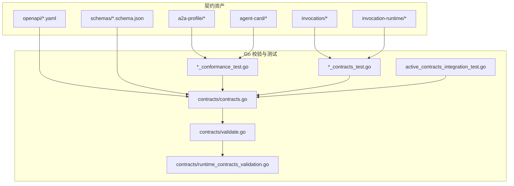
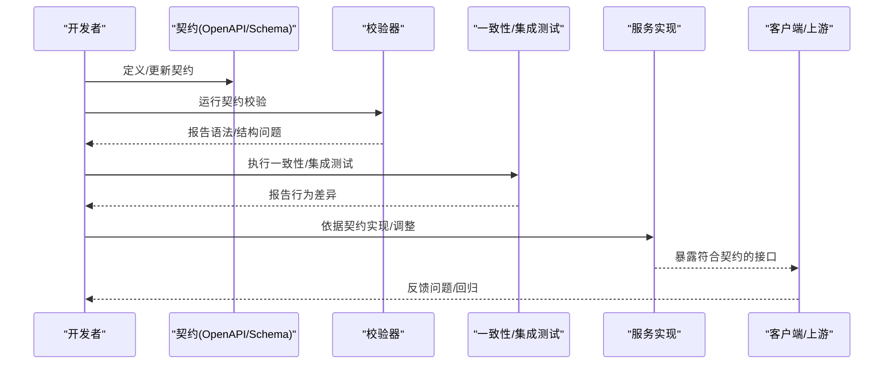
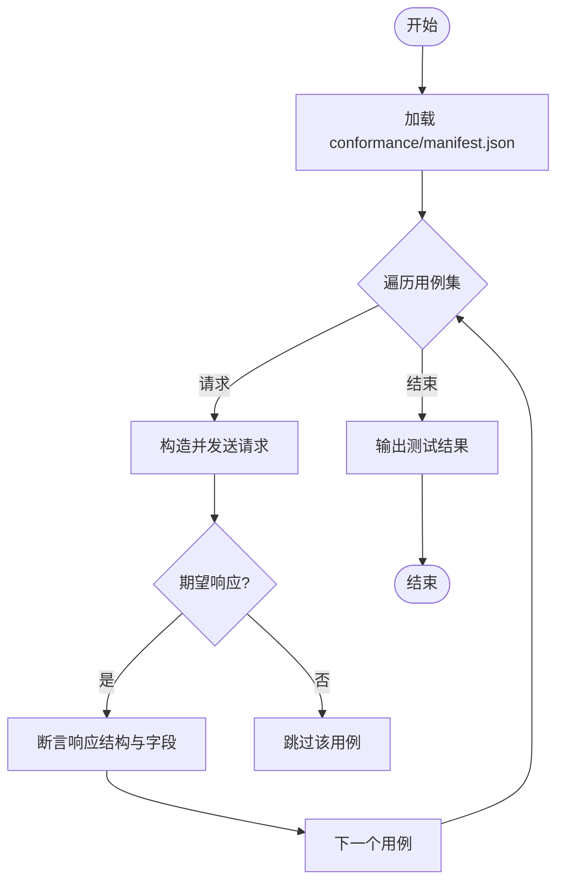
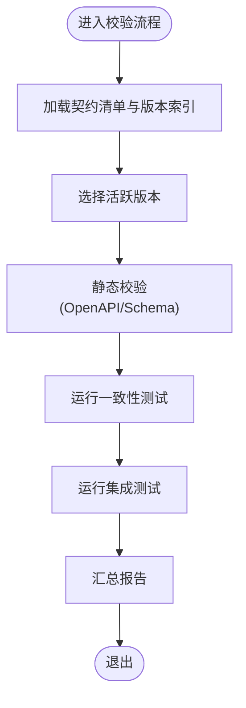
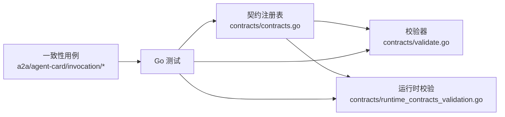

# 契约驱动开发

<cite>
**本文引用的文件**   
- [README.md](file://README.md)
- [contracts/contracts.go](file://contracts/contracts.go)
- [contracts/validate.go](file://contracts/validate.go)
- [contracts/runtime_contracts_validation.go](file://contracts/runtime_contracts_validation.go)
- [contracts/a2a_profile_v02.go](file://contracts/a2a_profile_v02.go)
- [contracts/a2a_profile_conformance_test.go](file://contracts/a2a_profile_conformance_test.go)
- [contracts/agent_card_semantics.go](file://contracts/agent_card_semantics.go)
- [contracts/agent_card_conformance_test.go](file://contracts/agent_card_conformance_test.go)
- [contracts/catalog_api_contracts_test.go](file://contracts/catalog_api_contracts_test.go)
- [contracts/workspace_api_contracts_test.go](file://contracts/workspace_api_contracts_test.go)
- [contracts/result_api_contracts_test.go](file://contracts/result_api_contracts_test.go)
- [contracts/active_contracts_integration_test.go](file://contracts/active_contracts_integration_test.go)
- [contracts/installation_contracts.go](file://contracts/installation_contracts.go)
- [contracts/runtime_contracts.go](file://contracts/runtime_contracts.go)
- [contracts/runtime_contracts_test.go](file://contracts/runtime_contracts_test.go)
- [contracts/result_contracts.go](file://contracts/result_contracts.go)
- [contracts/result_contracts_test.go](file://contracts/result_contracts_test.go)
- [contracts/openapi/control-plane.v1.yaml](file://contracts/openapi/control-plane.v1.yaml)
- [contracts/openapi/control-plane.v2.yaml](file://contracts/openapi/control-plane.v2.yaml)
- [contracts/openapi/control-plane.v3.yaml](file://contracts/openapi/control-plane.v3.yaml)
- [contracts/openapi/control-plane-invocation.v4.yaml](file://contracts/openapi/control-plane-invocation.v4.yaml)
- [contracts/openapi/router-agent.v1.yaml](file://contracts/openapi/router-agent.v1.yaml)
- [contracts/openapi/router-internal.v1.yaml](file://contracts/openapi/router-internal.v1.yaml)
- [contracts/openapi/router-internal.v2.yaml](file://contracts/openapi/router-internal.v2.yaml)
- [contracts/openapi/router-internal.v3.yaml](file://contracts/openapi/router-internal.v3.yaml)
- [contracts/schemas/common.v1.schema.json](file://contracts/schemas/common.v1.schema.json)
- [contracts/schemas/platform-error.v1.schema.json](file://contracts/schemas/platform-error.v1.schema.json)
- [contracts/schemas/platform-error.v2.schema.json](file://contracts/schemas/platform-error.v2.schema.json)
- [contracts/schemas/platform-error.v3.schema.json](file://contracts/schemas/platform-error.v3.schema.json)
- [contracts/schemas/platform-error.v4.schema.json](file://contracts/schemas/platform-error.v4.schema.json)
- [contracts/schemas/invocation-event.v0.1.schema.json](file://contracts/schemas/invocation-event.v0.1.schema.json)
- [contracts/schemas/invocation-event.v0.2.schema.json](file://contracts/schemas/invocation-event.v0.2.schema.json)
- [contracts/schemas/invocation-event.v0.3.schema.json](file://contracts/schemas/invocation-event.v0.3.schema.json)
- [contracts/schemas/invocation-result-stream-event.v1.schema.json](file://contracts/schemas/invocation-result-stream-event.v1.schema.json)
- [contracts/schemas/invocation-result-stream-event.v2.schema.json](file://contracts/schemas/invocation-result-stream-event.v2.schema.json)
- [contracts/schemas/invocation-result.v1.schema.json](file://contracts/schemas/invocation-result.v1.schema.json)
- [contracts/schemas/workspace.v1.schema.json](file://contracts/schemas/workspace.v1.schema.json)
- [contracts/schemas/a2a-profile.v0.2.schema.json](file://contracts/schemas/a2a-profile.v0.2.schema.json)
- [contracts/schemas/a2a-profile.v0.3.0.schema.json](file://contracts/schemas/a2a-profile.v0.3.0.schema.json)
- [contracts/schemas/agent-card.v0.1.schema.json](file://contracts/schemas/agent-card.v0.1.schema.json)
- [contracts/schemas/agent-card.v0.2.schema.json](file://contracts/schemas/agent-card.v0.2.schema.json)
- [contracts/schemas/installation.v1.schema.json](file://contracts/schemas/installation.v1.schema.json)
- [contracts/schemas/installation.v2.schema.json](file://contracts/schemas/installation.v2.schema.json)
- [contracts/a2a-profile/v0.3.0/profile.v0.2.json](file://contracts/a2a-profile/v0.3.0/profile.v0.2.json)
- [contracts/a2a-profile/v0.3.0/conformance/manifest.json](file://contracts/a2a-profile/v0.3.0/conformance/manifest.json)
- [contracts/a2a-profile/v0.3.0/conformance/message-send-request.json](file://contracts/a2a-profile/v0.3.0/conformance/message-send-request.json)
- [contracts/a2a-profile/v0.3.0/conformance/message-send-task-response.json](file://contracts/a2a-profile/v0.3.0/conformance/message-send-task-response.json)
- [contracts/a2a-profile/v0.3.0/conformance/tasks-get-request.json](file://contracts/a2a-profile/v0.3.0/conformance/tasks-get-request.json)
- [contracts/a2a-profile/v0.3.0/conformance/tasks-get-response.json](file://contracts/a2a-profile/v0.3.0/conformance/tasks-get-response.json)
- [contracts/a2a-profile/v0.3.0/conformance/tasks-cancel-request.json](file://contracts/a2a-profile/v0.3.0/conformance/tasks-cancel-request.json)
- [contracts/a2a-profile/v0.3.0/conformance/tasks-cancel-response.json](file://contracts/a2a-profile/v0.3.0/conformance/tasks-cancel-response.json)
- [contracts/a2a-profile/v0.3.0/conformance/message-stream-request.json](file://contracts/a2a-profile/v0.3.0/conformance/message-stream-request.json)
- [contracts/a2a-profile/v0.3.0/conformance/message-stream-valid.sse](file://contracts/a2a-profile/v0.3.0/conformance/message-stream-valid.sse)
- [contracts/a2a-profile/v0.3.0/conformance/message-stream-artifact-after-last-chunk.sse](file://contracts/a2a-profile/v0.3.0/conformance/message-stream-artifact-after-last-chunk.sse)
- [contracts/a2a-profile/v0.3.0/conformance/message-stream-context-mismatch.sse](file://contracts/a2a-profile/v0.3.0/conformance/message-stream-context-mismatch.sse)
- [contracts/a2a-profile/v0.3.0/conformance/message-stream-eof-without-terminal.sse](file://contracts/a2a-profile/v0.3.0/conformance/message-stream-eof-without-terminal.sse)
- [contracts/a2a-profile/v0.3.0/conformance/message-stream-event-after-terminal.sse](file://contracts/a2a-profile/v0.3.0/conformance/message-stream-event-after-terminal.sse)
- [contracts/a2a-profile/v0.3.0/conformance/invalid-array-response-id-response.json](file://contracts/a2a-profile/v0.3.0/conformance/invalid-array-response-id-response.json)
- [contracts/a2a-profile/v0.3.0/conformance/invalid-boolean-response-id-response.json](file://contracts/a2a-profile/v0.3.0/conformance/invalid-boolean-response-id-response.json)
- [contracts/a2a-profile/v0.3.0/conformance/invalid-jsonrpc-version-response.json](file://contracts/a2a-profile/v0.3.0/conformance/invalid-jsonrpc-version-response.json)
- [contracts/a2a-profile/v0.3.0/conformance/invalid-missing-result-and-error-response.json](file://contracts/a2a-profile/v0.3.0/conformance/invalid-missing-result-and-error-response.json)
- [contracts/a2a-profile/v0.3.0/conformance/invalid-object-response-id-response.json](file://contracts/a2a-profile/v0.3.0/conformance/invalid-object-response-id-response.json)
- [contracts/a2a-profile/v0.3.0/conformance/invalid-response-id-response.json](file://contracts/a2a-profile/v0.3.0/conformance/invalid-response-id-response.json)
- [contracts/a2a-profile/v0.3.0/conformance/invalid-result-and-error-response.json](file://contracts/a2a-profile/v0.3.0/conformance/invalid-result-and-error-response.json)
- [contracts/a2a-profile/v0.3.0/conformance/message-send-empty-id-response.json](file://contracts/a2a-profile/v0.3.0/conformance/message-send-empty-id-response.json)
- [contracts/a2a-profile/v0.3.0/conformance/message-send-invalid-kind-response.json](file://contracts/a2a-profile/v0.3.0/conformance/message-send-invalid-kind-response.json)
- [contracts/a2a-profile/v0.3.0/conformance/message-send-message-response.json](file://contracts/a2a-profile/v0.3.0/conformance/message-send-message-response.json)
- [contracts/a2a-profile/v0.3.0/conformance/message-send-no-parts-response.json](file://contracts/a2a-profile/v0.3.0/conformance/message-send-no-parts-response.json)
- [contracts/a2a-profile/v0.3.0/conformance/message-send-user-role-response.json](file://contracts/a2a-profile/v0.3.0/conformance/message-send-user-role-response.json)
- [contracts/a2a-profile/v0.3.0/conformance/tasks-get-arbitrary-state-response.json](file://contracts/a2a-profile/v0.3.0/conformance/tasks-get-arbitrary-state-response.json)
- [contracts/a2a-profile/v0.3.0/conformance/tasks-get-auth-required-response.json](file://contracts/a2a-profile/v0.3.0/conformance/tasks-get-auth-required-response.json)
- [contracts/a2a-profile/v0.3.0/conformance/tasks-get-not-found-response.json](file://contracts/a2a-profile/v0.3.0/conformance/tasks-get-not-found-response.json)
- [contracts/a2a-profile/v0.3.0/conformance/tasks-get-rejected-response.json](file://contracts/a2a-profile/v0.3.0/conformance/tasks-get-rejected-response.json)
- [contracts/a2a-profile/v0.3.0/conformance/tasks-cancel-not-cancelable-response.json](file://contracts/a2a-profile/v0.3.0/conformance/tasks-cancel-not-cancelable-response.json)
- [contracts/a2a-profile/v0.3.0/conformance/tasks-cancel-not-found-response.json](file://contracts/a2a-profile/v0.3.0/conformance/tasks-cancel-not-found-response.json)
- [contracts/a2a-profile/v0.3.0.json](file://contracts/a2a-profile/v0.3.0.json)
- [contracts/agent-card/v0.2/conformance/manifest.json](file://contracts/agent-card/v0.2/conformance/manifest.json)
- [contracts/agent-card/v0.2/conformance/valid-baseline.json](file://contracts/agent-card/v0.2/conformance/valid-baseline.json)
- [contracts/agent-card/v0.2/conformance/invalid-structural-missing-name.json](file://contracts/agent-card/v0.2/conformance/invalid-structural-missing-name.json)
- [contracts/agent-card/v0.2/conformance/invalid-duplicate-permission-id.json](file://contracts/agent-card/v0.2/conformance/invalid-duplicate-permission-id.json)
- [contracts/agent-card/v0.2/conformance/invalid-duplicate-skill-id.json](file://contracts/agent-card/v0.2/conformance/invalid-duplicate-skill-id.json)
- [contracts/agent-card/v0.2/conformance/invalid-endpoint-userinfo-credentials.json](file://contracts/agent-card/v0.2/conformance/invalid-endpoint-userinfo-credentials.json)
- [contracts/agent-card/v0.2/conformance/invalid-endpoint-userinfo-empty.json](file://contracts/agent-card/v0.2/conformance/invalid-endpoint-userinfo-empty.json)
- [contracts/agent-card/v0.2/conformance/invalid-cross-version-permission.json](file://contracts/agent-card/v0.2/conformance/invalid-cross版本权限.json)
- [contracts/agent-card/v0.2/conformance/invalid-case-mismatched-permission.json](file://contracts/agent-card/v0.2/conformance/invalid-case-mismatched-permission.json)
- [contracts/agent-card/v0.2/conformance/invalid-undeclared-permission.json](file://contracts/agent-card/v0.2/conformance/invalid-undeclared-permission.json)
- [contracts/agent-card/v0.2/conformance/valid-cross-version-permission-source.json](file://contracts/agent-card/v0.2/conformance/valid-cross-version-permission-source.json)
- [contracts/agent-card/v0.2/conformance/valid-shared-permission.json](file://contracts/agent-card/v0.2/conformance/valid-shared-permission.json)
- [contracts/invocation/v1/conformance/manifest.json](file://contracts/invocation/v1/conformance/manifest.json)
- [contracts/invocation/v1/conformance/event-matching-correlation.json](file://contracts/invocation/v1/conformance/event-matching-correlation.json)
- [contracts/invocation/v1/conformance/event-mismatched-invocation-id.json](file://contracts/invocation/v1/conformance/event-mismatched-invocation-id.json)
- [contracts/invocation/v1/conformance/event-mismatched-root-task-id.json](file://contracts/invocation/v1/conformance/event-mismatched-root-task-id.json)
- [contracts/invocation/v1/conformance/event-mismatched-trace-id.json](file://contracts/invocation/v1/conformance/event-mismatched-trace-id.json)
- [contracts/invocation/v1/conformance/stream-matching-correlation.json](file://contracts/invocation/v1/conformance/stream-matching-correlation.json)
- [contracts/invocation/v1/conformance/stream-mismatched-invocation-id.json](file://contracts/invocation/v1/conformance/stream-mismatched-invocation-id.json)
- [contracts/invocation/v1/conformance/stream-mismatched-root-task-id.json](file://contracts/invocation/v1/conformance/stream-mismatched-root-task-id.json)
- [contracts/invocation/v1/conformance/stream-mismatched-trace-id.json](file://contracts/invocation/v1/conformance/stream-mismatched-trace-id.json)
- [contracts/invocation-runtime/v1/conformance/manifest.json](file://contracts/invocation-runtime/v1/conformance/manifest.json)
- [contracts/invocation-runtime/v1/conformance/errors.json](file://contracts/invocation-runtime/v1/conformance/errors.json)
- [contracts/invocation-runtime/v1/conformance/lifecycle.json](file://contracts/invocation-runtime/v1/conformance/lifecycle.json)
- [contracts/invocation-runtime/v1/conformance/media.json](file://contracts/invocation-runtime/v1/conformance/media.json)
- [contracts/invocation-runtime/v1/conformance/nested.json](file://contracts/invocation-runtime/v1/conformance/nested.json)
- [contracts/invocation-runtime/v1/conformance/projection.json](file://contracts/invocation-runtime/v1/conformance/projection.json)
- [contracts/invocation-runtime/v1/conformance/result-stream.json](file://contracts/invocation-runtime/v1/conformance/result-stream.json)
- [docs/contracts/compatibility.md](file://docs/contracts/compatibility.md)
- [specs/001-complete-invocation-contracts/spec.md](file://specs/001-complete-invocation-contracts/spec.md)
- [specs/001-complete-invocation-contracts/contracts/a2a-conformance.md](file://specs/001-complete-invocation-contracts/contracts/a2a-conformance.md)
- [specs/001-complete-invocation-contracts/contracts/agent-card-semantics.md](file://specs/001-complete-invocation-contracts/contracts/agent-card-semantics.md)
- [specs/001-complete-invocation-contracts/contracts/directional-internal-api.md](file://specs/001-complete-invocation-contracts/contracts/directional-internal-api.md)
- [specs/001-complete-invocation-contracts/contracts/result-delivery.md](file://specs/001-complete-invocation-contracts/contracts/result-delivery.md)
</cite>

## 目录
1. [简介](#简介)
2. [项目结构](#项目结构)
3. [核心组件](#核心组件)
4. [架构总览](#架构总览)
5. [详细组件分析](#详细组件分析)
6. [依赖分析](#依赖分析)
7. [性能考虑](#性能考虑)
8. [故障排查指南](#故障排查指南)
9. [结论](#结论)
10. [附录](#附录)

## 简介
本文件面向 NeKiro 平台的“契约驱动开发”特性，聚焦以下目标：
- 基于 OpenAPI 规范的 API 设计与演进
- A2A 协议（Agent-to-Agent）的契约与一致性测试
- 契约定义、版本管理与兼容性保证机制
- 契约验证流程、测试策略与自动化检查工具
- 新 API 规范定义、客户端代码生成与契约测试执行示例
- 契约演进策略、向后兼容性与迁移指南
- 契约文档自动生成、在线 API 测试与开发者体验优化

NeKiro 通过集中化的 contracts 目录管理所有对外与内部接口契约，结合 JSON Schema、OpenAPI YAML 与语义规则，形成从设计到实现再到测试的全链路契约治理。

## 项目结构
契约相关资产主要位于 contracts 目录，按领域与版本组织：
- openapi：各服务域的 OpenAPI 规范（控制面、路由器等）
- schemas：JSON Schema 公共模型与错误模型
- a2a-profile、agent-card、invocation、invocation-runtime：A2A 与调用链路的语义规则与一致性用例
- Go 测试与校验器：将契约落地为可执行的验证与测试

图表来源
- [contracts/contracts.go](file://contracts/contracts.go)
- [contracts/validate.go](file://contracts/validate.go)
- [contracts/runtime_contracts_validation.go](file://contracts/runtime_contracts_validation.go)
- [contracts/a2a_profile_conformance_test.go](file://contracts/a2a_profile_conformance_test.go)
- [contracts/agent_card_conformance_test.go](file://contracts/agent_card_conformance_test.go)
- [contracts/catalog_api_contracts_test.go](file://contracts/catalog_api_contracts_test.go)
- [contracts/workspace_api_contracts_test.go](file://contracts/workspace_api_contracts_test.go)
- [contracts/result_api_contracts_test.go](file://contracts/result_api_contracts_test.go)
- [contracts/active_contracts_integration_test.go](file://contracts/active_contracts_integration_test.go)

章节来源
- [README.md](file://README.md)

## 核心组件
- 契约注册与发现：集中式清单与版本索引，便于统一加载与选择活跃版本
- 校验器：对 OpenAPI 与 JSON Schema 进行语法与结构校验
- 运行时契约校验：针对调用生命周期、事件与结果流等运行时语义的校验
- 一致性测试套件：覆盖 A2A Profile、Agent Card、Invocation、Invocation Runtime 的断言用例
- 集成测试：在真实或模拟环境中端到端验证契约行为

章节来源
- [contracts/contracts.go](file://contracts/contracts.go)
- [contracts/validate.go](file://contracts/validate.go)
- [contracts/runtime_contracts_validation.go](file://contracts/runtime_contracts_validation.go)
- [contracts/a2a_profile_conformance_test.go](file://contracts/a2a_profile_conformance_test.go)
- [contracts/agent_card_conformance_test.go](file://contracts/agent_card_conformance_test.go)
- [contracts/catalog_api_contracts_test.go](file://contracts/catalog_api_contracts_test.go)
- [contracts/workspace_api_contracts_test.go](file://contracts/workspace_api_contracts_test.go)
- [contracts/result_api_contracts_test.go](file://contracts/result_api_contracts_test.go)
- [contracts/active_contracts_integration_test.go](file://contracts/active_contracts_integration_test.go)

## 架构总览
契约驱动开发的整体流程如下：
- 设计阶段：以 OpenAPI YAML 和 JSON Schema 描述接口与数据模型
- 校验阶段：在构建与 CI 中运行契约校验与一致性测试
- 实现阶段：服务端根据契约生成骨架代码并实现业务逻辑
- 测试阶段：使用一致性用例与集成测试保障行为符合契约
- 发布阶段：通过版本化与兼容性策略平滑演进

图表来源
- [contracts/contracts.go](file://contracts/contracts.go)
- [contracts/validate.go](file://contracts/validate.go)
- [contracts/runtime_contracts_validation.go](file://contracts/runtime_contracts_validation.go)
- [contracts/a2a_profile_conformance_test.go](file://contracts/a2a_profile_conformance_test.go)
- [contracts/agent_card_conformance_test.go](file://contracts/agent_card_conformance_test.go)
- [contracts/catalog_api_contracts_test.go](file://contracts/catalog_api_contracts_test.go)
- [contracts/workspace_api_contracts_test.go](file://contracts/workspace_api_contracts_test.go)
- [contracts/result_api_contracts_test.go](file://contracts/result_api_contracts_test.go)
- [contracts/active_contracts_integration_test.go](file://contracts/active_contracts_integration_test.go)

## 详细组件分析

### OpenAPI 契约与版本管理
- 多域 OpenAPI 规范：控制面与路由器分别维护独立版本族，便于渐进式演进
- 版本命名与共存：v1/v2/v3/v4 等版本并存，配合活跃版本策略与兼容性文档
- 变更影响评估：新增字段、方法、状态码需遵循兼容性矩阵与迁移指引

章节来源
- [contracts/openapi/control-plane.v1.yaml](file://contracts/openapi/control-plane.v1.yaml)
- [contracts/openapi/control-plane.v2.yaml](file://contracts/openapi/control-plane.v2.yaml)
- [contracts/openapi/control-plane.v3.yaml](file://contracts/openapi/control-plane.v3.yaml)
- [contracts/openapi/control-plane-invocation.v4.yaml](file://contracts/openapi/control-plane-invocation.v4.yaml)
- [contracts/openapi/router-agent.v1.yaml](file://contracts/openapi/router-agent.v1.yaml)
- [contracts/openapi/router-internal.v1.yaml](file://contracts/openapi/router-internal.v1.yaml)
- [contracts/openapi/router-internal.v2.yaml](file://contracts/openapi/router-internal.v2.yaml)
- [contracts/openapi/router-internal.v3.yaml](file://contracts/openapi/router-internal.v3.yaml)
- [docs/contracts/compatibility.md](file://docs/contracts/compatibility.md)

### JSON Schema 公共模型
- 通用类型与平台错误模型：跨服务复用，确保错误语义一致
- 事件与结果流模型：支撑 Invocation 与 Result 的序列化与校验
- 工作空间与安装模型：用于控制面资源建模

章节来源
- [contracts/schemas/common.v1.schema.json](file://contracts/schemas/common.v1.schema.json)
- [contracts/schemas/platform-error.v1.schema.json](file://contracts/schemas/platform-error.v1.schema.json)
- [contracts/schemas/platform-error.v2.schema.json](file://contracts/schemas/platform-error.v2.schema.json)
- [contracts/schemas/platform-error.v3.schema.json](file://contracts/schemas/platform-error.v3.schema.json)
- [contracts/schemas/platform-error.v4.schema.json](file://contracts/schemas/platform-error.v4.schema.json)
- [contracts/schemas/invocation-event.v0.1.schema.json](file://contracts/schemas/invocation-event.v0.1.schema.json)
- [contracts/schemas/invocation-event.v0.2.schema.json](file://contracts/schemas/invocation-event.v0.2.schema.json)
- [contracts/schemas/invocation-event.v0.3.schema.json](file://contracts/schemas/invocation-event.v0.3.schema.json)
- [contracts/schemas/invocation-result-stream-event.v1.schema.json](file://contracts/schemas/invocation-result-stream-event.v1.schema.json)
- [contracts/schemas/invocation-result-stream-event.v2.schema.json](file://contracts/schemas/invocation-result-stream-event.v2.schema.json)
- [contracts/schemas/invocation-result.v1.schema.json](file://contracts/schemas/invocation-result.v1.schema.json)
- [contracts/schemas/workspace.v1.schema.json](file://contracts/schemas/workspace.v1.schema.json)

### A2A Profile 契约与一致性测试
- 能力声明与消息协议：包含任务发送、查询、取消与 SSE 流式事件
- 一致性用例：覆盖正常路径与多种非法输入场景，确保实现严格遵循协议
- 版本化 Profile：v0.2/v0.3.0 并行存在，测试套件按版本选择对应用例

图表来源
- [contracts/a2a-profile/v0.3.0/conformance/manifest.json](file://contracts/a2a-profile/v0.3.0/conformance/manifest.json)
- [contracts/a2a-profile/v0.3.0/conformance/message-send-request.json](file://contracts/a2a-profile/v0.3.0/conformance/message-send-request.json)
- [contracts/a2a-profile/v0.3.0/conformance/message-send-task-response.json](file://contracts/a2a-profile/v0.3.0/conformance/message-send-task-response.json)
- [contracts/a2a-profile/v0.3.0/conformance/tasks-get-request.json](file://contracts/a2a-profile/v0.3.0/conformance/tasks-get-request.json)
- [contracts/a2a-profile/v0.3.0/conformance/tasks-get-response.json](file://contracts/a2a-profile/v0.3.0/conformance/tasks-get-response.json)
- [contracts/a2a-profile/v0.3.0/conformance/tasks-cancel-request.json](file://contracts/a2a-profile/v0.3.0/conformance/tasks-cancel-request.json)
- [contracts/a2a-profile/v0.3.0/conformance/tasks-cancel-response.json](file://contracts/a2a-profile/v0.3.0/conformance/tasks-cancel-response.json)
- [contracts/a2a-profile/v0.3.0/conformance/message-stream-request.json](file://contracts/a2a-profile/v0.3.0/conformance/message-stream-request.json)
- [contracts/a2a-profile/v0.3.0/conformance/message-stream-valid.sse](file://contracts/a2a-profile/v0.3.0/conformance/message-stream-valid.sse)
- [contracts/a2a-profile/v0.3.0/conformance/message-stream-artifact-after-last-chunk.sse](file://contracts/a2a-profile/v0.3.0/conformance/message-stream-artifact-after-last-chunk.sse)
- [contracts/a2a-profile/v0.3.0/conformance/message-stream-context-mismatch.sse](file://contracts/a2a-profile/v0.3.0/conformance/message-stream-context-mismatch.sse)
- [contracts/a2a-profile/v0.3.0/conformance/message-stream-eof-without-terminal.sse](file://contracts/a2a-profile/v0.3.0/conformance/message-stream-eof-without-terminal.sse)
- [contracts/a2a-profile/v0.3.0/conformance/message-stream-event-after-terminal.sse](file://contracts/a2a-profile/v0.3.0/conformance/message-stream-event-after-terminal.sse)
- [contracts/a2a-profile/v0.3.0/conformance/invalid-array-response-id-response.json](file://contracts/a2a-profile/v0.3.0/conformance/invalid-array-response-id-response.json)
- [contracts/a2a-profile/v0.3.0/conformance/invalid-boolean-response-id-response.json](file://contracts/a2a-profile/v0.3.0/conformance/invalid-boolean-response-id-response.json)
- [contracts/a2a-profile/v0.3.0/conformance/invalid-jsonrpc-version-response.json](file://contracts/a2a-profile/v0.3.0/conformance/invalid-jsonrpc-version-response.json)
- [contracts/a2a-profile/v0.3.0/conformance/invalid-missing-result-and-error-response.json](file://contracts/a2a-profile/v0.3.0/conformance/invalid-missing-result-and-error-response.json)
- [contracts/a2a-profile/v0.3.0/conformance/invalid-object-response-id-response.json](file://contracts/a2a-profile/v0.3.0/conformance/invalid-object-response-id-response.json)
- [contracts/a2a-profile/v0.3.0/conformance/invalid-response-id-response.json](file://contracts/a2a-profile/v0.3.0/conformance/invalid-response-id-response.json)
- [contracts/a2a-profile/v0.3.0/conformance/invalid-result-and-error-response.json](file://contracts/a2a-profile/v0.3.0/conformance/invalid-result-and-error-response.json)
- [contracts/a2a-profile/v0.3.0/conformance/message-send-empty-id-response.json](file://contracts/a2a-profile/v0.3.0/conformance/message-send-empty-id-response.json)
- [contracts/a2a-profile/v0.3.0/conformance/message-send-invalid-kind-response.json](file://contracts/a2a-profile/v0.3.0/conformance/message-send-invalid-kind-response.json)
- [contracts/a2a-profile/v0.3.0/conformance/message-send-message-response.json](file://contracts/a2a-profile/v0.3.0/conformance/message-send-message-response.json)
- [contracts/a2a-profile/v0.3.0/conformance/message-send-no-parts-response.json](file://contracts/a2a-profile/v0.3.0/conformance/message-send-no-parts-response.json)
- [contracts/a2a-profile/v0.3.0/conformance/message-send-user-role-response.json](file://contracts/a2a-profile/v0.3.0/conformance/message-send-user-role-response.json)
- [contracts/a2a-profile/v0.3.0/conformance/tasks-get-arbitrary-state-response.json](file://contracts/a2a-profile/v0.3.0/conformance/tasks-get-arbitrary-state-response.json)
- [contracts/a2a-profile/v0.3.0/conformance/tasks-get-auth-required-response.json](file://contracts/a2a-profile/v0.3.0/conformance/tasks-get-auth-required-response.json)
- [contracts/a2a-profile/v0.3.0/conformance/tasks-get-not-found-response.json](file://contracts/a2a-profile/v0.3.0/conformance/tasks-get-not-found-response.json)
- [contracts/a2a-profile/v0.3.0/conformance/tasks-get-rejected-response.json](file://contracts/a2a-profile/v0.3.0/conformance/tasks-get-rejected-response.json)
- [contracts/a2a-profile/v0.3.0/conformance/tasks-cancel-not-cancelable-response.json](file://contracts/a2a-profile/v0.3.0/conformance/tasks-cancel-not-cancelable-response.json)
- [contracts/a2a-profile/v0.3.0/conformance/tasks-cancel-not-found-response.json](file://contracts/a2a-profile/v0.3.0/conformance/tasks-cancel-not-found-response.json)
- [contracts/a2a_profile_conformance_test.go](file://contracts/a2a_profile_conformance_test.go)

章节来源
- [contracts/a2a-profile/v0.3.0.json](file://contracts/a2a-profile/v0.3.0.json)
- [contracts/a2a-profile/v0.3.0/profile.v0.2.json](file://contracts/a2a-profile/v0.3.0/profile.v0.2.json)
- [contracts/a2a_profile_v02.go](file://contracts/a2a_profile_v02.go)
- [contracts/a2a_profile_conformance_test.go](file://contracts/a2a_profile_conformance_test.go)

### Agent Card 契约与语义规则
- 能力与权限声明：技能、权限、端点与用户信息约束
- 语义规则：跨版本权限、重复 ID、大小写匹配等规则
- 一致性测试：覆盖有效与无效用例，确保卡片结构正确且语义合规

章节来源
- [contracts/agent_card_semantics.go](file://contracts/agent_card_semantics.go)
- [contracts/agent_card_conformance_test.go](file://contracts/agent_card_conformance_test.go)
- [contracts/agent-card/v0.2/conformance/manifest.json](file://contracts/agent-card/v0.2/conformance/manifest.json)
- [contracts/agent-card/v0.2/conformance/valid-baseline.json](file://contracts/agent-card/v0.2/conformance/valid-baseline.json)
- [contracts/agent-card/v0.2/conformance/invalid-structural-missing-name.json](file://contracts/agent-card/v0.2/conformance/invalid-structural-missing-name.json)
- [contracts/agent-card/v0.2/conformance/invalid-duplicate-permission-id.json](file://contracts/agent-card/v0.2/conformance/invalid-duplicate-permission-id.json)
- [contracts/agent-card/v0.2/conformance/invalid-duplicate-skill-id.json](file://contracts/agent-card/v0.2/conformance/invalid-duplicate-skill-id.json)
- [contracts/agent-card/v0.2/conformance/invalid-endpoint-userinfo-credentials.json](file://contracts/agent-card/v0.2/conformance/invalid-endpoint-userinfo-credentials.json)
- [contracts/agent-card/v0.2/conformance/invalid-endpoint-userinfo-empty.json](file://contracts/agent-card/v0.2/conformance/invalid-endpoint-userinfo-empty.json)
- [contracts/agent-card/v0.2/conformance/invalid-cross-version-permission.json](file://contracts/agent-card/v0.2/conformance/invalid-cross-version-permission.json)
- [contracts/agent-card/v0.2/conformance/invalid-case-mismatched-permission.json](file://contracts/agent-card/v0.2/conformance/invalid-case-mismatched-permission.json)
- [contracts/agent-card/v0.2/conformance/invalid-undeclared-permission.json](file://contracts/agent-card/v0.2/conformance/invalid-undeclared-permission.json)
- [contracts/agent-card/v0.2/conformance/valid-cross-version-permission-source.json](file://contracts/agent-card/v0.2/conformance/valid-cross-version-permission-source.json)
- [contracts/agent-card/v0.2/conformance/valid-shared-permission.json](file://contracts/agent-card/v0.2/conformance/valid-shared-permission.json)

### Invocation 与 Invocation Runtime 契约
- 事件与流式结果：关联 ID、根任务 ID、追踪 ID 的一致性要求
- 生命周期与投影：任务状态流转、结果流分段与媒体类型处理
- 嵌套调用：子调用上下文传播与隔离

章节来源
- [contracts/invocation/v1/conformance/manifest.json](file://contracts/invocation/v1/conformance/manifest.json)
- [contracts/invocation/v1/conformance/event-matching-correlation.json](file://contracts/invocation/v1/conformance/event-matching-correlation.json)
- [contracts/invocation/v1/conformance/event-mismatched-invocation-id.json](file://contracts/invocation/v1/conformance/event-mismatched-invocation-id.json)
- [contracts/invocation/v1/conformance/event-mismatched-root-task-id.json](file://contracts/invocation/v1/conformance/event-mismatched-root-task-id.json)
- [contracts/invocation/v1/conformance/event-mismatched-trace-id.json](file://contracts/invocation/v1/conformance/event-mismatched-trace-id.json)
- [contracts/invocation/v1/conformance/stream-matching-correlation.json](file://contracts/invocation/v1/conformance/stream-matching-correlation.json)
- [contracts/invocation/v1/conformance/stream-mismatched-invocation-id.json](file://contracts/invocation/v1/conformance/stream-mismatched-invocation-id.json)
- [contracts/invocation/v1/conformance/stream-mismatched-root-task-id.json](file://contracts/invocation/v1/conformance/stream-mismatched-root-task-id.json)
- [contracts/invocation/v1/conformance/stream-mismatched-trace-id.json](file://contracts/invocation/v1/conformance/stream-mismatched-trace-id.json)
- [contracts/invocation-runtime/v1/conformance/manifest.json](file://contracts/invocation-runtime/v1/conformance/manifest.json)
- [contracts/invocation-runtime/v1/conformance/errors.json](file://contracts/invocation-runtime/v1/conformance/errors.json)
- [contracts/invocation-runtime/v1/conformance/lifecycle.json](file://contracts/invocation-runtime/v1/conformance/lifecycle.json)
- [contracts/invocation-runtime/v1/conformance/media.json](file://contracts/invocation-runtime/v1/conformance/media.json)
- [contracts/invocation-runtime/v1/conformance/nested.json](file://contracts/invocation-runtime/v1/conformance/nested.json)
- [contracts/invocation-runtime/v1/conformance/projection.json](file://contracts/invocation-runtime/v1/conformance/projection.json)
- [contracts/invocation-runtime/v1/conformance/result-stream.json](file://contracts/invocation-runtime/v1/conformance/result-stream.json)
- [contracts/runtime_contracts.go](file://contracts/runtime_contracts.go)
- [contracts/runtime_contracts_test.go](file://contracts/runtime_contracts_test.go)
- [contracts/runtime_contracts_validation.go](file://contracts/runtime_contracts_validation.go)

### 控制面与路由器的 API 契约测试
- 目录与服务契约：Catalog、Workspace、Result 等接口的契约测试
- 活跃契约集成测试：在多版本环境下验证当前活跃版本的可用性

章节来源
- [contracts/catalog_api_contracts_test.go](file://contracts/catalog_api_contracts_test.go)
- [contracts/workspace_api_contracts_test.go](file://contracts/workspace_api_contracts_test.go)
- [contracts/result_api_contracts_test.go](file://contracts/result_api_contracts_test.go)
- [contracts/active_contracts_integration_test.go](file://contracts/active_contracts_integration_test.go)

### 契约校验与验证流程
- 静态校验：OpenAPI 与 JSON Schema 的结构与语法检查
- 运行时校验：事件、结果流与生命周期等动态行为的断言
- 测试编排：按版本与用例清单自动加载与执行

图表来源
- [contracts/contracts.go](file://contracts/contracts.go)
- [contracts/validate.go](file://contracts/validate.go)
- [contracts/runtime_contracts_validation.go](file://contracts/runtime_contracts_validation.go)
- [contracts/active_contracts_integration_test.go](file://contracts/active_contracts_integration_test.go)

章节来源
- [contracts/contracts.go](file://contracts/contracts.go)
- [contracts/validate.go](file://contracts/validate.go)
- [contracts/runtime_contracts_validation.go](file://contracts/runtime_contracts_validation.go)

## 依赖分析
- 契约资产与测试之间的耦合：测试直接依赖 conformance 清单与用例数据
- 校验器与契约注册表：通过集中式清单统一管理版本与路径
- 外部依赖：OpenAPI 解析库、JSON Schema 校验库、SSE 流处理库（由测试与校验器间接引入）

图表来源
- [contracts/contracts.go](file://contracts/contracts.go)
- [contracts/validate.go](file://contracts/validate.go)
- [contracts/runtime_contracts_validation.go](file://contracts/runtime_contracts_validation.go)
- [contracts/a2a_profile_conformance_test.go](file://contracts/a2a_profile_conformance_test.go)
- [contracts/agent_card_conformance_test.go](file://contracts/agent_card_conformance_test.go)
- [contracts/runtime_contracts_test.go](file://contracts/runtime_contracts_test.go)

章节来源
- [contracts/contracts.go](file://contracts/contracts.go)
- [contracts/validate.go](file://contracts/validate.go)
- [contracts/runtime_contracts_validation.go](file://contracts/runtime_contracts_validation.go)

## 性能考虑
- 契约校验应在构建与 CI 阶段执行，避免在生产路径引入额外开销
- 一致性测试应分层：快速路径优先，长耗时用例按需启用
- 大体积 SSE 流与结果流测试建议异步与超时控制，防止阻塞流水线

## 故障排查指南
- 常见失败原因
  - OpenAPI/Schema 语法错误：检查字段类型、必填项与枚举值
  - 一致性用例不通过：核对请求/响应结构与字段映射
  - 运行时语义不符：检查事件关联 ID、根任务 ID、追踪 ID 的传播
- 定位步骤
  - 缩小范围：仅运行特定版本或特定用例集
  - 查看日志：关注校验器与测试输出的详细断言信息
  - 复现实例：使用 conformance 清单中的最小用例复现问题

章节来源
- [contracts/a2a_profile_conformance_test.go](file://contracts/a2a_profile_conformance_test.go)
- [contracts/agent_card_conformance_test.go](file://contracts/agent_card_conformance_test.go)
- [contracts/runtime_contracts_test.go](file://contracts/runtime_contracts_test.go)

## 结论
NeKiro 的契约驱动开发通过集中化的契约资产、严格的校验与一致性测试，以及清晰的版本与兼容性策略，实现了从设计到实现再到测试的闭环治理。建议在团队内推广“先契约后实现”的工作流，并在 CI 中固化契约校验与测试，以确保系统长期稳定演进。

## 附录

### 如何定义新的 API 规范
- 在 contracts/openapi 下新增或更新 YAML 文件，遵循现有版本命名约定
- 在 contracts/schemas 中补充或扩展 JSON Schema 模型
- 编写或更新对应的 conformance 用例，覆盖正负路径
- 在测试中注册新版本并加入活跃版本策略

章节来源
- [contracts/openapi/control-plane.v1.yaml](file://contracts/openapi/control-plane.v1.yaml)
- [contracts/openapi/control-plane.v2.yaml](file://contracts/openapi/control-plane.v2.yaml)
- [contracts/openapi/control-plane.v3.yaml](file://contracts/openapi/control-plane.v3.yaml)
- [contracts/openapi/control-plane-invocation.v4.yaml](file://contracts/openapi/control-plane-invocation.v4.yaml)
- [contracts/openapi/router-agent.v1.yaml](file://contracts/openapi/router-agent.v1.yaml)
- [contracts/openapi/router-internal.v1.yaml](file://contracts/openapi/router-internal.v1.yaml)
- [contracts/openapi/router-internal.v2.yaml](file://contracts/openapi/router-internal.v2.yaml)
- [contracts/openapi/router-internal.v3.yaml](file://contracts/openapi/router-internal.v3.yaml)
- [contracts/schemas/common.v1.schema.json](file://contracts/schemas/common.v1.schema.json)
- [contracts/schemas/platform-error.v1.schema.json](file://contracts/schemas/platform-error.v1.schema.json)
- [contracts/schemas/platform-error.v2.schema.json](file://contracts/schemas/platform-error.v2.schema.json)
- [contracts/schemas/platform-error.v3.schema.json](file://contracts/schemas/platform-error.v3.schema.json)
- [contracts/schemas/platform-error.v4.schema.json](file://contracts/schemas/platform-error.v4.schema.json)

### 客户端代码生成与在线测试
- 使用 OpenAPI 生成器从 YAML 生成客户端 SDK（语言无关）
- 借助在线 API 测试工具（如 Swagger UI/OpenAPI Explorer）加载 YAML 进行交互式调试
- 将生成的客户端纳入单元测试与集成测试，确保契约一致性

章节来源
- [contracts/openapi/control-plane.v1.yaml](file://contracts/openapi/control-plane.v1.yaml)
- [contracts/openapi/router-internal.v1.yaml](file://contracts/openapi/router-internal.v1.yaml)

### 契约演进策略与迁移指南
- 向后兼容原则：新增字段默认可选、保留旧字段、避免破坏性变更
- 版本共存：新旧版本同时支持，逐步淘汰旧版本
- 迁移指引：在兼容性文档中明确升级步骤与注意事项

章节来源
- [docs/contracts/compatibility.md](file://docs/contracts/compatibility.md)

### 契约文档自动生成
- 从 OpenAPI YAML 自动生成 API 文档站点
- 将语义规则与一致性用例链接至文档，提升可读性与可维护性

章节来源
- [contracts/openapi/control-plane.v1.yaml](file://contracts/openapi/control-plane.v1.yaml)
- [contracts/openapi/router-internal.v1.yaml](file://contracts/openapi/router-internal.v1.yaml)

### 参考规范与设计决策
- 完整调用契约规范与方向性内部 API 设计
- A2A 一致性规则与 Agent Card 语义规则

章节来源
- [specs/001-complete-invocation-contracts/spec.md](file://specs/001-complete-invocation-contracts/spec.md)
- [specs/001-complete-invocation-contracts/contracts/a2a-conformance.md](file://specs/001-complete-invocation-contracts/contracts/a2a-conformance.md)
- [specs/001-complete-invocation-contracts/contracts/agent-card-semantics.md](file://specs/001-complete-invocation-contracts/contracts/agent-card-semantics.md)
- [specs/001-complete-invocation-contracts/contracts/directional-internal-api.md](file://specs/001-complete-invocation-contracts/contracts/directional-internal-api.md)
- [specs/001-complete-invocation-contracts/contracts/result-delivery.md](file://specs/001-complete-invocation-contracts/contracts/result-delivery.md)