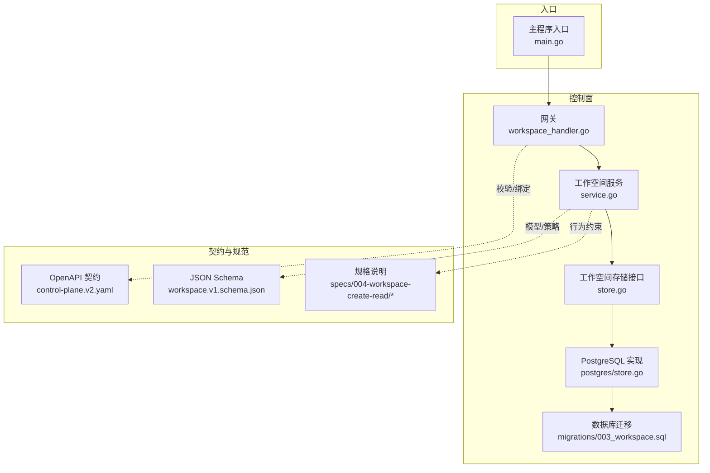
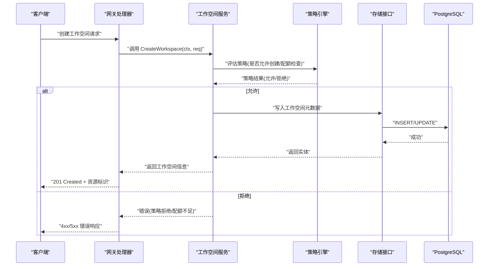
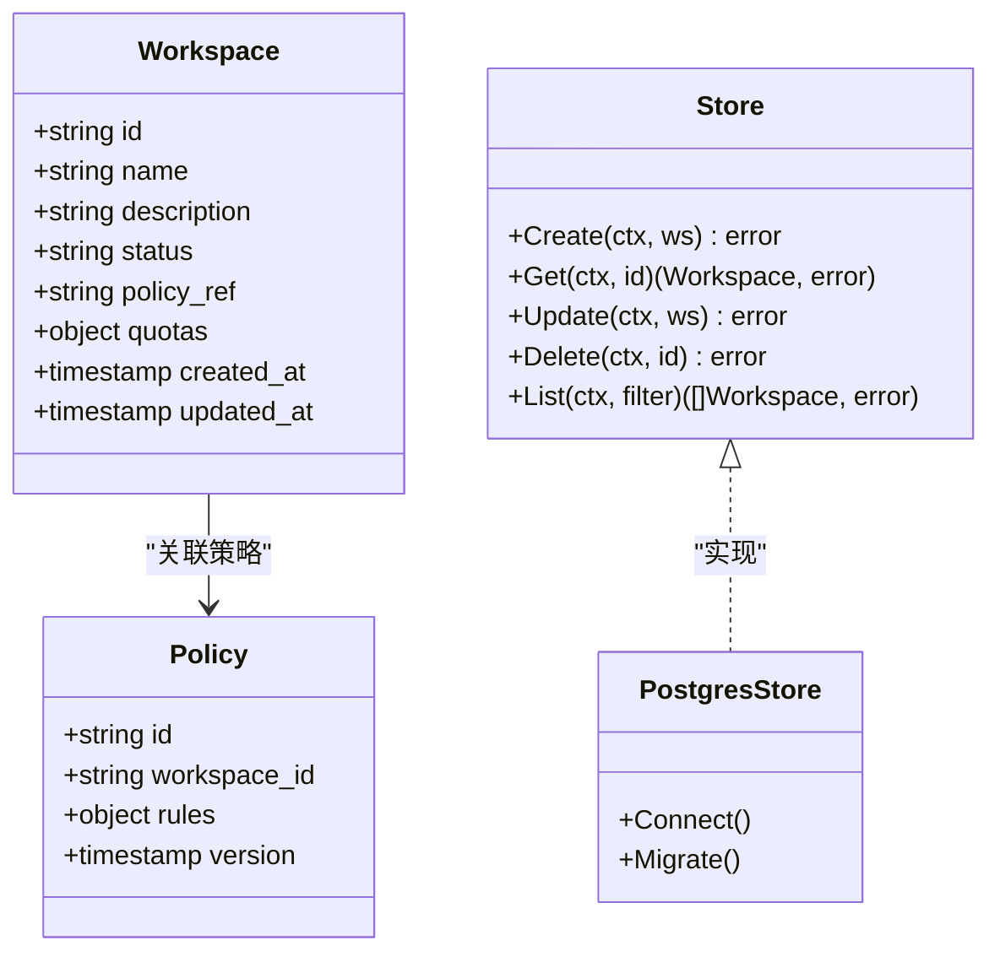
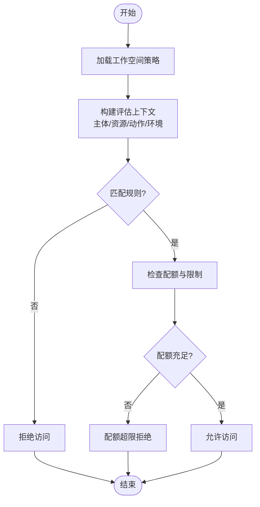
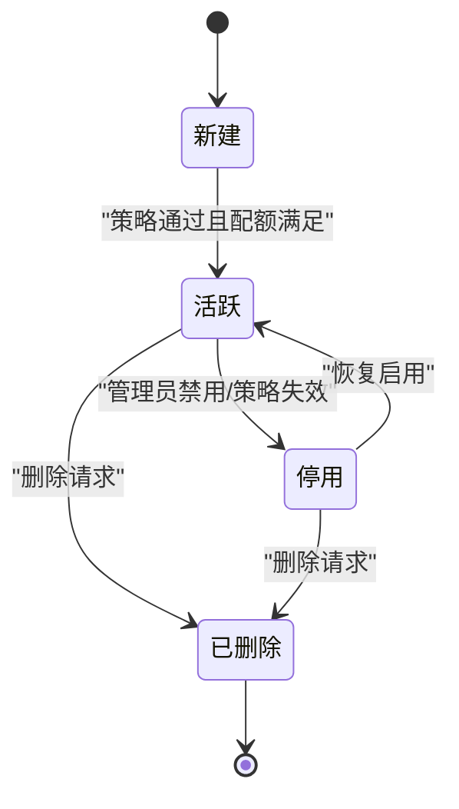
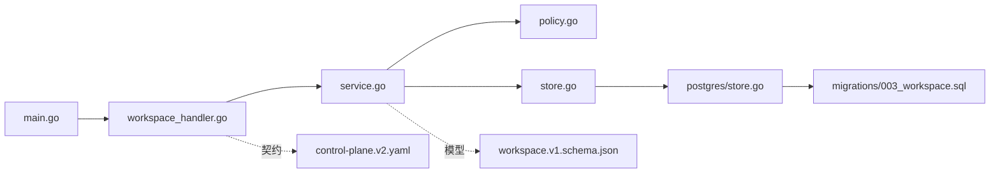

# 工作空间管理

<cite>
**本文引用的文件**   
- [apps/control-plane/cmd/control-plane/main.go](file://apps/control-plane/cmd/control-plane/main.go)
- [apps/control-plane/internal/gateway/workspace_handler.go](file://apps/control-plane/internal/gateway/workspace_handler.go)
- [apps/control-plane/internal/workspace/service.go](file://apps/control-plane/internal/workspace/service.go)
- [apps/control-plane/internal/workspace/store.go](file://apps/control-plane/internal/workspace/store.go)
- [apps/control-plane/internal/workspace/postgres/store.go](file://apps/control-plane/internal/workspace/postgres/store.go)
- [apps/control-plane/internal/workspace/model.go](file://apps/control-plane/internal/workspace/model.go)
- [apps/control-plane/internal/workspace/policy.go](file://apps/control-plane/internal/workspace/policy.go)
- [apps/control-plane/migrations/003_workspace.sql](file://apps/control-plane/migrations/003_workspace.sql)
- [contracts/schemas/workspace.v1.schema.json](file://contracts/schemas/workspace.v1.schema.json)
- [contracts/openapi/control-plane.v2.yaml](file://contracts/openapi/control-plane.v2.yaml)
- [specs/004-workspace-create-read/data-model.md](file://specs/004-workspace-create-read/data-model.md)
- [specs/004-workspace-create-read/spec.md](file://specs/004-workspace-create-read/spec.md)
- [specs/004-workspace-create-read/quickstart.md](file://specs/004-workspace-create-read/quickstart.md)
- [specs/006-resolve-authorize-capability/spec.md](file://specs/006-resolve-authorize-capability/spec.md)
- [specs/009-workspace-acceptance/spec.md](file://specs/009-workspace-acceptance/spec.md)
</cite>

## 目录
1. [简介](#简介)
2. [项目结构](#项目结构)
3. [核心组件](#核心组件)
4. [架构总览](#架构总览)
5. [详细组件分析](#详细组件分析)
6. [依赖关系分析](#依赖关系分析)
7. [性能与隔离策略](#性能与隔离策略)
8. [监控、审计与排障](#监控审计与排障)
9. [结论](#结论)
10. [附录：使用示例](#附录使用示例)

## 简介
本文件面向 NeKiro 平台的工作空间管理能力，围绕多租户架构、工作空间隔离机制与资源配额管理展开。文档覆盖工作空间的模型定义、创建与生命周期、权限策略与访问控制、数据隔离与安全、性能优化、监控与审计日志以及常见故障排查方法，并提供可操作的使用示例路径，帮助读者快速上手并深入理解实现细节。

## 项目结构
NeKiro 的控制面位于 apps/control-plane 下，工作空间相关能力由网关层（HTTP 路由）、领域服务层、持久化存储层与迁移脚本共同构成；契约与规范在 contracts 与 specs 目录下统一维护。

图示来源
- [apps/control-plane/cmd/control-plane/main.go](file://apps/control-plane/cmd/control-plane/main.go)
- [apps/control-plane/internal/gateway/workspace_handler.go](file://apps/control-plane/internal/gateway/workspace_handler.go)
- [apps/control-plane/internal/workspace/service.go](file://apps/control-plane/internal/workspace/service.go)
- [apps/control-plane/internal/workspace/store.go](file://apps/control-plane/internal/workspace/store.go)
- [apps/control-plane/internal/workspace/postgres/store.go](file://apps/control-plane/internal/workspace/postgres/store.go)
- [apps/control-plane/migrations/003_workspace.sql](file://apps/control-plane/migrations/003_workspace.sql)
- [contracts/openapi/control-plane.v2.yaml](file://contracts/openapi/control-plane.v2.yaml)
- [contracts/schemas/workspace.v1.schema.json](file://contracts/schemas/workspace.v1.schema.json)
- [specs/004-workspace-create-read/spec.md](file://specs/004-workspace-create-read/spec.md)

章节来源
- [apps/control-plane/cmd/control-plane/main.go](file://apps/control-plane/cmd/control-plane/main.go)
- [apps/control-plane/internal/gateway/workspace_handler.go](file://apps/control-plane/internal/gateway/workspace_handler.go)
- [apps/control-plane/internal/workspace/service.go](file://apps/control-plane/internal/workspace/service.go)
- [apps/control-plane/internal/workspace/store.go](file://apps/control-plane/internal/workspace/store.go)
- [apps/control-plane/internal/workspace/postgres/store.go](file://apps/control-plane/internal/workspace/postgres/store.go)
- [apps/control-plane/migrations/003_workspace.sql](file://apps/control-plane/migrations/003_workspace.sql)
- [contracts/openapi/control-plane.v2.yaml](file://contracts/openapi/control-plane.v2.yaml)
- [contracts/schemas/workspace.v1.schema.json](file://contracts/schemas/workspace.v1.schema.json)
- [specs/004-workspace-create-read/spec.md](file://specs/004-workspace-create-read/spec.md)

## 核心组件
- 网关处理器：负责 HTTP 请求解析、鉴权上下文注入、参数校验与响应封装。
- 工作空间服务：编排工作空间的业务流程，包括创建、读取、更新、删除、策略评估与配额检查。
- 存储接口与实现：抽象工作空间数据的读写，提供 PostgreSQL 实现。
- 模型与策略：定义工作空间实体、策略结构与评估逻辑。
- 迁移与契约：通过 SQL 迁移构建表结构，通过 OpenAPI/JSON Schema 约束输入输出。

章节来源
- [apps/control-plane/internal/gateway/workspace_handler.go](file://apps/control-plane/internal/gateway/workspace_handler.go)
- [apps/control-plane/internal/workspace/service.go](file://apps/control-plane/internal/workspace/service.go)
- [apps/control-plane/internal/workspace/store.go](file://apps/control-plane/internal/workspace/store.go)
- [apps/control-plane/internal/workspace/postgres/store.go](file://apps/control-plane/internal/workspace/postgres/store.go)
- [apps/control-plane/internal/workspace/model.go](file://apps/control-plane/internal/workspace/model.go)
- [apps/control-plane/internal/workspace/policy.go](file://apps/control-plane/internal/workspace/policy.go)
- [contracts/openapi/control-plane.v2.yaml](file://contracts/openapi/control-plane.v2.yaml)
- [contracts/schemas/workspace.v1.schema.json](file://contracts/schemas/workspace.v1.schema.json)

## 架构总览
工作空间管理采用分层架构：网关层暴露 RESTful API，服务层承载业务规则与策略引擎，存储层对接数据库。多租户通过“工作空间”作为边界单元进行隔离，策略引擎在工作空间维度进行授权决策，配额限制在服务层执行。

图示来源
- [apps/control-plane/internal/gateway/workspace_handler.go](file://apps/control-plane/internal/gateway/workspace_handler.go)
- [apps/control-plane/internal/workspace/service.go](file://apps/control-plane/internal/workspace/service.go)
- [apps/control-plane/internal/workspace/policy.go](file://apps/control-plane/internal/workspace/policy.go)
- [apps/control-plane/internal/workspace/store.go](file://apps/control-plane/internal/workspace/store.go)
- [apps/control-plane/internal/workspace/postgres/store.go](file://apps/control-plane/internal/workspace/postgres/store.go)

## 详细组件分析

### 工作空间模型与数据流
- 模型定义：工作空间实体包含标识、名称、描述、状态、策略引用、配额字段、时间戳等。
- 数据流：请求进入网关后，服务层对模型进行校验与转换，随后调用存储层完成持久化。
- 复杂度：典型 CRUD 为 O(1) 网络往返与索引查找；批量或分页查询受索引与排序键影响。

图示来源
- [apps/control-plane/internal/workspace/model.go](file://apps/control-plane/internal/workspace/model.go)
- [apps/control-plane/internal/workspace/store.go](file://apps/control-plane/internal/workspace/store.go)
- [apps/control-plane/internal/workspace/postgres/store.go](file://apps/control-plane/internal/workspace/postgres/store.go)

章节来源
- [apps/control-plane/internal/workspace/model.go](file://apps/control-plane/internal/workspace/model.go)
- [apps/control-plane/internal/workspace/store.go](file://apps/control-plane/internal/workspace/store.go)
- [apps/control-plane/internal/workspace/postgres/store.go](file://apps/control-plane/internal/workspace/postgres/store.go)

### 策略引擎与访问控制
- 策略结构：策略对象包含规则集合、版本与生效范围（工作空间级）。
- 评估流程：基于主体身份、目标资源、动作与环境条件进行匹配与决策。
- 集成点：服务层在关键操作前调用策略引擎，决定允许/拒绝及是否需要额外审批。

图示来源
- [apps/control-plane/internal/workspace/policy.go](file://apps/control-plane/internal/workspace/policy.go)
- [apps/control-plane/internal/workspace/service.go](file://apps/control-plane/internal/workspace/service.go)

章节来源
- [apps/control-plane/internal/workspace/policy.go](file://apps/control-plane/internal/workspace/policy.go)
- [apps/control-plane/internal/workspace/service.go](file://apps/control-plane/internal/workspace/service.go)

### 工作空间生命周期管理
- 创建：校验输入、策略评估、配额检查、持久化、返回资源标识。
- 读取：按 ID 获取工作空间详情，支持只读副本或缓存（可选）。
- 更新：变更名称、描述、策略引用、配额等，需再次策略评估。
- 删除：软删除或硬删除，清理关联策略与审计记录。
- 状态机：新建→活跃→停用→已删除。

章节来源
- [apps/control-plane/internal/workspace/service.go](file://apps/control-plane/internal/workspace/service.go)
- [apps/control-plane/internal/workspace/store.go](file://apps/control-plane/internal/workspace/store.go)
- [apps/control-plane/migrations/003_workspace.sql](file://apps/control-plane/migrations/003_workspace.sql)

### 多租户与隔离机制
- 租户边界：以工作空间为隔离单位，所有资源与策略均绑定到工作空间。
- 数据隔离：通过外键与索引确保跨工作空间的数据不可见；查询强制携带工作空间上下文。
- 策略隔离：策略与工作空间绑定，避免越权访问。
- 安全建议：最小权限原则、默认拒绝、显式授权。

章节来源
- [apps/control-plane/internal/workspace/model.go](file://apps/control-plane/internal/workspace/model.go)
- [apps/control-plane/internal/workspace/policy.go](file://apps/control-plane/internal/workspace/policy.go)
- [apps/control-plane/migrations/003_workspace.sql](file://apps/control-plane/migrations/003_workspace.sql)

### 资源配额管理
- 配额项：并发任务数、最大实例数、I/O 限额、存储上限等（具体字段以模型为准）。
- 检查时机：创建、更新、运行时调度前。
- 超限处理：拒绝新请求或降级策略，记录审计事件。

章节来源
- [apps/control-plane/internal/workspace/model.go](file://apps/control-plane/internal/workspace/model.go)
- [apps/control-plane/internal/workspace/service.go](file://apps/control-plane/internal/workspace/service.go)

## 依赖关系分析
- 入口依赖：主程序初始化配置与路由，注册工作空间网关处理器。
- 网关依赖：工作空间服务，策略引擎，OpenAPI 校验。
- 服务依赖：存储接口、策略模块、配额检查器。
- 存储依赖：PostgreSQL 驱动与迁移脚本。

图示来源
- [apps/control-plane/cmd/control-plane/main.go](file://apps/control-plane/cmd/control-plane/main.go)
- [apps/control-plane/internal/gateway/workspace_handler.go](file://apps/control-plane/internal/gateway/workspace_handler.go)
- [apps/control-plane/internal/workspace/service.go](file://apps/control-plane/internal/workspace/service.go)
- [apps/control-plane/internal/workspace/policy.go](file://apps/control-plane/internal/workspace/policy.go)
- [apps/control-plane/internal/workspace/store.go](file://apps/control-plane/internal/workspace/store.go)
- [apps/control-plane/internal/workspace/postgres/store.go](file://apps/control-plane/internal/workspace/postgres/store.go)
- [apps/control-plane/migrations/003_workspace.sql](file://apps/control-plane/migrations/003_workspace.sql)
- [contracts/openapi/control-plane.v2.yaml](file://contracts/openapi/control-plane.v2.yaml)
- [contracts/schemas/workspace.v1.schema.json](file://contracts/schemas/workspace.v1.schema.json)

章节来源
- [apps/control-plane/cmd/control-plane/main.go](file://apps/control-plane/cmd/control-plane/main.go)
- [apps/control-plane/internal/gateway/workspace_handler.go](file://apps/control-plane/internal/gateway/workspace_handler.go)
- [apps/control-plane/internal/workspace/service.go](file://apps/control-plane/internal/workspace/service.go)
- [apps/control-plane/internal/workspace/store.go](file://apps/control-plane/internal/workspace/store.go)
- [apps/control-plane/internal/workspace/postgres/store.go](file://apps/control-plane/internal/workspace/postgres/store.go)
- [apps/control-plane/migrations/003_workspace.sql](file://apps/control-plane/migrations/003_workspace.sql)
- [contracts/openapi/control-plane.v2.yaml](file://contracts/openapi/control-plane.v2.yaml)
- [contracts/schemas/workspace.v1.schema.json](file://contracts/schemas/workspace.v1.schema.json)

## 性能与隔离策略
- 索引设计：为工作空间 ID、状态、创建时间建立索引，加速过滤与分页。
- 连接池：合理设置数据库连接池大小与超时，避免热点瓶颈。
- 缓存策略：对只读高频数据（如策略）引入本地或分布式缓存，注意一致性。
- 事务粒度：短事务、明确边界，减少锁竞争。
- 隔离级别：默认使用可重复读或串行化（视一致性需求），避免跨工作空间泄漏。

[本节为通用指导，不直接分析具体文件]

## 监控、审计与排障
- 监控指标：工作空间创建成功率、策略拒绝率、配额超限次数、P99 延迟。
- 审计日志：记录创建、更新、删除、策略评估结果与配额检查结果。
- 排障步骤：
  - 确认工作空间上下文是否正确注入。
  - 检查策略规则与版本是否生效。
  - 验证配额阈值与当前用量。
  - 查看数据库迁移状态与连接健康。
  - 核对 OpenAPI 契约与请求体格式。

章节来源
- [apps/control-plane/internal/gateway/workspace_handler.go](file://apps/control-plane/internal/gateway/workspace_handler.go)
- [apps/control-plane/internal/workspace/service.go](file://apps/control-plane/internal/workspace/service.go)
- [apps/control-plane/internal/workspace/policy.go](file://apps/control-plane/internal/workspace/policy.go)
- [apps/control-plane/internal/workspace/postgres/store.go](file://apps/control-plane/internal/workspace/postgres/store.go)

## 结论
NeKiro 的工作空间管理以“工作空间”为核心边界，结合策略引擎与配额控制实现多租户隔离与安全访问。通过清晰的层次化架构与契约化接口，系统具备良好的可扩展性与可观测性。建议在部署中强化审计与监控，持续优化索引与缓存策略，保障高可用与高性能。

[本节为总结性内容，不直接分析具体文件]

## 附录：使用示例
以下示例路径指向规范与快速入门文档，便于读者按步骤完成工作空间创建、策略配置与资源限制管理。

- 创建工作空间（API 与数据模型）
  - [specs/004-workspace-create-read/spec.md](file://specs/004-workspace-create-read/spec.md)
  - [specs/004-workspace-create-read/data-model.md](file://specs/004-workspace-create-read/data-model.md)
  - [specs/004-workspace-create-read/quickstart.md](file://specs/004-workspace-create-read/quickstart.md)

- 策略与授权（解析与授权能力）
  - [specs/006-resolve-authorize-capability/spec.md](file://specs/006-resolve-authorize-capability/spec.md)

- 验收与证据（工作空间验收标准）
  - [specs/009-workspace-acceptance/spec.md](file://specs/009-workspace-acceptance/spec.md)

- 契约参考（OpenAPI 与 JSON Schema）
  - [contracts/openapi/control-plane.v2.yaml](file://contracts/openapi/control-plane.v2.yaml)
  - [contracts/schemas/workspace.v1.schema.json](file://contracts/schemas/workspace.v1.schema.json)

章节来源
- [specs/004-workspace-create-read/spec.md](file://specs/004-workspace-create-read/spec.md)
- [specs/004-workspace-create-read/data-model.md](file://specs/004-workspace-create-read/data-model.md)
- [specs/004-workspace-create-read/quickstart.md](file://specs/004-workspace-create-read/quickstart.md)
- [specs/006-resolve-authorize-capability/spec.md](file://specs/006-resolve-authorize-capability/spec.md)
- [specs/009-workspace-acceptance/spec.md](file://specs/009-workspace-acceptance/spec.md)
- [contracts/openapi/control-plane.v2.yaml](file://contracts/openapi/control-plane.v2.yaml)
- [contracts/schemas/workspace.v1.schema.json](file://contracts/schemas/workspace.v1.schema.json)