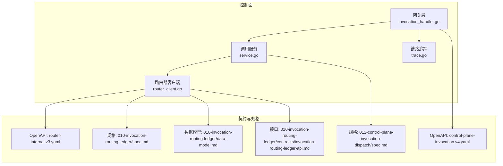
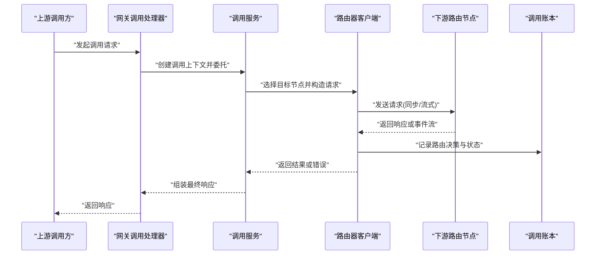
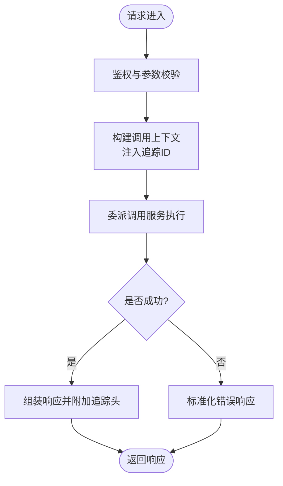
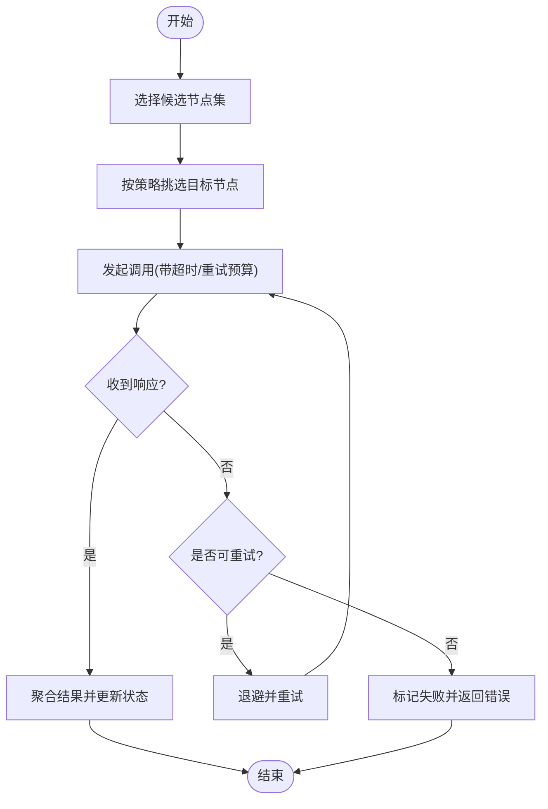
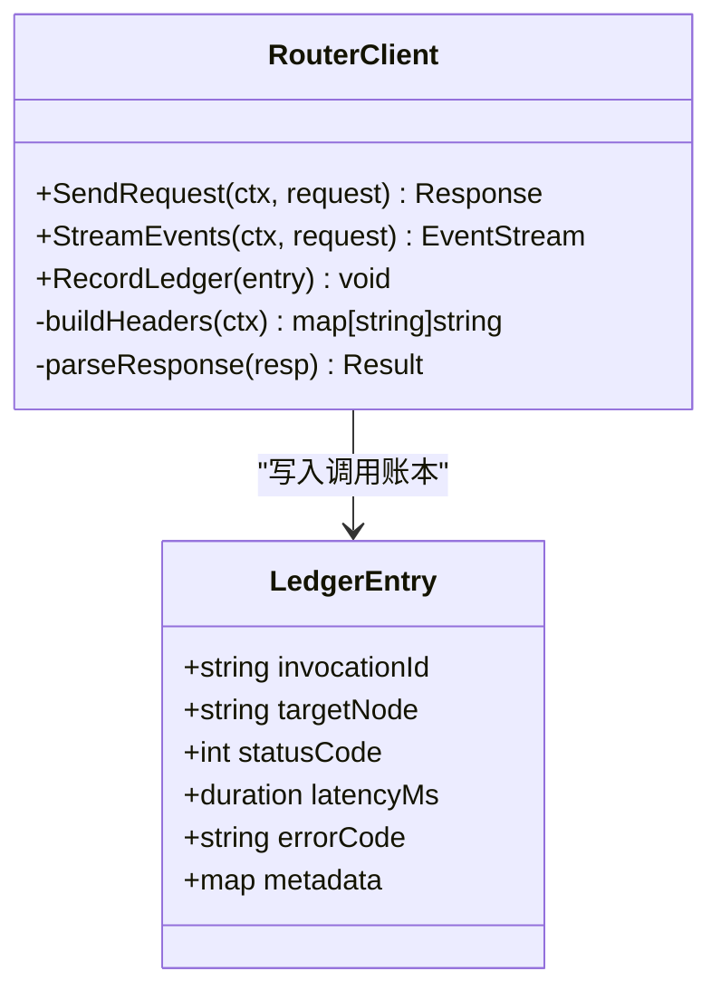
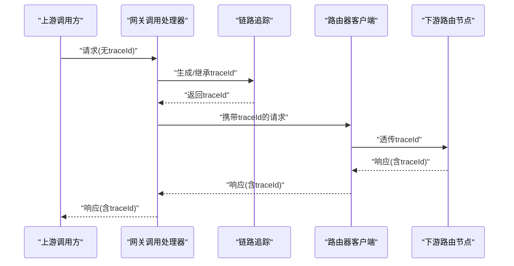
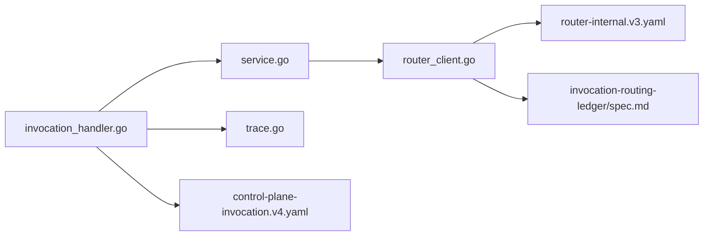

# 智能调用路由

<cite>
**本文引用的文件**   
- [apps/control-plane/internal/gateway/invocation_handler.go](file://apps/control-plane/internal/gateway/invocation_handler.go)
- [apps/control-plane/internal/gateway/trace.go](file://apps/control-plane/internal/gateway/trace.go)
- [apps/control-plane/internal/invocation/router_client.go](file://apps/control-plane/internal/invocation/router_client.go)
- [apps/control-plane/internal/invocation/service.go](file://apps/control-plane/internal/invocation/service.go)
- [contracts/openapi/router-internal.v3.yaml](file://contracts/openapi/router-internal.v3.yaml)
- [contracts/openapi/control-plane-invocation.v4.yaml](file://contracts/openapi/control-plane-invocation.v4.yaml)
- [specs/012-control-plane-invocation-dispatch/spec.md](file://specs/012-control-plane-invocation-dispatch/spec.md)
- [specs/010-invocation-routing-ledger/spec.md](file://specs/010-invocation-routing-ledger/spec.md)
- [specs/010-invocation-routing-ledger/data-model.md](file://specs/010-invocation-routing-ledger/data-model.md)
- [specs/010-invocation-routing-ledger/contracts/invocation-routing-ledger-api.md](file://specs/010-invocation-routing-ledger/contracts/invocation-routing-ledger-api.md)
</cite>

## 目录
1. [简介](#简介)
2. [项目结构](#项目结构)
3. [核心组件](#核心组件)
4. [架构总览](#架构总览)
5. [详细组件分析](#详细组件分析)
6. [依赖分析](#依赖分析)
7. [性能考虑](#性能考虑)
8. [故障排查指南](#故障排查指南)
9. [结论](#结论)
10. [附录](#附录)

## 简介
本文件面向 NeKiro 平台的“智能调用路由”能力，聚焦控制面在调用分发、负载均衡与故障转移方面的实现与规范。文档覆盖：
- 请求分发算法与路由决策逻辑
- 负载均衡策略与故障转移机制
- 调用链路建立、跟踪与监控
- 超时控制与重试策略
- 代理间通信示例（同步/异步）
- 错误场景处理
- 性能优化（连接池、缓存、并发）
- 调用链追踪、指标收集与调试工具使用

## 项目结构
NeKiro 仓库中与控制面调用路由相关的代码主要位于 control-plane 内部模块，配合 OpenAPI 契约与规格说明文档共同定义行为与边界。

图示来源
- [apps/control-plane/internal/gateway/invocation_handler.go](file://apps/control-plane/internal/gateway/invocation_handler.go)
- [apps/control-plane/internal/invocation/service.go](file://apps/control-plane/internal/invocation/service.go)
- [apps/control-plane/internal/invocation/router_client.go](file://apps/control-plane/internal/invocation/router_client.go)
- [apps/control-plane/internal/gateway/trace.go](file://apps/control-plane/internal/gateway/trace.go)
- [contracts/openapi/router-internal.v3.yaml](file://contracts/openapi/router-internal.v3.yaml)
- [contracts/openapi/control-plane-invocation.v4.yaml](file://contracts/openapi/control-plane-invocation.v4.yaml)
- [specs/012-control-plane-invocation-dispatch/spec.md](file://specs/012-control-plane-invocation-dispatch/spec.md)
- [specs/010-invocation-routing-ledger/spec.md](file://specs/010-invocation-routing-ledger/spec.md)
- [specs/010-invocation-routing-ledger/data-model.md](file://specs/010-invocation-routing-ledger/data-model.md)
- [specs/010-invocation-routing-ledger/contracts/invocation-routing-ledger-api.md](file://specs/010-invocation-routing-ledger/contracts/invocation-routing-ledger-api.md)

章节来源
- [apps/control-plane/internal/gateway/invocation_handler.go](file://apps/control-plane/internal/gateway/invocation_handler.go)
- [apps/control-plane/internal/invocation/service.go](file://apps/control-plane/internal/invocation/service.go)
- [apps/control-plane/internal/invocation/router_client.go](file://apps/control-plane/internal/invocation/router_client.go)
- [apps/control-plane/internal/gateway/trace.go](file://apps/control-plane/internal/gateway/trace.go)
- [contracts/openapi/router-internal.v3.yaml](file://contracts/openapi/router-internal.v3.yaml)
- [contracts/openapi/control-plane-invocation.v4.yaml](file://contracts/openapi/control-plane-invocation.v4.yaml)
- [specs/012-control-plane-invocation-dispatch/spec.md](file://specs/012-control-plane-invocation-dispatch/spec.md)
- [specs/010-invocation-routing-ledger/spec.md](file://specs/010-invocation-routing-ledger/spec.md)
- [specs/010-invocation-routing-ledger/data-model.md](file://specs/010-invocation-routing-ledger/data-model.md)
- [specs/010-invocation-routing-ledger/contracts/invocation-routing-ledger-api.md](file://specs/010-invocation-routing-ledger/contracts/invocation-routing-ledger-api.md)

## 核心组件
- 网关调用处理器：负责接收外部调用请求，进行鉴权、参数校验、上下文注入与响应封装，并触发后续路由流程。
- 调用服务：编排调用生命周期，协调路由客户端与追踪器，管理超时、重试与结果聚合。
- 路由器客户端：与下游路由节点交互，执行实际的分发与转发，维护调用账本记录。
- 链路追踪：为每次调用生成唯一标识，贯穿请求到响应的完整链路，便于观测与排障。

章节来源
- [apps/control-plane/internal/gateway/invocation_handler.go](file://apps/control-plane/internal/gateway/invocation_handler.go)
- [apps/control-plane/internal/invocation/service.go](file://apps/control-plane/internal/invocation/service.go)
- [apps/control-plane/internal/invocation/router_client.go](file://apps/control-plane/internal/invocation/router_client.go)
- [apps/control-plane/internal/gateway/trace.go](file://apps/control-plane/internal/gateway/trace.go)

## 架构总览
控制面作为调度中枢，将上层业务调用转化为对下游路由节点的请求。整体遵循“网关入口 -> 调用服务 -> 路由器客户端 -> 下游路由节点”的层次化设计，并通过 OpenAPI 契约明确接口边界。

图示来源
- [apps/control-plane/internal/gateway/invocation_handler.go](file://apps/control-plane/internal/gateway/invocation_handler.go)
- [apps/control-plane/internal/invocation/service.go](file://apps/control-plane/internal/invocation/service.go)
- [apps/control-plane/internal/invocation/router_client.go](file://apps/control-plane/internal/invocation/router_client.go)
- [specs/010-invocation-routing-ledger/spec.md](file://specs/010-invocation-routing-ledger/spec.md)

## 详细组件分析

### 网关调用处理器
职责
- 解析与校验入参，绑定工作区与身份上下文
- 生成或透传调用标识，注入追踪信息
- 委派给调用服务执行，统一错误码与响应格式

关键流程
- 请求进入后，先完成鉴权与参数校验
- 初始化调用上下文（包含 traceId、workspaceId、correlationId 等）
- 调用服务执行路由与转发
- 根据返回结果构建 HTTP 响应，必要时附加追踪头

图示来源
- [apps/control-plane/internal/gateway/invocation_handler.go](file://apps/control-plane/internal/gateway/invocation_handler.go)
- [apps/control-plane/internal/gateway/trace.go](file://apps/control-plane/internal/gateway/trace.go)

章节来源
- [apps/control-plane/internal/gateway/invocation_handler.go](file://apps/control-plane/internal/gateway/invocation_handler.go)
- [apps/control-plane/internal/gateway/trace.go](file://apps/control-plane/internal/gateway/trace.go)

### 调用服务
职责
- 编排调用生命周期：创建、路由、重试、超时、结果聚合
- 与路由器客户端协作，决定具体目标节点
- 维护调用状态与指标采集点

关键流程
- 基于路由策略选择候选节点集合
- 按策略挑选目标节点，设置超时与重试预算
- 等待响应或事件流，合并结果并更新状态
- 失败时触发降级或重试，直至达到预算上限

图示来源
- [apps/control-plane/internal/invocation/service.go](file://apps/control-plane/internal/invocation/service.go)

章节来源
- [apps/control-plane/internal/invocation/service.go](file://apps/control-plane/internal/invocation/service.go)

### 路由器客户端
职责
- 与下游路由节点通信，执行实际转发
- 维护调用账本，记录路由决策、耗时、错误类型等
- 支持同步与流式响应处理

关键流程
- 构造下游请求，携带调用上下文与追踪信息
- 发送请求并等待响应；若为流式，则逐块消费
- 写入调用账本，包括目标节点、状态码、耗时、错误码
- 返回结果或错误给调用服务

图示来源
- [apps/control-plane/internal/invocation/router_client.go](file://apps/control-plane/internal/invocation/router_client.go)
- [specs/010-invocation-routing-ledger/data-model.md](file://specs/010-invocation-routing-ledger/data-model.md)

章节来源
- [apps/control-plane/internal/invocation/router_client.go](file://apps/control-plane/internal/invocation/router_client.go)
- [specs/010-invocation-routing-ledger/data-model.md](file://specs/010-invocation-routing-ledger/data-model.md)

### 链路追踪
职责
- 为每次调用生成全局唯一的 traceId
- 在请求头中传递追踪信息，确保跨进程链路连贯
- 提供查询与导出能力，用于观测与排障

关键流程
- 网关入口处生成或继承 traceId
- 将 traceId 注入下游请求头
- 在日志与指标中附带 traceId，便于关联分析

图示来源
- [apps/control-plane/internal/gateway/trace.go](file://apps/control-plane/internal/gateway/trace.go)
- [apps/control-plane/internal/gateway/invocation_handler.go](file://apps/control-plane/internal/gateway/invocation_handler.go)

章节来源
- [apps/control-plane/internal/gateway/trace.go](file://apps/control-plane/internal/gateway/trace.go)
- [apps/control-plane/internal/gateway/invocation_handler.go](file://apps/control-plane/internal/gateway/invocation_handler.go)

## 依赖分析
- 网关层依赖调用服务与追踪模块
- 调用服务依赖路由器客户端与配置
- 路由器客户端依赖下游路由节点 API 与调用账本
- 所有对外接口通过 OpenAPI 契约约束，保证版本兼容与演进可控

图示来源
- [apps/control-plane/internal/gateway/invocation_handler.go](file://apps/control-plane/internal/gateway/invocation_handler.go)
- [apps/control-plane/internal/invocation/service.go](file://apps/control-plane/internal/invocation/service.go)
- [apps/control-plane/internal/invocation/router_client.go](file://apps/control-plane/internal/invocation/router_client.go)
- [apps/control-plane/internal/gateway/trace.go](file://apps/control-plane/internal/gateway/trace.go)
- [contracts/openapi/router-internal.v3.yaml](file://contracts/openapi/router-internal.v3.yaml)
- [contracts/openapi/control-plane-invocation.v4.yaml](file://contracts/openapi/control-plane-invocation.v4.yaml)
- [specs/010-invocation-routing-ledger/spec.md](file://specs/010-invocation-routing-ledger/spec.md)

章节来源
- [contracts/openapi/router-internal.v3.yaml](file://contracts/openapi/router-internal.v3.yaml)
- [contracts/openapi/control-plane-invocation.v4.yaml](file://contracts/openapi/control-plane-invocation.v4.yaml)
- [specs/012-control-plane-invocation-dispatch/spec.md](file://specs/012-control-plane-invocation-dispatch/spec.md)
- [specs/010-invocation-routing-ledger/spec.md](file://specs/010-invocation-routing-ledger/spec.md)

## 性能考虑
- 连接池管理
  - 复用与下游路由节点的长连接，减少握手开销
  - 按目标节点维度隔离连接池，避免热点节点影响其他节点
- 缓存策略
  - 缓存路由决策结果（如节点健康度、权重），降低计算成本
  - 短 TTL 与失效策略结合，保证动态性
- 并发控制
  - 限制并发度，防止雪崩
  - 使用令牌桶或滑动窗口限流，保护下游
- 超时与重试
  - 分层超时：网关超时、服务超时、下游超时
  - 指数退避与抖动，避免重试风暴
- 流式响应
  - 对大结果采用流式传输，降低内存占用与端到端延迟
- 指标与观测
  - 采集 P50/P95/P99 延迟、错误率、重试次数、超时次数
  - 以 traceId 关联日志与指标，提升定位效率

[本节为通用指导，不直接分析具体文件]

## 故障排查指南
- 常见问题
  - 超时：检查各层超时配置与下游响应时间，关注 P99 延迟
  - 重试风暴：确认退避与抖动策略，观察重试次数与错误分布
  - 路由不均：检查权重与健康度更新频率，确认缓存失效策略
  - 链路断裂：核对 traceId 透传是否正确，查看下游节点日志
- 定位步骤
  - 通过 traceId 检索全链路日志
  - 查看调用账本中的路由决策与状态码
  - 对比不同节点的延迟与错误率，识别异常节点
  - 验证 OpenAPI 契约版本一致性，排除协议不匹配问题

章节来源
- [apps/control-plane/internal/invocation/router_client.go](file://apps/control-plane/internal/invocation/router_client.go)
- [specs/010-invocation-routing-ledger/contracts/invocation-routing-ledger-api.md](file://specs/010-invocation-routing-ledger/contracts/invocation-routing-ledger-api.md)

## 结论
NeKiro 的智能调用路由以网关入口、调用服务与路由器客户端为核心，结合链路追踪与调用账本，形成高可用、可观测、可扩展的调用分发体系。通过合理的负载均衡、故障转移、超时与重试策略，以及连接池、缓存与并发控制等性能优化手段，平台能够在复杂环境下保持稳定的调用质量与用户体验。

[本节为总结，不直接分析具体文件]

## 附录

### 调用示例（概念性）
- 同步调用
  - 上游向网关发起调用，网关生成 traceId 并委派调用服务
  - 调用服务选择目标节点，路由器客户端转发请求
  - 下游返回结果，经路由器客户端记录账本后返回网关
- 异步流式调用
  - 网关接受流式请求，调用服务启动流式通道
  - 路由器客户端逐块消费下游事件，更新账本并回写
  - 网关将事件流推送给上游，直到终端事件

[本节为概念性说明，不直接分析具体文件]

### 相关契约与规格
- 控制面调用分发规格：[specs/012-control-plane-invocation-dispatch/spec.md](file://specs/012-control-plane-invocation-dispatch/spec.md)
- 调用路由账本规格与数据模型：
  - [specs/010-invocation-routing-ledger/spec.md](file://specs/010-invocation-routing-ledger/spec.md)
  - [specs/010-invocation-routing-ledger/data-model.md](file://specs/010-invocation-routing-ledger/data-model.md)
  - [specs/010-invocation-routing-ledger/contracts/invocation-routing-ledger-api.md](file://specs/010-invocation-routing-ledger/contracts/invocation-routing-ledger-api.md)
- OpenAPI 契约：
  - [contracts/openapi/router-internal.v3.yaml](file://contracts/openapi/router-internal.v3.yaml)
  - [contracts/openapi/control-plane-invocation.v4.yaml](file://contracts/openapi/control-plane-invocation.v4.yaml)