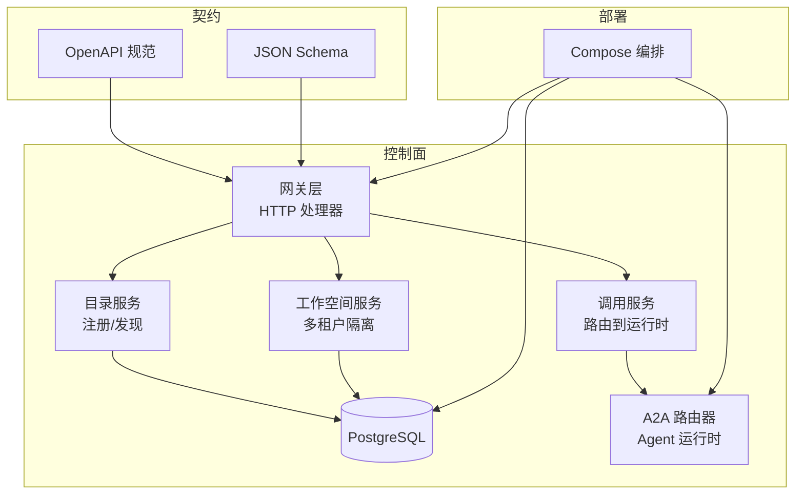
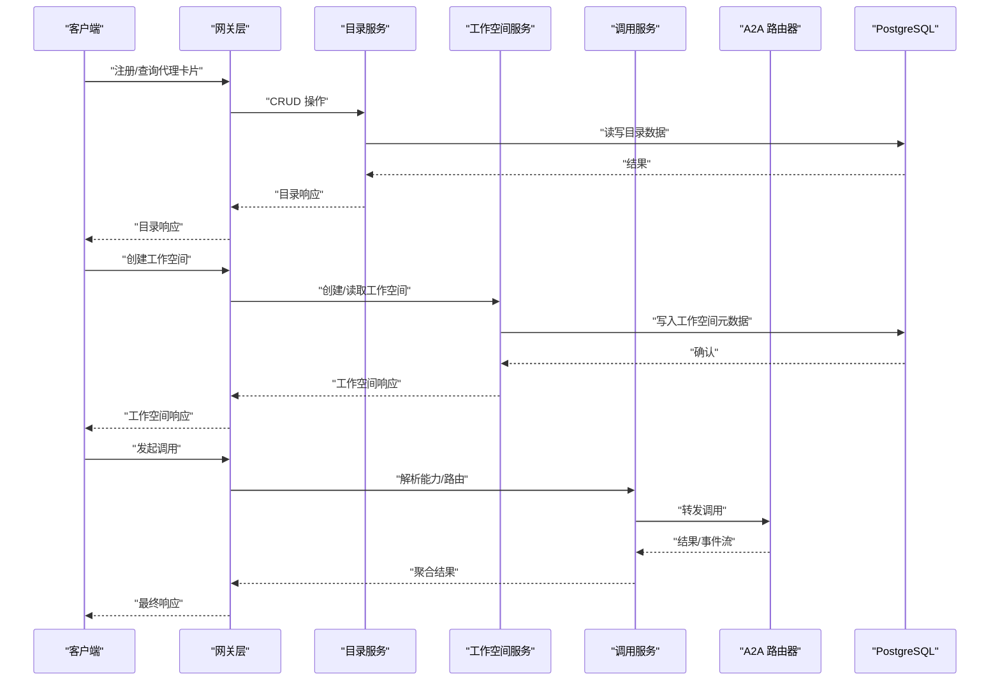
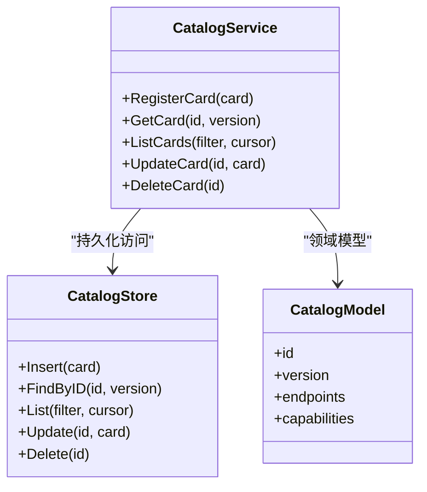
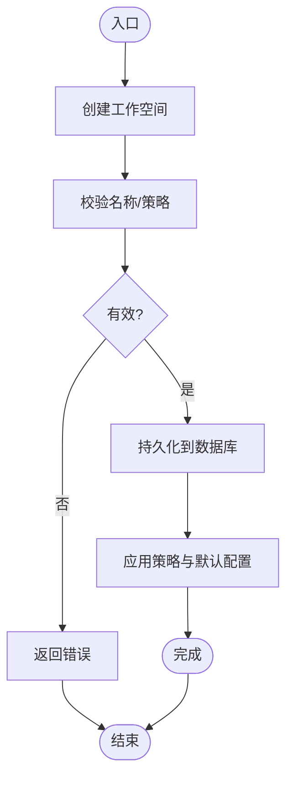
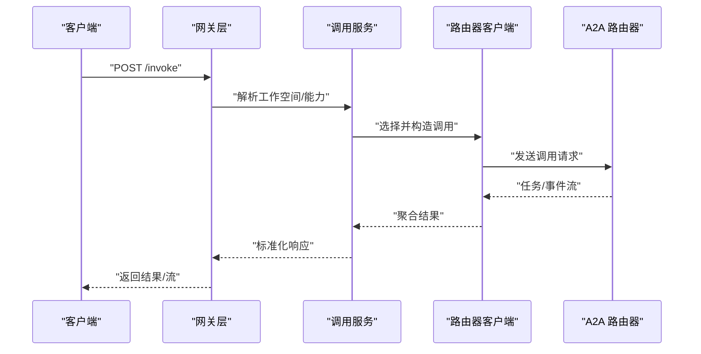
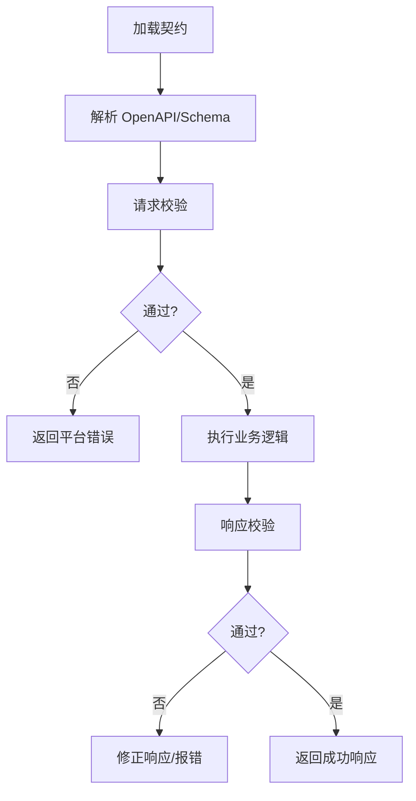
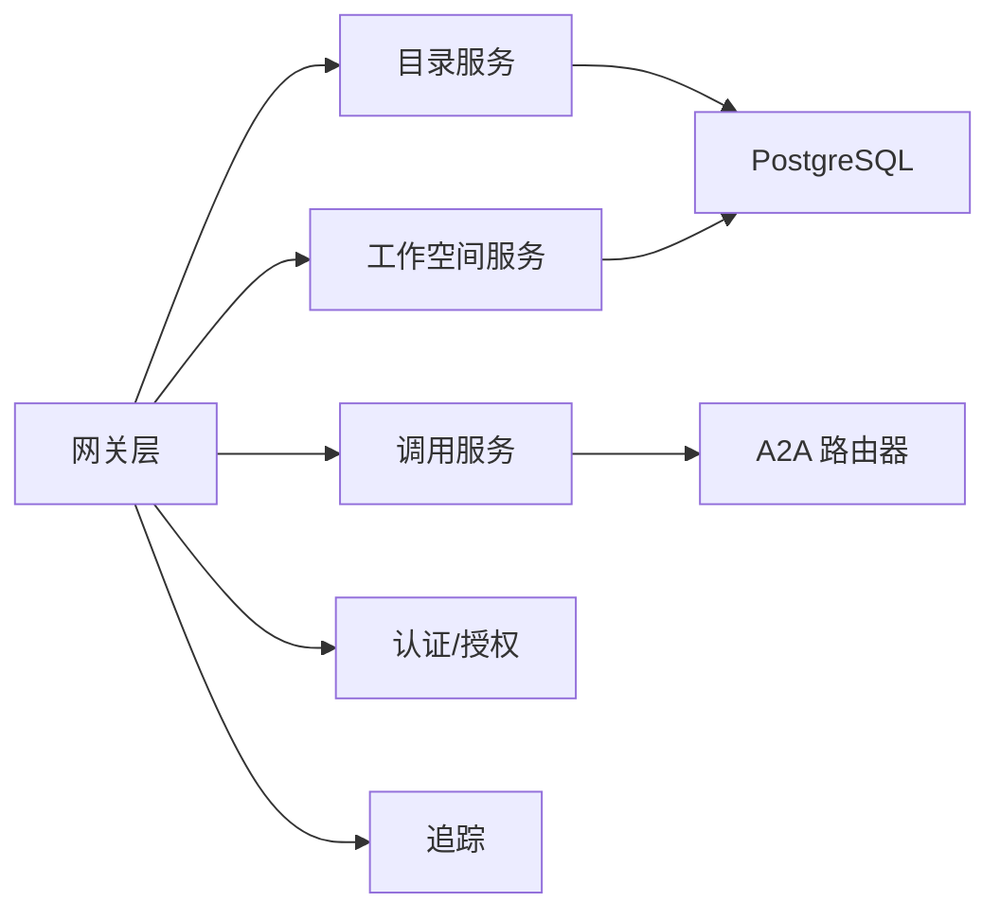

# 核心特性

<cite>
**本文引用的文件**   
- [README.md](file://README.md)
- [main.go](file://apps/control-plane/cmd/control-plane/main.go)
- [config.go](file://apps/control-plane/internal/config/config.go)
- [service.go](file://apps/control-plane/internal/catalog/service.go)
- [store.go](file://apps/control-plane/internal/catalog/store.go)
- [model.go](file://apps/control-plane/internal/catalog/model.go)
- [cursor.go](file://apps/control-plane/internal/catalog/cursor.go)
- [migrations.go](file://apps/control-plane/internal/catalog/postgres/migrations.go)
- [catalog_handler.go](file://apps/control-plane/internal/gateway/catalog_handler.go)
- [invocation_handler.go](file://apps/control-plane/internal/gateway/invocation_handler.go)
- [workspace_handler.go](file://apps/control-plane/internal/gateway/workspace_handler.go)
- [auth.go](file://apps/control-plane/internal/gateway/auth.go)
- [trace.go](file://apps/control-plane/internal/gateway/trace.go)
- [errors.go](file://apps/control-plane/internal/gateway/errors.go)
- [router_client.go](file://apps/control-plane/internal/invocation/router_client.go)
- [service.go](file://apps/control-plane/internal/invocation/service.go)
- [store.go](file://apps/control-plane/internal/workspace/postgres/store.go)
- [migrations.go](file://apps/control-plane/internal/workspace/postgres/migrations.go)
- [model.go](file://apps/control-plane/internal/workspace/model.go)
- [policy.go](file://apps/control-plane/internal/workspace/policy.go)
- [service.go](file://apps/control-plane/internal/workspace/service.go)
- [cursor.go](file://apps/control-plane/internal/workspace/cursor.go)
- [contracts.go](file://contracts/contracts.go)
- [validate.go](file://contracts/validate.go)
- [control-plane.v2.yaml](file://contracts/openapi/control-plane.v2.yaml)
- [router-agent.v1.yaml](file://contracts/openapi/router-agent.v1.yaml)
- [router-internal.v3.yaml](file://contracts/openapi/router-internal.v3.yaml)
- [platform-error.v4.schema.json](file://contracts/schemas/platform-error.v4.schema.json)
- [workspace.v1.schema.json](file://contracts/schemas/workspace.v1.schema.json)
- [compose.yaml](file://deploy/compose.yaml)
</cite>

## 目录
1. [简介](#简介)
2. [项目结构](#项目结构)
3. [核心组件](#核心组件)
4. [架构总览](#架构总览)
5. [详细组件分析](#详细组件分析)
6. [依赖分析](#依赖分析)
7. [性能考虑](#性能考虑)
8. [故障排查指南](#故障排查指南)
9. [结论](#结论)
10. [附录](#附录)

## 简介
NeKiro AI Agent 平台提供代理注册与发现、多租户工作空间管理、智能调用路由以及契约驱动开发等核心能力。平台通过控制面（Control Plane）统一编排，结合 OpenAPI 与 JSON Schema 的契约体系，确保代理生命周期、安装部署、能力解析与调用链路的稳定与可演进。本文件聚焦于这些特性的问题背景、实现原理、使用场景与协作关系，并提供面向初学者的概览与面向资深开发者的深入细节。

## 项目结构
仓库采用多应用与多合约的组织方式：
- apps/control-plane：控制面服务，包含网关、目录注册中心、工作空间与调用路由等模块
- contracts：契约定义（OpenAPI、JSON Schema、语义规则与一致性测试）
- deploy：部署配置（Docker Compose）
- docs/specs：分阶段规格说明与数据模型
- tests：集成与一致性测试

图表来源
- [main.go:1-200](file://apps/control-plane/cmd/control-plane/main.go#L1-L200)
- [catalog_handler.go:1-200](file://apps/control-plane/internal/gateway/catalog_handler.go#L1-L200)
- [workspace_handler.go:1-200](file://apps/control-plane/internal/gateway/workspace_handler.go#L1-L200)
- [invocation_handler.go:1-200](file://apps/control-plane/internal/gateway/invocation_handler.go#L1-L200)
- [router_client.go:1-200](file://apps/control-plane/internal/invocation/router_client.go#L1-L200)
- [compose.yaml:1-200](file://deploy/compose.yaml#L1-L200)

章节来源
- [README.md:1-200](file://README.md#L1-L200)
- [main.go:1-200](file://apps/control-plane/cmd/control-plane/main.go#L1-L200)
- [compose.yaml:1-200](file://deploy/compose.yaml#L1-L200)

## 核心组件
- 代理注册与发现（目录服务）
  - 负责代理卡片的持久化、版本管理与查询，支撑跨工作空间的发现与选择
- 多租户工作空间管理
  - 提供工作空间的创建、读取、策略与安装边界，保证资源与权限隔离
- 智能调用路由
  - 基于工作空间与能力解析，将调用请求路由至 A2A 路由器并返回结果流
- 契约驱动开发
  - 以 OpenAPI 与 JSON Schema 为单一事实源，贯穿校验、生成与一致性测试

章节来源
- [service.go:1-200](file://apps/control-plane/internal/catalog/service.go#L1-L200)
- [store.go:1-200](file://apps/control-plane/internal/catalog/store.go#L1-L200)
- [model.go:1-200](file://apps/control-plane/internal/catalog/model.go#L1-L200)
- [cursor.go:1-200](file://apps/control-plane/internal/catalog/cursor.go#L1-L200)
- [migrations.go:1-200](file://apps/control-plane/internal/catalog/postgres/migrations.go#L1-L200)
- [workspace_handler.go:1-200](file://apps/control-plane/internal/gateway/workspace_handler.go#L1-L200)
- [service.go:1-200](file://apps/control-plane/internal/workspace/service.go#L1-L200)
- [store.go:1-200](file://apps/control-plane/internal/workspace/postgres/store.go#L1-L200)
- [migrations.go:1-200](file://apps/control-plane/internal/workspace/postgres/migrations.go#L1-L200)
- [model.go:1-200](file://apps/control-plane/internal/workspace/model.go#L1-L200)
- [policy.go:1-200](file://apps/control-plane/internal/workspace/policy.go#L1-L200)
- [invocation_handler.go:1-200](file://apps/control-plane/internal/gateway/invocation_handler.go#L1-L200)
- [router_client.go:1-200](file://apps/control-plane/internal/invocation/router_client.go#L1-L200)
- [contracts.go:1-200](file://contracts/contracts.go#L1-L200)
- [validate.go:1-200](file://contracts/validate.go#L1-L200)
- [control-plane.v2.yaml:1-200](file://contracts/openapi/control-plane.v2.yaml#L1-L200)
- [router-agent.v1.yaml:1-200](file://contracts/openapi/router-agent.v1.yaml#L1-L200)
- [router-internal.v3.yaml:1-200](file://contracts/openapi/router-internal.v3.yaml#L1-L200)
- [platform-error.v4.schema.json:1-200](file://contracts/schemas/platform-error.v4.schema.json#L1-L200)
- [workspace.v1.schema.json:1-200](file://contracts/schemas/workspace.v1.schema.json#L1-L200)

## 架构总览
控制面作为中枢，对外暴露 HTTP API，内部按职责拆分为网关、目录、工作空间与调用服务；数据库用于持久化目录与工作空间元数据；A2A 路由器承载实际 Agent 运行时的通信。

图表来源
- [catalog_handler.go:1-200](file://apps/control-plane/internal/gateway/catalog_handler.go#L1-L200)
- [workspace_handler.go:1-200](file://apps/control-plane/internal/gateway/workspace_handler.go#L1-L200)
- [invocation_handler.go:1-200](file://apps/control-plane/internal/gateway/invocation_handler.go#L1-L200)
- [service.go:1-200](file://apps/control-plane/internal/catalog/service.go#L1-L200)
- [service.go:1-200](file://apps/control-plane/internal/workspace/service.go#L1-L200)
- [service.go:1-200](file://apps/control-plane/internal/invocation/service.go#L1-L200)
- [router_client.go:1-200](file://apps/control-plane/internal/invocation/router_client.go#L1-L200)
- [store.go:1-200](file://apps/control-plane/internal/catalog/store.go#L1-L200)
- [store.go:1-200](file://apps/control-plane/internal/workspace/postgres/store.go#L1-L200)

## 详细组件分析

### 代理注册与发现机制
- 解决的问题
  - 在多工作空间与多运行时环境下，如何统一管理代理能力描述、版本与可用性，支持快速发现与选择
- 实现原理
  - 目录服务提供代理卡片的增删改查与分页游标；存储层对接 PostgreSQL，迁移脚本维护表结构
  - 网关层暴露目录相关 HTTP 接口，处理认证与追踪上下文
- 使用场景
  - 新代理上线时注册卡片；消费者根据能力与版本筛选目标代理；灰度发布时通过版本字段切换流量
- 关键数据结构与复杂度
  - 目录实体包含标识、版本、端点与能力声明；分页游标基于时间戳或自增 ID，避免深翻页开销
- 错误处理
  - 使用平台错误模式，统一错误码与消息，便于客户端重试与降级
- 最佳实践
  - 使用游标分页替代偏移量；对高频查询建立索引；卡片变更触发缓存失效

图表来源
- [service.go:1-200](file://apps/control-plane/internal/catalog/service.go#L1-L200)
- [store.go:1-200](file://apps/control-plane/internal/catalog/store.go#L1-L200)
- [model.go:1-200](file://apps/control-plane/internal/catalog/model.go#L1-L200)
- [cursor.go:1-200](file://apps/control-plane/internal/catalog/cursor.go#L1-L200)
- [migrations.go:1-200](file://apps/control-plane/internal/catalog/postgres/migrations.go#L1-L200)
- [catalog_handler.go:1-200](file://apps/control-plane/internal/gateway/catalog_handler.go#L1-L200)

章节来源
- [service.go:1-200](file://apps/control-plane/internal/catalog/service.go#L1-L200)
- [store.go:1-200](file://apps/control-plane/internal/catalog/store.go#L1-L200)
- [model.go:1-200](file://apps/control-plane/internal/catalog/model.go#L1-L200)
- [cursor.go:1-200](file://apps/control-plane/internal/catalog/cursor.go#L1-L200)
- [migrations.go:1-200](file://apps/control-plane/internal/catalog/postgres/migrations.go#L1-L200)
- [catalog_handler.go:1-200](file://apps/control-plane/internal/gateway/catalog_handler.go#L1-L200)

### 多租户工作空间管理
- 解决的问题
  - 在共享平台上隔离不同团队或项目的资源、策略与安装边界，避免越权访问
- 实现原理
  - 工作空间服务提供创建、读取与策略管理；存储层持久化工作空间元数据；迁移脚本保障数据库演进
  - 网关层在工作空间上下文中执行鉴权与审计
- 使用场景
  - 为新团队初始化独立工作空间；为不同环境（开发/预发/生产）划分工作空间；按策略限制可安装的代理范围
- 关键数据结构与复杂度
  - 工作空间实体包含标识、名称、策略与状态；常用查询按标识与名称检索，O(1)/O(log n) 取决于索引
- 错误处理
  - 冲突与权限不足返回明确错误码，客户端据此提示用户或回滚操作
- 最佳实践
  - 工作空间命名规范化；策略最小权限原则；定期清理未使用工作空间

图表来源
- [workspace_handler.go:1-200](file://apps/control-plane/internal/gateway/workspace_handler.go#L1-L200)
- [service.go:1-200](file://apps/control-plane/internal/workspace/service.go#L1-L200)
- [store.go:1-200](file://apps/control-plane/internal/workspace/postgres/store.go#L1-L200)
- [migrations.go:1-200](file://apps/control-plane/internal/workspace/postgres/migrations.go#L1-L200)
- [model.go:1-200](file://apps/control-plane/internal/workspace/model.go#L1-L200)
- [policy.go:1-200](file://apps/control-plane/internal/workspace/policy.go#L1-L200)

章节来源
- [workspace_handler.go:1-200](file://apps/control-plane/internal/gateway/workspace_handler.go#L1-L200)
- [service.go:1-200](file://apps/control-plane/internal/workspace/service.go#L1-L200)
- [store.go:1-200](file://apps/control-plane/internal/workspace/postgres/store.go#L1-L200)
- [migrations.go:1-200](file://apps/control-plane/internal/workspace/postgres/migrations.go#L1-L200)
- [model.go:1-200](file://apps/control-plane/internal/workspace/model.go#L1-L200)
- [policy.go:1-200](file://apps/control-plane/internal/workspace/policy.go#L1-L200)

### 智能调用路由
- 解决的问题
  - 如何将业务调用精准路由到合适的 Agent 运行时，支持版本选择、能力匹配与结果流式返回
- 实现原理
  - 网关接收调用请求，调用服务解析工作空间与能力，选择目标路由器实例，转发请求并聚合结果
  - 路由器遵循 A2A 协议，支持任务获取、取消与事件流
- 使用场景
  - 跨工作空间调用外部代理；同一能力多版本灰度；长耗时任务的事件流式反馈
- 关键数据结构与复杂度
  - 调用上下文包含工作空间、能力、参数与追踪信息；路由决策通常 O(1)~O(log n)，受索引与缓存影响
- 错误处理
  - 超时、不可用与协议不匹配均返回平台错误，客户端可重试或降级
- 最佳实践
  - 设置合理的超时与重试预算；利用追踪 ID 进行端到端排障；对热点能力启用本地缓存

图表来源
- [invocation_handler.go:1-200](file://apps/control-plane/internal/gateway/invocation_handler.go#L1-L200)
- [service.go:1-200](file://apps/control-plane/internal/invocation/service.go#L1-L200)
- [router_client.go:1-200](file://apps/control-plane/internal/invocation/router_client.go#L1-L200)
- [router-agent.v1.yaml:1-200](file://contracts/openapi/router-agent.v1.yaml#L1-L200)
- [router-internal.v3.yaml:1-200](file://contracts/openapi/router-internal.v3.yaml#L1-L200)

章节来源
- [invocation_handler.go:1-200](file://apps/control-plane/internal/gateway/invocation_handler.go#L1-L200)
- [service.go:1-200](file://apps/control-plane/internal/invocation/service.go#L1-L200)
- [router_client.go:1-200](file://apps/control-plane/internal/invocation/router_client.go#L1-L200)
- [router-agent.v1.yaml:1-200](file://contracts/openapi/router-agent.v1.yaml#L1-L200)
- [router-internal.v3.yaml:1-200](file://contracts/openapi/router-internal.v3.yaml#L1-L200)

### 契约驱动开发支持
- 解决的问题
  - 多语言、多组件间接口一致性与兼容性难以保证，变更易引发破坏性升级
- 实现原理
  - 以 OpenAPI 与 JSON Schema 为权威契约；网关与服务在入参出参处进行校验；一致性测试覆盖合法与非法用例
- 使用场景
  - 前端/SDK 基于契约生成代码；后端在 CI 中运行一致性测试；发布前进行兼容性与回归验证
- 关键数据结构与复杂度
  - 平台错误与工作空间等核心类型由 Schema 定义；校验复杂度与对象深度和嵌套程度相关
- 错误处理
  - 违反契约的请求直接拒绝，返回标准错误结构，便于客户端快速定位问题
- 最佳实践
  - 严格遵循语义规则；变更走版本化流程；自动化生成与测试纳入流水线

图表来源
- [contracts.go:1-200](file://contracts/contracts.go#L1-L200)
- [validate.go:1-200](file://contracts/validate.go#L1-L200)
- [control-plane.v2.yaml:1-200](file://contracts/openapi/control-plane.v2.yaml#L1-L200)
- [platform-error.v4.schema.json:1-200](file://contracts/schemas/platform-error.v4.schema.json#L1-L200)
- [workspace.v1.schema.json:1-200](file://contracts/schemas/workspace.v1.schema.json#L1-L200)

章节来源
- [contracts.go:1-200](file://contracts/contracts.go#L1-L200)
- [validate.go:1-200](file://contracts/validate.go#L1-L200)
- [control-plane.v2.yaml:1-200](file://contracts/openapi/control-plane.v2.yaml#L1-L200)
- [platform-error.v4.schema.json:1-200](file://contracts/schemas/platform-error.v4.schema.json#L1-L200)
- [workspace.v1.schema.json:1-200](file://contracts/schemas/workspace.v1.schema.json#L1-L200)

## 依赖分析
- 组件耦合与内聚
  - 网关层仅依赖服务接口，保持高内聚低耦合；服务层组合存储与策略，职责清晰
- 直接与间接依赖
  - 目录与工作空间服务依赖 PostgreSQL；调用服务依赖 A2A 路由器；网关依赖认证与追踪中间件
- 外部依赖与集成点
  - OpenAPI/Schema 驱动契约校验；Compose 编排容器化部署
- 循环依赖风险
  - 当前分层清晰，未见循环导入；建议持续通过静态检查保障

图表来源
- [main.go:1-200](file://apps/control-plane/cmd/control-plane/main.go#L1-L200)
- [catalog_handler.go:1-200](file://apps/control-plane/internal/gateway/catalog_handler.go#L1-L200)
- [workspace_handler.go:1-200](file://apps/control-plane/internal/gateway/workspace_handler.go#L1-L200)
- [invocation_handler.go:1-200](file://apps/control-plane/internal/gateway/invocation_handler.go#L1-L200)
- [auth.go:1-200](file://apps/control-plane/internal/gateway/auth.go#L1-L200)
- [trace.go:1-200](file://apps/control-plane/internal/gateway/trace.go#L1-L200)
- [router_client.go:1-200](file://apps/control-plane/internal/invocation/router_client.go#L1-L200)

章节来源
- [main.go:1-200](file://apps/control-plane/cmd/control-plane/main.go#L1-L200)
- [auth.go:1-200](file://apps/control-plane/internal/gateway/auth.go#L1-L200)
- [trace.go:1-200](file://apps/control-plane/internal/gateway/trace.go#L1-L200)

## 性能考虑
- 目录查询
  - 使用游标分页与索引优化，避免深翻页；热点卡片可引入内存缓存
- 工作空间操作
  - 创建/读取路径短且幂等，注意并发写冲突与锁粒度
- 调用路由
  - 合理设置超时与重试预算；对长任务使用事件流；对热点能力做就近路由与缓存
- 数据库
  - 针对常见过滤条件建索引；监控慢查询与连接池使用率
- 网络与序列化
  - 减少不必要的数据拷贝；使用高效序列化格式；开启连接复用

## 故障排查指南
- 常见问题
  - 认证失败：检查网关鉴权中间件与令牌有效性
  - 契约校验失败：核对请求体是否符合 OpenAPI/Schema 定义
  - 路由失败：确认路由器可达性与协议版本匹配
- 诊断手段
  - 利用追踪 ID 串联请求链路；查看网关日志与错误码；对比一致性测试结果
- 恢复策略
  - 对瞬时错误启用指数退避重试；对不可用节点进行熔断与降级

章节来源
- [auth.go:1-200](file://apps/control-plane/internal/gateway/auth.go#L1-L200)
- [trace.go:1-200](file://apps/control-plane/internal/gateway/trace.go#L1-L200)
- [errors.go:1-200](file://apps/control-plane/internal/gateway/errors.go#L1-L200)
- [platform-error.v4.schema.json:1-200](file://contracts/schemas/platform-error.v4.schema.json#L1-L200)

## 结论
NeKiro 平台通过清晰的模块化设计与严格的契约驱动，实现了代理注册与发现、多租户工作空间管理与智能调用路由的核心能力。建议在迭代过程中持续完善索引与缓存策略、强化一致性测试与可观测性，以提升稳定性与可扩展性。

## 附录
- 快速开始
  - 使用 Compose 启动控制面、数据库与路由器，参考部署配置
- 参考契约
  - 控制面 API、路由器协议与平台错误模型详见 OpenAPI 与 Schema 文件

章节来源
- [compose.yaml:1-200](file://deploy/compose.yaml#L1-L200)
- [control-plane.v2.yaml:1-200](file://contracts/openapi/control-plane.v2.yaml#L1-L200)
- [router-agent.v1.yaml:1-200](file://contracts/openapi/router-agent.v1.yaml#L1-L200)
- [platform-error.v4.schema.json:1-200](file://contracts/schemas/platform-error.v4.schema.json#L1-L200)