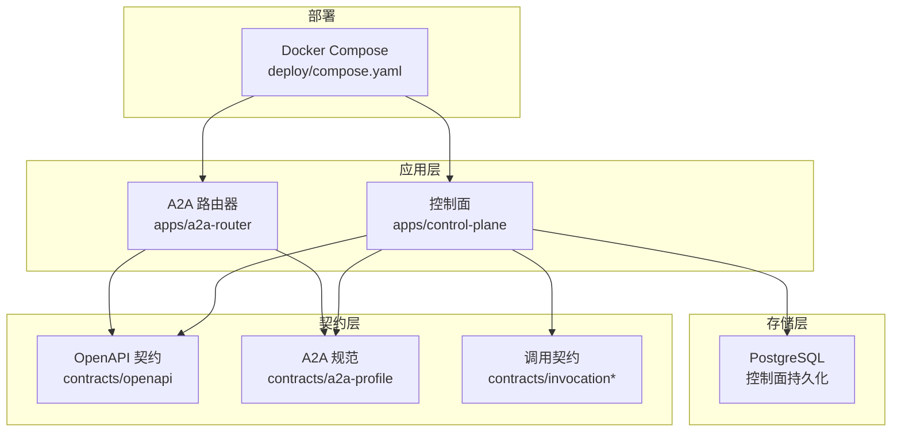
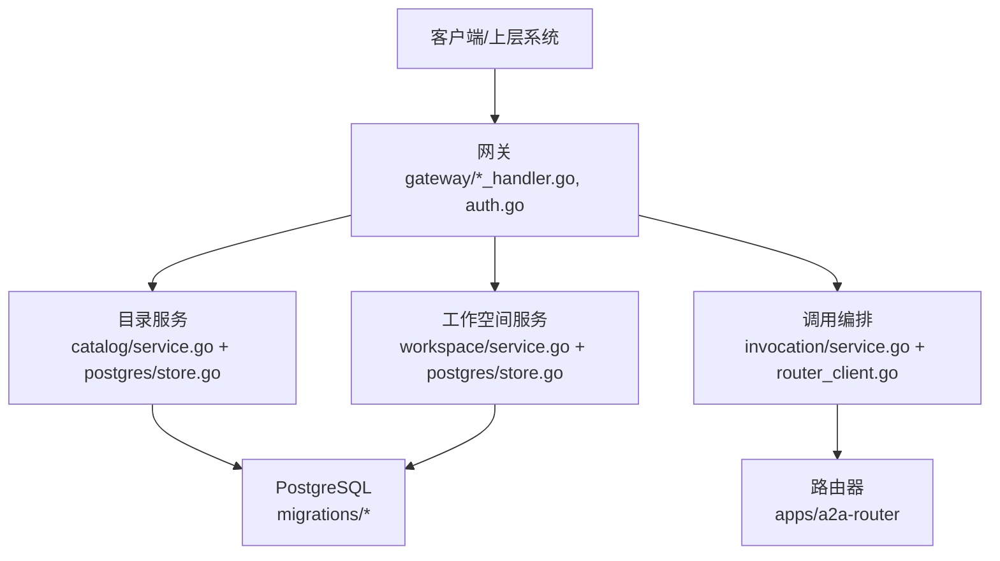
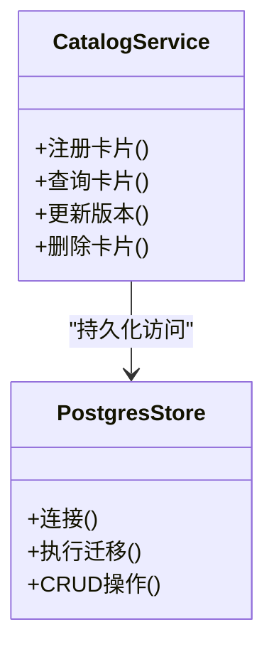
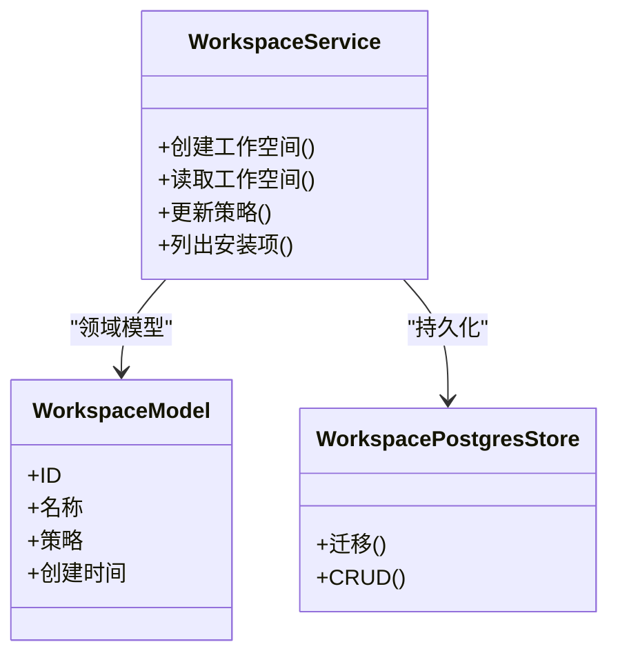
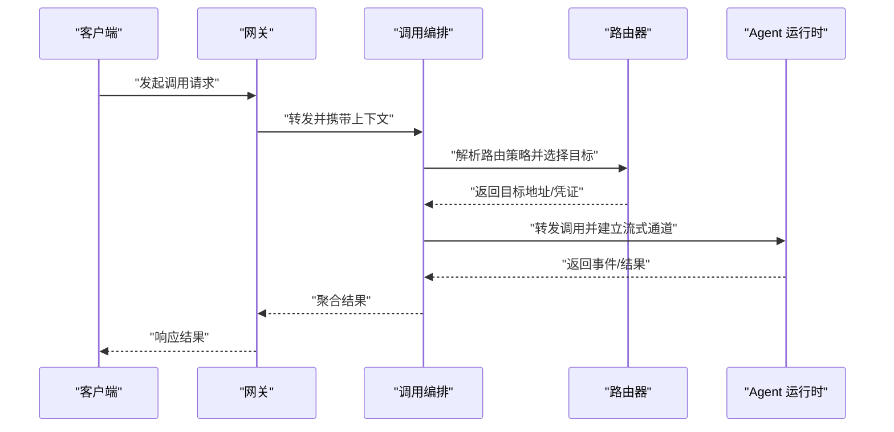
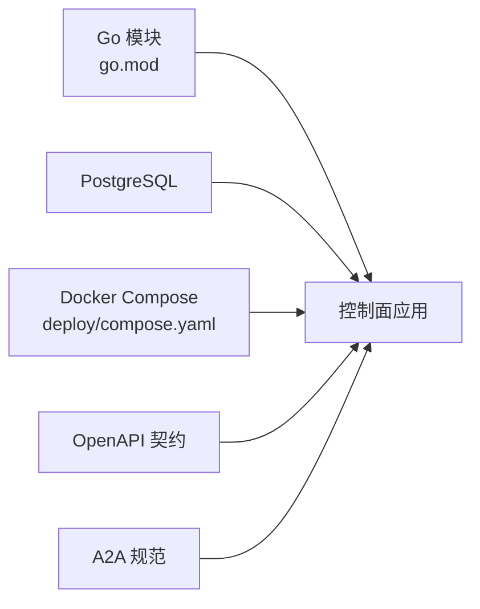

# 项目介绍

<cite>
**本文引用的文件**   
- [README.md](file://README.md)
- [go.mod](file://go.mod)
- [main.go](file://apps/control-plane/cmd/control-plane/main.go)
- [config.go](file://apps/control-plane/internal/config/config.go)
- [service.go](file://apps/control-plane/internal/catalog/service.go)
- [store.go](file://apps/control-plane/internal/catalog/postgres/store.go)
- [migrations.go](file://apps/control-plane/internal/catalog/postgres/migrations.go)
- [model.go](file://apps/control-plane/internal/workspace/model.go)
- [service.go](file://apps/control-plane/internal/workspace/service.go)
- [store.go](file://apps/control-plane/internal/workspace/postgres/store.go)
- [migrations.go](file://apps/control-plane/internal/workspace/postgres/migrations.go)
- [auth.go](file://apps/control-plane/internal/gateway/auth.go)
- [invocation_handler.go](file://apps/control-plane/internal/gateway/invocation_handler.go)
- [workspace_handler.go](file://apps/control-plane/internal/gateway/workspace_handler.go)
- [catalog_handler.go](file://apps/control-plane/internal/gateway/catalog_handler.go)
- [router_client.go](file://apps/control-plane/internal/invocation/router_client.go)
- [compose.yaml](file://deploy/compose.yaml)
- [0001-go-backend-stack.md](file://docs/decisions/0001-go-backend-stack.md)
- [0003-runtime-agnostic-platform-boundary.md](file://docs/decisions/0003-runtime-agnostic-platform-boundary.md)
- [0004-catalog-persistence-and-consistency.md](file://docs/decisions/0004-catalog-persistence-and-consistency.md)
- [0005-minimal-workspace-installation-boundary.md](file://docs/decisions/0005-minimal-workspace-installation-boundary.md)
- [0006-invocation-runtime-trust-and-failure-policy.md](file://docs/decisions/0006-invocation-runtime-trust-and-failure-policy.md)
- [control-plane.v2.yaml](file://contracts/openapi/control-plane.v2.yaml)
- [router-agent.v1.yaml](file://contracts/openapi/router-agent.v1.yaml)
- [router-internal.v3.yaml](file://contracts/openapi/router-internal.v3.yaml)
</cite>

## 目录
1. [引言](#引言)
2. [项目结构](#项目结构)
3. [核心组件](#核心组件)
4. [架构总览](#架构总览)
5. [详细组件分析](#详细组件分析)
6. [依赖分析](#依赖分析)
7. [性能考量](#性能考量)
8. [故障排查指南](#故障排查指南)
9. [结论](#结论)
10. [附录](#附录)

## 引言
NeKiro AI Agent 平台是一个面向企业的 AI Agent 编排与治理平台，致力于提供统一的控制平面、可插拔的目录服务与多租户工作空间管理，帮助企业在复杂环境中安全、可控地部署与管理大量异构 AI Agent。平台的核心价值主张包括：
- 企业级多租户隔离：以“工作空间”为边界，实现资源、权限与数据的多租户隔离。
- 智能路由与调度：通过网关与路由器协作，将调用请求精准分发到合适的 Agent 运行时。
- 全生命周期管理：从注册、发现、安装、版本锁定到运行期调用的端到端能力。
- 开放契约与可观测性：基于 OpenAPI 与 A2A 规范定义清晰的接口契约，并提供追踪与审计基础能力。

选择 Go 作为后端语言，结合微服务架构，旨在获得高并发、低延迟、强一致性与良好的云原生生态支持。

## 项目结构
仓库采用多应用与多合约的组织方式：
- apps：包含控制面（control-plane）与路由器（a2a-router）等应用入口。
- contracts：OpenAPI、A2A Profile、Agent Card、Invocation 等契约与一致性测试用例。
- docs：架构决策记录（ADR）、路线图、本地开发手册等。
- deploy：容器编排示例（Compose）。
- specs：分阶段需求规格与验收清单。

图表来源
- [compose.yaml](file://deploy/compose.yaml)
- [control-plane.v2.yaml](file://contracts/openapi/control-plane.v2.yaml)
- [router-agent.v1.yaml](file://contracts/openapi/router-agent.v1.yaml)
- [router-internal.v3.yaml](file://contracts/openapi/router-internal.v3.yaml)

章节来源
- [README.md](file://README.md)
- [go.mod](file://go.mod)

## 核心组件
- 控制面（Control Plane）
  - 网关（Gateway）：统一入口，负责鉴权、路由、限流与追踪。
  - 目录服务（Catalog）：Agent 注册、发现与版本管理，持久化至 PostgreSQL。
  - 工作空间（Workspace）：多租户隔离的资源域，承载安装、策略与元数据。
  - 调用编排（Invocation）：协调路由客户端，完成跨运行时调用。
- 路由器（Router）：根据 Agent 卡片与策略进行智能路由，暴露内部与外部 API。
- 契约与规范：OpenAPI、A2A Profile、Invocation 语义规则与一致性测试。

章节来源
- [main.go](file://apps/control-plane/cmd/control-plane/main.go)
- [config.go](file://apps/control-plane/internal/config/config.go)
- [service.go](file://apps/control-plane/internal/catalog/service.go)
- [store.go](file://apps/control-plane/internal/catalog/postgres/store.go)
- [migrations.go](file://apps/control-plane/internal/catalog/postgres/migrations.go)
- [model.go](file://apps/control-plane/internal/workspace/model.go)
- [service.go](file://apps/control-plane/internal/workspace/service.go)
- [store.go](file://apps/control-plane/internal/workspace/postgres/store.go)
- [migrations.go](file://apps/control-plane/internal/workspace/postgres/migrations.go)
- [auth.go](file://apps/control-plane/internal/gateway/auth.go)
- [invocation_handler.go](file://apps/control-plane/internal/gateway/invocation_handler.go)
- [workspace_handler.go](file://apps/control-plane/internal/gateway/workspace_handler.go)
- [catalog_handler.go](file://apps/control-plane/internal/gateway/catalog_handler.go)
- [router_client.go](file://apps/control-plane/internal/invocation/router_client.go)

## 架构总览
控制面由网关、目录服务、工作空间与调用编排组成；路由器作为独立服务对外暴露 Agent 发现与调用能力。所有关键状态通过 PostgreSQL 持久化，并通过迁移脚本保障数据库演进。

图表来源
- [invocation_handler.go](file://apps/control-plane/internal/gateway/invocation_handler.go)
- [catalog_handler.go](file://apps/control-plane/internal/gateway/catalog_handler.go)
- [workspace_handler.go](file://apps/control-plane/internal/gateway/workspace_handler.go)
- [auth.go](file://apps/control-plane/internal/gateway/auth.go)
- [service.go](file://apps/control-plane/internal/catalog/service.go)
- [store.go](file://apps/control-plane/internal/catalog/postgres/store.go)
- [migrations.go](file://apps/control-plane/internal/catalog/postgres/migrations.go)
- [service.go](file://apps/control-plane/internal/workspace/service.go)
- [store.go](file://apps/control-plane/internal/workspace/postgres/store.go)
- [migrations.go](file://apps/control-plane/internal/workspace/postgres/migrations.go)
- [router_client.go](file://apps/control-plane/internal/invocation/router_client.go)

## 详细组件分析

### 控制面入口与配置
- 入口程序负责加载配置、初始化各子系统并启动 HTTP 服务。
- 配置模块集中管理环境变量与默认值，便于多环境部署。

章节来源
- [main.go](file://apps/control-plane/cmd/control-plane/main.go)
- [config.go](file://apps/control-plane/internal/config/config.go)

### 网关与鉴权
- 网关聚合多个处理器：调用、目录、工作空间等。
- 鉴权中间件对请求进行身份校验与上下文注入，确保后续处理具备租户与用户信息。

章节来源
- [auth.go](file://apps/control-plane/internal/gateway/auth.go)
- [invocation_handler.go](file://apps/control-plane/internal/gateway/invocation_handler.go)
- [catalog_handler.go](file://apps/control-plane/internal/gateway/catalog_handler.go)
- [workspace_handler.go](file://apps/control-plane/internal/gateway/workspace_handler.go)

### 目录服务（Catalog）
- 职责：Agent 卡片的增删改查、版本管理与发布状态维护。
- 存储：PostgreSQL，使用迁移脚本管理 schema 演进。
- 设计要点：服务层封装业务逻辑，存储层抽象具体实现，便于替换或扩展。

图表来源
- [service.go](file://apps/control-plane/internal/catalog/service.go)
- [store.go](file://apps/control-plane/internal/catalog/postgres/store.go)
- [migrations.go](file://apps/control-plane/internal/catalog/postgres/migrations.go)

章节来源
- [service.go](file://apps/control-plane/internal/catalog/service.go)
- [store.go](file://apps/control-plane/internal/catalog/postgres/store.go)
- [migrations.go](file://apps/control-plane/internal/catalog/postgres/migrations.go)

### 工作空间（Workspace）
- 职责：多租户隔离的工作空间模型、策略与安装态管理。
- 存储：PostgreSQL，按工作空间维度组织数据与权限。
- 设计要点：模型与服务分离，策略与安装边界清晰，便于扩展新特性。

图表来源
- [model.go](file://apps/control-plane/internal/workspace/model.go)
- [service.go](file://apps/control-plane/internal/workspace/service.go)
- [store.go](file://apps/control-plane/internal/workspace/postgres/store.go)
- [migrations.go](file://apps/control-plane/internal/workspace/postgres/migrations.go)

章节来源
- [model.go](file://apps/control-plane/internal/workspace/model.go)
- [service.go](file://apps/control-plane/internal/workspace/service.go)
- [store.go](file://apps/control-plane/internal/workspace/postgres/store.go)
- [migrations.go](file://apps/control-plane/internal/workspace/postgres/migrations.go)

### 调用编排与路由
- 调用编排负责解析请求、选择目标运行时、建立会话与结果回传。
- 路由器客户端封装与路由器的通信细节，屏蔽协议差异。

图表来源
- [invocation_handler.go](file://apps/control-plane/internal/gateway/invocation_handler.go)
- [router_client.go](file://apps/control-plane/internal/invocation/router_client.go)

章节来源
- [invocation_handler.go](file://apps/control-plane/internal/gateway/invocation_handler.go)
- [router_client.go](file://apps/control-plane/internal/invocation/router_client.go)

### 契约与兼容性
- OpenAPI 定义了控制面与路由器的对外接口，保证前后端与第三方集成的一致性。
- A2A Profile 与 Invocation 语义规则定义了消息格式、事件与错误约定，配合一致性测试提升稳定性。

章节来源
- [control-plane.v2.yaml](file://contracts/openapi/control-plane.v2.yaml)
- [router-agent.v1.yaml](file://contracts/openapi/router-agent.v1.yaml)
- [router-internal.v3.yaml](file://contracts/openapi/router-internal.v3.yaml)

## 依赖分析
- 语言与运行时：Go 模块定义表明后端基于 Go 构建，强调并发与性能。
- 外部依赖：PostgreSQL 用于持久化；容器编排使用 Docker Compose。
- 契约依赖：OpenAPI 与 A2A 规范驱动接口设计与测试。

图表来源
- [go.mod](file://go.mod)
- [compose.yaml](file://deploy/compose.yaml)
- [control-plane.v2.yaml](file://contracts/openapi/control-plane.v2.yaml)

章节来源
- [go.mod](file://go.mod)
- [compose.yaml](file://deploy/compose.yaml)

## 性能考量
- 高并发与低延迟：Go 的协程模型适合网关与路由场景的高吞吐。
- 存储优化：PostgreSQL 索引与事务边界需结合目录与工作空间的热点路径进行优化。
- 缓存与幂等：在目录查询与路由决策中引入缓存与幂等键，降低重复计算与网络开销。
- 流式传输：调用链路的流式事件应使用背压与超时控制，避免内存膨胀。

[本节为通用指导，不直接分析具体文件]

## 故障排查指南
- 鉴权失败：检查网关鉴权中间件的配置与令牌校验流程，确认租户上下文是否正确注入。
- 目录不一致：核对迁移脚本与当前 schema 版本，必要时回滚或重放迁移。
- 路由异常：查看路由器客户端的错误码与重试策略，确认目标运行时可达性与证书配置。
- 工作空间策略冲突：检查工作空间策略与安装项的权限矩阵，确保最小权限原则。

章节来源
- [auth.go](file://apps/control-plane/internal/gateway/auth.go)
- [migrations.go](file://apps/control-plane/internal/catalog/postgres/migrations.go)
- [migrations.go](file://apps/control-plane/internal/workspace/postgres/migrations.go)
- [router_client.go](file://apps/control-plane/internal/invocation/router_client.go)

## 结论
NeKiro AI Agent 平台以控制面为核心，结合目录服务、工作空间与路由器，为企业提供了完整的 AI Agent 生命周期管理能力。通过 Go 与微服务架构，平台在高并发、可扩展与云原生方面具备天然优势；借助 OpenAPI 与 A2A 规范，平台实现了开放的集成与稳定的契约。未来可在缓存、可观测性与自动化运维方面持续增强，进一步提升生产可用性与运维效率。

[本节为总结性内容，不直接分析具体文件]

## 附录
- 技术背景与决策
  - 选择 Go 作为后端栈的原因与权衡。
  - 平台边界与运行时无关性的设计原则。
  - 目录持久化与一致性策略。
  - 工作空间安装边界的约束与扩展点。
  - 调用运行时信任与失败策略。

章节来源
- [0001-go-backend-stack.md](file://docs/decisions/0001-go-backend-stack.md)
- [0003-runtime-agnostic-platform-boundary.md](file://docs/decisions/0003-runtime-agnostic-platform-boundary.md)
- [0004-catalog-persistence-and-consistency.md](file://docs/decisions/0004-catalog-persistence-and-consistency.md)
- [0005-minimal-workspace-installation-boundary.md](file://docs/decisions/0005-minimal-workspace-installation-boundary.md)
- [0006-invocation-runtime-trust-and-failure-policy.md](file://docs/decisions/0006-invocation-runtime-trust-and-failure-policy.md)