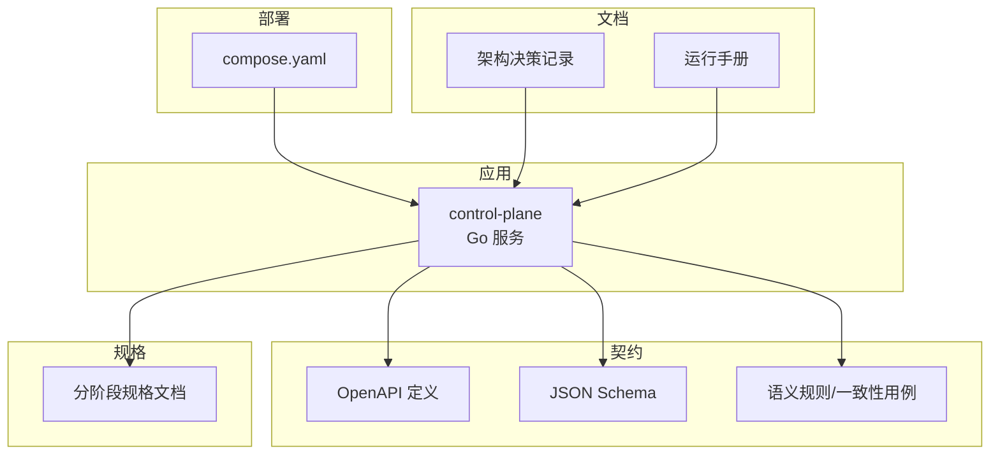
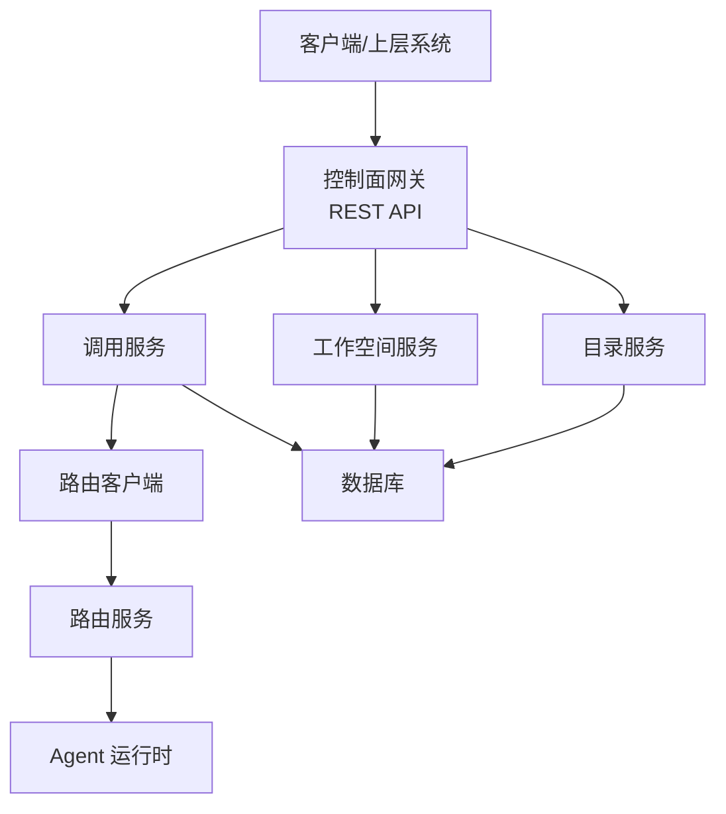
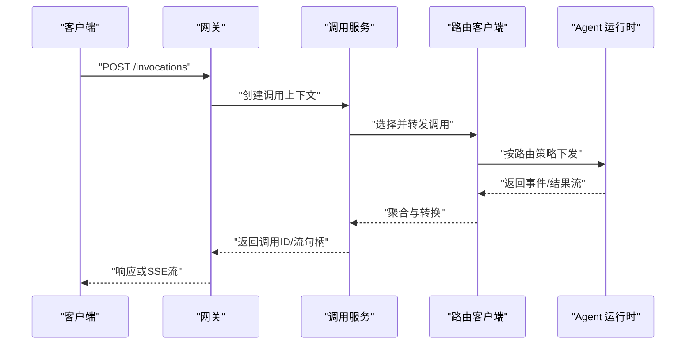
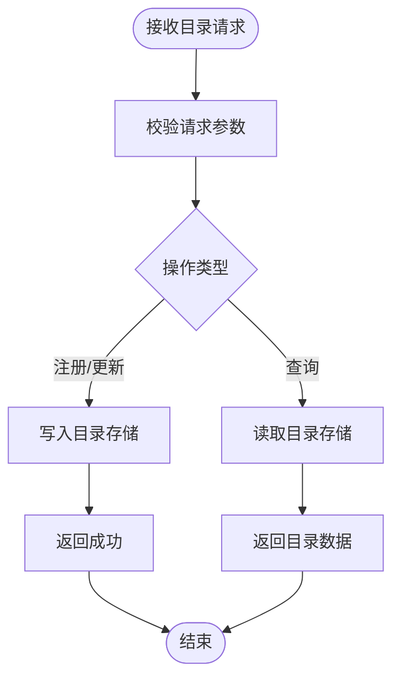
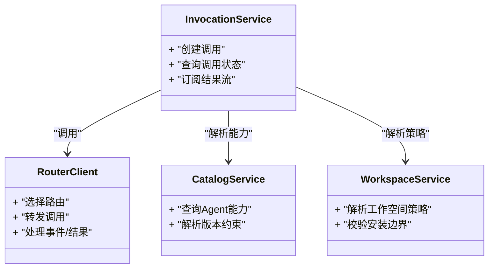
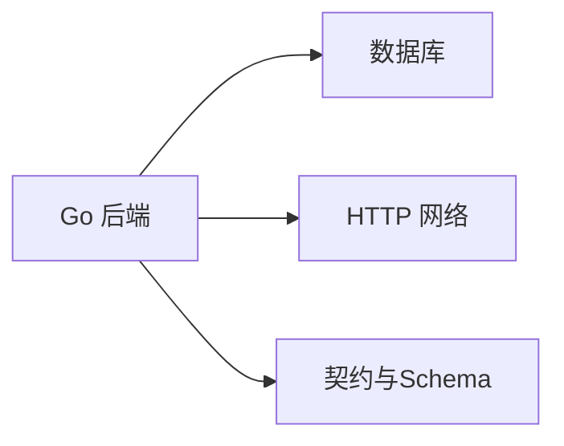

# 项目概述

<cite>
**本文引用的文件**   
- [README.md](file://README.md)
- [go.mod](file://go.mod)
- [deploy/compose.yaml](file://deploy/compose.yaml)
- [apps/control-plane/cmd/control-plane/main.go](file://apps/control-plane/cmd/control-plane/main.go)
- [apps/control-plane/internal/config/config.go](file://apps/control-plane/internal/config/config.go)
- [apps/control-plane/internal/gateway/auth.go](file://apps/control-plane/internal/gateway/auth.go)
- [apps/control-plane/internal/gateway/catalog_handler.go](file://apps/control-plane/internal/gateway/catalog_handler.go)
- [apps/control-plane/internal/gateway/invocation_handler.go](file://apps/control-plane/internal/gateway/invocation_handler.go)
- [apps/control-plane/internal/gateway/workspace_handler.go](file://apps/control-plane/internal/gateway/workspace_handler.go)
- [apps/control-plane/internal/invocation/service.go](file://apps/control-plane/internal/invocation/service.go)
- [apps/control-plane/internal/invocation/router_client.go](file://apps/control-plane/internal/invocation/router_client.go)
- [apps/control-plane/internal/catalog/service.go](file://apps/control-plane/internal/catalog/service.go)
- [apps/control-plane/internal/catalog/store.go](file://apps/control-plane/internal/catalog/store.go)
- [apps/control-plane/internal/workspace/service.go](file://apps/control-plane/internal/workspace/service.go)
- [apps/control-plane/internal/workspace/store.go](file://apps/control-plane/internal/workspace/store.go)
- [contracts/openapi/control-plane.v2.yaml](file://contracts/openapi/control-plane.v2.yaml)
- [contracts/openapi/router-agent.v1.yaml](file://contracts/openapi/router-agent.v1.yaml)
- [contracts/openapi/router-internal.v3.yaml](file://contracts/openapi/router-internal.v3.yaml)
- [contracts/a2a_profile_v02.go](file://contracts/a2a_profile_v02.go)
- [contracts/runtime_contracts.go](file://contracts/runtime_contracts.go)
- [specs/001-complete-invocation-contracts/spec.md](file://specs/001-complete-invocation-contracts/spec.md)
- [specs/002-catalog-registry-discovery/spec.md](file://specs/002-catalog-registry-discovery/spec.md)
- [specs/003-workspace-installation-contracts/spec.md](file://specs/003-workspace-installation-contracts/spec.md)
- [specs/012-control-plane-invocation-dispatch/spec.md](file://specs/012-control-plane-invocation-dispatch/spec.md)
- [docs/decisions/0001-go-backend-stack.md](file://docs/decisions/0001-go-backend-stack.md)
- [docs/decisions/0004-catalog-persistence-and-consistency.md](file://docs/decisions/0004-catalog-persistence-and-consistency.md)
- [docs/decisions/0005-minimal-workspace-installation-boundary.md](file://docs/decisions/0005-minimal-workspace-installation-boundary.md)
- [docs/decisions/0006-invocation-runtime-trust-and-failure-policy.md](file://docs/decisions/0006-invocation-runtime-trust-and-failure-policy.md)
- [docs/runbooks/local-development.md](file://docs/runbooks/local-development.md)
</cite>

## 目录
1. [简介](#简介)
2. [项目结构](#项目结构)
3. [核心组件](#核心组件)
4. [架构总览](#架构总览)
5. [详细组件分析](#详细组件分析)
6. [依赖分析](#依赖分析)
7. [性能考量](#性能考量)
8. [故障排查指南](#故障排查指南)
9. [结论](#结论)
10. [附录：快速开始](#附录快速开始)

## 简介
NeKiro AI Agent 平台是一个面向多租户的 AI Agent 编排与调度基础设施，提供代理生命周期管理、工作空间隔离、智能调用路由以及可插拔的运行时契约。平台以“控制面 + 路由 + 运行时”的分层架构为核心，通过标准化契约（A2A Profile、Agent Card、Invocation 事件与结果流）实现跨运行时的互操作与可观测性。

- 定位与目标
  - 为开发者与企业用户提供统一的 Agent 注册、发现、安装与调用入口
  - 在多租户环境下保障工作空间隔离与策略执行
  - 通过路由层将调用请求智能分发到合适的 Agent 运行时实例
  - 以契约驱动的方式确保跨版本兼容与可验证性

- 关键特性
  - 代理目录与注册发现
  - 工作空间安装与生命周期管理
  - 调用编排与结果流式传输
  - A2A Profile 与 Agent Card 能力声明
  - 可审计的调用路由账本与追踪

[本节不直接分析具体源文件]

## 项目结构
仓库采用多应用与契约分离的组织方式：
- apps：服务实现（当前包含 control-plane）
- contracts：OpenAPI、JSON Schema、语义规则与一致性测试
- specs：分阶段规格说明与数据模型
- docs：架构决策、运行手册与路线图
- deploy：部署配置（Docker Compose）
- tests：集成与验收测试

图表来源
- [deploy/compose.yaml](file://deploy/compose.yaml)
- [contracts/openapi/control-plane.v2.yaml](file://contracts/openapi/control-plane.v2.yaml)
- [specs/001-complete-invocation-contracts/spec.md](file://specs/001-complete-invocation-contracts/spec.md)

章节来源
- [README.md](file://README.md)
- [deploy/compose.yaml](file://deploy/compose.yaml)

## 核心组件
- 控制面（Control Plane）
  - 网关层：对外暴露 REST API，负责鉴权、路由与错误处理
  - 目录服务：维护 Agent 卡片、能力与版本信息
  - 工作空间服务：管理工作空间的创建、安装与策略
  - 调用服务：编排调用流程，协调路由客户端与持久化
- 路由与运行时契约
  - 路由内部接口与 Agent 侧接口由 OpenAPI 定义
  - A2A Profile 与 Invocation 事件/结果流遵循统一语义
- 契约与规格
  - OpenAPI 与 JSON Schema 用于接口与数据结构校验
  - 语义规则与一致性测试保证跨版本兼容

章节来源
- [apps/control-plane/cmd/control-plane/main.go](file://apps/control-plane/cmd/control-plane/main.go)
- [apps/control-plane/internal/gateway/catalog_handler.go](file://apps/control-plane/internal/gateway/catalog_handler.go)
- [apps/control-plane/internal/gateway/invocation_handler.go](file://apps/control-plane/internal/gateway/invocation_handler.go)
- [apps/control-plane/internal/gateway/workspace_handler.go](file://apps/control-plane/internal/gateway/workspace_handler.go)
- [apps/control-plane/internal/catalog/service.go](file://apps/control-plane/internal/catalog/service.go)
- [apps/control-plane/internal/workspace/service.go](file://apps/control-plane/internal/workspace/service.go)
- [apps/control-plane/internal/invocation/service.go](file://apps/control-plane/internal/invocation/service.go)
- [contracts/openapi/control-plane.v2.yaml](file://contracts/openapi/control-plane.v2.yaml)
- [contracts/openapi/router-agent.v1.yaml](file://contracts/openapi/router-agent.v1.yaml)
- [contracts/openapi/router-internal.v3.yaml](file://contracts/openapi/router-internal.v3.yaml)
- [contracts/a2a_profile_v02.go](file://contracts/a2a_profile_v02.go)
- [contracts/runtime_contracts.go](file://contracts/runtime_contracts.go)

## 架构总览
平台采用分层与契约驱动设计：
- 外部客户端通过控制面网关访问
- 控制面根据工作空间与目录信息选择合适路由
- 路由层转发至具体的 Agent 运行时
- 调用过程产生事件与结果流，支持追踪与审计

图表来源
- [apps/control-plane/cmd/control-plane/main.go](file://apps/control-plane/cmd/control-plane/main.go)
- [apps/control-plane/internal/gateway/invocation_handler.go](file://apps/control-plane/internal/gateway/invocation_handler.go)
- [apps/control-plane/internal/invocation/service.go](file://apps/control-plane/internal/invocation/service.go)
- [apps/control-plane/internal/invocation/router_client.go](file://apps/control-plane/internal/invocation/router_client.go)
- [apps/control-plane/internal/catalog/service.go](file://apps/control-plane/internal/catalog/service.go)
- [apps/control-plane/internal/workspace/service.go](file://apps/control-plane/internal/workspace/service.go)
- [contracts/openapi/control-plane.v2.yaml](file://contracts/openapi/control-plane.v2.yaml)
- [contracts/openapi/router-internal.v3.yaml](file://contracts/openapi/router-internal.v3.yaml)

## 详细组件分析

### 控制面网关
- 职责
  - 解析并校验请求参数（基于 OpenAPI/Schema）
  - 鉴权与会话上下文注入
  - 将请求委派给对应领域服务（目录、工作空间、调用）
- 关键路径
  - 目录相关：注册、查询、版本管理
  - 工作空间相关：创建、安装、策略
  - 调用相关：发起调用、获取状态、订阅结果流

图表来源
- [apps/control-plane/internal/gateway/invocation_handler.go](file://apps/control-plane/internal/gateway/invocation_handler.go)
- [apps/control-plane/internal/invocation/service.go](file://apps/control-plane/internal/invocation/service.go)
- [apps/control-plane/internal/invocation/router_client.go](file://apps/control-plane/internal/invocation/router_client.go)
- [contracts/openapi/control-plane.v2.yaml](file://contracts/openapi/control-plane.v2.yaml)

章节来源
- [apps/control-plane/internal/gateway/auth.go](file://apps/control-plane/internal/gateway/auth.go)
- [apps/control-plane/internal/gateway/catalog_handler.go](file://apps/control-plane/internal/gateway/catalog_handler.go)
- [apps/control-plane/internal/gateway/invocation_handler.go](file://apps/control-plane/internal/gateway/invocation_handler.go)
- [apps/control-plane/internal/gateway/workspace_handler.go](file://apps/control-plane/internal/gateway/workspace_handler.go)

### 目录服务（Catalog）
- 职责
  - 维护 Agent 卡片、能力描述、版本与元数据
  - 提供查询与变更接口，供网关与路由使用
- 数据与一致性
  - 使用关系型存储持久化目录条目
  - 结合迁移脚本保证模式演进

图表来源
- [apps/control-plane/internal/catalog/service.go](file://apps/control-plane/internal/catalog/service.go)
- [apps/control-plane/internal/catalog/store.go](file://apps/control-plane/internal/catalog/store.go)
- [contracts/openapi/control-plane.v2.yaml](file://contracts/openapi/control-plane.v2.yaml)

章节来源
- [apps/control-plane/internal/catalog/service.go](file://apps/control-plane/internal/catalog/service.go)
- [apps/control-plane/internal/catalog/store.go](file://apps/control-plane/internal/catalog/store.go)

### 工作空间服务（Workspace）
- 职责
  - 管理工作空间生命周期（创建、安装、检查）
  - 绑定策略与权限，隔离不同租户的资源与调用
- 关键点
  - 安装边界最小化，便于扩展与替换
  - 与目录服务协作完成能力解析与依赖校验

章节来源
- [apps/control-plane/internal/workspace/service.go](file://apps/control-plane/internal/workspace/service.go)
- [apps/control-plane/internal/workspace/store.go](file://apps/control-plane/internal/workspace/store.go)
- [specs/003-workspace-installation-contracts/spec.md](file://specs/003-workspace-installation-contracts/spec.md)
- [docs/decisions/0005-minimal-workspace-installation-boundary.md](file://docs/decisions/0005-minimal-workspace-installation-boundary.md)

### 调用服务与路由客户端（Invocation & Router Client）
- 职责
  - 编排调用流程：建立上下文、选择路由、转发请求、收集事件与结果
  - 与路由服务交互，遵循内部接口规范
- 可靠性与失败策略
  - 明确信任边界与失败重试/回退策略
  - 生成可追踪的调用标识与链路信息

图表来源
- [apps/control-plane/internal/invocation/service.go](file://apps/control-plane/internal/invocation/service.go)
- [apps/control-plane/internal/invocation/router_client.go](file://apps/control-plane/internal/invocation/router_client.go)
- [apps/control-plane/internal/catalog/service.go](file://apps/control-plane/internal/catalog/service.go)
- [apps/control-plane/internal/workspace/service.go](file://apps/control-plane/internal/workspace/service.go)
- [contracts/openapi/router-internal.v3.yaml](file://contracts/openapi/router-internal.v3.yaml)

章节来源
- [apps/control-plane/internal/invocation/service.go](file://apps/control-plane/internal/invocation/service.go)
- [apps/control-plane/internal/invocation/router_client.go](file://apps/control-plane/internal/invocation/router_client.go)
- [specs/012-control-plane-invocation-dispatch/spec.md](file://specs/012-control-plane-invocation-dispatch/spec.md)
- [docs/decisions/0006-invocation-runtime-trust-and-failure-policy.md](file://docs/decisions/0006-invocation-runtime-trust-and-failure-policy.md)

### 契约与运行时（Contracts & Runtime）
- A2A Profile 与 Agent Card
  - 能力声明、端点与权限模型
- Invocation 事件与结果流
  - 事件匹配、关联 ID、追踪 ID 等语义规则
- 运行时契约
  - 平台与运行时的边界、信任与失败策略

章节来源
- [contracts/a2a_profile_v02.go](file://contracts/a2a_profile_v02.go)
- [contracts/runtime_contracts.go](file://contracts/runtime_contracts.go)
- [contracts/openapi/router-agent.v1.yaml](file://contracts/openapi/router-agent.v1.yaml)
- [specs/001-complete-invocation-contracts/spec.md](file://specs/001-complete-invocation-contracts/spec.md)

## 依赖分析
- 语言与工具链
  - Go 后端栈，配合 Docker Compose 进行本地与容器化部署
- 外部依赖
  - 关系型数据库（目录与工作空间持久化）
  - HTTP 网络（网关与路由、路由与运行时）
- 耦合与内聚
  - 网关层低耦合，按领域拆分处理器
  - 服务层通过接口抽象降低对存储与网络的直接依赖
  - 契约层独立于实现，便于测试与兼容性验证

图表来源
- [go.mod](file://go.mod)
- [deploy/compose.yaml](file://deploy/compose.yaml)
- [contracts/openapi/control-plane.v2.yaml](file://contracts/openapi/control-plane.v2.yaml)

章节来源
- [go.mod](file://go.mod)
- [deploy/compose.yaml](file://deploy/compose.yaml)
- [docs/decisions/0001-go-backend-stack.md](file://docs/decisions/0001-go-backend-stack.md)
- [docs/decisions/0004-catalog-persistence-and-consistency.md](file://docs/decisions/0004-catalog-persistence-and-consistency.md)

## 性能考量
- 连接池与并发
  - 合理配置数据库连接池与 HTTP 客户端并发度
- 缓存与幂等
  - 对目录查询与工作空间策略进行缓存，减少重复计算
  - 调用接口具备幂等键，避免重复提交
- 流式传输
  - 结果流采用 SSE 或类似机制，降低延迟与内存占用
- 可观测性
  - 全链路追踪与指标采集，支撑容量规划与问题定位

[本节提供通用指导，不直接分析具体源文件]

## 故障排查指南
- 常见问题
  - 鉴权失败：检查网关鉴权中间件与令牌有效性
  - 路由不可达：确认路由服务健康与网络连通性
  - 调用超时：检查运行时负载与重试策略
  - 目录不一致：核对迁移与存储一致性
- 诊断步骤
  - 查看网关日志与错误码
  - 检查调用链路追踪 ID 与事件序列
  - 验证 OpenAPI 与 Schema 的一致性
  - 使用 compose 环境快速复现与隔离问题

章节来源
- [apps/control-plane/internal/gateway/errors.go](file://apps/control-plane/internal/gateway/errors.go)
- [apps/control-plane/internal/gateway/trace.go](file://apps/control-plane/internal/gateway/trace.go)
- [docs/runbooks/local-development.md](file://docs/runbooks/local-development.md)

## 结论
NeKiro AI Agent 平台通过清晰的层次划分与契约驱动设计，实现了多租户隔离、智能路由与可观测的调用编排。其模块化结构与严格的兼容性测试为持续演进提供了坚实基础。建议在生产环境中强化监控与告警，并结合业务场景优化路由策略与缓存策略。

[本节总结性内容，不直接分析具体源文件]

## 附录：快速开始
- 前置条件
  - 已安装 Docker 与 Docker Compose
  - 本地开发环境满足 Go 构建要求
- 启动服务
  - 使用 compose 启动控制面与依赖
  - 等待服务就绪后访问网关地址
- 基本操作
  - 注册/查询 Agent 卡片
  - 创建工作空间并完成安装
  - 发起一次调用并订阅结果流
- 参考文档
  - 本地开发运行手册
  - 控制面 OpenAPI 定义
  - 路由内部接口与 Agent 接口

章节来源
- [docs/runbooks/local-development.md](file://docs/runbooks/local-development.md)
- [deploy/compose.yaml](file://deploy/compose.yaml)
- [contracts/openapi/control-plane.v2.yaml](file://contracts/openapi/control-plane.v2.yaml)
- [contracts/openapi/router-internal.v3.yaml](file://contracts/openapi/router-internal.v3.yaml)
- [contracts/openapi/router-agent.v1.yaml](file://contracts/openapi/router-agent.v1.yaml)